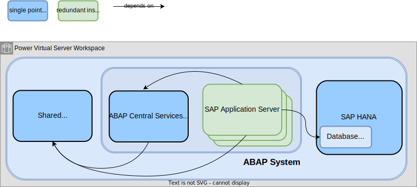
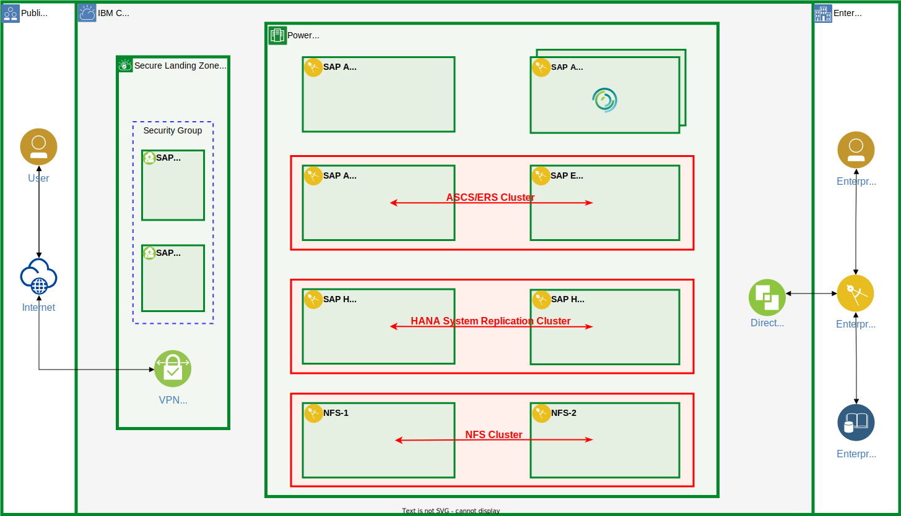

---
copyright:
  years: 2023, 2025
lastupdated: "2025-09-30"
keywords: SAP, {{site.data.keyword.cloud_notm}}, SAP-Certified Infrastructure, {{site.data.keyword.ibm_cloud_sap}}, SAP Workloads, SAP HANA, SAP HANA System Replication, High Availability, HA, Linux, Pacemaker, RHEL HA AddOn
subcollection: sap
---

{{site.data.keyword.attribute-definition-list}}

# Implementing high availability for SAP applications on IBM {{site.data.keyword.powerSys_notm}}
{: #ha-overview}

Running SAP on {{site.data.keyword.powerSysFull}} offers a consistent platform for SAP HANA-based and traditional applications, world-class performance, resiliency for critical workloads, and a flexible infrastructure.
{: shortdesc}

Use the following information to understand how to implement high availability solutions for SAP systems by using {{site.data.keyword.powerSys_notm}} instances.

## SAP system architecture
{: #ha-overview-architecture}

The main components of an SAP system are as follows.

SAP HANA system
:   The SAP HANA system provides the tenant database for SAP application servers.

SAP application server
:   SAP application servers provide the functional part of an SAP S/4HANA or other application solution.
    All customization and application data of an SAP system is stored in a tenant database of an SAP HANA system.

    An SAP application system is installed and configured as a single unit and consists of the following application instances.

    - One ABAP System Central Services instance (ASCS instance)
      Each SAP application system has exactly one ASCS instance, which consists of a message server and an enqueue server.

    - One or more application server instances (AS instances)
      - The primary application server (PAS) is the first AS instance that is installed for an ABAP system.
      - Other AS instances that are installed for an ABAP system are called additional application servers (AAS).

    Both the application server instances and the ASCS instance depend on a shared file system and require read/write access to it.

Shared file system
:   Typically, the shared file system is exported on an NFS server and mounted on all instances.

Figure 1 illustrates the technical components of an SAP system.

{: caption="Technical components for SAP systems" caption-side="bottom"}

## Considerations for implementing an SAP high availability solution
{: #ha-overview-ha-considerations}

For high availability protection, it is recommended to install application servers redundantly.
Install at least two application servers (PAS and AAS) and use login groups to implement load balancing.
If an application server fails, all user sessions that are connected to that instance are stopped.
The user logs in again, and load balancing redirects the user to another application server that is still running.

The other technical components, such as the ASCS instance, the SAP HANA database, and the shared file system, are single points of failure and must be protected.

- ASCS instance

   The best way to safeguard the ASCS instance is to deploy an Enqueue Replication Server (ERS) instance on an extra virtual server and use HA clustering software for automating failover.

   Install ASCS and ERS either on a shared disk that is attached to both virtual server instances or on an NFS file system.

   The enqueue server of the ASCS instance manages the lock table, and the ERS creates a replicated copy of the lock table in its main memory.
   If the enqueue server must be restarted, the lock table is rebuilt by using the copy on the ERS, and the locks are retained.

   A simple restart of the message server is sufficient because no data needs to be retained.

   Follow the steps in [Configuring high availability for SAP S/4HANA (ASCS and ERS) in a Red Hat Enterprise Linux High Availability Add-On cluster](/docs/sap?topic=sap-ha-rhel-ensa){: external} to set up an HA cluster for the ABAP System Central Services instance.

- Shared file system

   The recommended method of protecting the NFS server is to implement an extra virtual server instance. Then, create the NFS exported file systems on shared disks that are attached to both virtual server instances and automate the failover by using HA cluster software.

   Follow the steps in [Configuring an active-passive NFS Server in a Red Hat Enterprise Linux High Availability Add-On cluster](/docs/sap?topic=sap-ha-rhel-nfs){: external} to set up an HA cluster for the shared file system.

- SAP HANA system

   SAP HANA provides two approaches to scale a system: *scale-up* and *scale-out*.
   With the comprehensive and highly scalable set of [IBM {{site.data.keyword.powerSys_notm}} certified profiles for SAP HANA](/docs/sap?topic=sap-hana-iaas-offerings-profiles-power-vs){: external} that are available in IBM {{site.data.keyword.powerSys_notm}}, the focus is on a SAP HANA *scale-up* installation.
   {: note}

   The best way to protect an SAP HANA system is to set up a secondary SAP HANA system on a separate virtual server instance. Then, configure SAP HANA system replication, and automate failover with HA cluster software.

The following figure shows an architectural overview of a highly available SAP system that is implemented on {{site.data.keyword.powerSys_notm}}.

{: caption="SAP on {{site.data.keyword.powerSys_notm}} HA architecture overview" caption-side="bottom"}

## SAP HANA high availability scenarios
{: #ha-overview-hana-ha-scenarios}

The solution varies depending on the recovery time objective (RTO).

| Scenario                      | Typical RTO           | Comment        |
| ----------------------------- | --------------------- | -------------- |
| Performance Optimized         | A few minutes         | Unless you have specific requirements, this scenario is the default. |
| Active/Active (read enabled)  | A few minutes         | In an Active/Active (read enabled) configuration, SAP HANA system replication allows read access to the database content on the secondary system. |
| Cost Optimized                | A few tens of minutes | In a cost-optimized configuration, a nonproduction SAP HANA system runs on the secondary node during normal operation. The hardware resources on the secondary node are shared between the nonproduction system and the SAP HANA System Replication secondary. The memory consumption of the production SAP HANA System Replication secondary is reduced by turning off the preloading of data in the column tables. When a failover occurs, the nonproduction instance is automatically stopped before the node takes over the production workload. The take-over time is longer compared to a performance-optimized configuration. |
{: caption="Variations for high availability solutions for SAP HANA" caption-side="bottom"}

Depending on your requirements, select the documentation for one of the scenarios.

- SAP HANA System Replication performance-optimized scenario

   [Configuring SAP HANA scale-up system replication in a Red Hat Enterprise Linux High Availability Add-On cluster](/docs/sap?topic=sap-ha-rhel-hana-sr){: external}.

- SAP HANA System Replication cost-optimized scenario

   [Configuring SAP HANA cost-optimized scale-up system replication in a Red Hat Enterprise Linux High Availability Add-On cluster](/docs/sap?topic=sap-ha-rhel-hana-sr-cost-optimized){: external}.

- SAP HANA System Replication Active-Active (Read Enabled) scenario

   [Configuring SAP HANA active/active (read enabled) system replication in a Red Hat Enterprise Linux High Availability Add-On cluster](/docs/sap?topic=sap-ha-rhel-hana-sr-aa){: external}.

## SAP HANA disaster recovery scenarios
{: #ha-overview-hana-dr-scenarios}

For extra protection of the database system, replicate the SAP HANA system to a third system that is located in a different region by using SAP HANA system replication.
Depending on your requirements, select one of the two available topologies.

- SAP HANA multitier system replication scenario

   With SAP HANA multitier system replication, you can chain multiple systems together to achieve a higher level of availability.

   [Configuring SAP HANA multitier system replication in a Red Hat Enterprise Linux High Availability Add-On cluster](/docs/sap?topic=sap-ha-rhel-hana-sr-multitier){: external}.

- SAP HANA multitarget system replication scenario

   Multitarget system replication allows primary and secondary systems to replicate changes to more than one system.

   [Configuring SAP HANA multitarget system replication in a Red Hat Enterprise Linux High Availability Add-On cluster](/docs/sap?topic=sap-ha-rhel-hana-sr-multitarget){: external}.

## SAP HANA high availability solution in a multizone region environment
{: #ha-overview-hana-mzr-ha-scenario}

### Network considerations
{: #ha-overview-hana-mzr-network}

In IBM {{site.data.keyword.powerSys_notm}}, a subnet is confined to a single workspace and cannot extend across multiple workspaces. Consequently, transferring a service IP address to a secondary workspace and maintaining communication with it from IBM VPC or another IBM {{site.data.keyword.powerSys_notm}} workspace is not feasible.
The common Linux cluster resource agent `ipaddr2` cannot be used to move the service IP address.

Two other resource agents are available to manage a service IP address in a multizone region environment in IBM {{site.data.keyword.powerSys_notm}}.
- Resource agent `powervs-move-ip`
- Resource agent `powervs-subnet`

#### Resource agent `powervs-move-ip`
{: #ha-overview-hana-mzr-move-ip}

During a takeover event, the resource agent `powervs-move-ip` updates predefined static routes in the IBM {{site.data.keyword.powerSys_notm}}, and configures an overlay IP address as IP alias address on the virtual server instance.

The following figures illustrate this scenario for a SAP HANA System Replication cluster.
- Two virtual server instances (VSIs) are deployed in separate workspaces.
- A private subnet is created in each workspace.
- The instances, running RHEL, form a two-node RHEL High Availability Add-on cluster.
- SAP HANA is installed on both instances, and SAP HANA system replication is configured.
- A cluster resource for an *Overlay IP address* is configured with the `powervs-move-ip` resource agent.

The *Overlay IP* has the following characteristics
- The *Overlay IP* is not part of any CIDR subnet range in the environment.
- It is not assigned to a network interface during deployment.
- The resource agent configures the *Overlay IP address* as an IP alias address on a network adapter of a VSI at run time.

A *static route* is created in each workspace
- The *destination* of the *static route* is set to the overlay IP address.
- The *next hop* for each route is the *primary IP* address of the respective virtual server instance (VSI).
- The resource agent *enables the route* to the VSI with the *SAP HANA primary* and *disables the route* to the VSI with the *SAP HANA secondary*.

During *normal operation*
- The *Overlay IP address* is configured as an IP alias on VSI-1 in *workspace 1*.
- The *static route* in *workspace 1*, with the *destination* set to the Overlay IP address and the *next hop* set to the primary IP of VSI-1, is *enabled*.
- The *static route* in *workspace 2*, with the same destination and the next hop set to the primary IP of VSI-2, is *disabled*.
- The *SAP HANA primary* is active on *VSI-1*.
- The *SAP HANA secondary* is active on *VSI-2*.

{: caption="SAP HANA on {{site.data.keyword.powerSys_notm}} in multizone region HA overview" caption-side="bottom"}

After a *cluster takeover*
- The *Overlay IP address* is configured as an *IP alias* on *VSI-2* in *workspace 2*.
- The *static route* in *workspace 2*, with the *destination* set to the Overlay IP address and the *next hop* set to the primary IP of VSI-2, is *enabled*.
- The *static route* in *workspace 1*, with the same destination and the next hop set to the primary IP of VSI-1, is *disabled*.
- The *SAP HANA primary* is active on *VSI-2*.
- The *SAP HANA secondary* is active on *VSI-1*.

{: caption="SAP HANA on {{site.data.keyword.powerSys_notm}} in multizone region HA takeover" caption-side="bottom"}

#### Resource agent `powervs-subnet`
{: #ha-overview-hana-mzr-subnet}

During a takeover event, the resource agent `powervs-subnet` moves the entire subnet, including the IP address, from one workspace to another.

The following figures illustrate this scenario for a SAP HANA System Replication cluster.

Two virtual server instances are deployed in separate workspaces with different subnets.
- SAP HANA is installed on both virtual server instances, and SAP HANA System Replication is configured.
- The two virtual server instances are configured as a two-node high availability cluster with their own subnets.
- A cluster resource that uses the `powervs-subnet` resource agent is configured for `Subnet 3` and `IP address 3`.
   Choose a small range for the Classless Inter-Domain Routing (CIDR), only `IP address 3` and an IP address for the gateway are allocated in `Subnet 3`.
- SAP HANA database clients use `IP address 3` connect to the database.

The subnet *Subnet 3* has the following characteristics
- The CIDR range of the subnet does not overlap with any other CIDR subnet block in the environment.
- The subnet does not exist in both workspaces
- The resource agent creates the subnet in one of the workspaces.

During *normal operation*
- *Subnet 3* is created in workspace 1.
- *Subnet 3* is attached to virtual server instance 1.
- *IP address 3* is configured on virtual server instance 1.
- The *SAP HANA primary* is active on virtual server instance 1.
- The *SAP HANA secondary* is active on virtual server instance 2.

{: caption="SAP HANA on {{site.data.keyword.powerSys_notm}} in multizone region HA overview" caption-side="bottom"}

After a *cluster takeover*
- *Subnet 3* is created in workspace 2.
- *Subnet 3* is attached to virtual server instance 2.
- *IP address 3* is configured on virtual server instance 2.
- The *SAP HANA primary* is active on virtual server instance 2.
- The *SAP HANA secondary* is active on virtual server instance 1.

{: caption="SAP HANA on {{site.data.keyword.powerSys_notm}} in multizone region HA takeover" caption-side="bottom"}

### Links to the setup documentation
{: #ha-overview-hana-mzr-howto}

See the information in [Implementing a Red Hat Enterprise Linux High Availability Add-On cluster in a multizone region environment](/docs/sap?topic=sap-ha-rhel-mz){: external} on how to prepare and configure a Red Hat Enterprise Linux (RHEL) High Availability (HA) cluster.

To configure an SAP HANA System Replication cluster in a multizone region environment, refer to the following resource:
- [Configuring SAP HANA scale-up system replication in a Red Hat Enterprise Linux High Availability Add-On cluster with the sap-hana-ha resource agent](/docs/sap?topic=sap-ha-rhel-hana-ng-sh){: external}

To configure an SAP S/4HANA (ASCS and ERS) cluster in a multizone region environment, refer to the following resources:
- [Configuring high availability for SAP S/4HANA (ASCS and ERS) on Red Hat Enterprise Linux HA Add-On clusters in a multizone region with simple mount](/docs/sap?topic=sap-ha-rhel-ensa-sm-mz){: external}
- [Configuring high availability for SAP S/4HANA (ASCS and ERS) in a Red Hat Enterprise Linux High Availability Add-On cluster in a multizone region environment](/docs/sap?topic=sap-ha-rhel-ensa-mz){: external}
