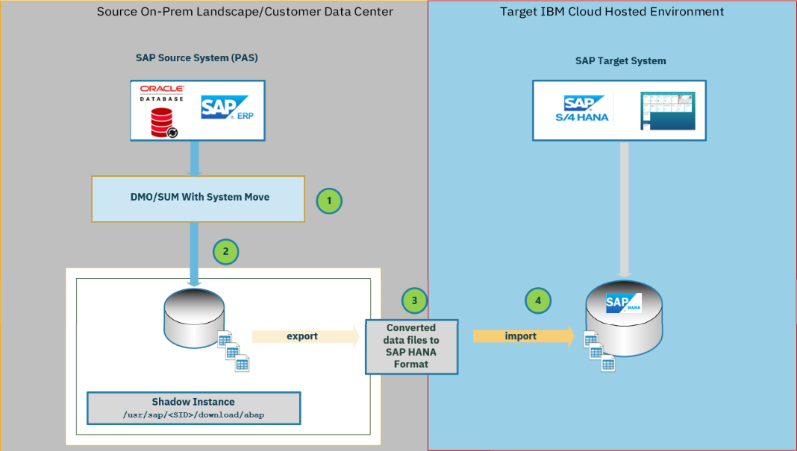

---
copyright:
  years: 2025
lastupdated: "2025-04-02"
keywords: SAP, SAP-Certified Infrastructure, SAP Workloads, on-prem, on premises, Hybrid Cloud, Migration, heterogeneous migration, Linux, Red Hat, RHEL, SuSE, Db2, Oracle, HANA, clean up, pre migration step, Row Store Re-organization, reorg, row, store, sync, Synchronize, sum, software update manager, dmo, database migration option, dmove2s4, Software Provisioning Manager, SWPM
subcollection: sap
---

{{site.data.keyword.attribute-definition-list}}


# Migration from SAP ERP 6.0 to S/4HANA to IBM {{site.data.keyword.powerSys_notm}} considerations
{: #sapmig-sum-dmo}

Migrating from SAP ERP 6.0 to SAP S/4HANA is called a heterogeneous migration. Upgrading
the SAP software version and changing the database engine during the transition of
the SAP system to IBM {{site.data.keyword.powerSys_notm}} is complex.

The following items are best practices for a heterogeneous SAP migration.

* Either sign a contract for [RISE with SAP on IBM Power Virtual Server](https://www.ibm.com/cloud/rise-with-sap){: external}. The IBM RISE contract includes the service to migrate your SAP system to IBM {{site.data.keyword.powerSys_notm}}.
* Or contact [IBM consulting](https://www.ibm.com/consulting/sap){: external} for more help with SAP migration service options.

This information does not replace required expert advice or support.
It is intended for educational purposes as an example outline of the migration steps.

The migration process is based on the SAP product "Software Update Manager" (SUM) and
the "Database Migration Option" (DMO) - which is not an IBM product.
For more information, see [Database Migration Option: Target Database SAP HANA](https://help.sap.com/docs/SLTOOLSET/7d57e56e12104cc68bce7646cd9f4cbf/6d134104cca649968b691778bdf82c0b.html?locale=en-US){: external}.

## Target audience and intent
{: #sapmig-dmo-target-audience-intent}

The described steps are targeted for solution and infrastructure architects, technology
consultants, and implementation teams for SAP system migrations.

The information is to help with your project plans and provides an overview of
database migration procedures that use DMO. Each migration project has a unique
migration scenario with different challenges in terms of deployment, configuration, and
available resources.

The following information explains the steps to migrate an SAP Business Suite server from on-premises to IBM {{site.data.keyword.powerSys_notm}}.
It is important to use the most recent version of the "Database Migration Option" (DMO) within the "Software Update Manager" (SUM).

The DMO function offers various methods to migrate.
Installing the recent Service or Enhancement Pack Updates on the source system in advance
is the method that is used in this description.

The following steps are verified with a proof of concept (POC) project migration:

* From the source system, use SAP ERP 6.0 EhP8 SP30 (ECC) system with Oracle 19c database on AIX
* To the target system, use SAP S/4HANA 2023 on RHEL 9.4 running on IBM {{site.data.keyword.powerSys_notm}}

Whereas the overall steps are similar, migration steps that involve other operating systems or other databases are different. SAP offers individual SAP Notes for each operating system and database version.

### DMO basics
{: #sapmig-dmo-basics}

Understand the naming conventions provided by SAP.

Software Update Manager (SUM)
:   SUM updates the SAP systems that are based on AS ABAP and AS Java&trade;.

Database Migration Option (DMO)
:   DMO is an option of SUM for a migration scenario. It is not a tool.

Software Provisioning Manager (SWPM)
:   Software Provisioning Manager is a tool for SAP system installation or copy.
:   You can use SWPM for the heterogeneous SAP system copy, which is a typical migration path.

SAPup
:   SAPup runs as a background service for the migration.
:   SAPup processes handle requests from the SAP host agent and trigger tools such as `R3trans`, `tp`, or `R3load` when needed during the migration.

Maintenance Planner (MPO)
:   The SAP Solution Manager cloud-based Maintenance Planner enables an easier and more efficient planning of all changes in your SAP system landscape.
:   - [Maintenance Planner Link](https://support.sap.com/en/alm/solution-manager/processes-72/maintenance-planner.html){: external}

Technical Downtime Optimization App (TDOA)
:   TDOA gives a detailed analysis and evaluation of a previous SUM maintenance task or action.
    This information provides information on optimization potential, which can help to optimize the next SUM operation.
    If detailed planning is required for business downtime, TDOA can help minimize downtime and helps provide a more
    simple maintenance experience.
:   [SAP Note 2881515 - Introduction to the Technical Downtime Optimization App](https://me.sap.com/notes/2881515){: external}
:   [SAP Community Blog - TDOA](https://community.sap.com/t5/technology-blogs-by-sap/downtime-optimization-get-insights-using-the-new-tdo-app/ba-p/13461177){: external}

### Disclaimer
{: #sapmig-ibm-dmo-disclaimer}

SAP systems are typically customized and integrated with other systems and tools.

Every migration project must consider multiple dependencies that are not in the scope for this information. The following items are an example of out-of-scope dependencies.

* Specific procedures for operating and maintaining nonproduction and production systems
* Helps makes sure that the system is available for maintenance and reconfiguration
* Plan, schedule, and communicate downtimes
* Review and adjust migration procedures to the local system and environment

The migration options that are described are not necessarily specific to IBM PowerVS migrations.
SAP basis and SAP functional admins are expected to understand the full scope of SAP Upgrades and the migration option that uses SUM/DMO - including details that are not explicitly stated.

SAP Software Update Manager is an SAP product. For more information, see [Database Migration Option: Target Database SAP HANA](https://help.sap.com/docs/help/c4ebc2b5d928446180d9ad2667f11faa/404d4617367948f0be1c41ec2254ae37.html){: external}.

## Migration considerations
{: #sapmig-ibm-dmo-mig-considerations}

It is important to understand the implications of a migration action and evaluate the necessary tasks.
The following sections outline these considerations.

The following information also highlights some of the migration steps. The following items are verified with a migration.

* Source system: SAP ERP 6.0 EhP8 SP30 (ECC) system with Oracle 19c database on AIX
* Target system: SAP S/4HANA 2023 on RHEL 9.4 that is running on IBM {{site.data.keyword.powerSys_notm}}

The overall steps are similar to other databases and operating systems.

Use this information, together with and not *limited* to SAP certified business practices, processes, and publicized tools.
Links are included at the foot of the chapter.

You can't upgrade of SAP source system during DMO with a system move.
Instead, do a system copy, if the source system upgrade is required.
To retain a fallback option, upgrade the copied SAP system. You can decommission the source SAP system after the migration.
{: tip}

### Prerequisites and limitations
{: #sapmig-ibm-dmo-mig-prereqs-limitations}

* The source SAP system must be Unicode
* The minimum SAP Version is at least SAP ERP 6.0 - also known as SAP ECC
* The ECC stack is ABAP only and not a dual ABAP and Java&trade; stack
* Update SPAM to version 77 or higher
* You can run the following checks in parallel (without the stack XML from MP)
   - Simplification item check
   - ABAP custom code checks

### Dependency fulfillment
{: #sapmig-ibm-dmo-mig-dependency-Fulfillment}

See the following list for the planning considerations for migrating to S/4HANA:

* Does ABAP custom code exist on your system that needs to be adapted?
* Which migration options are available for S/4HANA? For more information, see [Migration Objects for SAP S/4HANA](https://help.sap.com/docs/SAP_S4HANA_ON-PREMISE/d3a3eb7caa1842858bf0372e17ad3909/8dd142b479f9481891fa8b3f86648df3.html?locale=en-US){: external}.
* Are any business processes outdated?
* How long is the acceptable system downtime?
* Are you aware of the new transaction codes that are available and which codes are obsolete?
* Migrating to S/4HANA requires database schema changes. Implementing SAP customer vendor integration (CVI) on the source system is mandatory.
* Do any ad-on dependencies exist?
* Does SAP Fiori have dependencies?
* Are external data source connections used?
* Are data cleanup and database consistency checks in place?
* Is warm and cold SAP data clearly defined?
* Is the source system configured to run the "SAP Readiness Check" by using the most recent "Simplification Check"?

These considerations are just some of the questions that you need to address during the migration planning phase.

You can see details on how to activate and run the "SAP Readiness Check" with the most recent Simplification Check.

### SAP readiness check for SAP S/4HANA
{: #sapmig-ibm-dmo-mig-doc-sap-readiness}

The "SAP Readiness Check" for SAP S/4HANA is a tool that analyzes the source system
and determines steps that are required to convert from SAP ERP 6.0 to SAP S/4HANA.
The "SAP Readiness Check" is a useful tool for the planning
stage of your migration project. It also provides important assistance to scope and plan the project.

The "SAP Readiness Check" tool has different feature versions.

* SAP BW/4HANA
* SAP S/4HANA Upgrades
* SAP Customer Experience Solutions, and more

Read the subsections of this SAP support article to get the full list of variants:
[Feature Scope Description - SAP Readiness Check)](https://help.sap.com/docs/SAP_READINESS_CHECK/a281af437b3e4ef4a187c7f35a9093e9/b47054d8bb6a47738b874cefc0b9f561.html?locale=en-US){: external}.

You need to implement SAP notes to install the "SAP Readiness Check for SAP S/4HANA" tool.
These notes are listed in the section [Associated SAP notes and documentation for the SAP readiness check](/docs/sap?topic=sap-sapmig-sum-dmo#sapmig-ibm-dmo-mig-doc-sap-readiness-additional).
The data collector framework together with the data collectors are implemented on the source system.
These collectors are then activated to collect statistical data and collect a limited set of configuration
data from your system.

Make sure that you choose the correct target version of SAP S/4HANA for the "SAP Readiness Check" report.

Download the "Simplification Item Catalog" from the download site "Simplification Item Catalog":

* [SAP Simplification Catalog](https://me.sap.com/sic){: external} - Make sure to use the correct version for the planned S/4HANA conversion target.

Instruction videos and guidance on how to set up and run the "SAP Readiness Check" are provided in the following section.

## Associated SAP notes and documentation for the SAP readiness check
{: #sapmig-ibm-dmo-mig-doc-sap-readiness-additional}

* The central SAP documentation landing page for the "SAP Readiness Check": [SAP Tutorial overview - SAP Readiness Check for SAP S/4HANA)](https://me.sap.com/notes/2913617){: external}

* Overview video tutorial for the "S/4HANA Readiness Check" tool: [SAP Video Tutorial - SAP Readiness Check for SAP S/4HANA)](https://sapvideo.cfapps.eu10-004.hana.ondemand.com/?entry_id=1_iiijux10){: external}

* The SAP Readiness Check Analysis Upload Page: [SAP Readiness Analysis Upload page](https://me.sap.com/readinesscheck/home){: external}

* The central SAP Note for the "SAP Readiness Check" for SAP S/4HANA: [SAP Note 2913617 - SAP Readiness Check for SAP S/4HANA](https://me.sap.com/notes/2913617){: external}

* Instructions about how to solve authorization issues: [SAP Note 3310759 - Revised Authorization Concept for SAP Readiness Check](https://me.sap.com/notes/3310759){: external}

* Important updates for the SAP Notes Assistant (Mandatory): [SAP Note 1668882 - Note Assistant: Important notes for SAP_BASIS 730, 731, 740, 750, ...](https://me.sap.com/notes/1668882){: external} and [SAP Note 2971435 - SNOTE - Delta calculation Issue when 'mod unit' positions are changed](https://me.sap.com/notes/2971435){: external}

### Compare business data before the SAP migration
{: #sapmig-ibm-dmo-mig-doc-sap-business-data}

Use the Data Transition Validation (DTV) tool to compare business data before and after a system conversion from SAP ECC
to SAP S/4HANA. It can also serve as a data validation check during updates and upgrades.

## Sizing the target SAP system
{: #sapmig-ibm-dmo-mig-doc-target-sizing}

It is highly recommended that you implement the most recent SAP patches for SPAM, ST-PI, ST/A-PI on the source system.
These updates contain the most recent version of the ABAP sizing reports.

To view the current SAP version, start an SAP GUI session:

1. Log in to the SAP GUI.
1. Use SAP Transaction "SPAM" to see the Support Package Manager version.
1. Record the version number and collect the version numbers for the additional software.
1. Click **System**, then select **Status** when the dialog box appears.
1. Go to **SAP System Data**.
1. Click the magnifying glass and
1. Click the **Installed Software Component Versions** tab and check for the following components:
       * ST-PI
       * ST-A/PI
1. Compare the current version with the new versions that are available for download by using [Tools For Support Service Sessions](https://support.sap.com/en/offerings-programs/support-services/support-tools.html){: external}.

### Sizing considerations for the brownfield approach
{: #sapmig-ibm-dmo-mig-doc-target-sizing-brownfield}

SAP recommends that you archive as much data as possible from the source database before you start the conversion to SAP S/4HANA.
{: tip}

Use the following steps to determine the version of the "ABAP HANA Sizing report" that is installed on your source system.

1. Log in to to the SAP GUI.
1. Use the SAP Transaction "SE38".
1. Select report `/SDF/HDB_SIZING`.
1. Leave the "Subobjects" field to "Source Code".
1. Click **Display**.
1. Check the "VALUE" that is in Line 10. This value is of the current report version.

You can use the ABAP Sizing report to correctly size for brownfield configurations. For more information, see [SAP Note 1872170 - ABAP on HANA sizing report (S/4HANA, Suite on HANA)](https://me.sap.com/notes/1872170){: external}.

The following link demonstrates how to run a sizing report:

   * [How to install and run the ABAP on HANA Sizing report](https://community.sap.com/t5/enterprise-resource-planning-blogs-by-sap/how-to-install-run-the-abap-on-hana-sizing-report-sap-note-1872170-a-step/ba-p/13500140){: external}

Consider the system growth factors, the data-aging residence time in days, and the maximum age of database statistics.
They are the typical criteria in the report to plan for system growth.

After the report is complete, it displays the recommended core, memory, SAPS, and storage requirements for your target system.
Use the following links to compare the SAP Sizing report recommendations with the current IBM {{site.data.keyword.powerSys_notm}} profile offerings and select the profile that aligns with the sizing report recommendation.

   * [SAP Note 2947579 - SAP HANA on IBM Power Virtual Servers)](https://me.sap.com/notes/2947579){: external}
   * [IBM Power Virtual Server certified profiles for SAP HANA {{site.data.keyword.powerSysFull}}](/docs/sap?topic=sap-hana-iaas-offerings-profiles-power-vs)

SAP maintains a list of certified and supported SAP HANA® hardware.
Certified IBM {{site.data.keyword.powerSys_notm}} profiles and certified IBM server hardware are listed in the [SAP Certified and Supported SAP HANA® Hardware Directory](https://www.sap.com/dmc/exp/2014-09-02-hana-hardware/enEN/#/solutions?filters=v:deCertified;iaas;v:ca270&sort=Latest%20Certification&sortDesc=true){: external}.

### Source database health
{: #sapmig-ibm-dmo-mig-doc-database-health}

Database consistency is an important part of the pre-migration step because issues with the source database
can break the migration process.
Your source database needs to be checked for inconsistencies, fragmentation, and general health in advance.
Review the existing migration documentation for your database software version and implement all required checks.

## Preparing the target system landscape
{: #sapmig-ibm-dmo-mig-doc-poc-target-prep}

Use the following steps to prepare the target system landscape.

1. Access the most recent version of "Database Migration Option: Target Database SAP HANA" from [Database Migration Option: Target Database SAP HANA](https://help.sap.com/doc/38301960cfe4484587f9cedb8c6a740f/dmosum20.latest/en-US/dmo_of_sum2_to_hana.pdf), then select **Download Link**.

   This migration scenario uses the "System Move" option. A single stack SAP Netweaver DB/Application is moved to a separate S/4HANA 2023 Application Server and a dedicated server for the SAP HANA database.
   {: note}

1. Make sure that an active network connection between source and target systems with sufficient line speed is available.
    [Hybrid Cloud Network Considerations for SAP applications on {{site.data.keyword.powerSysFull}}](/docs/sap?topic=sap-sapmig-hybrid-cloud-networking). Keep in mind that SAP demands a network latency less than 20 ms, and a bandwidth higher than 400 Mbps for this migration scenario.

### Requirements for using the system move option
{: #sapmig-ibm-dmo-mig-doc-req-system-move-option}

See the following requirement for using System Move.

* Install the target database and target PAS before you start the migration.
* Make sure that both target systems use a different `<SID>`.
    For example, if `<DB_SID>` is assigned to the target SAP HANA database, the target application server must then use a different ID like `<AS_SID>`.
* During a "DMO with System Move" run, dump files are created in the SUM folder. These files contain the source database data and tables in compressed form.
   - The dump files are transferred from the source to the target system in a later step.
   - Because the entire source database is exported, make sure that enough free disk space is available on both systems.

#### Source database is Oracle - suppressing long-running phases in SUM
{: #sapmig-sum-long-running-phases}

During the update with DMO, the EU_CLONE_DT_SIZES and EU_CLONE_UT_SIZES phases can be long-running.

In these phases, the system updates the database statistics.
Correct statistics for table space usage helps to better distribute the tables
during the system cloning. Before the update is started, follow this procedure to suppress
long-running phases:

1. Log in to the host where the Oracle database instance is running. Use user `ora<dbsid>` for UNIX&trade; system or user `<sapsid>adm` for Windows&trade;.
1. Open a command line and run the following command:

   ```sh
   brconnect -u / -c -f stats -o <schema_owner> -t all -f allsel,collect,space –p <Number of Processors>
   ```
   {: pre}

   The `-p` flag defines the number of CPU processors that your hardware has, if the source
   system has, e. g. 8 processors, then the value needs to be changed to 8.
   To find the schema owner, use the following SQL statement in `sqlplus`.

   ```sql
   SQL> select username from dba_users;
   ```
   {: codeblock}

   This query provides all database usernames. For ABAP systems, the common schema owner is typically `SAPSR3`.

   The following SQL query lists the database schemas:

   ```sql
   SQL> select distinct owner from dba_objects;
   ```
   {: codeblock}

1. The file `SAPup_add.par` is located in the `bin` subdirectory of the SUM folder. It is typically part of the "Software Update Manager" archive.

1. Add the following line to the file `SAPup_add.par`:

   ```sql
   /ORA/update_spacestat = 0
   ```
   {: codeblock}

   If the `SAPup_add.par` file does not exist yet, create one.

#### Checking database parameterization for source Oracle databases
{: #sapmig-sum-check}

If your source database is Oracle, make sure that the database parameterization is properly
configured regarding parameter parallel_max_server. For more information, see [SAP Note 936441 - Oracle settings for R3load based system copy](https://me.sap.com/notes/936441){: external}.

#### Index-organized tables for source Oracle databases
{: #sapmig-index}

The following information is about Oracle index-organized tables.

The "Database Migration Option" is able to work with index-organized tables on the source database Oracle.
The primary key is used to split index-organized tables automatically. No special action or
preparatory activity is necessary from your side.
For more information about index-organized tables, check this SAP Note:
* [SAP Note 641435 - FAQ: Oracle index-organized tables (IOTs)](https://me.sap.com/notes/641435){: external}

Make sure that the release version and the patch level of the SUM tools are identical in both the source and the target system.

* Download the same SUM version for both systems, even if different operating system platforms are involved.
* Check that the most recent version is used on source and target SAP systems.

### POC project SAP system landscape
{: #sapmig-ibm-dmo-mig-doc-poc-project-system-landscape}

This description is based on a proof of concept (POC) project. The project migrates to two target SAP servers in IBM {{site.data.keyword.powerSys_notm}}:

* IBM Power Systems Virtual Server - model S1022 for the S/4HANA Application Layer
* IBM Power Systems Virtual Server - model E1080 for the HANA Database Layer

Both Servers are provisioned with the recommended values that are outlined in the SAP HANA sizing report, and installed with the OS RHEL 9x.
Storage Architecture and configuration are aligned with the current TDI recommendations.

Details for SAP HANA and supported Operating Systems including RHEL and SLES.
The second SAP Note also includes recommended OS settings for both product versions.
You can apply settings manually or automatically by running an Ansible&trade; playbook on IBM {{site.data.keyword.powerSys_notm}}s.
For SAP HANA on RHEL 9, SAP recommends the following OS settings:

   * [SAP Note 2235581 - SAP HANA: Supported Operating Systems](https://me.sap.com/notes/2235581){: external}
   * [SAP Note 3108302 - SAP HANA DB: Recommended OS Settings for RHEL 9](https://me.sap.com/notes/3108302){: external}

Before you can start the installation of the most recent GA version of SAP HANA Database, you need to make sure that the required
GCC complier is installed on the OS. If the correct Compiler version isn't installed, the SAP HANA Database installation experiences errors.

If you plan to install SAP HANA database version 2.00.082, a newer compiler version is needed. For more information, see [SAP Note 3449186 - Linux: Running SAP applications compiled with GCC 13.x](https://me.sap.com/notes/3449186){: external}.

For earlier versions of the SAP HANA Database, see [SAP Note 3216146 - Linux: Running SAP applications compiled with GCC 11.x](https://me.sap.com/notes/3216146){: external}.

### Next steps before installing the SAP HANA database
{: #next-steps-install-hana-db}

Before you install SAP HANA Database, make sure that you perform the following items.

* Configure storage
* Apply OS recommendations
* Prepare the target servers
* Test network connectivity between both source and target servers

In the next phase, the stack and software packaging XML file is required, which defines two things:

* Which upgrades are required on the source SAP system.
* Which software stack to apply to prepare the target servers.

## Using SAP Maintenance Planner to create the system software stack
{: #sapmig-ibm-dmo-mig-doc-maint-stack}

If the source system is already registered in the SAP "Solution Manager Landscape", continue with the next section.

If the current SAP server is not registered in a Solution Manager environment, use SAP Maintenance Planner to update the software stack information from the source SAP server with these steps:

1. Start a dialog session on the SAP source system.
1. Use SAP Transaction "SPAM".
1. Select **Utilities** from the menu.
1. Click **Generate System information XML**.
1. Save the XML file with name `sysinfo_<SID>`.

   The XML file contains all details of installed software levels and SAP modules currently in your system.
   {: note}

1. Open the [SAP Maintenance Planner](https://support.sap.com/en/alm/solution-manager/processes-72/maintenance-planner.html){: external} website.
1. Click **Access Maintenance Planner**, which opens the [SAP Maintenance Planner](https://maintenanceplanner.cloud.sap/){: external}.
1. In the **Plan and Execute** section, click **Explore Systems**.
1. If the system is not on the list, click **Add System**.
1. Accept the SAP advisory and click **Next**.
1. Use browse in the **Select System Information XML** section and upload the system XML file that was generated in the previous section.
1. Click **Next** after the system message "Valid system information XML, choose Next" appears.
1. Double check the *SID*, *Host*, and *System Type* and click **Next**.
1. If a question why the system was manually uploaded occurs, verify whether "no active SAP SOLMAN in the landscape" is a valid answer in your environment.
1. Click **OK**. The system appears in the **Explore Systems** list.

## Creating the maintenance plan
{: #sapmig-ibm-dmo-mig-doc-maint-plan}

Use the instructions that are outlined in the following links to create your maintenance plan for your conversion to S/4HANA.

1. Follow the steps that are in the [SAP Maintenance Planner - Central Repository](https://help.sap.com/docs/maintenance-planner?locale=en-US){: external}.
1. Use the [Manual Conversion to SAP S/4HANA System](https://help.sap.com/docs/maintenance-planner/user-guide/manual-conversion-to-sap-s-4hana-system?locale=en-US){: external} as a guide.

   Consider that in the scenario of an OS/DB migration you need the OS-dependent files for source and your target systems. Remember to include all relevant software packages for the conversion to S/4HANA.
   {: tip}

### Backing up the source SAP system
{: #sapmig-ibm-dmo-mig-doc-migration-steps}

Backup the source SAP system before the SAP migration is started by using the following steps.

1. Create a full database backup (preferably an offline backup).
1. Back up your SAP Profiles (`DEFAULT.PFL`, `Dxx`, and `ASCSXX`) to a backup directory.
1. Create a backup folder in the `/home/<sid>adm` directory.
1. Copy all SAP and AnyDB environment files to the backup folder, including the following files.

    * `.profile`
    * `.sapenv.*`
    * `.dbenv.*`
    * `.sapsrc_<hostname>.*`

## Enabling DMO with system migration
{: #sapmig-ibm-dmo-mig-enable-dmo}

See the following overview for the SAP "System Move": Enabling DMO with System Migration

[Enabling DMO with System Move](https://help.sap.com/docs/SLTOOLSET/7d57e56e12104cc68bce7646cd9f4cbf/6cf4608e6dd6491eb074e300f90a253b.html?locale=en-US){: external}

{: caption="SUM DMO System Move Flow Chart" caption-side="bottom"}

Legend

* As *sid*adm user, start SUM - Scenario DMO Without System Update - Standard Configuration.
* DMO initiates the cloning of the source DB files to the shadow instance.
* Converted files are then exported.
* Import the SAP HANA Format files into the Target SAP HANA Database. SUM/DMO drops the shadow instance upon export/import completion.

## Post-migration actions
{: #sapmig-ibm-dmo-mig-doc-postmigration}

Comparing Business Data before and after conversion from SAP ERP (ECC) to SAP S/4HANA:

* [SAP Note Data Transition Validation (DTV Tool)](https://me.sap.com/notes/3117879){: external}

Post Activities must include an assessment and acceptance phase.

The following link provides an overview of follow-up activities to complete after a successful migration.

* [DMO - Follow Up Activities Section](https://help.sap.com/docs/SLTOOLSET/7d57e56e12104cc68bce7646cd9f4cbf/413b3403abe3417ab097d65441fe1696.html?locale=en-US){: external}

One of the follow up activities is [Backing up the SAP HANA Database](https://help.sap.com/docs/SLTOOLSET/7d57e56e12104cc68bce7646cd9f4cbf/49ecdd5aaec7494386a5af08d7946dac.html?locale=en-US){: external}
Include a label that indicates a post DMO backup for both backups:
* Full SAP HANA SYSTEMDB database backup
* Full SAP HANA MDC database backup

For additional information on enabling or disabling HANA encryption, including backup encryption, refer to:
[SAP Note 3498202 - Enabling or Disabling HANA Encryption](https://me.sap.com/notes/3498202){: external}

For encrypted backups of SYSTEMDB or MDC, create a backup of the *ROOT ENCRYPTION KEYS* to a secure location.
Without these keys, a backup cannot be restored.
The SAP documentation describes how to [Back Up Root Keys](https://help.sap.com/docs/SAP_HANA_PLATFORM/6b94445c94ae495c83a19646e7c3fd56/b1e7562e2c704c19bd86f2f9f4feedc4.html?locale=en-US) {: external}


### Compare business data after migration
{: #sapmig-ibm-dmo-mig-doc-postmigration-dtv}

Comparison of business data after conversion from SAP ERP (ERP) to SAP S/4HANA:

* [SAP Note Data Transition Validation (DTV Tool)](https://me.sap.com/notes/3117879){: external}

### Perform SQL optimizations
{: #sapmig-ibm-dmo-mig-sql-optimization}

The SQL Monitor grants transparency on all ABAP functions that run SQL statements.
Use SQL Monitor to find any SQL performance-related issues, and to identify areas and statements that you can optimize. For more information, see [SQL Monitor](https://help.sap.com/docs/ABAP_PLATFORM_NEW/a24970c68fcf4770a64bf9a78e3719e2/f1be2e59f44d448180703d6a497ec1e2.html?locale=en-US){: external}.

## Links for the database migration option
{: #sapmig-dmo-links}

DMO user guides for different target database systems are available.

* [Database Migration Option of Software Update Manager 2.0](https://help.sap.com/docs/help/c4ebc2b5d928446180d9ad2667f11faa/404d4617367948f0be1c41ec2254ae37.html?locale=en-US){: external}

* [SAP Note 1912445 - ABAP custom code migration for SAP HANA - recommendations](https://me.sap.com/notes/1912445){: external}

### Links for the SAP Software Update Manager data migration option
{: #sapmig-dmo-sum-links}

* [Database Migration Option: Target Database SAP HANA](https://help.sap.com/docs/help/c4ebc2b5d928446180d9ad2667f11faa/404d4617367948f0be1c41ec2254ae37.html?locale=en-US){: external}

* [SAP Note 3474707 - Database Migration Option (DMO) of SUM 2.0 SP21](https://me.sap.com/notes/3474707){: external}

   * This SAP Note contains prerequisites for source and target SAP systems. The version of the SAP Software Update Manager depends on the target SAP system version. Restrictions and in-depth information about the available types of DMO options are explained.

   * The "attachment" section contains a PDF file worth mentioning. It contains a PDF file that graphically shows SAP supported update and upgrade paths.

* [SAP Note 3391209 - Central SAP Note Software Update Manager 2.0 SP20](https://me.sap.com/notes/3391209){: external}

* [SAP Note 2547309 - Downtime-optimized DMO with SUM 2.0](https://me.sap.com/notes/2547309){: external}

#### Extra DMO information
{: #sapmig-dmo-information-sources}

The following links provide extra DMO information

An SAP *S-User* access is required to access the following links.
{: note}

* [Database Migration Option (DMO of SUM in a nutshell)](https://support.sap.com/en/tools/software-logistics-tools/software-update-manager/database-migration-option-dmo.html){: external}
* [How to optimize DMO performance to reduce downtime)](https://support.sap.com/en/tools/software-logistics-tools/software-update-manager/dmo_performance_optimization.html){: external}

The following document outlines the DMO steps for a migration of an SAP system from anyDB to an SAP HANA Database.

* [Database Migration Option: Target Database SAP HANA](https://help.sap.com/doc/38301960cfe4484587f9cedb8c6a740f/dmosum20.latest/en-US/dmo_of_sum2_to_hana.pdf){: external}

* [Software Logistics Toolset](https://support.sap.com/en/tools/software-logistics-tools.html){: external}

## Links for sizing SAP servers
{: #sapmig-dmo-links-sizing}

For reference only, the new sizing report for SAP BW/4HANA:

* [SAP Note 2296290 - New Sizing Report for SAPBW/4HANA](https://me.sap.com/notes/2296290){: external}

The official SAP sizing webpage:

* SAP [Sizing](https://www.sap.com/about/benchmark/sizing.sizing-guidelines.html){: external} webpage
