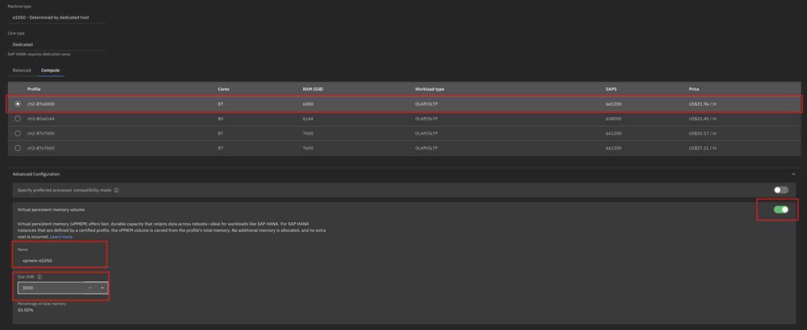
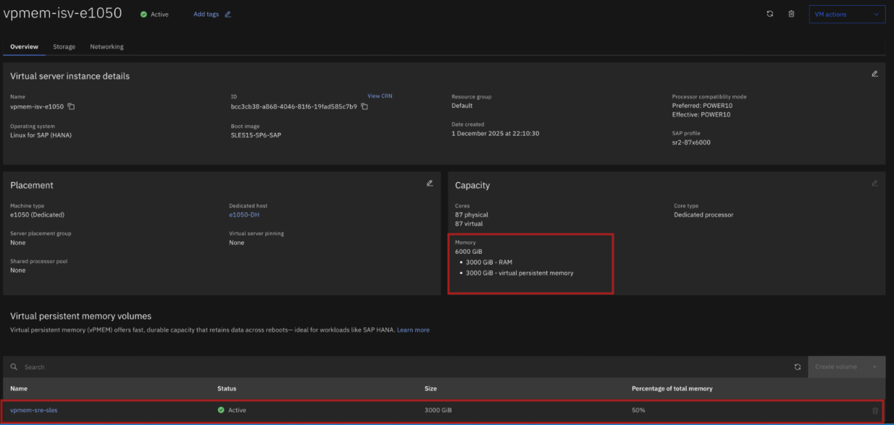

---
copyright:
  years: 2025, 2025
lastupdated: "2025-12-15"
keywords: SAP,{{site.data.keyword.cloud_notm}}, {{site.data.keyword.ibm_cloud_sap}}, SAP Workloads, VPMEM, Virtual persistent memory, VPMEM on {{site.data.keyword.powerSys_notm}}, Congifure VPMEM
subcollection: sap
---

{{site.data.keyword.attribute-definition-list}}


# Virtual Persistent Memory (vPMEM) with SAP HANA on {{site.data.keyword.powerSys_notm}}
{: #powervs-vpmem-with-sap-hana}


Virtual Persistent Memory (vPMEM) is an enhancement of IBM's advanced virtualization platform, PowerVM&reg;. It introduces the ability to configure persistent volumes by using conventional DRAM (dynamic RAM) memory modules on Power&reg; systems.

vPMEM uses DRAM technology, so it gives the same performance characteristics as DRAM. It enables IBM Power users to significantly accelerate SAP HANA&reg; restarts during planned maintenance and unplanned outages, without compromising production performance. This innovation substantially improves the serviceability of SAP HANA and simplifies Linux software maintenance.

This document is intended for technical specialists who plan to configure vPMEM with SAP HANA on {{site.data.keyword.powerSysShort}}. It does not replace existing IBM or SAP HANA&reg; documentation but provides a technical overview of how to configure vPMEM with SAP HANA on {{site.data.keyword.powerSysShort}}. It also explains how to deploy, resize, and delete vPMEM devices for SAP HANA deployment on {{site.data.keyword.powerSys_notm}}.

## Why vPMEM?
{: #powervs-vpmem-intro}

SAP HANA uses persistent memory to reduce operational downtime. By retaining data in memory after a shutdown, SAP HANA avoids time‑consuming data reloads from disk storage during database server startup.

SAP HANA currently supports three types of persistent memory:
- Physical persistent memory (PMEM)
- IBM {{site.data.keyword.powerSysFull}} vPMEM
- Linux tmpfs file system (SAP HANA Fast Restart option)

##  Time-saving benefits for SAP HANA startup using vPMEM
{: #powervs-vpem-time-save}

SAP HANA startup times are measured and summarized in the chart to show the benefits of using vPMEM. With vPMEM, an SAP HANA warm start is 9 times faster than the equivalent cold start for a 1.9 TB SAP HANA database. This factor increases to 16 for a 16 TB SAP HANA database.
The following chart shows the linear dependency between SAP HANA startup times measured in minutes and the database size specified in TB.


{: caption="Time savings for SAP HANA startups using vPMEM." caption-side="bottom"}

vPMEM is supported only for profiles with memory sizes of 1900 GiB (1.9 TB) or higher. Profiles with smaller memory are not supported because vPMEM does not provide significant performance benefits in those cases.
{:note: .note}


## SAP HANA certified profiles that support vPMEM
{: #powervs-vpmem-supported-hana-profiles}

The following SAP HANA certified profiles support vPMEM on IBM {{site.data.keyword.powerSys_notm}}, enabling high‑performance in‑memory computing for SAP HANA workloads:

|Profile Name	|Cores	|RAM (GiB)  | vPMEM min %	| vPMEM max %|
|---------------|-------|---------- |--------------|------------|
|sh2-8x1900	    |8	    |1900	   |10%	         |90%	       |
|sh2-16x1900	|16	    |1900	   |10%	         |90%	       |
|sr2-25x1900	|25	    |1900	   |10%	         |90%	       |
|sh2-33x1900	|33	    |1900	   |10%	         |90%	       |
|sr2-35x3000	|35	    |3000	   |10%	         |90%	       |
|bh2-35x3000	|35	    |3000	   |10%	         |90%         |
|sr2-35x3900	|35	    |3900	   |10%	         |90%	       |
|bh2-35x3900	|35	    |3900	   |10%	         |90%	       |
|sr2-87x6000	|87	    |6000	   |10%	         |90%	       |
|ch2-87x6000	|87	    |6000	   |10%	         |90%	       |
|sr2-80x6144	|80	    |6144	   |10%	         |90%	       |
|ch2-80x6144	|80	    |6144	   |10%	         |90%	       |
|sr2-87x7000	|87	    |7000	   |10%	         |90%	       |
|ch2-87x7000	|87	    |7000	   |10%	         |90%	       |
|sr2-87x7600	|87	    |7600	   |10%	         |90%	       |
|ch2-87x7600	|87	    |7600	   |10%	         |90%	       |
{: caption="vPMEM‑supported SAP HANA profiles on IBM Power Virtual Server" caption-side="bottom"}


Currently, only specific profiles of Power S1022 and Power E1050 support vPMEM on {{site.data.keyword.powerSys_notm}}. More profiles will be added in future releases, including those for Power E1080 and the latest Power11 servers. For detailed information about the vPMEM supported profiles, see [SAP HANA certified instances on IBM Power Virtual Server](/docs/sap?topic=sap-hana-iaas-offerings-profiles-power-vs).
{:note: .note}


## Planning for vPMEM with SAP HANA on {{site.data.keyword.powerSys_notm}}
{: #powervs-vpmem-planning-phase}

Planning for vPMEM with SAP HANA on {{site.data.keyword.powerSys_notm}} includes:
- Recommended workflow for using vPMEM with SAP HANA
- Guidance on sizing vPMEM for SAP HANA

### Recommended workflow for using vPMEM with SAP HANA
{: #powervs-vpmem-sap-hana-workflow}

The recommended workflow to enable the use of vPMEM with SAP HANA is as follows:

1. Determine the amount of persistent memory required to configure (see [Sizing vPMEM for SAP HANA](#powervs-vpmem-sap-hana-sizing)).
1. Create the vPMEM volumes (see [Deploy SAP HANA instance on Power Virtual Server with vPMEM](#powervs-vpmem-deployment)).
1. After the virtual machine (VM) is deployed, create vPMEM‑based file systems (see [Manual steps to create and remove vPMEM volumes](https://community.ibm.com/HigherLogic/System/DownloadDocumentFile.ashx?DocumentFileKey=9bb76800-c060-6613-ab28-cbdd1d3f55e8&forceDialog=0){: external}), page 41.
1. Enable SAP HANA to use persistent memory (see [Configuring vPMEM usage in existing SAP HANA installations](https://community.ibm.com/HigherLogic/System/DownloadDocumentFile.ashx?DocumentFileKey=9bb76800-c060-6613-ab28-cbdd1d3f55e8&forceDialog=0){: external}) and [Configuring vPMEM usage in new SAP HANA installations](https://community.ibm.com/HigherLogic/System/DownloadDocumentFile.ashx?DocumentFileKey=9bb76800-c060-6613-ab28-cbdd1d3f55e8&forceDialog=0){: external}, pages 43 and 44.)
1. Verify that SAP HANA is using the vPMEM volumes. (See [Verifying the vPMEM setup in the OS](#powervs-vpmem-verification)).

#### Automation
{: #powervs-vpmem-automation}

Steps 3 and 4 can be automated by using the vPMEM startup script `vpmem_hana_startup.py`. The `vpmem_hana_startup.py` script and sample configuration files can be downloaded from
[https://github.com/IBM/vpmem-hana-startup](https://github.com/IBM/vpmem-hana-startup){: external}.

The script simplifies the creation and mounting of vPMEM‑based file systems in SAP HANA environments, reducing manual effort and ensuring consistent configuration.

The script is described in the *Using vPMEM with SAP HANA* section of the document [vPMEM-SAPHANA-Whitepaper-v2.2.pdf](https://community.ibm.com/HigherLogic/System/DownloadDocumentFile.ashx?DocumentFileKey=9bb76800-c060-6613-ab28-cbdd1d3f55e8&forceDialog=0){: external} (page 25).

#### Required Packages
{: #powervs-vpmem-required-packages}

To use the vPMEM startup script, install the following packages:
- `numactl`
- `ndctl`


Run the following commands:


[SLES]{: tag-green}:

```sh
zypper install ndctl numactl
```
{: pre}


[RHEL]{: tag-red}:

```sh
yum install ndctl numactl
```
{: pre}


These commands install `numactl` and `ndctl`.


For the updated information, see [SAP Note 2945828 - Virtual PMEM on IBM Power Systems](https://me.sap.com/notes/2945828/E){: external}.


### Sizing vPMEM for SAP HANA
{: #powervs-vpmem-sap-hana-sizing}

The required volume sizes should be determined before configuring vPMEM for SAP HANA. In general, the vPMEM volume should be:
- Large enough to store the main data of the SAP HANA system’s column store.
- Include extra space for growth and delta merge operations.

This ensures optimal performance and prevents capacity issues during normal database operations. [SAP Note 2786237](https://me.sap.com/notes/2786237/E){: external} provides tools to help with sizing persistent memory volumes:

- [SAP HANA Quick Sizer](https://www.sap.com/about/benchmark/sizing.quick-sizer.html#quick-sizer){: external} for new deployments.
- Sizing report for SoH and S/4HANA - [SAP Note 1872170](https://launchpad.support.sap.com/#/notes/1872170){: external}
- Sizing report for BWoH and BW/4HANA - [SAP Note 2296290](https://launchpad.support.sap.com/#/notes/2296290){: external}
- SQL reports that are included in SAP Note 2786237 for analyzing memory usage in an existing system

The DRAM-to-PMEM ratio restrictions in [SAP Note 2786237](https://me.sap.com/notes/2786237/E){: external} do not apply to the Power platform. This is because the physical characteristics of vPMEM, such as latency, are equivalent to the characteristics of standard DRAM. Therefore, vPMEM-to-DRAM ratios can be configured with complete flexibility {{site.data.keyword.powerSys_notm}}.

On {{site.data.keyword.powerSys_notm}}, users can configure the vPMEM volume to be between 10% and 90% of the profile memory.

Example:
If you are deploying the profile sr2-87*6000 on an E1050 system, the vPMEM memory allocation can range from:

- Minimum: 600 GiB (10% of profile memory)
- Maximum: 5400 GiB (90% of profile memory)

This flexibility allows administrators to optimize memory persistence based on workload requirements and SAP HANA sizing recommendations.

## Deploy SAP HANA instance on {{site.data.keyword.powerSys_notm}} with vPMEM
{: #powervs-vpmem-deployment}


### Graphical user interface (GUI)
{: #powervs-vpmem-gui-deployment}

During virtual machine (VM) deployment, specify the required virtual persistent memory (vPMEM) size and provide all necessary details, including the vPMEM volume.

To create a virtual server instance, follow the steps in [Configuring a Power Virtual Server Instance](https://www.ibm.com/docs/es/power-virtual-server?topic=deploying-creating-power-virtual-server#configuring-instance){: external}. For vPMEM configuration, the process is similar, with a few more steps as follows:
1. Select a profile for vPMEM.
2. Turn on the toggle to enter the vPMEM device size.
3. Enter a unique name and specify the size in GiB between 10% and 90% of the maximum memory for the selected profile.

{: caption="Storage section showing the selected profile, vPMEM toggle enabled, and configured with a unique vPMEM name and size." caption-side="bottom"}


After the instance is created, perform the following checks in the {{site.data.keyword.powerSys_notm}} graphical user interface (GUI) to validate vPMEM configuration:

Verify the profile details
- On the Virtual server instances page, locate the newly created virtual machine in the **Private networks** list.
- **Name**, **IP address**, **IP range**, and **CIDR** display on the screen.


Check the vPMEM allocation
- Click the instance name to open the detailed view.
- Go to the **Capacity** section.
- See the memory split, including:
   - The RAM size (for example, 3000 GiB)
   - The virtual persistent memory allocation is the same size that you configured earlier.


Validate the status
- Ensure that the vPMEM **Status** is Active.
- The **Size** column must reflect the correct vPMEM size as configured during instance creation.


{: caption="Capacity section displays memory and virtual persistent memory details, and virtual persistent memory volume section shows active status with vPMEM size." caption-side="bottom"}


### Command-line interface (CLI)
{: #powervs-vpmem-cli-deployment}

Run the following command in the command line:

```sh
ibmcloud pi instance sap create vpmem-isv-e1050
--image SLES15-SP6-SAP
--key-name Permanent-VPC-VM-Key
--subnets "ISV-Net2"
--deployment-target 'f141b265-7325-45e9-8c1f-9ee3a2d7c082,host'
--profile-id sr2-87x6000
--vpmem-volumes "vpmem-e1050  3000"
```
{: pre}

See a sample output of the command:

```sh
ibmcloud pi instance sap create vpmem-isv-e1050 --image SLES15-SP6-SAP --key-name Permanent-VPC-VM-Key --subnets 'ISV-Net2' --deployment-target 'f1412b65-7235-4e59-8c1f-9ee3a2d7c082,host' --profile-id sr2-87x6000 --vpmem-volumes 'vpmem-e1050 3000'
Creating SAP instance vpmem-isv-e1050 under account ##### from account as user user@in.ibm.com...
SAP Instance vpmem-isv-e1050 Created.

ID: bcc3cb38-a086-4df6-81f6-19fad585c7d9
CRN: crn:v1:staging:public:power-iaas:####:a/1d2d5e521b50472b8fda58ebf7f3d:9e666885-b237-4e49-8f6f-ef4b8c4398c7:pvm-instance:bcc3cb38-a086-4df6-81f6-19fad585c7d9
Name: e1050
Creation Date: 2025-01-01T00:00:00.000Z
Last Update: 2025-01-01T00:00:00.000Z
CPU Cores: 87
Memory: 3000
Processor Type: Dedicated
Preferred Processor Compatibility Mode: POWER10
Preferred Processor Compatibility Mode: POWER10
System Type: e1050
Subnets: abc10/ba0-6f2e-4f44-9995-5a678114449a
Boot Disk Size: 100
Volumes: -
Storage Type: tier3
Image: SLES15-SP6-SAP
Status: BUILDING
Placement Group: None
Storage Pool Affinity: General-Flash-86
Deployment Type: None
Address: Internal Address: Mac Address:
Profile ID: sr2-87x6000
SAP Profile Link: /p/cloud/v1/cloud-instances/4a5db4b434d483b9c7e48790245641/sap/sr2-87x6000
```
{: screen}


To list VM details along with vPMEM device details, run the following command:

```sh
ibmcloud pi instance get vpmem-isv-e1050
```
{: pre}

See a sample output of the command:

```sh
Getting instance vpmem-isv-e1050 under account IBM Account as user user@in.ibm.com...

ID: 73e1ed53-d6ee-471d-ad65-d18151814810
Name: vpmem-isv-e1050
CRN: crn:v1:staging:public:power-iaas:####:a/27bfc5ab5def7f83d:966688f5-3237-4ef9-8f6f-ef648b4398c7:pvm-instance:73e1ed53-d6ee-471d-ad65-d18151814810
Creation Date: 2025-12-12T16:13:39.000Z
Last Update: 2025-12-12T16:13:39.000Z
CPU Cores: 87
Memory: 3000
Processor Type: Dedicated
Preferred Processor Compatibility Mode: POWER10
Effective Processor Compatibility Mode: POWER10
System Type: e1050
Subnets: 61b9e2c0-4f44-9995-50bf814f4404
Boot Disk Size: 100
Volumes: c1b9f3f2-92f9-4f99-a9f7-5f8f144f4404
Storage Type: tier3
Image: SLES15-SP6-SAP
Status: ACTIVE
Placement Group: None
Storage Pool Affinity: General-Flash-86
Deployment Type: None
Network: Internal Address: XX.XX.XX.XX, Mac Address: XX:XX:XX:XX:XX:XX
Health Reason: -
Health Status: OK
Profile ID: sr2-87x6000
SAP Profile Link: /p/cloud/v1/cloud-instances/966688f5-3237-4ef9-8f6f-ef648b4398c7/sap/sr2-87x6000

Max Cores: 87
Assigned: 87
Min: 87

vPMEM Volumes:
ID: 994e8b9b-5837-4d43-a0bc-17efb0ca841c
Name: vpmem-e1050
CRN: crn:v1:staging:public:power-iaas:####:a/27bfc5ab5def7f83d:966688f5-3237-4ef9-8f6f-ef648b4398c7:pvm-volume:994e8b9b-5837-4d43-a0bc-17efb0ca841c
Creation Date: 2025-12-12T16:14:29.000Z
Last Update: 2025-12-12T16:14:29.000Z
PVM Instance ID: 73e1ed53-d6ee-471d-ad65-d18151814810
Size: 3000
Status: ACTIVE
```
{: screen}


## Modify vPMEM volumes for SAP HANA instances in {{site.data.keyword.powerSys_notm}}
{: #powervs-modify-vpmem}

To change the vPMEM device size, follow these steps to modify the vPMEM volumes for SAP HANA in {{site.data.keyword.powerSys_notm}}:

1. Shut down the VM and delete the existing vPMEM volume.
1. Create and attach a new vPMEM volume, then restart the VM.

Deleting a vPMEM device reverts the physical memory of the virtual machine back to the original profile memory size specified during instance creation.

For example, consider a profile with 87 cores and 6000 GiB of memory, where vPMEM is 3000 GiB and DRAM is 3000 GiB. The customer wants to increase the vPMEM size to 3500 GiB. Since resizing is not supported, follow these steps:

1. Shut down the VM.
1. Delete the existing 3000 GiB vPMEM volume.
1. The VM memory automatically reverts to 6000 GiB of DRAM.
1. Add a new vPMEM volume with a size of 3500 GiB.
1. The VM memory is reconfigured to 2500 GiB of DRAM plus the new 3500 GiB vPMEM volume.
1. Restart the VM with the updated configuration.

## Deleting vPMEM volumes
{: #powervs-delete-vpmem}

If vPMEM volumes are no longer required, the existing vPMEM volume can be deleted from {{site.data.keyword.powerSys_notm}} by following these steps:

1. Shut down the VM.
1. Delete the existing vPMEM volume.
1. The VM memory automatically reverts to DRAM.
1. Restart the VM.

## Verifying the vPMEM setup in the OS
{: #powervs-vpmem-verification}

After the instance is successfully created, connect to your virtual machine.

Run the following commands:
- `free -h` to verify the memory allocation.
- `numactl --hardware` to verify CPU and memory distribution.

See a sample output of the command:

```sh
node 1 cpus: 96 97 98 99 100 101 102 103 104 105 106 107 108 109 110 111 112 113 114 115 116 117 118 119 120 121 122 123 124 125 126 127 128 129 130 131 132 133 13 |4 135 136 137 138 139 140 141 142 143 144 145 146 147 148 149 150 151 152 153 154 155 156 157 158 159 160 161 162 163 164 165 166 167 168 169 170 171 172 173 174 1 75 176 177 178 179 180 181 182 183 184 185 186 187 188 189 190 191
node 1 size: 942113 MB
node 1 free: 885967 MB
node 2 cpus: 192 193 194 195 196 197 198 199 200 201 202 203 204 205 206 207 208 209 210 211 212 213 214 215 216 217 218 219 220 221 222 223 224 225 226 227 228 22 9 230 231 232 233 234 235 236 237 238 239
node 2 size: 471054 MB
node 2 free: 468595 MB
node 3 cpus: 240 241 242 243 244 245 246 247 248 249 250 251 252 253 254 255 256 257 258 259 260 261 262 263 264 265 266 267 268 269 270 271 272 273 274 275 276 27 7 278 279 280 281 282 283 284 285 286 287 288 289 290 291 292 293 294 295
node 3 size: 549566 MB
node 3 free: 547367 MB
node 4 cpus: 296 297 298 299 300 301 302 303 304 305 306 307 308 309 310 311 312 313 314 315 316 317 318 319 320 321 322 323 324 325 326 327 328 329 330 331 332 33 3 334 335 336 337 338 339 340 341 342 343 344 345 346 347 348 349 350 351 352 353 354 355 356 357 358 359
node 4 size: 628075 MB
node 4 free: 626305 MB
node 5 cpus: 360 361 362 363 364 365 366 367 368 369 370 371 372 373 374 375 376 377 378 379 380 381 382 383 384 385 386 387 388 389 390 391 392 393 394 395 396 39 7 398 399 400 401 402 403 404 405 406 407 408 409 410 411 412 413 414 415 416 417 418 419 420 421 422 423 424 425 426 427 428 429 430 431 432 433 434 435 436 437 4 38 439 440 441 442 443 444 445 446 447 448 449 450 451 452 453 454 455
node 5 size: 625035 MB
node 5 free: 623033 MB
```
{: screen}


List the vPMEM devices by using the vPMEM startup script, described in the [Recommended workflow for using vPMEM with SAP HANA]( #powervs-vpmem-psap-hana-workflow) section.

```sh
./vpmem_hana_startup.py -p
```
{: pre}

See a sample output of the command:

```sh
vPMEM     Numa
Region    Node        Size            Parent UUID
--------------------------------------------------------------------------
region0    0          197568495616    27e2557b-4b59-482c-9f13-deca043fd401
region1    1          197031624704    27e2557b-4b59-482c-9f13-deca043fd401
region2    2          230049185792    27e2557b-4b59-482c-9f13-deca043fd401
region3    3          196763189248    27e2557b-4b59-482c-9f13-deca043fd401
```
{: screen}


## Using vPMEM with SAP HANA
{: #powervs-using-vpmem}

Enable SAP HANA to use vPMEM by taking one of the following actions:

- Install SAP HANA with vPMEM configuration
- Reconfigure HANA with the vPMEM devices

For detailed instructions, refer to the [Using vPMEM with SAP HANA](https://community.ibm.com/HigherLogic/System/DownloadDocumentFile.ashx?DocumentFileKey=9bb76800-c060-6613-ab28-cbdd1d3f55e8&forceDialog=0){: external} section, page 25.


## Application programming interface (API)
{: #powervs-vpmem-api-deployment}

To deploy vPMEM with SAP HANA on {{site.data.keyword.powerSys_notm}}, see [Create a new SAP PVM Instance](/apidocs/power-cloud#pcloud-sap-post){: external}.
