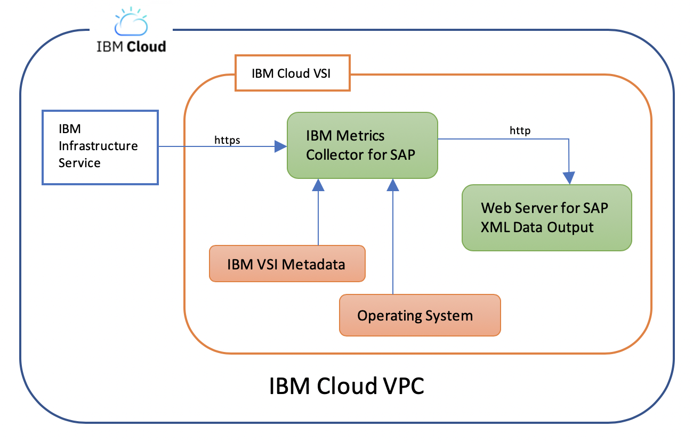

---
copyright:
  years: 2020
lastupdated: "2020-12-17"
keywords: SAP, {{site.data.keyword.cloud_notm}} SAP-Certified Infrastructure, {{site.data.keyword.ibm_cloud_sap}}, SAP Workloads, VPC, SAP NetWeaver, SAP HANA, {{site.data.keyword.IBM}} Metrics Collector for SAP, IMCS
subcollection: sap
---

{{site.data.keyword.attribute-definition-list}}


# Using {{site.data.keyword.IBM_notm}} Metrics Collector for SAP (IMCS) on Linux
{: #ibm-metrics-collector-for-sap-linux}

The {{site.data.keyword.IBM}} Metrics Collector for SAP (IMCS) on Linux&reg; is a requirement by SAP Support for {{site.data.keyword.vpc_full}} Infrastructure only when SAP workloads are running on the virtual server instance (VSI).
{: note}


The IMCS collects performance-related data from {{site.data.keyword.vsi_is_full}} for SAP. The SAP Support team uses the collected metric data to monitor, troubleshoot, and improve performance of business transactions. Use the following information to help with installing, configuring, and troubleshooting the {{site.data.keyword.IBM_notm}} Metrics Collector for SAP on Linux.
{: shortdesc}

## Before you begin
{: #before-you-begin-imcs}

You need to successfully create an {{site.data.keyword.vpc_full}} and {{site.data.keyword.vsi_is_short}} by using the appropriate catalog image for SAP. Check [SAP Note 2927211](https://me.sap.com/notes/2927211){: external} to make sure that the selected operating system is supported by SAP. The Metrics Collector runs specifically on {{site.data.keyword.vsi_is_short}} to gather required SAP metrics. Figure 1 outlines the data sources that are used by {{site.data.keyword.IBM_notm}} Metrics Collector for SAP.

{: caption="Data sources for {{site.data.keyword.IBM_notm}} Metrics Collector for SAP" caption-side="bottom"}


## Getting an {{site.data.keyword.cloud_notm}} API key
{: #metrics-linux-get-api-key}

You need an {{site.data.keyword.cloud_notm}} API key for IMCS to successfully collect all required metrics. The API key grants view access to {{site.data.keyword.cloud_notm}} infrastructure services. You can install IMCS without an API key. However, some metrics are missing and the virtual server is not supported by SAP.

For a list of missing metrics, see [Additional Information](#metrics-linux-addl-info).

You need to create only one Service ID and one API Key per Account. You can use the same Service ID and API Key for all the Metric Collectors that are installed in the virtual server that is associated to the Account.
{: note}


### Creating a Service ID
{: #metrics-linux-service-id}

You need to first create a Service ID and then the related API key. Use the following steps to create a Service ID.

1. Sign in to the [{{site.data.keyword.cloud_notm}} console](https://cloud.ibm.com){: external} and click **Manage** > **Access (IAM)**.

   Figure 2. Open the Access (IAM page)

    page"){: caption="Open the Access (IAM) page" caption-side="bottom"}

1. Click **Services IDs** > **Create**.
1. Enter a **Name** and **Description** for the Service ID and click **Create**. You can assign the Access Policy after your Service ID is created.
1. Click **Access Policies** > **Assign Access**.
1. Click **IAM Services** for **Assign Service ID additional access**.
1. Select **VPC Infrastructure service** for **What type of access do you want to assign?**
1. Leave the default **Account** for **in**
1. Leave **All resource types** for **Resource type** and click **Viewer** for **Platform Access**.
1. Click **Add** > **Assign**. The VPC Infrastructure Service policy is assigned to your Service ID.

### Creating an API Key for the Service ID.
{: #-metrucs-linux-api-key}

Use the following steps to create an API Key for the new Service ID.

1. Select **Service IDs** and your newly created Service ID
1. Click the tab **Access Policy** and verify that the **VPC Infrastructure Service** is listed as an Access Policy. If not repeat steps 4-9.
1. Click the next tab **API keys** > **Create**.
1. Enter a **Name** and **Description** for the key and click **Create**.
1. Click **Copy** or **Download** your API key to save it.

This is the only opportunity to access the API Key's data. You cannot view this API key again, so you cannot retrieve it later.
{: important}

## Installing the {{site.data.keyword.IBM_notm}} Metrics Collector for SAP on Linux
{: #install-imcs-linux}

The IMCS is a daemon or service that automatically starts as soon as it is installed and requires an API key. It collects metrics from the metadata of the virtual server, {{site.data.keyword.cloud_notm}} infrastructure services, runtime data about resources, such as CPU, memory, network, and disk. The metrics are aggregated and displayed through the web server for SAP customers. SAPOSCOL uses the XML output of this web server.

The IMCS uses port 18181 to display the metrics. Make sure that `port 18181` is not used by any other application. For more information about checking port availability, see [Troubleshooting](#troubleshooting-linux).
{: important}

The commands that are listed in this section were run on a Red Hat virtual server instance. If you have a SUSE virtual server, you can follow the same steps but you will see a slightly different user interface.
{: note}

Use the following steps to download the IMCS.

1. [Download the IMCS](https://public.dhe.ibm.com/cloud/bluemix/sap/linux/){: external}.
1. Select the appropriate `tar.gz` file. In most cases, use the current version. Connect as **guest**.
1. Save the file to your internal Downloads folder and click **OK**.
1. Move or copy the IMCS `tar.gz` file to your VPC virtual server instance.
1. Extract the file and open the extracted folder.

   ```sh
   tar -xvf sap-metrics-collector-v1.3.tar.gz
   cd sap
   ```
   {: pre}

1. Run the `install-linux.sh` file.

   ```sh
   ./install-linux.sh
   ```
   {: pre}

1. Paste your API key when prompted. If you don't have an API key, see [Getting an {{site.data.keyword.cloud_notm}} API key](/docs/sap?topic=sap-ibm-metrics-collector-for-sap-linux#metrics-linux-get-api-key).
1. Check to make sure that the IMCS is running after the installation is complete. The service status displays `active` when it is ready.

   ```sh
   sudo systemctl is-active sap-metrics-collector
   ```
   {: pre}

## Verifying data collection
{: #verify-data-collection-linux}

After the installation completes and the service is started, it can take time for the IMCS begins collecting metrics. Wait at least 2 minutes after the installation before you expect full and accurate metrics.

1. Run the following `curl` command for your localhost address to see your metrics:

   ```sh
   curl http://localhost:18181/sap/metrics
   ```
   {: pre}

   ```sh
    <metrics>
      <metric category="config" context="vm" device-id="" last-refresh="1607451781" refresh-interval="0" type="string" unit="none">
        <name>Data Provider Version</name>
        <value>1.3</value>
      </metric>
      <metric category="config" context="host" device-id="" last-refresh="1607451781" refresh-interval="0" type="string" unit="none">
        <name>Cloud Provider</name>
         <value>IBM Cloud</value>
      </metric>
      <metric category="config" context="vm" device-id="" last-refresh="1607451781" refresh-interval="0" type="string" unit="none">
        <name>Instance Type</name>
        <value>bx2-8x32</value>
      </metric>
      <metric category="config" context="host" device-id="" last-refresh="1607451781" refresh-interval="0" type="string" unit="none">
        <name>Virtualization Solution</name>
        <value>KVM</value>
      </metric>
      .
      .
      .
    </metrics>
   ```
   {: screen}

You might experience a delay before your data is available.
{: note}

## Troubleshooting
{: #troubleshooting-linux}

Use the following troubleshooting tips for IMCS.

### Uninstalling the Metrics Collector
{: #uninstall-imcs-linux}

1. Run the following command to uninstall IMCS if you have any issues during the installation process. Then, reinstall it.

   ```sh
   ./uninstall-linux.sh
   ```
   {: pre}

   ```sh
   Removing IBM Metric Collector for SAP...
   Successfully removed IBM Metric Collector for SAP.
   ```
   {: screen}

### No metrics reported when you run the `curl` command
{: #no-metrics-linux}

No reported metrics message is often due to the port not assigned to SAP Metrics Collector. It needs port `18181` available for `localhost`. If you have any other applications that use the port, you must close the applications.

1. Use the following command to see whether the port is assigned to another application.

   ```sh
   nmap -sT -O localhost
   ```
   {: pre}

   ```sh
   Starting Nmap 6.40 (http://nmap.org) at (date and time)
   Nmap scan report for localhost (your localhost address)
   Host is up (0.0s latency).
   Other addresses for localhost (not scanned): (localhost addresses)
   rDNS record for (localhost): sap-mc-redhat
   Not shown: (number of) closed ports
   PORT   STATE SERVICE
   (port)/tcp open  ssh
   (port)/tcp open  smtp
   Device type: general purpose
   Running: Linux 3.X
   OS CPE: cpe:/o:linux:linux_kernel:3
   OS details: Linux 3.7 3.9
   Network Distance: 0 hops
   ```
   {: screen}

### nmap not found
{: #nmap-not-found}

You can install `nmap` on your system by using the appropriate package manager like `yum` or `apt-get`.

* Command for Red Hat: `yum install nmap`
* Command for SUSE: `zypper install nmap`


## Additional information
{: #metrics-linux-addl-info}

If you don't have an {{site.data.keyword.cloud_notm}} API key, the IMCS can't collect all of the metrics that are required by SAP, which include

* Network Adapter Mapping - replaced with local MAC ID.
* Network Adapter Bandwidth - Port Speed - defaults to 0.
* Disk Volume Mapping - replaced with Volume Attachment ID.
* Disk Guaranteed IOPS - defaults to 0.

You must provide an API key so that all metrics can be collected. Otherwise, this virtual server is not fully supported by SAP.
{: important}
