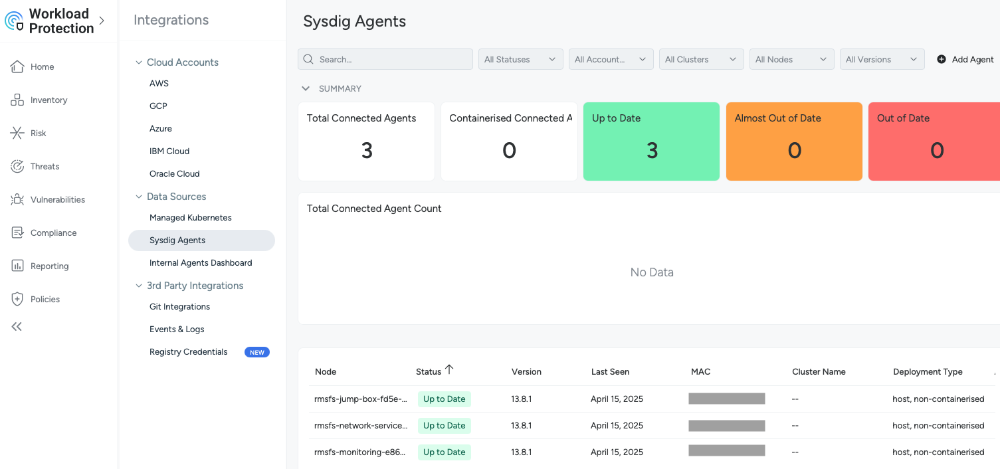

---
copyright:
  years: 2026
lastupdated: "2026-01-23"
keywords: SAP, SAP SCC Workload Protection, {{site.data.keyword.sysdigsecure_full_notm}}, {{site.data.keyword.ibm_cloud_sap}}, SAP Workloads, SAP HANA
subcollection: sap
content-type: tutorial
account-plan: paid
completion-time: 10m
---

{{site.data.keyword.attribute-definition-list}}


# Set up the {{site.data.keyword.sysdigsecure_short}} agent
{: #scc-wp-agent-setup}
{: toc-content-type="tutorial"}
{: toc-completion-time="10m"}

This tutorial describes how to install and configure the {{site.data.keyword.sysdigsecure_short}} agent on Linux.
{: shortdesc}

{{site.data.keyword.sysdigsecure_short}} provides the following features to protect standalone Linux hosts:

* **Threat detection**: identify threats and suspicious activity based on application, network and host activity by processing syscall events and investigate with detailed system captures.

* **Posture management**: scan host configuration files for compliance and benchmarks such as CIS Linux Benchmark.

* **Host scanning**: scan host packages, detect the associated vulnerabilities and identify the resolution priority based on available fixed versions and severity.

This tutorial only covers installing the {{site.data.keyword.sysdigsecure_short}} agent on {{site.data.keyword.vsi_is_full}} and {{site.data.keyword.powerSysFull}} hosts running RHEL or SLES Linux. For more compatible operating systems and setup instructions, refer to the [{{site.data.keyword.sysdigsecure_short}} documentation](/docs/workload-protection?topic=workload-protection-getting-started&interface=ui) under **Managing the agent**.
{: note}

There are multiple ways to install the agent depending on your preferences and setup. This tutorial installs the agent through an installation script. For other methods, refer to the official [{{site.data.keyword.sysdigsecure_short}} documentation](/docs/workload-protection?topic=workload-protection-getting-started&interface=ui) under **Managing the agent**.
{: note}

## Preparation
{: #scc-wp-agent-setup-preparation}
{: step}

### Collecting {{site.data.keyword.sysdigsecure_full_notm}} details
{: #scc-wp-agent-setup-collect-details}

The following details are required to setup the {{site.data.keyword.sysdigsecure_short}} agent:
* `access_key`
* `api_endpoint`
* `ingestion_endpoint`

### Getting the Access Key
{: #scc-wp-agent-setup-access-key}

The Access Key is a token needed to connect the agents to the {{site.data.keyword.sysdigsecure_full}} instance in {{site.data.keyword.cloud_notm}}.

To get the access key for an {{site.data.keyword.sysdigsecure_full_notm}} instance, complete the following steps:

1. Navigate to the {{site.data.keyword.sysdigsecure_short}} overview.

   1. [Log in to the {{site.data.keyword.cloud_notm}} console](https://cloud.ibm.com/login){: external}.

   2. Go to the Menu icon  &gt; **Security**.

   3. Click on your {{site.data.keyword.sysdigsecure_short}}

2. Click on **Actions** &gt; **Manage Key** and note it down somewhere safe so you can use it in the next steps.

### Getting the API and Ingestion Endpoints
{: #scc-wp-agent-setup-endpoints}

Refer to [REST API endpoints](/docs/workload-protection?topic=workload-protection-endpoints#endpoints_rest_api) to find the right private API endpoint for your location.

Refer to [Collector endpoints](/docs/workload-protection?topic=workload-protection-endpoints#endpoints_ingestion) to find the right private ingestion endpoint for your location.

For API endpoint, make sure to note it down **with** preceding `https://` but **without** any subdirectories like `/api`. Example:
* API endpoint: `https://private.us-south.security-compliance-secure.cloud.ibm.com`

For Ingestion endpoint, make sure to note it down **without** preceding `https://`and **without** any subdirectories. Example:
* Ingestion endpoint: `ingest.private.us-south.security-compliance-secure.cloud.ibm.com`

## Agent installation and Setup
{: #scc-wp-agent-setup-install-setup}
{: step}

The {{site.data.keyword.sysdigsecure_short}} agent needs to be installed on each host. Thus, the following steps have to be performed on each host.
{: note}

### Determine the agent driver
{: #scc-wp-agent-setup-driver}

1. Depending on the kernel version of the linux distribution, a different agent driver is required. For kernel versions newer than 5.8, ```universal_ebpf``` is recommended and ```kmod``` for older kernel versions.

   To check the kernel version:
   ```bash
   uname -r
   ```

1. Skip this step if your kernel version is 5.8 or newer. Otherwise, install the kernel headers:
   - on RHEL

   ```bash
   yum -y install kernel-devel-$(uname -r)
   ```

   - on SLES

   ```bash
   zypper -y install kernel-devel
   ```

For more information on the different agent drivers, refer to [Understand Agent Drivers](https://docs.sysdig.com/en/sysdig-secure/install-agent-components/configuration/sysdig-agent/understand-agent-drivers/){: external}
{: note}

### {{site.data.keyword.sysdigsecure_short}} agent installation
{: #scc-wp-agent-setup-installation}

1. If your instance requires a proxy for internet access, make sure it's activated
    ```bash
   export http_proxy=http://<proxy_host_or_ip_port>:3128
   export https_proxy=http://<proxy_host_or_ip_port>:3128
   export HTTP_PROXY=http://<proxy_host_or_ip_port>:3128
   export HTTPS_PROXY=http://<proxy_host_or_ip_port>:3128
   export no_proxy=161.0.0.0/0,10.0.0.0/8
   ```

1. Download the installation script and make it executable, adjust the target directory to your needs:
   ```bash
   curl -L https://ibm.biz/install-sysdig-agent --output install-agent.sh
   chmod +x install-agent.sh
   ```

1. Run the installation script to install the {{site.data.keyword.sysdigsecure_short}} agent. Make sure to replace ACCESS_KEY, INGESTION_ENDPOINT, and API_ENDPOINT with the values obtained previously:

   - For kernel version 5.8 or newer:

   ```bash
   ./install-agent.sh -a <ACCESS_KEY> -c <INGESTION_ENDPOINT> --collector_port 6443 --secure true --universal_ebpf --additional_conf 'sysdig_api_endpoint: <API_ENDPOINT>\nhost_scanner:\n  enabled: true\n  scan_on_start: true\nkspm_analyzer:\n  enabled: true'
   ```

   - For kernel versions older than 5.8:

   ```bash
   ./install-agent.sh -a <ACCESS_KEY> -c <INGESTION_ENDPOINT> --collector_port 6443 --secure true --kmod --additional_conf 'sysdig_api_endpoint: <API_ENDPOINT>\nhost_scanner:\n  enabled: true\n  scan_on_start: true\nkspm_analyzer:\n  enabled: true'
   ```

1. Check that {{site.data.keyword.sysdigsecure_short}} agent is running:

   ```bash
   ps -ef | grep sysdig
   ```

   To look for errors, use:
   ```bash
   grep -i error /opt/draios/logs/draios.log
   # and
   grep -i fatal /opt/draios/logs/draios.log
   ```

1. Check the host shows up on the {{site.data.keyword.sysdigsecure_short}} Dashboard

   * Navigate to the dashboard. You can refer to [Creating a {{site.data.keyword.sysdigsecure_short}} instance](/docs/sap?topic=sap-scc-wp-create-instance#scc-wp-create-instance-access-dashboard) if you don't remember how to get there.
   * Select **Integrations** > **Data Sources** > **Sysdig Agents**.
   * It may take up to 15 minutes for the agent to show on the dashboard. If successful, it should look similar to this:

   {: caption="Agent Data Source in Dashboard Example" caption-side="bottom"}
   {: external download="scc-wp-dashboard-example.png"}

## Next step: Get to know the dashboard
{: #scc-wp-agent-setup-next-steps}
{: step}

- Go to [{{site.data.keyword.sysdigsecure_short}} Dashboard Overview](/docs/sap?topic=sap-scc-wp-dashboard-overview) for a brief introduction.

## Troubleshooting
{: #scc-wp-agent-setup-troubleshooting}

Downloading the agent installation script fails

* Make sure your system has internet access
* If you still can't download the script, you can try downloading it on your local machine and then transferring it to the remote system by using a method of your choice (e.g. scp).

I'm getting an error message saying my kernel headers don't match the expected version

* For kernel versions 5.8 or newer, make sure to use `universal_ebpf` driver. For kernel versions older than 5.8, make sure to use `kmod` driver.
* If your kernel version is 5.8 or older, make sure you installed the correct kernel headers as shown in [Determine the agent driver](/docs/sap?topic=sap-scc-wp-agent-setup#scc-wp-agent-setup-driver)
* For more information about the different drivers, refer to [Understand Agent Drivers](https://docs.sysdig.com/en/sysdig-secure/install-agent-components/configuration/sysdig-agent/understand-agent-drivers/){: external}

I see an error message in the logs saying that the endpoint can't be reached

* Make sure you selected the correct endpoints. The region in the endpoint should match the region of your {{site.data.keyword.sysdigsecure_short}} instance.
* Check the endpoints in the config file located under `/opt/draios/etc/dragent.yaml`. Make sure they match the description in [Getting the API and Ingestion Endpoints](/docs/sap?topic=sap-scc-wp-agent-setup#scc-wp-agent-setup-endpoints).
* Make sure you didn't mix up the API and ingestion endpoints. API endpoint starts with `https://` and ingestion endpoint start with `ingestion`.
* Check the network connectivity of your instance, including firewalls and security groups. Refer to [{{site.data.keyword.sysdigsecure_short}} Endpoints](/docs/workload-protection?topic=workload-protection-endpoints) to see which IP addresses need to be allowed for outbound traffic.

I have installed the agent as described and I don't see any error messages in /opt/draios/logs/draios.log but my host doesn't show up in the dashboard

* Check you have the correct endpoints and access key
* Give it some time, it may up to 15 minutes take a while for the agent to show up in the dashboard.

## Additional resources
{: #scc-wp-agent-setup-additional-resources}

* [Official {{site.data.keyword.sysdigsecure_short}} documentation](/docs/workload-protection?topic=workload-protection-getting-started&interface=ui)
* [Sysdig Secure documentation](https://docs.sysdig.com/en/docs/sysdig-secure/){: external}
