---
copyright:
  years: 2025
lastupdated: "2025-07-03"
keywords:
subcollection: sap
---

{{site.data.keyword.attribute-definition-list}}


# Deploying SAP NetWeaver 7.5 with ASE on RHEL 9.4
{: #deploy-sap-ase}

The deployment for SAP NetWeaver 7.5 with ASE Sybase on RHEL 9.4 is performed in phases:

1. [Cloud infrastructure planning](/docs/sap?topic=sap-deploy-sap-ase#cloud-infra-plan-ase)
2. [Cloud resource deployment](/docs/sap?topic=sap-deploy-sap-ase#cloud-resource-deploy-ase)
3. [File system preparation](/docs/sap?topic=sap-deploy-sap-ase#file-system-prep-ase)
4. [Operating system preparation](/docs/sap?topic=sap-deploy-sap-ase#os-prep-ase)
5. [Installation of SAP NetWeaver 7.5 with ASE on RHEL 9.4 with Software Provisioning Manager (SWPM)](/docs/sap?topic=sap-deploy-sap-ase#install-sapnw-ase)

## Cloud infrastructure planning
{: #cloud-infra-plan-ase}

Before performing any deployment, it is important to plan the cloud infrastructure requirements and ensure that all the required components are deployed on cloud VPC level. Learn about the cloud components that are required for deploying the SAP NetWeaver 7.5 with ASE solution:

### Virtual Private Cloud (VPC) deployment
{: #vpc-deploy-ase}

A VPC is the most basic component necessary for any deployment with the IBM Cloud VPC. For more information, see [VPC for SAP provisioning](/docs/sap?topic=sap-intro-sap-cloud-vpc#vpc-provision-sap).

### VPC subnet
{: #vpc-subnet-ase}

A VPC subnet is created as part of the network space in which SAP and database deployment take place. For more information, see [New Subnet for VPC](/docs/sap?topic=sap-intro-sap-cloud-vpc#new-subnet-sap-vpc).

### VPC security group
{: #vpc-security-ase}

A VPC Security Group is created to meet the security demands and standards. By specifying the specific inbound and outbound rules, the VSIs assigned to this security group will be protected against threats. For more information, see [Security Group for VPC](/docs/sap?topic=sap-intro-sap-cloud-vpc#security-group-sap-vpc).

### VPC Virtual Server Instance (VSI)
{: #vpc-vsi-ase}

VSIs are created and assigned to proper disks to meet the compute and storage requirements for SAP and database deployment.

For compute component, based on the estimated user load for the SAP system, it is important to choose the correct sizing in terms of CPU and RAM memory resource. For more information, see [Virtual Server profile names](/docs/sap?topic=sap-intro-sap-cloud-vpc#virtual-profile-intel-vsi-sap-vpc).

Also, for any deployment it is important to choose the right OS image for your VSI. Multiple options are available to choose from a selection of SAP certified RHEL, SUSE, or Windows images or custom images. For more information, see the [Catalog images on VPC](/docs/sap?topic=sap-intro-sap-cloud-vpc#catalog-images-sap-nw-db2-rhel).

The storage component is also an important part of any VSI deployment process and choosing the right block storage volume or deciding to use the NFS-based file storage is an important decision for any SAP deployment. For more information, see [Block Storage for Virtual Server Instances on VPC Infrastructure](/docs/sap?topic=sap-intro-sap-cloud-vpc#block-storage-vpc-sap).

## Cloud resource deployment
{: #cloud-resource-deploy-ase}

Before any deployment of SAP and database applications, you should prepare and deploy the necessary cloud resources in the IBM Cloud VPC. It is important to know the business and geographical location of the VPC placement. For more information, see [SAP NetWeaver deployment to Intel Virtual Server on VPC Infrastructure that uses RHEL](/docs/sap?topic=sap-quickstudy-vs-gen2-netweaver-rhel).

For instance, the following example data is of a VPC created in Germany with data centers spanning in the Frankfurt area:

| VPC name | VPC region | VPC zones |
| ---------------: | ---------: | ---------: |
| “bog-sap” | “eu-de” | “eu-de-1”, “eu-de-2” and “eu-de-3” |
{: caption="VPC details" caption-side="top"}

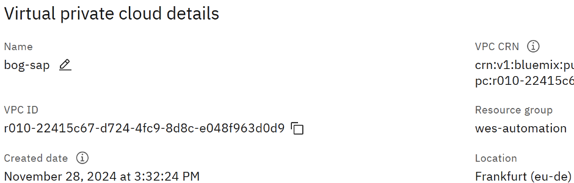{: caption="VPC details" caption-side="bottom"}

The Resource Group where the VPC was previously created, “wes-automation” will hold and group other necessary components (VSIs, and so on).”
{: note}

The following subnets are defined and available for the example VPC:

| VPC subnet | Location |
| ---------------: | ---------: |
|“bog-bastion-fra-subnet-01” | “eu-de-1” |
|“bog-bastion-fra-subnet-02” | “eu-de-2” |
|“bog-bastion-fra-subnet-03” | “eu-de-3” |
{: caption="VPC details" caption-side="top"}

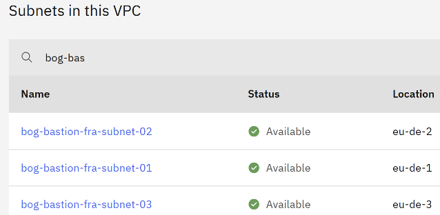{: caption="Subnets" caption-side="bottom"}

Security group `bastion-sg-bog-bast-de` is used for this example. During the planning phase, it is important to leverage the IBM Cloud VPC security resources and services (Security groups) by using inbound and outbound rules governing traffic to and from specific VSIs. The user can easily manage access and align with any security standards the business requires.

Before you begin the deployment of the required VSI, note the following IBM Cloud VPC resource parameters:

* VPC name - “bog-sap”
* Region - “eu-de”
* Zone - “eu-de-1”
* Subnet - “bog-bastion-fra-subnet-01”
* Security Group - “bastion-sg-bog-bast-de"
* Resource Group - "wes-automation"

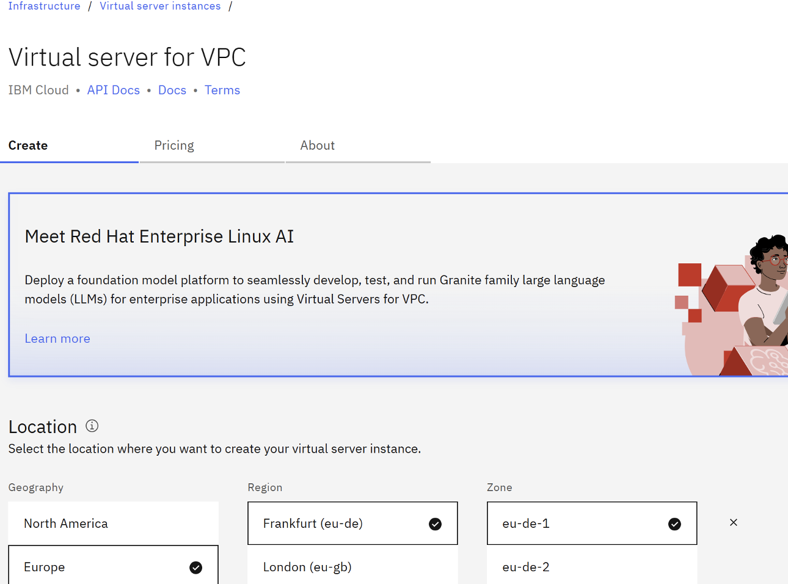{: caption="Virtual Server for VPC" caption-side="bottom"}

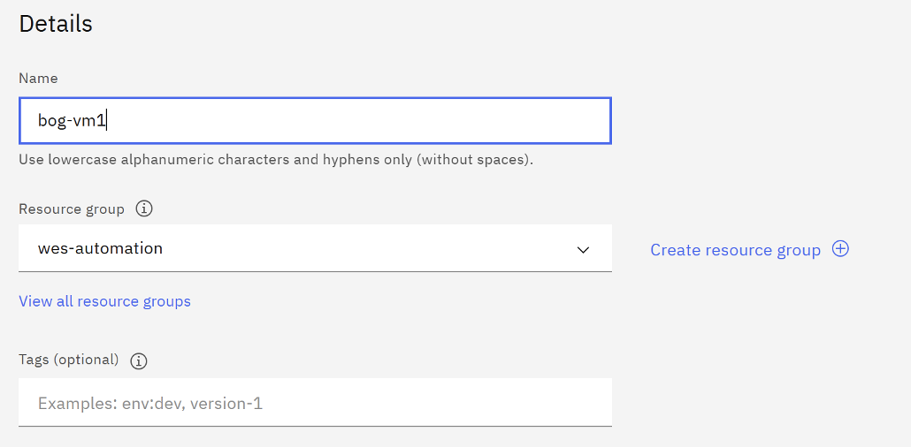{: caption="Virtual Server for VPC details" caption-side="bottom"}

The Geography, Region, and Zone values correspond to the values mentioned for the example VPC. In other words, an example VSI is created inside the existing VPC, by choosing the same properties and the location (Geography, Region, Zone).
{: note}

Selecting the **Image** and **Profiles** is an important step during the VSI creation process. For the example purpose, “Red Hat Enterprise Linux for SAP 9.4” for the OS image and “bx2-2x8” for the profile is chosen.

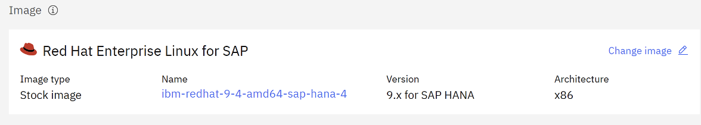{: caption="VSI creation - Image" caption-side="bottom"}

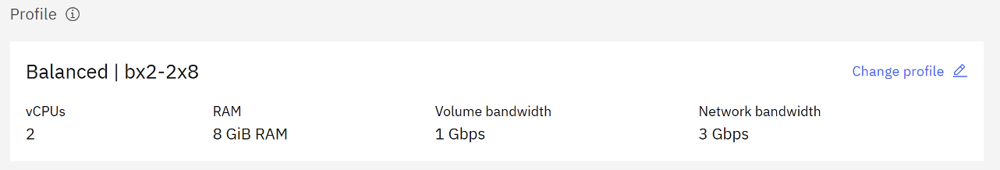{: caption="VSI creation - Profile" caption-side="bottom"}

In the Storage section, additional data volumes are added to align with the [File system layout](/docs/sap?topic=sap-deploy-sap-ase#file-system-prep-ase).

Create the **Data volume** one by one according to the requirements of SAP and ASE Sybase:

* SWAP disk – 32GB
* Log volumes disk – 32GB
* Sybase software – 64GB
* SAP applications – 128GB
* Data file disk – 256GB

After creating the data volume, the output will be displayed as shown below:

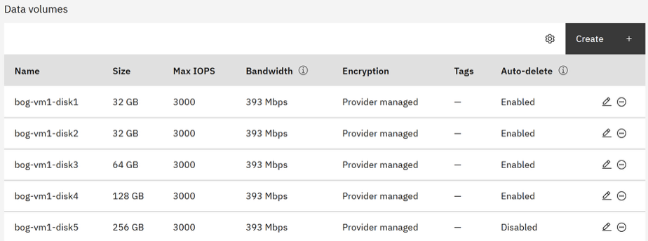{: caption="Data Volumes" caption-side="bottom"}

There may be solutions (for High Availability or distributed installations) where using NFS for holding Application or Database data would be needed. For example `/sapmnt/<SID>`, `/usr/sap/<SID>` or `/usr/sap/trans` file systems.
{: important}

In those cases, it is necessary to create NFS file systems as file-shares and use them as mount points for SAP application data.

For more information on NFS-based file storage for VSI on VPC infrastructure, see [About File Storage for VPC](/docs/vpc?topic=vpc-file-storage-vpc-about&interface=ui).

For successfully mounting the file storage share through NFS, we need to note down the “Mount path”.
{: note}

For demonstration purposes, the file system `/usr/sap/trans` is used in two different scenarios:
* as a local file system
* as a NFS-based file system, using the File storage share service available in the IBM Cloud VPC.

For more information and procedures regarding IBM Cloud VPC file share resource, see [Creating file shares and mount targets](/docs/vpc?topic=vpc-file-storage-create&interface=ui).

## File system preparation
{: #file-system-prep-ase}

The installation of the SAP NetWeaver 7.5 with ASE on RHEL 9.4 is performed based on the file system layout:

| Disk name| Disk size (GB) | Physical volume | Volume group | Logical volume name | Logical volumn size (GB) | File system | Mount point |
| - | - | - | - | - | - | - | - |
| vdb | 32 | /dev/vdb | bog_swap_vg | bog_swap_lv | 30 | /dev/bog_swap_vg/bog_swap_lv | [SWAP] |
| vdc | 32 | /dev/vdc | bog_log_vg | bog_saplog1_lv \n bog_saplog2_lv \n bog_saplog3_lv \n bog_saplog4_lv | 7 \n 7 \n 7 \n 7 | /dev/bog_log_vg/bog_saplog1_lv \n /dev/bog_log_vg/bog_saplog2_lv \n /dev/bog_log_vg/bog_saplog3_lv \n /dev/bog_log_vg/bog_saplog4_lv | /sybase/BOG/saplog_1 \n /sybase/BOG/saplog_2 \n /sybase/BOG/saplog_3 \n /sybase/BOG/saplog_4 |
| vdd | 64 | /dev/vdd | bog_syb_vg | bog_sybsoftware_lv \n bog_sybsystem_lv \n bog_sybtemp_lv \n bog_saptemp_lv \n bog_sapdiag_lv \n bog_sybsecurity_lv | 8 \n 10 \n 8 \n 12 \n 8 \n 8 | /dev/bog_syb_vg/bog_sybsoftware_lv \n /dev/bog_syb_vg/bog_sybsystem_lv \n /dev/bog_syb_vg/bog_sybtemp_lv \n /dev/bog_syb_vg/bog_saptemp_lv \n /dev/bog_syb_vg/bog_sapdiag_lv \n /dev/bog_syb_vg/bog_sybsecurity_lv | /sybase/BOG \n /sybase/BOG/sybsystem \n /sybase/BOG/sybtemp \n /sybase/BOG/saptemp \n /sybase/BOG/sapdiag \n /sybase/BOG/sybsecurity |
| vde | 128 | /dev/vde | bog_app_vg | bog_usrsap_lv \n bog_sap_lv \n bog_sapmnt_lv \n bog_saptrans_lv | 5 \n 20 \n 20 \n 20 | /dev/bog_app_vg/bog_usrsap_lv \n /dev/bog_app_vg/bog_sap_lv \n /dev/bog_app_vg/bog_sapmnt_lv \n /dev/bog_app_vg/bog_saptrans_lv | /usr/sap \n /usr/sap/BOG \n /sapmnt/BOG \n /usr/sap/trans |
| vdf | 256 | /dev/vdf | bog_data_vg | bog_sapdata1_lv \n bog_sapdata2_lv \n bog_sapdata3_lv \n bog_sapdata4_lv | 30 \n 30 \n 30 \n 30 | /dev/bog_data_vg/bog_sapdata1_lv \n /dev/bog_data_vg/bog_sapdata2_lv \n /dev/bog_data_vg/bog_sapdata3_lv \n /dev/bog_data_vg/bog_sapdata4_lv | /sybase/BOG/sapdata_1 \n /sybase/BOG/sapdata_2 \n /sybase/BOG/sapdata_3 \n /sybase/BOG/sapdata_4 |
{: row-headers}
{: caption="File system preparation" caption-side="bottom"}

### Creating file system at operating system level
{: #create-file-system-ase}

A proper file system layout is necessary for a correct installation of any SAP solution within the IBM Cloud VPC.

For the presented example, the SAP SID is BOG, thus the naming for the volume groups, logical volumes, and file systems are considered this SID.
{: note}

At the operating system level, physical volumes, volume groups, logical volumes, and file systems are created in a specific sequence.

1. List the available disk using the command: `# lsblk`

2. To use LVM, the Linux package "lvm2" must be installed using the command: `# dnf install lvm2`

3. Create the required physical volumes using the following commands:

    ```pre
    # pvcreate /dev/vdb
    # pvcreate /dev/vdc
    # pvcreate /dev/vdd
    # pvcreate /dev/vde
    # pvcreate /dev/vdf
    ```

4. Create the required volume groups using the following commands:

    ```pre
    # vgcreate bog_swap_vg /dev/vdb
    # vgcreate bog_log_vg /dev/vdc
    # vgcreate bog_syb_vg /dev/vdd
    # vgcreate bog_app_vg /dev/vde
    # vgcreate bog_data_vg /dev/vdf
    ```

5. Create the ASE logical volumes using the following commands:

    ```pre
    # lvcreate -L 8G -n bog_sybsoftware_lv bog_syb_vg
    # lvcreate -L 10G -n bog_sybsystem_lv bog_syb_vg
    # lvcreate -L 8G -n bog_sybtemp_lv bog_syb_vg
    # lvcreate -L 12G -n bog_saptemp_lv bog_syb_vg
    # lvcreate -L 8G -n bog_sapdiag_lv bog_syb_vg
    # lvcreate -L 8G -n bog_sybsecurity_lv bog_syb_vg
    # lvcreate -L 30G -n bog_sapdata1_lv bog_data_vg
    # lvcreate -L 30G -n bog_sapdata2_lv bog_data_vg
    # lvcreate -L 30G -n bog_sapdata3_lv bog_data_vg
    # lvcreate -L 30G -n bog_sapdata4_lv bog_data_vg
    # lvcreate -L 7G -n bog_saplog1_lv bog_log_vg
    # lvcreate -L 7G -n bog_saplog2_lv bog_log_vg
    # lvcreate -L 7G -n bog_saplog3_lv bog_log_vg
    # lvcreate -L 7G -n bog_saplog4_lv bog_log_vg
    ```

6. Create the SAP application logical volumes using the following commands:

    ```pre
    # lvcreate -L 5G -n bog_usrsap_lv bog_app_vg
    # lvcreate -L 20G -n bog_sap_lv bog_app_vg
    # lvcreate -L 20G -n bog_sapmnt_lv bog_app_vg
    # lvcreate -L 20G -n bog_saptrans_lv bog_app_vg
    ```

7. Create the logical volume for the OS SWAP using the following command: `# lvcreate -L 32G -n bog_swap_lv bog_swap_vg`

8. Create the ASE file systems using the following commands:

    ```pre
    # mkfs.ext4 /dev/bog_syb_vg/bog_sybsoftware_lv
    # mkfs.ext4 /dev/bog_syb_vg/bog_sybsystem_lv
    # mkfs.ext4 /dev/bog_syb_vg/bog_sybtemp_lv
    # mkfs.ext4 /dev/bog_syb_vg/bog_saptemp_lv
    # mkfs.ext4 /dev/bog_syb_vg/bog_sapdiag_lv
    # mkfs.ext4 /dev/bog_syb_vg/bog_sybsecurity_lv
    # mkfs.ext4 /dev/bog_data_vg/bog_sapdata1_lv
    # mkfs.ext4 /dev/bog_data_vg/bog_sapdata2_lv
    # mkfs.ext4 /dev/bog_data_vg/bog_sapdata3_lv
    # mkfs.ext4 /dev/bog_data_vg/bog_sapdata4_lv
    # mkfs.ext4 /dev/bog_log_vg/bog_saplog1_lv
    # mkfs.ext4 /dev/bog_log_vg/bog_saplog2_lv
    # mkfs.ext4 /dev/bog_log_vg/bog_saplog3_lv
    # mkfs.ext4 /dev/bog_log_vg/bog_saplog4_lv
    ```

9. The SAP application file systems are created using the following commands:

    ```pre
    # mkfs.ext4 /dev/bog_app_vg/bog_usrsap_lv
    # mkfs.ext4 /dev/bog_app_vg/bog_sap_lv
    # mkfs.ext4 /dev/bog_app_vg/bog_sapmnt_lv
    # mkfs.ext4 /dev/bog_app_vg/bog_saptrans_lv
    ```

10. Finally, create and enable the OS SWAP using the following commands:

    ```pre
    # mkswap /dev/bog_swap_vg/bog_swap_lv
    # swapon /dev/bog_swap_vg/bog_swap_lv
    ```

11. After creating all the required file system, you can create the necessary mount points using the following commands:

    ```pre
    # mkdir -p /sybase/BOG
    # mount /dev/bog_syb_vg/bog_sybsoftware_lv /sybase/BOG
    # mkdir -p /sybase/BOG/sybsystem
    # mount /dev/bog_syb_vg/bog_sybsystem_lv /sybase/BOG/sybsystem
    # mkdir -p /sybase/BOG/sybtemp
    # mount /dev/bog_syb_vg/bog_sybtemp_lv /sybase/BOG/sybtemp
    # mkdir -p /sybase/BOG/saptemp
    # mount /dev/bog_syb_vg/bog_saptemp_lv /sybase/BOG/saptemp
    # mkdir -p /sybase/BOG/sapdiag
    # mount /dev/bog_syb_vg/bog_sapdiag_lv /sybase/BOG/sapdiag
    # mkdir -p /sybase/BOG/sybsecurity
    # mount /dev/bog_syb_vg/bog_sybsecurity_lv /sybase/BOG/sybsecurity
    # mkdir -p /sybase/BOG/sapdata_1
    # mount /dev/bog_data_vg/bog_sapdata1_lv /sybase/BOG/sapdata_1
    # mkdir -p /sybase/BOG/sapdata_2
    # mount /dev/bog_data_vg/bog_sapdata2_lv /sybase/BOG/sapdata_2
    # mkdir -p /sybase/BOG/sapdata_3
    # mount /dev/bog_data_vg/bog_sapdata3_lv /sybase/BOG/sapdata_3
    # mkdir -p /sybase/BOG/sapdata_4
    # mount /dev/bog_data_vg/bog_sapdata4_lv /sybase/BOG/sapdata_4
    # mkdir -p /sybase/BOG/saplog_1
    # mount /dev/bog_log_vg/bog_saplog1_lv /sybase/BOG/saplog_1
    # mkdir -p /sybase/BOG/saplog_2
    # mount /dev/bog_log_vg/bog_saplog2_lv /sybase/BOG/saplog_2
    # mkdir -p /sybase/BOG/saplog_3
    # mount /dev/bog_log_vg/bog_saplog3_lv /sybase/BOG/saplog_3
    # mkdir -p /sybase/BOG/saplog_4
    # mount /dev/bog_log_vg/bog_saplog4_lv /sybase/BOG/saplog_4
    # mkdir -p /usr/sap
    # mount /dev/bog_app_vg/bog_usrsap_lv /usr/sap
    # mkdir -p /usr/sap/BOG
    # mount /dev/bog_app_vg/bog_sap_lv /usr/sap/BOG
    # mkdir -p /sapmnt/BOG
    # mount /dev/bog_app_vg/bog_sapmnt_lv /sapmnt/BOG
    # mkdir -p /usr/sap/trans
    # mount /dev/bog_app_vg/bog_saptrans_lv /usr/sap/trans
    ```

12. Resize the TMPFS according to [SAP Note 941735 - SAP memory management system for 64-bit Linux systems](https://me.sap.com/notes/941735/E){: external} (file system /dev/shm) using the following command: `# mount -o remount,size=47G /dev/shm`

13. Add the following entries in the `/etc/fstab` file to create all the permanent mounts:

    ```pre
    /dev/bog_syb_vg/bog_sybsoftware_lv /sybase/BOG ext4 defaults 0 0
    /dev/bog_syb_vg/bog_sybsystem_lv /sybase/BOG/sybsystem ext4 defaults 0 0
    /dev/bog_syb_vg/bog_sybtemp_lv /sybase/BOG/sybtemp ext4 defaults 0 0
    /dev/bog_syb_vg/bog_saptemp_lv /sybase/BOG/saptemp ext4 defaults 0 0
    /dev/bog_syb_vg/bog_sapdiag_lv /sybase/BOG/sapdiag ext4 defaults 0 0
    /dev/bog_syb_vg/bog_sybsecurity_lv /sybase/BOG/sybsecurity ext4 defaults 0 0
    /dev/bog_data_vg/bog_sapdata1_lv /sybase/BOG/sapdata_1 ext4 defaults 0 0
    /dev/bog_data_vg/bog_sapdata2_lv /sybase/BOG/sapdata_2 ext4 defaults 0 0
    /dev/bog_data_vg/bog_sapdata3_lv /sybase/BOG/sapdata_3 ext4 defaults 0 0
    /dev/bog_data_vg/bog_sapdata4_lv /sybase/BOG/sapdata_4 ext4 defaults 0 0
    /dev/bog_log_vg/bog_saplog1_lv /sybase/BOG/saplog_1 ext4 defaults 0 0
    /dev/bog_log_vg/bog_saplog2_lv /sybase/BOG/saplog_2 ext4 defaults 0 0
    /dev/bog_log_vg/bog_saplog3_lv /sybase/BOG/saplog_3 ext4 defaults 0 0
    /dev/bog_log_vg/bog_saplog4_lv /sybase/BOG/saplog_4 ext4 defaults 0 0
    /dev/bog_app_vg/bog_usrsap_lv /usr/sap ext4 defaults 0 0
    /dev/bog_app_vg/bog_sap_lv /usr/sap/BOG ext4 defaults 0 0
    /dev/bog_app_vg/bog_sapmnt_lv /sapmnt/BOG ext4 defaults 0 0
    /dev/bog_app_vg/bog_saptrans_lv /usr/sap/trans ext4 defaults 0 0
    /dev/bog_swap_vg/bog_swap_lv swap swap defaults 0 0
    tmpfs /dev/shm tmpfs size=47G,rw,nosuid,nodev 0 0
    ```

### NFS file system using IBM Cloud VPC File Shares
{: #nfs-application-vpc-ase}

[IBM Cloud File Storage for VPC](/docs/vpc?topic=vpc-file-storage-vpc-about) is used to make SAP-specific directories accessible to the SAP system, by using technologies like NFS, shared disks, and cluster file system. When using an HA solution for your SAP system, ensure that you address the HA requirements for SAP file systems properly.

For SAP HA multi-zone applications, file shares are mounted as permanent NFS file systems on both cluster nodes.

* `/usr/sap/[SAPSID]/SYS`

* `/sapmnt/[SAPSID]`

* `/usr/sap/trans`

In some HA or distributed environment, using NFS to store the application or database data may be necessary. In such case, you can create NFS file systems as file-shares using them as mount points for SAP application data. For more information, see [Creating file shares and mount targets](https://test.cloud.ibm.com/docs/vpc?topic=vpc-file-storage-create&interface=ui).

The following is an example where `/usr/sap/trans` file system is defined as an IBM Cloud VPC file share and mounted to the SAP system VSI:

* **File storage share for VPC**

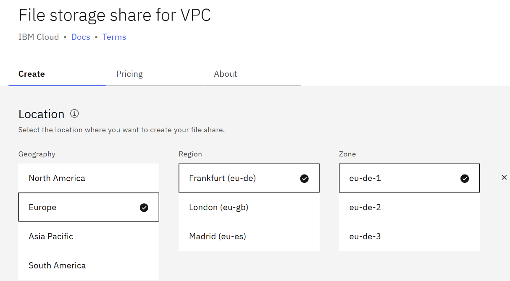{: caption="File storage for VPC" caption-side="bottom"}

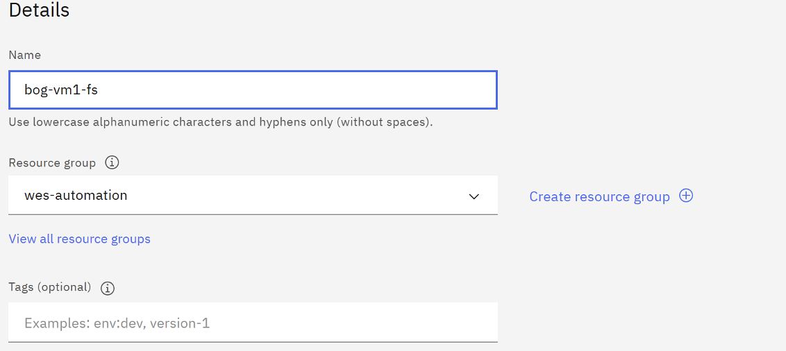{: caption="File storage for VPC details" caption-side="bottom"}

* **Profile**

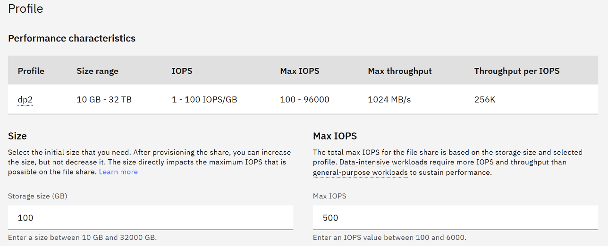{: caption="File storage for VPC profile" caption-side="bottom"}

* **Mount target access mode**

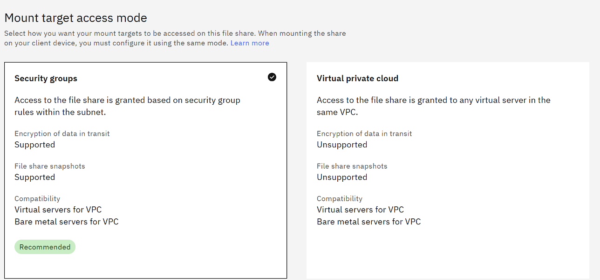{: caption="Mount target access mode" caption-side="bottom"}

After the File Share is created, check the path by selecting “View Path” on the Mount Target. This path is used to mount the NFS share on the target VSI.

* **Mount path**

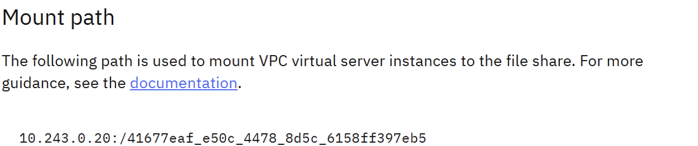{: caption="Mount path" caption-side="bottom"}

Use this path to mount the FileShare over the `/usr/sap/trans` file system. Add it to `/etc/fstab` file.

`10.243.0.20:/41677eaf_e50c_4478_8d5c_6158ff397eb5 /usr/sap/trans nfs rw,hard,rsize=65536,wsize=65536,vers=4.1,sec=sys 0 0`

### Shared application file systems using classic NFS
{: #shared-fs-classic-ase}

If the installation scenario requires, then export one or more file systems. For example, “/usr/sap/trans” between various VSIs, thus between various SAP Applications.

1. Install the NFS package on the source VSI using the command: `dnf list nfs-utils`

2. Check the status using the command: `systemctl status rpcbind`

3. Enable the NFS package using the command: `systemctl enable –now nfs-server`

4. For example, export the “/usr/sap/trans” directory, by adding the following line in the “/etc/exports” file: `/usr/sap/trans 10.243.0.180(rw,sync,no_root_squash)`

5. Apply configuration and activate exports using the command: `exportfs -arv`

6. After completion, see the export list (and options) by using one of the following commands: `exportfs -s` or `showmount -e`

7. On the target VSI, mount the “/usr/sap/trans” through NFS using the command: `mount --types nfs4 10.243.64.10:/usr/sap/trans /usr/sap/trans`

8. Verify the mount file system using the command: `df -hT /usr/sap/trans`

## Operating system preparation
{: #os-prep-ase}

[RHEL]{: tag-red}

The operating system is prepared according to [SAP note 3108316](https://me.sap.com/notes/3108316/E){: external}. The OS packages are installed using the command: `# dnf install uuidd libnsl tcsh nfs-utils`

1. After successful installation, check if the `uuidd` daemon is running using: `# systemctl status uuidd`

2. Next, `SELinux` needs to be set to “permissive”. Open the configuration file “/etc/selinux/config” and set the following: `SELinux=permissive`

3. Once the changes are saved, restart the VSI and verify the above settings using the command: `# getenforce`

4. Verify the short hostname and FQDN by using the OS level commands:

    * `# hostname`
    * `# hostname -s`
    * `# hostname -f`

5. Verify whether the Linux service `chronyd` is running correctly (enabled by default in RHEL9.4) using the command: `# systemctl status chronyd`

6. Next, check whether the firewall is disabled.

    If the customer-specific security rules are required, then it can be enabled and configured to allow the communication ports of the SAP System.
    {: note}

7. Check the status of the firewall using the command: `# systemctl status firewall.d`

8. Configure the required Linux Kernel parameters by creating a file named “sap.conf” in the directory “/etc/sysctl.d”. The file content is:

    * `vm.max_map_count=2147483647`

    * `kernel.pid_max=4194304`

9. No process limits are configured as you run “systemd” higher than 239 and SAP kernel 7.54. Check the “systemd” version by running the command: `# systemctl –version`

    Regarding “temp files” we need to ensure that we create a file “sap.conf” under the directory `/etc/tmpfiles.d`, and add the following lines, inside the file:

    ```pre
    # systemd.tmpfiles exclude file for SAP
    # SAP software stores some important files in /tmp which should not be deleted automatically
    # Exclude SAP socket and lock files
    x /tmp/.sap*
    # Exclude TREX lock file
    x /tmp/.trex*lock
    ```

10. Next, check whether the following Linux kernel parameters have the values:

    ```pre
    # sysctl kernel.shmmax kernel.shmall
    kernel.shmmax = 18446744073692774399
    kernel.shmall = 18446744073692774399
       ```

11. Finally, check the OS SWAP space using the command: `# free -m`

14. Once all the OS preconfigures activities (according to [SAP Note 3108316 - Red Hat Enterprise Linux 9.x: Installation and Configuration](https://me.sap.com/notes/3108316){: external}) and the ASE prerequisites checks are successfully completed, then the operating system needs to be tuned for running SAP NetWeaver Applications. This is done by installing and activating the `tuned-profiles-sap` using the following commands:

    * `# dnf install tuned-profiles-sap`

    * `# tuned-adm profile sap-netweaver`

[SLES]{: tag-green}

The operating system is prepared according to [SAP note 1275776](https://me.sap.com/notes/1275776/E){: external}

* Run the following commands to check or install the package “saptune”:

    `# zypper info saptune`

    `# saptune service enablestart`

* The “saptune” service is enabled and started using the command: `# saptune solution list`

As you will be running both SAP NetWeaver and SAP ASE on the same VSI, you need to enable the solution "NetWeaver" and additionally the SAP note **1680803** (which is the only difference between the two solutions).

`# saptune solution apply NETWEAVER`

* SAP note “1680803” - `# saptune note apply 1680803`

After successful installation of the “saptune”, check and configure the operating system installation according to SAP Note 2578899. The commands are:

* Check I/O scheduler - `# grep . /sys/block/*/queue/scheduler`

* Check User TasksMax - `# systemctl --version`

    No changes are done for version 254.24
    {: note}

* Setting of “kernel.pid_max” - `# sysctl -a | grep kernel.pid_max`. Set according to SAP note “2578899”.

* Check the status for “sysstat” - `# systemctl status sysstat`

* Check the status for “sysctl” monitoring - `# systemctl status sysctl-logger.service`

* Check the status for the “UUID daemon” - `# systemctl status uuidd.socket`

* Check that “Polkit” is installed - `# zypper info polkit`

* Check values for “vm.dirty_background_bytes/vm.dirty_bytes”

    `# sysctl -a | grep vm.dirty_background_bytes`

    `# sysctl -a | grep vm.dirty_bytes`

This is already taken care by “saptune”

* Install package “insserv-compat”

    `# zypper in insserv-compat`

    `# zypper info insserv-compat`

* If the VSI is part of a domain, verify that the short hostname and FQDN are reported correctly by the following OS level commands:

    `# hostname`

    `# hostname -s`

    `# hostname -f`

* Check the status of “chronyd” - `# systemctl status chronyd`

* Check the version for package “glibc” - `# zypper info glibc`

According to SAP note 3425215, there is no issue using SAP ASE 16.0 SP04 PL06.

* Initialize **TMPFS.**

* Resize TMPFS according to SAP Note 941735 (filesystem /dev/shm): - `# mount -o remount,size=43G /dev/shm`

43GB is represents 70% of RAM + SWAP
{: note}

To make the new size for the “TMPFS” permanent, add the following entry in the “/etc/fstab” file:
Check the new size of “TMPFS” with the following command: - `# df -h /dev/shm`

## Installation of SAP NetWeaver 7.5 with ASE on RHEL 9.4 with SWPM
{: #install-sapnw-ase}

After you download the installation media, follow the standard SAP installation procedure that is documented in the SAP installation guides for your SAP version and components. Also, review the corresponding SAP notes.

## Related information
{: #related-info-ase}

* [Release notes for IBM Cloud VPC](/docs/vpc?topic=vpc-release-notes&interface=ui)
* [IBM Cloud® File Storage for VPC](/docs/vpc?topic=vpc-file-storage-vpc-about)
* [SAP Note 84555 - Windows Server, Linux&reg;, and UNIX: Certified hardware](https://me.sap.com/notes/84855){: external}
* [SAP Note 2927211 - SAP Applications on {{site.data.keyword.cloud_notm}} Virtual Private Cloud (VPC) Infrastructure environment](https://me.sap.com/notes/2927211){: external}
* [SAP Note 2414820 - SAP on IBM Cloud: Support prerequisites](https://me.sap.com/notes/2414820/E)
* [SAP Note 2923773 - Linux&reg; on {{site.data.keyword.cloud_notm}} (IaaS): Adaption of your SAP License](https://me.sap.com/notes/2923773){: external}
* [SAP Note 2414097 - SAP Applications on {{site.data.keyword.cloud_notm}} Classic Infrastructure environment](https://me.sap.com/notes/2414097){: external}
* [SAP Note 2369910 - SAP Software on Linux&reg;: General information](https://me.sap.com/notes/2369910){: external}
* [SAP Note 171380 - Released IBM hardware (Intel processors) and IBM cloud services offers](https://me.sap.com/notes/171380){: external}
* [SAP Note 1380654 - SAP support in IaaS environments](https://me.sap.com/notes/1380654){: external}
* [SAP Note 2987324 - SAP ASE 16.0 SP04 Supported Operating Systems and Versions](https://me.sap.com/notes/2987324/E)
* [SAP Note 3386206 - Which is the current latest ASE version? - SAP ASE](https://me.sap.com/notes/3386206/E)
* [SAP Note 1941500 - Certification information for Linux and other Operating Systems - SAP ASE](https://me.sap.com/notes/1941500/E)
* [SAP Note 1554717 - SYB: Planning Information for SAP on SAP ASE](https://me.sap.com/notes/1554717/E)
* [SAP Note 2526952 - Red Hat Enterprise Linux for SAP Solutions](https://me.sap.com/notes/2526952/E)
* [SAP Note 3108316 - Red Hat Enterprise Linux 9.x: Installation and Configuration](https://me.sap.com/notes/3108316){: external}
* [SAP Note 1597355 - Swap-space recommendation for Linux](https://me.sap.com/notes/1597355){: external}
* [SAP Note 1391070 - Linux UUID solutions](https://me.sap.com/notes/1391070/E)
* [SAP Note 611361 - Hostnames of SAP ABAP Platform servers](https://me.sap.com/notes/611361/E)
* [SAP Note 900929 - Linux: STORAGE_PARAMETERS_WRONG_SET and "mmap() failed"](https://me.sap.com/notes/900929/E)
* [SAP Note 2620175 - Reason for RHEL nproc to be set to unlimited for SAP Systems](https://me.sap.com/notes/2620175/E)
* [SAP Note 1771258 - Linux: User and system resource limits](https://me.sap.com/notes/1771258/E)
* [SAP Note 3139184 - Linux: systemd integration for sapstartsrv and SAP Host Agent](https://me.sap.com/notes/3139184/E)
* [SAP Product Availability Matrix](https://support.sap.com/en/release-upgrade-maintenance.html?anchorId=section_1969201630){: external}
* [SAP Note 405827 - Linux: Recommended file systems](https://me.sap.com/notes/405827/E){: external}
* [SAP Note 941735 - SAP memory management system for 64-bit Linux systems](https://me.sap.com/notes/941735/E){: external}
* [SAP Note 1748888 - SYB: Inst. Systems based on NW 7.3 and Higher: SAP ASE](https://me.sap.com/notes/1748888/E)
* [SAP Note 1680045 - Release Note for Software Provisioning Manager 1.0 (recommended: SWPM 1.0 SP43)](https://me.sap.com/notes/1680045/E){: external}
* [Installation guide: Installation of SAP Systems based on the Application Server ABAP of SAP NetWeaver 7.3 EHP1 to 7.52 on UNIX: SAP Adaptive Server Enterprise](https://help.sap.com/doc/4f95c9e3741a1014955595407d8604de/CURRENT_VERSION/en-US/Inst_nw7x_unix_ase_abap.pdf)
* [SAP Adaptive Server Enterprise 16.0 SP04 - System Administration Guide: Volume 1](https://help.sap.com/doc/a611eab9bc2b1014a4eaf1a160376bec/16.0.4.6/en-US/SAP_ASE_System_Administration_Guide_Volume_1_en.pdf)
* [SAP Adaptive Server Enterprise 16.0 SP04 - System Administration Guide: Volume 2](https://help.sap.com/doc/a6121aa4bc2b1014973595b879fce7fd/16.0.4.6/en-US/SAP_ASE_System_Administration_Guide_Volume_2_en.pdf)

## References
{: #references-sap-nw-ase}

* [SAP Note 2927211 - SAP Applications on IBM Cloud Virtual Private Cloud (VPC) Infrastructure environment](https://me.sap.com/notes/2927211){: external}.
* [SAP Note 2588225 - SAP on IBM Cloud: Protect against speculative execution vulnerabilities](https://me.sap.com/notes/2588225)
* [SAP Note 1380654 - SAP support in IaaS environments](https://me.sap.com/notes/1380654){: external}
* [SAP Note 2414097 - SAP Applications on IBM Cloud Classic Infrastructure environment](https://me.sap.com/notes/2414097){: external}
