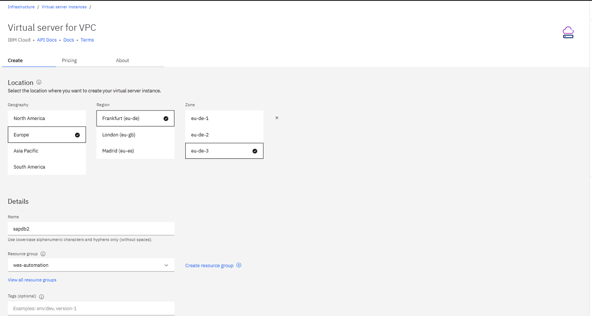

---
copyright:
  years: 2025
lastupdated: "2025-07-03"
keywords:
subcollection: sap
---

{{site.data.keyword.attribute-definition-list}}


# Deploying SAP NetWeaver 7.5 with Db2 on RHEL 9.4
{: #deploy-sap-db2}

The deployment for SAP NetWeaver 7.5 with Db2 on RHEL 9.4 is performed in phases:

1. [Cloud infrastructure planning](/docs/sap?topic=sap-deploy-sap-db2#cloud-infra-plan)
2. [Cloud resource deployment](/docs/sap?topic=sap-deploy-sap-db2#cloud-resource-deploy)
3. [File system preparation](/docs/sap?topic=sap-deploy-sap-db2#file-system-prep)
4. [Operating system preparation](/docs/sap?topic=sap-deploy-sap-db2#os-prep)
5. [Installation of SAP NetWeaver 7.5 with Db2 on RHEL 9.4 with Software Provisioning Manager (SWPM)](/docs/sap?topic=sap-deploy-sap-db2#install-sapnw-db2)

## Cloud infrastructure planning
{: #cloud-infra-plan}

Before performing any deployment, it is important to plan the cloud infrastructure requirements and ensure that all the required components are deployed on cloud VPC level. Learn about the cloud components that are required for deploying the SAP NetWeaver 7.5 with Db2 solution:

### Virtual Private Cloud (VPC) deployment
{: #vpc-deploy}

A VPC is the most basic component necessary for any deployment with the IBM Cloud VPC. For more information, see [VPC for SAP provisioning](/docs/sap?topic=sap-intro-sap-cloud-vpc#vpc-provision-sap).

### VPC subnet
{: #vpc-subnet-db2}

A VPC subnet is created as part of the network space in which SAP and database deployment take place. For more information, see [New Subnet for VPC](/docs/sap?topic=sap-intro-sap-cloud-vpc#new-subnet-sap-vpc).

### VPC security group
{: #vpc-security-db2}

A VPC Security Group is created to meet the security demands and standards. By specifying the specific inbound and outbound rules, the VSIs assigned to this security group will be protected against threats. For more information, see [Security Group for VPC](/docs/sap?topic=sap-intro-sap-cloud-vpc#security-group-sap-vpc).

### VPC Virtual Server Instance (VSI)
{: #vpc-vsi}

VSIs are created and assigned to proper disks to meet the compute and storage requirements for SAP and database deployment.

For compute component, based on the estimated user load for the SAP system, it is important to choose the correct sizing in terms of CPU and RAM memory resource. For more information, see [Virtual Server profile names](/docs/sap?topic=sap-intro-sap-cloud-vpc#virtual-profile-intel-vsi-sap-vpc).

Also, for any deployment it is important to choose the right OS image for your VSI. Multiple options are available to choose from a selection of SAP certified RHEL, SUSE, or Windows images or custom images. For more information, see the [Catalog images on VPC](/docs/sap?topic=sap-intro-sap-cloud-vpc#catalog-images-sap-nw-db2-rhel).

The storage component is also a important part of any VSI deployment process and choosing the right block storage volume or deciding to use the NFS-based file storage is an important decision for any SAP deployment. For more information, see [Block Storage for Virtual Server Instances on VPC Infrastructure](/docs/sap?topic=sap-intro-sap-cloud-vpc#block-storage-vpc-sap).

## Cloud resource deployment
{: #cloud-resource-deploy}

Before any deployment of SAP and database applications, you should prepare and deploy the necessary cloud resources in the IBM Cloud VPC. It is important to know the business and geographical location of the VPC placement. For more information, see [SAP NetWeaver deployment to Intel Virtual Server on VPC Infrastructure that uses RHEL](/docs/sap?topic=sap-quickstudy-vs-gen2-netweaver-rhel)

For instance, the following example data is of a VPC created in Germany with data centers spanning in the Frankfurt area:

| VPC name | VPC region | VPC zones |
| ---------------: | ---------: | ---------: |
|“dt-vpc-fr” | “eu-de” | “eu-de-1”, “eu-de-2” and “eu-de-3” |
{: caption="VPC details" caption-side="top"}

{: caption="VPC details" caption-side="bottom"}

The Resource Group where the VPC was previously created, “wes-automation” will hold and group other necessary components (VSIs, and so on).”
{: note}

The following subnets are defined and available for the example VPC:

| VPC subnet | Location |
| ---------------: | ---------: |
|“sn-dt-01-fr” | “eu-de-1” |
|“sn-dt-02-fr” | “eu-de-2” |
|“sn-dt-03-fr” | “eu-de-3” |
{: caption="VPC details" caption-side="top"}

{: caption="Subnets" caption-side="bottom"}

Security group `bastion-sg-dt-bastion-fr` is used for this example. During the planning phase, it is important to leverage the IBM Cloud VPC security resources and services (Security groups) using inbound and outbound rules governing traffic to and from specific VSIs. The user can easily manage access and align with any security standards the business requires.

Before you begin the deployment of the required VSI, note the following IBM Cloud VPC resource parameters:

* VPC name - “dt-vpc-fr”
* Region - “eu-de”
* Zone - “eu-de-1”
* Subnet - “sn-dt-01-fr”
* Security Group - “bastion-sg-dt-bastion-fr"
* Resource Group - "wes-automation"

{: caption="Virtual Server for VPC" caption-side="bottom"}

The Geography, Region, and Zone values correspond to the values mentioned for the example VPC. In other words, an example VSI is created inside the existing VPC, by choosing the same properties and the location (Geography, Region, Zone).
{: note}

Selecting the **Image** and **Profiles** is an important step during the VSI creation process. For the example purpose, “Red Hat Enterprise Linux&reg; for SAP 9.4” for the OS image and “bx2-8x32” for the profile is chosen.

{: caption="Server Configuration" caption-side="bottom"}

In the Storage section, additional data volumes are added to align with the [File system layout](/docs/sap?topic=sap-deploy-sap-db2#file-system-prep).

{: caption="VSI details" caption-side="bottom"}

For storage, additional data volumes (disks) are used for initializing all the required file systems.

{: caption="File system" caption-side="bottom"}

There may be solutions (for High Availability or distributed installations) where using NFS for holding Application or Database data would be needed. For example `/sapmnt/<SID>`, `/usr/sap/<SID>` or `/usr/sap/trans` file systems.
{: important}

In those cases, it is necessary to create NFS file systems as file-shares and use them as mount points for SAP application data.

For more information on NFS-based file storage for VSI on VPC infrastructure, see [About File Storage for VPC](/docs/vpc?topic=vpc-file-storage-vpc-about&interface=ui).

For demonstration purposes, the file system `/usr/sap/trans` is used in two different scenarios:
* as a local file system
* as a NFS-based file system, using the File storage share service available in the IBM Cloud VPC.

For more information and procedures regarding IBM Cloud VPC file share resource, see [Creating file shares and mount targets](/docs/vpc?topic=vpc-file-storage-create&interface=ui).

## File system preparation
{: #file-system-prep}

The installation of the SAP NetWeaver 7.5 with Db2 on RHEL 9.4 is performed based on the file system layout:

| Disk name| Disk size (GB) | Physical volume | Volume group | Logical volume name | Logical volumn size (GB) | File system | Mount point |
| - | - | - | - | - | - | - | - |
| vdb | 256 | /dev/vdb | dtw_data_vg | dtw_db2_lv \n dtw_db2software_lv \n dtw_db2dump_lv \n dtw_sapdata1_lv \n dtw_sapdata2_lv \n dtw_sapdata3_lv \n dtw_sapdata4_lv \n dtw_saptmp1_lv \n dtw_saptmp2_lv \n dtw_saptmp3_lv \n dtw_saptmp4_lv | 2 \n 5 \n 5 \n 25 \n 25 \n 25 \n 25 \n 5 \n 5 \n 5 \n 5 |  /dev/dtw_data_vg/dtw_db2_lv \n /dev/dtw_data_vg/dtw_db2software_lv \n /dev/dtw_data_vg/dtw_db2dump_lv \n /dev/dtw_data_vg/dtw_sapdata1_lv \n /dev/dtw_data_vg/dtw_sapdata2_lv \n /dev/dtw_data_vg/dtw_sapdata3_lv \n /dev/dtw_data_vg/dtw_sapdata4_lv \n /dev/dtw_data_vg/dtw_saptmp1_lv \n /dev/dtw_data_vg/dtw_saptmp2_lv \n /dev/dtw_data_vg/dtw_saptmp3_lv \n /dev/dtw_data_vg/dtw_saptmp4_lv | /db2/DTW \n /db2/db2dtw \n /db2/db2dtw \n /db2/DTW/db2dump \n /db2/DTW/sapdata1 \n /db2/DTW/sapdata2 \n /db2/DTW/sapdata3 \n /db2/DTW/sapdata4 \n /db2/DTW/saptmp1 \n /db2/DTW/saptmp2 \n /db2/DTW/saptmp3 \n /db2/DTW/saptmp4 |
| vdc | 64 | /dev/vdc | dtw_arch_vg | dtw_archlog_lv | 50 | /dev/dtw_arch_vg/dtw_archlog_lv | /db2/DTW/log_archive |
| vdd | 32 | /dev/vdd | dtw_log_vg | dtw_log_lv | 25 | /dev/dtw_log_vg/dtw_log_lv | /db2/DTW/log_dir |
| vde | 128 | /dev/vde | dtw_app_vg | dtw_sap_lv \n dtw_sapmnt_lv \n dtw_saptrans_lv \n dtw_usrsap_lv | 20 \n 20 \n 50 \n 5 | /dev/dtw_app_vg/dtw_sap_lv \n /dev/dtw_app_vg/dtw_sapmnt_lv \n /dev/dtw_app_vg/dtw_saptrans_lv \n /dev/dtw_app_vg/dtw_usrsap_lv | /usrsap \n /sapmnt/DTW \n /usr/sap/trans \n /usr/sap/DTW |
| vdf | 64 | /dev/vdf | dtw_swap_vg | dtw_swap_lv | 60 | /dev/dtw_swap_vg/dtw_swap_lv | [SWAP] |
{: row-headers}
{: caption="File system preparation" caption-side="bottom"}

### Creating file system at operating system level
{: #create-file-system}

A proper file system layout is necessary for a correct installation of any SAP solution within the IBM Cloud VPC.

For the presented example, the SAP SID is DWT, thus the naming for the volume groups, logical volumes, and file systems are taken into consideration by this SID.
{: note}

At the operating system level, physical volumes, volume groups, logical volumes, and file systems are created in a specific sequence.

1. List the available disk using the command: `# lsblk`

2. To use LVM, the Linux&reg; package "lvm2" must be installed using the command: `# dnf install lvm2`

3. Create the required physical volumes using the following commands:

    ```pre
    # pvcreate /dev/vdb
    # pvcreate /dev/vdc
    # pvcreate /dev/vdd
    # pvcreate /dev/vde
    # pvcreate /dev/vdf
    ```

4. Create the required volume groups using the following commands:

    ```pre
    # vgcreate dtw_data_vg /dev/vdb
    # vgcreate dtw_arch_vg /dev/vdc
    # vgcreate dtw_log_vg /dev/vdd
    # vgcreate dtw_app_vg /dev/vde
    # vgcreate dtw_swap_vg /dev/vdf
    ```

5. Create the Db2 logical volumes using the following commands:

    ```pre
    # lvcreate -L 2G -n dtw_db2_lv dtw_data_vg
    # lvcreate -L 5G -n dtw_db2software_lv dtw_data_vg
    # lvcreate -L 5G -n dtw_db2dump_lv dtw_data_vg
    # lvcreate -L 25G -n dtw_sapdata1_lv dtw_data_vg
    # lvcreate -L 25G -n dtw_sapdata2_lv dtw_data_vg
    # lvcreate -L 25G -n dtw_sapdata3_lv dtw_data_vg
    # lvcreate -L 25G -n dtw_sapdata4_lv dtw_data_vg
    # lvcreate -L 5G -n dtw_saptmp1_lv dtw_data_vg
    # lvcreate -L 5G -n dtw_saptmp2_lv dtw_data_vg
    # lvcreate -L 5G -n dtw_saptmp3_lv dtw_data_vg
    # lvcreate -L 5G -n dtw_saptmp4_lv dtw_data_vg
    # lvcreate -L 50G -n dtw_archlog_lv dtw_arch_vg
    # lvcreate -L 25G -n dtw_log_lv dtw_log_vg
    ```

6. Create the SAP application logical volumes using the following commands:

    ```pre
    # lvcreate -L 20G -n dtw_sap_lv dtw_app_vg
    # lvcreate -L 20G -n dtw_sapmnt_lv dtw_app_vg
    # lvcreate -L 50G -n dtw_saptrans_lv dtw_app_vg
    # lvcreate -L 5G -n dtw_usrsap_lv dtw_app_vg
    ```

7. Create the logical volume for the OS SWAP using the following command: `# lvcreate -L 60G -n dtw_swap_lv dtw_swap_vg`

8. Create the Db2 file systems using the following commands:

    ```pre
    # mkfs.ext4 /dev/dtw_data_vg/dtw_db2_lv
    # mkfs.ext4 /dev/dtw_data_vg/dtw_db2software_lv
    # mkfs.ext4 /dev/dtw_data_vg/dtw_db2dump_lv
    # mkfs.ext4 /dev/dtw_data_vg/dtw_sapdata1_lv
    # mkfs.ext4 /dev/dtw_data_vg/dtw_sapdata2_lv
    # mkfs.ext4 /dev/dtw_data_vg/dtw_sapdata3_lv
    # mkfs.ext4 /dev/dtw_data_vg/dtw_sapdata4_lv
    # mkfs.ext4 /dev/dtw_data_vg/dtw_saptmp1_lv
    # mkfs.ext4 /dev/dtw_data_vg/dtw_saptmp2_lv
    # mkfs.ext4 /dev/dtw_data_vg/dtw_saptmp3_lv
    # mkfs.ext4 /dev/dtw_data_vg/dtw_saptmp4_lv
    # mkfs.ext4 /dev/dtw_arch_vg/dtw_archlog_lv
    # mkfs.ext4 /dev/dtw_log_vg/dtw_log_lv
    ```

9. The SAP application file systems are created using the following commands:

    ```pre
    # mkfs.ext4 /dev/dtw_app_vg/dtw_sap_lv
    # mkfs.ext4 /dev/dtw_app_vg/dtw_sapmnt_lv
    # mkfs.ext4 /dev/dtw_app_vg/dtw_saptrans_lv
    # mkfs.ext4 /dev/dtw_app_vg/dtw_usrsap_lv
    ```

10. Finally, create and enable the OS SWAP using the following commands:

    ```pre
    # mkswap /dev/dtw_swap_vg/dtw_swap_lv
    # swapon /dev/dtw_swap_vg/dtw_swap_lv
    ```

11. After creating all the required file system, you can create the necessary mount points using the following commands:

    ```pre
    # mkdir -p /db2/DTW
    # mount /dev/dtw_data_vg/dtw_db2_lv /db2/DTW
    # mkdir -p /db2/db2dtw
    # mount /dev/dtw_data_vg/dtw_db2software_lv /db2/db2dtw
    # mkdir -p /db2/DTW/db2dump
    # mount /dev/dtw_data_vg/dtw_db2dump_lv /db2/DTW/db2dump
    # mkdir -p /db2/DTW/sapdata1
    # mount /dev/dtw_data_vg/dtw_sapdata1_lv /db2/DTW/sapdata1
    # mkdir -p /db2/DTW/sapdata2
    # mount /dev/dtw_data_vg/dtw_sapdata2_lv /db2/DTW/sapdata2
    # mkdir -p /db2/DTW/sapdata3
    # mount /dev/dtw_data_vg/dtw_sapdata3_lv /db2/DTW/sapdata3
    # mkdir -p /db2/DTW/sapdata4
    # mount /dev/dtw_data_vg/dtw_sapdata4_lv /db2/DTW/sapdata4
    # mkdir -p /db2/DTW/saptmp1
    # mount /dev/dtw_data_vg/dtw_saptmp1_lv /db2/DTW/saptmp1
    # mkdir -p /db2/DTW/saptmp2
    # mount /dev/dtw_data_vg/dtw_saptmp2_lv /db2/DTW/saptmp2
    # mkdir -p /db2/DTW/saptmp3
    # mount /dev/dtw_data_vg/dtw_saptmp3_lv /db2/DTW/saptmp3
    # mkdir -p /db2/DTW/saptmp4
    # mount /dev/dtw_data_vg/dtw_saptmp4_lv /db2/DTW/saptmp4
    # mkdir -p /db2/DTW/log_archive
    # mount /dev/dtw_arch_vg/dtw_archlog_lv /db2/DTW/log_archive
    # mkdir -p /db2/DTW/log_dir
    # mount /dev/dtw_log_vg/dtw_log_lv /db2/DTW/log_dir
    # mkdir -p /usr/sap
    # mount /dev/dtw_app_vg/dtw_usrsap_lv /usr/sap
    # mkdir -p /usr/sap/DTW
    # mount /dev/dtw_app_vg/dtw_sap_lv /usr/sap/DTW
    # mkdir -p /usr/sap/trans
    # mount /dev/dtw_app_vg/dtw_saptrans_lv /usr/sap/trans
    # mkdir -p /sapmnt/DTW
    # mount /dev/dtw_app_vg/dtw_sapmnt_lv /sapmnt/DTW
    ```

12. Resize the TMPFS according to [SAP Note 941735 - SAP memory management system for 64-bit Linux&reg; systems](https://accounts.sap.com/saml2/idp/sso){: external} (file system /dev/shm) using the following command: `# mount -o remount,size=70G /dev/shm`

13. Add the following entries in the `/etc/fstab` file to create all the permanent mounts:

    ```pre
    /dev/dtw_data_vg/dtw_db2_lv /db2/DTW ext4 defaults 0 0
    /dev/dtw_data_vg/dtw_db2software_lv /db2/db2dtw ext4 defaults 0 0
    /dev/dtw_data_vg/dtw_db2dump_lv /db2/DTW/db2dump ext4 defaults 0 0
    /dev/dtw_data_vg/dtw_sapdata1_lv /db2/DTW/sapdata1 ext4 defaults 0 0
    /dev/dtw_data_vg/dtw_sapdata2_lv /db2/DTW/sapdata2 ext4 defaults 0 0
    /dev/dtw_data_vg/dtw_sapdata3_lv /db2/DTW/sapdata3 ext4 defaults 0 0
    /dev/dtw_data_vg/dtw_sapdata4_lv /db2/DTW/sapdata4 ext4 defaults 0 0
    /dev/dtw_data_vg/dtw_saptmp1_lv /db2/DTW/saptmp1 ext4 defaults 0 0
    /dev/dtw_data_vg/dtw_saptmp2_lv /db2/DTW/saptmp2 ext4 defaults 0 0
    /dev/dtw_data_vg/dtw_saptmp3_lv /db2/DTW/saptmp3 ext4 defaults 0 0
    /dev/dtw_data_vg/dtw_saptmp4_lv /db2/DTW/saptmp4 ext4 defaults 0 0
    /dev/dtw_arch_vg/dtw_archlog_lv /db2/DTW/log_archive ext4 defaults 0 0
    /dev/dtw_log_vg/dtw_log_lv /db2/DTW/log_dir ext4 defaults 0 0
    /dev/dtw_app_vg/dtw_usrsap_lv /usr/sap ext4 defaults 0 0
    /dev/dtw_app_vg/dtw_sap_lv /usr/sap/DTW ext4 defaults 0 0
    /dev/dtw_app_vg/dtw_sapmnt_lv /sapmnt/DTW ext4 defaults 0 0
    /dev/dtw_app_vg/dtw_saptrans_lv /usr/sap/trans ext4 defaults 0 0
    /dev/dtw_swap_vg/dtw_swap_lv swap swap defaults 0 0
    tmpfs /dev/shm tmpfs size=70G,rw,nosuid,nodev 0 0
    ```

### NFS file system using IBM Cloud VPC File Shares
{: #nfs-application-vpc}

[IBM Cloud File Storage for VPC](/docs/vpc?topic=vpc-file-storage-vpc-about) is used to make SAP-specific directories accessible to the SAP system, by using technologies like NFS, shared disks, and cluster file system. When using an HA solution for your SAP system, ensure that you address the HA requirements for SAP file systems properly.

For SAP HA multi-zone applications, file shares are mounted as permanent NFS file systems on both cluster nodes.

* `/usr/sap/[SAPSID]/SYS`

* `/sapmnt/[SAPSID]`

* `/usr/sap/trans`

In some HA or distributed environment, using NFS to store the application or database data may be necessary. In such case, you can create NFS file systems as file-shares using them as mount points for SAP application data.

Following is an example where `/usr/sap/trans` file system is defined as an IBM Cloud VPC file share and mounted accordingly to the SAP system VSI:

* **File storage share for VPC**

{: caption="File storage for VPC" caption-side="bottom"}

* **Profile**

{: caption="File Profile" caption-side="bottom"}

* **Mount target access mode**

{: caption="Mount Target Access" caption-side="bottom"}

* **Mount targets (optional)**

{: caption="Mount Target Optional" caption-side="bottom"}

* **Create mount target**

{: caption="Create Mount Target" caption-side="bottom"}

* **Choose your VPC and security group**

{: caption="Encryption" caption-side="bottom"}

* **Review the mount target details**

{: caption="Review mount target details" caption-side="bottom"}

* After the File Share is created, check the path by selecting “View Path” on the Mount Target. This path is used to mount the NFS share on the target VSI.

{: caption="View path - Mount Target" caption-side="bottom"}

* **Mount path**

{: caption="Mount Path" caption-side="bottom"}

Use this path to mount the FileShare over the `/usr/sap/trans` file system. Add it to `/etc/fstab` file.

`10.243.64.46:/4059c088_d385_4cef_9b53_c015bec46a7b /usr/sap/trans nfs rw,hard,rsize=65536,wsize=65536,vers=4.1,sec=sys 0 0`

### Shared application file systems using classic NFS
{: #shared-fs-classic}

If the installation scenario requires, we can export one or more file systems (for example, “/usr/sap/trans”) between various VSIs, thus between various SAP Applications.

1. Install the NFS package on the source VSI using the command: `dnf list nfs-utils`

2. Check the status using the command: `systemctl status rpcbind`

3. Enable the NFS package using the command: `systemctl enable –now nfs-server`

4. For example, export the “/usr/sap/trans” directory, by adding the following line in the “/etc/exports” file: `/usr/sap/trans 10.243.0.180(rw,sync,no_root_squash)`

5. Apply configuration and activate exports using the command: `exportfs -arv`

6. After completion, see the export list (and options) by using one of the following commands: `exportfs -s` or `showmount -e`

7. On the target VSI, mount the “/usr/sap/trans” through NFS using the command: `mount --types nfs4 10.243.64.10:/usr/sap/trans /usr/sap/trans`

8. Verify the mount file system using the command: `df -hT /usr/sap/trans`

## Operating system preparation
{: #os-prep}

[RHEL]{: tag-red}

The operating system is prepared according to [SAP note 3108316](https://me.sap.com/notes/3108316/E){: external}. The OS packages are installed using the command: `# dnf install uuidd libnsl tcsh nfs-utils`

1. After successful installation, check if the `uuidd` daemon is running using: `# systemctl status uuidd`

2. Next, `SELinux` needs to be set to “permissive”. Open the configuration file “/etc/selinux/config” and set the following: `SELinux=permissive`

3. Once the changes are saved, restart the VSI and verify the above settings using the command: `# getenforce`

4. Verify the short hostname and FQDN by using the OS level commands:

    * `# hostname`
    * `# hostname -s`
    * `# hostname -f`

5. Verify if the Linux&reg; service `chronyd` is running correctly (enabled by default in RHEL9.4) using the command: `# systemctl status chronyd`

6. Next, check if the firewall is disabled.

    If the customer-specific security rules are required, then it can be enabled and configured to allow the communication ports of the SAP System.
    {: note}

7. Check the status of the firewall using the command: `# systemctl status firewall.d`

8. Configure the required Linux&reg; Kernel parameters by creating a file named “sap.conf” in the directory “/etc/sysctl.d”. The file content is:

    * `vm.max_map_count=2147483647`

    * `kernel.pid_max=4194304`

9. No process limits are configured as you run “systemd” higher than 239 and SAP kernel 7.54. Check the “systemd” version by running the command: `# systemctl –version`

    Regarding “temp files” we need to ensure we create a file “sap.conf” under the directory `/etc/tmpfiles.d`, and add the following lines, inside the file:

    ```pre
    # systemd.tmpfiles exclude file for SAP
    # SAP software stores some important files in /tmp which should not be deleted automatically
    # Exclude SAP socket and lock files
    x /tmp/.sap*
    # Exclude TREX lock file
    x /tmp/.trex*lock
    ```

10. Next, check if the following Linux&reg; kernel parameters have the values:

    ```pre
    # sysctl kernel.shmmax kernel.shmall
    kernel.shmmax = 18446744073692774399
    kernel.shmall = 18446744073692774399
       ```

11. Finally, check the OS SWAP space using the command: `# free -m`

    For the IBM Db2 database, for both 11.5 and 12.1 versions, the following packages are needed for servers and clients. Install `mksh` as replacement for `pdksh`. See https://access.redhat.com/solutions/178913{: external}.

    `# dnf install mksh pam.i686 libstdc++.i686`

12. For IBM Db2 11.5.9 version, check IBM Db2 11.5.9 server and client prerequisites by using the script named `db2prereqcheck` located in the `<db2_kit_zip>/LINUXX86_64/ESE/disk1` path:

    `# ./db2prereqcheck -v 11.5.9.0`

13. For IBM Db2 12.1.0, check the server and client prerequisites by using the script that is named `db2prereqcheck` located in the `<db2_kit_zip>/LINUXX86_64/ESE/disk1` path:

    `# ./db2prereqcheck -v 12.1.0.0`

14. Once all the OS preconfigure activities (according to [SAP Note 3108316 - Red Hat Enterprise Linux&reg; 9.x: Installation and Configuration](https://me.sap.com/notes/3108316){: external}) and the Db2 prerequisites checks are successfully completed, then the operating system needs to be tuned for running SAP NetWeaver Applications. This is done by installing and activating the `tuned-profiles-sap` using the following commands:

    * `# dnf install tuned-profiles-sap`

    * `# tuned-adm profile sap-netweaver`

[SLES]{: tag-green}

The operating system is prepared according to [SAP note 1275776](https://me.sap.com/notes/1275776/E){: external}

1. Install the package “saptune”.

    `# zypper info saptune`
    `# saptune service enablestart`
    `# saptune solution apply NETWEAVER`
    `# saptune solution verify NETWEAVER`

2. Configure the operating system installation according to SAP Note 2578899.

3. Check the Input Output scheduler
    `# grep . /sys/block/*/queue/scheduler`

4. Check the User TasksMax
    `# systemctl –version`

5. Use the command to set the “kernel.pid_max”
    `# sysctl -a | grep kernel.pid_max`

6. Check the status of "Sysstat” using the commands:
    `# systemctl enable sysstat`
    `# systemctl status sysstat`

7. Check the status of “Sysctl” monitoring - `# systemctl status sysctl-logger.service`

8. Check the status of “UUID” daemon - `# systemctl status uuidd.socket`

9. Check the status of “Polkit” - `# zypper info polkit`

10. Check the parameters “vm.dirty_background_bytes / vm.dirty_bytes” using the commands:
    `# sysctl -a | grep vm.dirty_background_bytes`
    `# sysctl -a | grep vm.dirty_bytes`

11. Check the package “insserv-compat” using the commands:
    `# zypper in insserv-compat`
    `# zypper info insserv-compat`

12. Reboot the VSI.

13. Check the configured OS SWAP space using the command - `# free -m`

14. If the VSI is part of a domain, verify that the short hostname and FQDN are reported correctly by the using the following OS level commands:
    `# hostname`
    `# hostname -s`
    `# hostname -f`

15. The Linux service “chronyd” is enabled by default. Check by running the command - `# systemctl status chronyd`

16. For the IBM Db2 database version 11.5 the following packages are also needed for both Servers and Clients:

    `# zypper in mksh binutils libstdc++6-32bit net-tools-deprecated libnuma1`

17. For the IBM Db2 database version 12.1 the following packages are also needed for both Servers and Clients:

    `# zypper in mksh binutils libstdc++6-32bit`

18. Check IBM Db2 11.5.9 server and client prerequisites using the script named “db2prereqcheck” located in the “[db2_kit_zip]/LINUXX86_64/ESE/disk1”:

    `# ./db2prereqcheck -v 11.5.9.0`
    `# ./db2prereqcheck -c -v 11.5.9.0`

19. For IBM Db2 12.1.0, check the server and client prerequisites using the script named “db2prereqcheck” located in the “[db2_kit_zip]/LINUXX86_64/ESE/disk1”:

    `# ./db2prereqcheck -v 12.1.0.0`
    `# ./db2prereqcheck -c -v 12.1.0.0`

## Installation of SAP NetWeaver 7.5 with Db2 on RHEL 9.4 with SWPM
{: #install-sapnw-db2}

After you download the installation media, follow the standard SAP installation procedure documented in the SAP installation guides for your SAP version and components. Also, review the corresponding SAP notes. For more information about SAP NetWeaver installation using Db2 as the RDBMS, see [Considerations about IBM Db2](/docs/sap?topic=sap-anydb-ibm-db2).

## Related information
{: #related-info-db2}

* [Db2 Recommended file systems](https://www.ibm.com/docs/en/db2/12.1.0?topic=databases-recommended-file-systems){: external}
* [Release notes for IBM Cloud VPC](/docs/vpc?topic=vpc-release-notes&interface=ui)
* [IBM Cloud® File Storage for VPC](/docs/vpc?topic=vpc-file-storage-vpc-about)
* [SAP Product Availability Matrix](https://support.sap.com/en/release-upgrade-maintenance.html?anchorId=section_1969201630){: external}
* [Db2 Database Administration Guide](https://help.sap.com/doc/7367f81b468e4480b3c550669b3534aa/CURRENT_VERSION/en-US/DB6_Admin_Guide.pdf){: external}
* [Preparing to install Db2 database servers](https://www.ibm.com/docs/en/db2/12.1.0?topic=servers-preparing-install-db2-database){: external}
* [SAP Note 405827 - Linux&reg;: Recommended file systems](https://me.sap.com/notes/405827/E){: external}
* [SAP Note 1380654 - SAP support in IaaS environments](https://me.sap.com/notes/1380654){: external}
* [SAP Note 1597355 - Swap-space recommendation for Linux&reg;](https://me.sap.com/notes/1597355){: external}
* [SAP Netweaver Installation Guide on Unix: IBM Db2 for LUW](https://help.sap.com/doc/4f95f7ac741a1014956dd879c2537334/CURRENT_VERSION/en-US/db6_inst_71x_unix_abap.pdf){: external}
* [System requirements for IBM Db2 for Linux&reg;, UNIX, and Windows](https://www.ibm.com/support/pages/system-requirements-ibm-db2-linux-unix-and-windows){: external}
* [Support for SAP customers running Db2 for Linux&reg;, UNIX, and Windows](https://www.ibm.com/support/pages/support-sap-customers-running-db2-linux-unix-and-windows){: external}.
* [SAP Note 2369910 - SAP Software on Linux&reg;: General information](https://me.sap.com/notes/2369910){: external}
* [SAP Note 101809 - DB6: Supported Db2 Versions and Fix Pack Levels](https://me.sap.com/notes/101809/E){: external}
* [SAP Note 941735 - SAP memory management system for 64-bit Linux&reg; systems](https://me.sap.com/notes/941735/E){: external}
* [SAP Note 84555 - Windows Server, Linux&reg;, and UNIX: Certified hardware](https://me.sap.com/notes/84855){: external}
* [SAP Note 171380 - Released IBM hardware (Intel processors) and IBM cloud services offers](https://me.sap.com/notes/171380){: external}
* [SAP Note 1707361 - Inst. Systems based on NW 7.31 and Higher: UNIX Db2 for LUW](https://me.sap.com/notes/1707361/E){: external}
* [SAP Note 1168456 - DB6: Support Process and End of Support Dates for IBM Db2 LUW](https://me.sap.com/notes/1168456){: external}
* [SAP Note 3108316 - Red Hat Enterprise Linux&reg; 9.x: Installation and Configuration](https://me.sap.com/notes/3108316){: external}
* [SAP Note 2923773 - Linux&reg; on {{site.data.keyword.cloud_notm}} (IaaS): Adaption of your SAP License](https://me.sap.com/notes/2923773){: external}
* [SAP Note 2414097 - SAP Applications on {{site.data.keyword.cloud_notm}} Classic Infrastructure environment](https://me.sap.com/notes/2414097){: external}
* [SAP Note 1680045 - Release Note for Software Provisioning Manager 1.0 (recommended: SWPM 1.0 SP43)](https://me.sap.com/notes/1680045/E){: external}
* [SAP Note 2927211 - SAP Applications on {{site.data.keyword.cloud_notm}} Virtual Private Cloud (VPC) Infrastructure environment](https://me.sap.com/notes/2927211){: external}
* [SAP Note 2588225 - SAP on {{site.data.keyword.cloud_notm}}: Protect against speculative execution vulnerabilities](https://me.sap.com/notes/2588225){: external}

## References
{: #references-sap-nw-db2-rhel}

* For more information and updates about SAP on Db2 for LUW on {{site.data.keyword.vpc_short}}, see [SAP Note 2927211](https://me.sap.com/notes/2927211){: external}.
* [SAP community page for IBM Db2](https://pages.community.sap.com/topics/db2-for-linux-unix-windows){: external}
* [SAP on IBM Cloud VPC reference architecture](/docs/pattern-sap-on-vpc?topic=pattern-sap-on-vpc-sap-on-vpc){: external}

**IBM Db2 support on SAP-certified Cloud IaaS:**
* [IBM Knowledge Center for Db2 - Support for Db2 on public clouds (BYOSL, SAP Notes, Reference blueprints)](https://www.ibm.com/docs/en/db2/12.1.0?topic=SSEPGG_12.1.0/com.ibm.db2.luw.licensing.doc/doc/r_suprt_db2_pblik_clouds.htm){: external}
* [SAP Note 101809 - DB6: Supported Db2 Versions and Fix Pack Levels](https://me.sap.com/notes/101809){: external}
* [General IBM Db2 prerequisites on UNIX and Linux®](https://www.ibm.com/docs/en/SSEPGG_11.5.0/com.ibm.db2.luw.qb.server.doc/doc/c0059823.html){: external}

**IBM Db2 and SAP NetWeaver on UNIX or Linux:**
* [Installation of SAP Systems based on the Application Server ABAP of SAP NetWeaver 7.1 to 7.52 on UNIX: IBM Db2 LUW](https://help.sap.com/docs/SLTOOLSET/ce9e270ad34949969c16d09d1b099a26/930c6eefd5b94f02bd2fd9d90fbd47ee.html?version=CURRENT_VERSION){: external}
* [Installation of SAP Systems based on the Application Server Java of SAP NetWeaver 7.1 to 7.5 on UNIX: IBM Db2 LUW](https://help.sap.com/docs/SLTOOLSET/e85af73ba3324e29834015d03d8eea84/930c6eefd5b94f02bd2fd9d90fbd47ee.html?version=CURRENT_VERSION){: external}
* [SAP Note 1707361 - Inst. Systems based on NW 7.1 and Higher: UNIX Db2 for LUW](https://me.sap.com/notes/1707361){: external}

**IBM Db2 and SAP NetWeaver on Windows:**
* [Installation of SAP Systems based on the Application Server ABAP of SAP NetWeaver 7.1 to 7.52 on Windows: IBM Db2 LUW](https://help.sap.com/docs/SLTOOLSET/77e3a615f633437e9c4549891bb6bad7/930c6eefd5b94f02bd2fd9d90fbd47ee.html?version=CURRENT_VERSION){: external}
* [Installation of SAP Systems based on the Application Server Java of SAP NetWeaver 7.1 to 7.5 on Windows: IBM Db2 LUW](https://help.sap.com/docs/SLTOOLSET/d65d4f66e8c34555ad9541734f9cd5b0/930c6eefd5b94f02bd2fd9d90fbd47ee.html?version=CURRENT_VERSION){: external}
* [SAP Note 1707362 - Inst. Systems based on NW 7.1 and Higher: Windows Db2 LUW](https://me.sap.com/notes/1707362){: external}

**SAP on IBM Db2 using Intel Bare Metal:**
* [SAP Note 2414097 - SAP Applications on IBM Cloud Classic Infrastructure environment](https://me.sap.com/notes/2414097){: external} for supported IBM Db2 database versions.

A sample configuration is shown in:
* [Quick Study Tutorial - SAP NetWeaver deployment to Bare Metal on Classic Infrastructure, using RHEL](/docs/sap?topic=sap-quickstudy-bm-netweaver-rhel)
* [Quick Study Tutorial - SAP NetWeaver deployment to Bare Metal on Classic Infrastructure, by using Windows Server](/docs/sap?topic=sap-quickstudy-bm-netweaver-wins)

**SAP on IBM Db2 using Intel Virtual Servers:**
* [SAP Note 2927211 - SAP Applications on IBM Cloud Virtual Private Cloud (VPC) Infrastructure environment](https://me.sap.com/notes/2927211){: external} for supported IBM Db2 database versions.

A sample configuration is shown in:
[Quick Study Tutorial - SAP NetWeaver deployment to Intel Virtual Server on VPC Infrastructure, by using RHEL](/docs/sap?topic=sap-quickstudy-vs-gen2-netweaver-rhel)

This is a complementary offering from IBM Power Systems with low latency access to IBM Cloud services.
{: note}

Db2 version 10.5 is supported for Linux&reg;, Unix, and Windows on IBM Cloud VSI. For more information about supported IBM Db2 products and IBM Cloud Virtual Server instances types, refer to [SAP Note 1928533](https://me.sap.com/notes/1928533){: external}.
