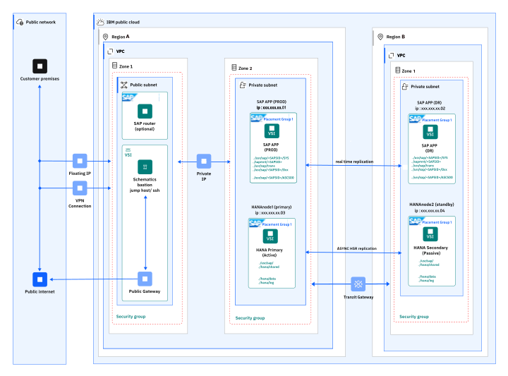

---
copyright:
  years: 2025
lastupdated: "2025-09-18"
keywords: SAP, {{site.data.keyword.cloud_notm}} SAP-Certified Infrastructure, {{site.data.keyword.ibm_cloud_sap}}, SAP Workloads, RHEL
subcollection: sap
---

{{site.data.keyword.attribute-definition-list}}

# SAP NetWeaver 7.5 on SAP HANA 2.0 with Disaster Recovery on RHEL 8.6
{: #sap-nw-hana-dr-intro}

This document describes the deployment of a SAP NetWeaver 7.5 running on SAP HANA 2.0 as the database solution, with Disaster Recovery (DR) setup across two IBM Virtual Private Cloud (VPC) regions. The supported operating system is RHEL 8.6.
The design ensures business continuity, data protection, and reduced downtime in the event of a primary site outage.

{: caption="SAP NetWeaver 7.5 on SAP HANA 2.0 with Disaster Recovery on RHEL 8.6" caption-side="bottom"}

* **(Region A) Primary Site:** Production workloads running SAP NetWeaver 7.5 on HANA 2.0
* **(Region B) DR site**: Identical standby environment with real-time replication and monitoring.
* **Recovery strategy:** On HANA 2.0 database level, HANA System Replication (HSR) mechanism is implemented with the “logreplay” as the operation mode and “async” as the replication mode. On SAP NetWeaver filesystem level, two operating system specific tools are used: “inotify” as a file-system monitoring tool and “rsync” as a file-system replication tool.

## Deployment topology
{: #deploy-topology}

This section describes the infrastructure, database layer, and application layer of SAP NetWeaver 7.5 on HANA 2.0.

### Infrastructure
{: #infra}

* **Two different regions are selected:** the primary site is in the Frankfurt/DE region and the disaster recovery site is in the London/UK region. Each region is separated at network level with its own dedicated Virtual Private Cloud.
* **IBM Virtual Server Instances (VSIs):** Two VSIs are used per site. One for the SAP NetWeaver Application and another one for the SAP HANA database application.
* **Networking:** Network connectivity between the two region is made possible by using the IBM VPC service named “Transit Gateway”. With this service, it is ensured that there is proper network communication between the two regions which is required for both replication mechanisms (HSR on database level and “rsync” on SAP file-system level).
* **Security:** With the help of dedicated IBM VPC Security Groups, traffic is allowed back and forward, between the four VSIs and only on specific ports (necessary for HANA System Replication and “rsync” file-system replication).

### SAP HANA Database layer (HANA 2.0)
{: #database-layer}

* For the SAP HANA Database the HANA System Replication (HSR) mechanism is used, having the “replication mode” set to “async” and the “operation Mode” set to “logreplay”.
* All database level prerequisites have to be met, meaning DNS settings on/between all four VSIs, SSH communication between the VSIs, required SAP HANA parameters being set up before hand, SSFS set up between the master and secondary HANA VSI and finally replication set up between the two sites/VSIs.
* Continuous shipping of log files from primary to secondary is automatically performed by the HANA HSR mechanism, as above mentioned, ensuring near real-time data consistency with minimal performance impact.
* Failover procedure: manual or automated takeover can be performed on the DR site.

Guidance for implementing the HSR mechanism was used by following these resources:

* [General Prerequisites for Configuring SAP HANA System Replication](https://help.sap.com/docs/SAP_HANA_PLATFORM/4e9b18c116aa42fc84c7dbfd02111aba/86267e1ed56940bb8e4a45557cee0e43.html){: external}

* [Configure SAP HANA System Replication with hdbnsutil](https://help.sap.com/docs/SAP_HANA_PLATFORM/4e9b18c116aa42fc84c7dbfd02111aba/2dd26de6360046309e1579accbd9e527.html){: external}

* [Host Name Resolution for System Replication](https://help.sap.com/docs/SAP_HANA_PLATFORM/6b94445c94ae495c83a19646e7c3fd56/c0cba1cb2ba34ec89f45b48b2157ec7b.html){: external}

### SAP Application layer (SAP NetWeaver 7.5)
{: #application-layer}

* **Primary site:** Runs the SAP Central Service (ASCS) and Primary Application Server (PAS) productively used by the business.
* **DR site:** Receives replicated file-system data, through “rsync” for the following file-systems:

    * /usr/sap/<SAP_SID>
    * /sapmnt/<SAP_SID>
    * /usr/sap/trans

Data in these file-system is being monitored through the “inotify” OS monitoring tool, and whenever a “modify, attribute change, create, delete, move” action is performed, on any files/sub-directories, this will be automatically trigger a “rsync” action to the DR site, thus ensuring a real-time consistency between the two locations/regions, file-system/data wise.
Ensures application configuration and runtime consistency in case of a failover.

## Disaster recovery operations
{: #dr-operations}

###	Failover process
{: #failover}

Database layer: Activate the SAP HANA Database on the seoncdary (DR) VSI by performing a “takeover” activity.
Before starting the SAP Application on the DR site, check for Database connectivity using the “R3trans” kernel tool.

SAP Application layer:
* Perform all pre-start activities on the DR site, including “/etc/hosts” file adaption, reregister the “sapstartsrv” SAP service for both the ASCS and PAS Application Instances.
* Start both the ASCS and PAS SAP Application Instances and confirm SAP System integrity by performing standard checks after logging into the SAP System (via SAPgui).
* Network layer: Reroute network traffic Update DNR or load-balancer settings to redirect end users to the SAP Application running on the DR site.

### Recovery objectives
{: #recovery}

* **RPO:** Recovery point objective is near-zero, only influenced by the asynchronous logreplay replication mechanism/time.
* **RTO:** Recovery time objective is in the real of minutes to a few hours, closely depending on the level of automation.

### Testing and validation
{: #testing-validation}

* Periodic DR drills are recommended for critical business SAP Applications thus ensuring readiness in case of a disaster. Documentation of each step performed and the time taken to perform each action can serve as a basis for future improvements/automation.
* Automated scripts support switchover consistency and reduce the time taken for such action. Such automated script can be also implement for verification purposes, thus reducing even further the time spent for post activities and checks, and deliver the SAP Application to the business as fast as possible, thus meeting RCA times negotiated with contractual agreements.

## Benefits
{: #benefits}

* **Data integrity:** One of the most important benefits and requirement when implementing a DR configuration, as the asynchronous logreplay mechanism ensures continuous data replication between the two sites.
* **Application consistency:** “The “rsync” replication mechanism keeps the SAP Application file-systems in sync, in a real-time manner by making use of standard OS monitoring tools.
* **Resiliency:** A two region deployment model protects against outages, natural disasters, or other situations having a big impact on a regional level.
* **Flexibility:** The failover proves, including post steps activities and checks, can be fully automated thus improving the RTO times and reducing as much as possible business impact.

## References
{: #references}

**IBM VPC Infrastructure:**

* [Transit Gateway general information](https://cloud.ibm.com/docs/transit-gateway)
* [Security Groups general information](https://cloud.ibm.com/docs/vpc?topic=vpc-using-security-groups)

**General SAP notes:**

* SAPnote 2235581 - SAP HANA: Supported Operating Systems
* SAPnote 1999997 – FAQ: SAP HANA Memory
* SAPnote 3115048 - sapstartsrv with native Linux systemd support

**HANA System replication references:**

* [General Prerequisites for Configuring SAP HANA System Replication](https://help.sap.com/docs/SAP_HANA_PLATFORM/4e9b18c116aa42fc84c7dbfd02111aba/86267e1ed56940bb8e4a45557cee0e43.html){: external}
* [Configure SAP HANA System Replication with hdbnsutil](https://help.sap.com/docs/SAP_HANA_PLATFORM/4e9b18c116aa42fc84c7dbfd02111aba/2dd26de6360046309e1579accbd9e527.html){: external}
* [Host Name Resolution for System Replication](https://help.sap.com/docs/SAP_HANA_PLATFORM/6b94445c94ae495c83a19646e7c3fd56/c0cba1cb2ba34ec89f45b48b2157ec7b.html){: external}
