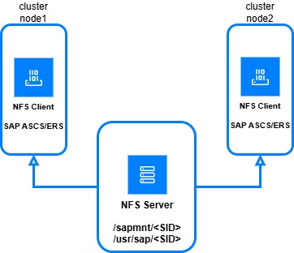

---
copyright:
  years: 2025
lastupdated: "2025-09-30"
keywords: SAP, {{site.data.keyword.cloud_notm}} SAP-Certified Infrastructure, {{site.data.keyword.ibm_cloud_sap}}, SAP Workloads, SLES, HADR
subcollection: sap
---

{{site.data.keyword.attribute-definition-list}}

# SAP NetWeaver 7.5 on SAP ASE with High Availability (HA) on SLES
{: #sap-nw-hadr-intro}

This document describes the deployment of an SAP NetWeaver 7.5 running on SAP ASE 16 as the database solution with a High Availability (HA) setup on IBM Virtual Private Cloud (VPC) regions. The supported operating system is SUSE 15.6.
This design can ensure business continuity, data protection, and reduced downtime if there is a primary site outage.

{: caption="SAP Netweaver 7.5 deployment in HA configuration single-zone" caption-side="bottom"}

## Mount structure (SUSE Linux)
{: #mount-suse-linux}

In a traditional HA setup, the cluster manages the mounting and unmounting of SAP file systems during failover operations. The Simple Mount Architecture assumes that these file systems do not need to be switched-over or controlled by the pacemaker cluster. This structure is based on an external network file share.

Instead of the number of file systems that are needed per SAP system and number of file systems per SAP instance, this simple mount setup needs only two simple file system layouts: **"/sapmnt/SID"** and **"/usr/sap/SID"**.

Both NFS shares with instance directories can be mounted statically on all nodes at the boot time, by using standard OS mechanisms such as `systemd` or `fstab`. Also, the **“/usr/sap/sapservices”** file resides locally on each cluster node.

Due to compatibility with earlier HA setups, this reference architecture still uses the "old" file system layout but most fileshares are mounted on both nodes to implement the simple mount approach.

{: caption="Simple Mount Architecture in SUSE Linux" caption-side="bottom"}

**SAP ASE database** - ASE database is running on two separate virtual machines with primary and secondary database and deployed in different availability zone. Database replication (synchronous replication method) will be running from primary to secondary database. Database can automatically switch roles if there is failover.
SAP ASE database HA setup is independent of operating system HA software such as Windows cluster and Pacemaker. This requires the Fault Manager performing the failover. It is also recommended to use latest version of ASE database for HA setup and saphostcontrol for all the components.

**Fault Manager (FM)** - Fault Manager monitors the availability of database nodes and trigger switching off roles of database from Secondary to Primary when there is unavailability of primary database. An enhancement to Fault Manager configures and monitors the ILB IP and probe port assignment. The Fault Manager binary must be version 126 or higher. FM should be installed on ASCS cluster nodes and will be available within the ASCS cluster.

**SAP ASCS/ERS cluster** – SAP ASCS/ERS is deployed on two nodes with Linux pacemaker cluster. Fencing agent is the preferred option for fencing mechanism though SBD device can also be used as alternative option on SLES. Pacemaker monitors the SAP ASCS/ERS and perform auto-failover of services if there is failure. You need to use Application Load Balancer (ALB) to define the virtual IP addresses of ASCS and ERS.

## References
{: #reference}

* [Install the Data Movement Component](https://help.sap.com/docs/SAP_ASE/6ca21b96f7cb456fabb2b32b2121a6ae/2c6c4fba235245f49f6c412d011fb628.html?version=16.0.4.7&locale=en-US){: external}
* [3086679 - SYB: Fault Manager: floating IP address on Azure](https://launchpad.support.sap.com/#/notes/3086679){: external}
* [1959660 - SYB: Database Fault Management](https://launchpad.support.sap.com/#/notes/1959660){: external}
* [2906375 - SYB: Database Fault Management: testing the Floating IP](https://launchpad.support.sap.com/#/notes/2906375){: external}
* [2134316 - Can SAP ASE run in a cloud environment? - SAP ASE](https://launchpad.support.sap.com/#/notes/2134316){: external}
* [1941500 - Certification information for Linux and other Operating Systems - SAP ASE](https://launchpad.support.sap.com/#/notes/1941500){: external}
* [1891560 - SYB: Disaster Recovery Setup with SAP Replication Server](https://launchpad.support.sap.com/#/notes/1891560){: external}
* [2968912 - SYS: Failed to install Replication Server 16.0 SP03 using SWPM - SRS](https://me.sap.com/notes/2968912){: external}
* [2872158 - SYS: Wrong Hostname displayed in SAP System Status menu after planned failover - SAP ASE for BS](https://me.sap.com/notes/2872158){: external}
* [2791542 - SYS: Unplanned failover failed for J2EE engine - SAP HADR](https://me.sap.com/notes/2791542){: external}
* [2702143 - SYS: HADR failover takes a long time to complete - SRS](https://me.sap.com/notes/2702143){: external}
* [2374642 - SYS: Installing ADD-Ons and Support Packages in an HADR environment](https://me.sap.com/notes/2374642){: external}
* [3025368 - SYB: Targeted SAP ASE 16.0 Release Schedule for SAP ASE on SAP Business Suite](https://me.sap.com/notes/3025368){: external}
* [2073343 - SYB: Release information for SAP Sybase ASE 15.7 SP13x / SP14x](https://me.sap.com/notes/2073343){: external}
* [2331424 - SYB: SAP ASE 16.0 and SAP Replication Server 15.7 SP3xx / 16.0 SP3 : rolling update](https://me.sap.com/notes/2331424){: external}
* [2800495 - SYB: How to perform an SAP ASE rolling update with SAP Host Agent 7.21 PL43 and later](https://me.sap.com/notes/2800495){: external}
* [2617311 - SYB: Disaster Recovery Setup with SAP ASE 15.7 and SAP Replication Server](https://me.sap.com/notes/2617311){: external}
* [1650511 - SYB: High Availability Offerings with SAP Adaptive Server Enterprise](https://me.sap.com/notes/1650511){: external}
* [2086970 - SYB: SAP ASE and SRS - Assertion failed: Unable to configure replication server parameters with a time delay](https://me.sap.com/notes/2086970){: external}
