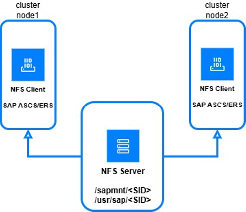

---
copyright:
  years: 2025
lastupdated: "2025-09-22"
keywords: SAP, {{site.data.keyword.cloud_notm}} SAP-Certified Infrastructure, {{site.data.keyword.ibm_cloud_sap}}, SAP Workloads, Db2
subcollection: sap
---

{{site.data.keyword.attribute-definition-list}}

# SAP S/4HANA running on High Availability configuration
{: #sap-s4hana-intro}

The IBM Cloud® architecture provides superior technical capabilities, such as a software definable environment critical to a cloud infrastructure, programmable interfaces, and hundreds of hardware and network configurations. It is designed to deliver a higher level of flexibility by mixing virtual and dedicated servers to fit various workloads, automation of interfaces, and hybrid deployment options. The IBM Cloud SAP-Certified Infrastructure offering for SAP HANA and SAP NetWeaver provides you with a best-fit selection of bare metal and virtualization-based servers on which the SAP software stack is run.

SAP HANA is one of several databases that can be deployed on SAP NetWeaver in the IBM Cloud®. SAP HANA is an in-memory database installed on a dedicated database server. The main architecture deployments for SAP HANA are single-host or multiple-host systems. IBM Cloud is certified for running SAP NetWeaver application servers ABAP, Java, and SAP products based on these application server stacks.

## SAP S/4 HANA deployment in HA configuration multi-zone
{: #multi-zone-s4hana}

{: caption="SAP S/4 HANA deployment in HA configuration multi-zone" caption-side="bottom"}

The deployment of the SAP system in a High Availability is based on two pacemaker cluster configurations:
* one cluster protects one single point of failure of the SAP applications and the Central Services.
* second cluster assures the availability of the SAP HANA database.

### SAP technical components
{: #tech-components-s4hana}

Following are the SAP technical components deployed in this configuration:

* SAP HANA database - two installations on two VSIs with replication configuration for HA support.
* SAP ASCS instance, installed on one of the nodes. This instance contains the Message Server and the Enqueue Server process. It is used to manage locks, exchange messages, and balance workload in the SAP system.
* SAP ERS instance, installed on an opposite node. This Enqueue Replication server is a mandatory instance in a HA scenario, with a role of preserving a replica of the enqueue table in a local memory.
* SAP PAS, the Primary Application server with dialog and batch processing.
* SAP AAS, one Additional Application server, installed on an opposite node related to the PAS.
* SAP Router (optional), provides secured connections to the VSI and remote connections for support of SAP AG Remote services.

### VPC services and components
{: #services-and-comp-s4hana}

Following are the IBM Cloud VPC services and components in support of SAP High Availability configuration:

* Network Services (VPN, Public Gateway) - providing customer access and Internet connectivity.
* Jumphost - used to access, manage, and administer SAP virtual server instances from the same customer zone directly from their premises.
* Application Load Balancer - with the role of distributing traffic for the virtual instances which are part of the SAP and HANA clusters.
* DNS Services
* FileShares - provides NFS-based file storage which are used as shared storage supporting the needs of SAP Netweaver filesystems configurations.

Clients on the Customer Facing Network (CFN) use a floating IP to access virtual server instances within the IBM Cloud. Virtual server instances are hosted in availability zones (data centers) within geographic regions.

The SAP virtual server instances can be in a separate security zone but should be on same IBM Cloud region. The customer connection to the jumphost follows the same rules as the direct connection from customer premises to the virtual server instance SAP instances. The connection uses the Floating IP and security group 1 firewall rules from a designated public subnet. In this architecture, there are two security groups defined; this arrangement is the simplest method for separating the public and private subnets. You can add more security groups if you require more isolation.

## Key aspects of High Availability
{: #key-aspects-s4hana}

Redundancy of critical components, automated failover mechanisms and integration with clustering and system replication technologies such as Pacemaker and SAP HANA System Replication, are important aspects for the High Availability reference architecture.

In order to maintain access and availability of application processing to end users, the SAP application servers are recommended to be installed redundant. This can be obtained by using a Primary Application Server and an Additional Application server using 2 VSIs.

In case a crash occurs and one of the nodes fails, the users are losing access to the respective application server which has failed.  If logon groups are used for load balancing, when the users are connecting again they are redirected to the remaining available application server.

Other points of failure are the ASCS instance and the SAP HANA database:

* ASCS instance should be deployed in a HighAvailability cluster. In this way, the enqueue table locks managed by the Enqueue Server are protected. To achieve  this,  an ERS instance is deployed on another VSI and creates a replicated copy of the lock table in its instance memory. If the ASCS fails, the enqueue locks table can be rebuilt from the replicated copy held by the  ERS instance.  Message Server is restarted, communication is lost but data integrity is assured.

The SAP S/4 HANA System is running by default a ENSA2 configuration, a concept in which the ASCS does not need to be started on the ERS node. Still, in a 2 node cluster configuration, ASCS will fail over to the same node where ERS is running.

* SAP HANA database system is also protected by installing the database instances in a Pacemaker High Availability cluster. The environment is built as a standard two-node high availability cluster where one node is active and the other operates as seconday with continuous data synchronization. The SAP HANA database is configured using native HANA System Replication (HSR) in synchronous mode (mode=sync with log-replay enabled), ensuring that all committed data is replicated from the primary to the secondary node in near real-time. The replication is established between two identically sized SAP HANA instances. While SAP HANA supports both scale-up (vertical scaling) and scale-out (horizontal scaling) architectures for handling large workloads, this deployment is focused on the scale-up model.

## Simple Mount Structure (SUSE Linux)
{: #suse-linux-s4hana}

In traditional HA setups, the cluster manages the mounting and unmounting of SAP file systems during failover operations.
The Simple Mount Architecture assumes that these filesystems do not need to be switched-over nor to be controlled by the pacemaker cluster.  This structure is based on an external network file share.
Instead of a number of filesystems needed per SAP system plus a number of filesystems per SAP instance, the simple mount setup only needs a 2 simple filesystem layout: "/sapmnt/[SID]" and "/usr/sap/[SID]".
Both NFS shares with instance directories can be mounted statically on all nodes at boot time, using standard OS mechanisms such as systemd or fstab. Also,the “/usr/sap/sapservices” file resides locally on each cluster node.
For some kind of compatibility with earlier HA setups, this reference architecture still uses the "old" filesystem layout but most fileshares are mounted on both nodes to implementing the simple mount approach.

{: caption="Simple Mount Architecture in SUSE Linux" caption-side="bottom"}

**SAP Standalone Enqueue Server 1 (ENSA1) and Standalone Enqueue Server 2 (ENSA2)**
To protect one of the critical components of the SAP System an one of the single points of failure, the enqueue table, there is a need to have a separate installation of the Enqueue Replication Server instance (ERS) which holds a copy of the enqueue table.

In ENSA1 installations, ASCS needs to fail over to the node where ERS in running in order to rebuild his own ENQ lock table. This is achieved by synchronizing the instances shared memory segments, therefore ASCS is mandatory to be started on the node where ERS is running.

Starting with SAP NW 7.52 / SAP S4 HANA, Standalone Enqueue Server 2 is the default installation. This new mechanism replaces ENSA1 and introduces some improved behavior in HA installations and flexibility in failover operations. The replication/copy of the ENQ table is now executed through a network connection. This means that ASCS does not need to be restarted on ERS side in case a failover occurs, but on any other node of the cluster including the original node. Of course, however, in 2 node cluster setups ASCS will still fail over to the opposite node, the same node where ERS in running.

### SAP HANA system replication scale-up (High Availability scenarios)
{: #scenarios-s4hana}

SAP HANA System Replication in a scale-up high availability configuration supports multiple deployment configurations, each aligned with distinct business and operational requirements such as performance optimization, cost control, and service continuity (RTO).

* HANA Performance Optimized: the SAP HANA installation on the first node is synchronizing (sync with operation mode log-replay) with the SAP HANA database installed on the second node. The takeover time is very short, as the database on the second node is configured to preload the tables in memory.
* HANA performance optimized, secondary site read-enabled: a performance optimized scenario but with the possibility to allow read access on the secondary database site. This is called also an active-active configuration.
* HANA cost optimized: in this scenario, the stand-by or secondary HANA database is colocated with a non-productive database system, for example a Test or Development system. Whenever a takeover occurs, the non-productive system has to be stopped in order to free up the nedeed hardware resources for running the promoted HANA productive instance. The table preload is switched off and the takeover time is longer in this scenario.

### High Availablity in MultiZone (MZ) and SingleZone (SZ) environments
{: #single-multizone-s4hana}

Deploying resources across multiple zones within a region enables high availability and fault isolation, as workloads can continue operating even if one zone experiences a failure. For more information, see [IBM Cloud region and data center locations for resource deployment](/docs/overview?topic=overview-locations).

However, deploying the resources in a HA configuration is also possible by using a single-zone inside a region.

{: caption="SAP S/4 HANA deployment in HA configuration single-zone" caption-side="bottom"}

* There is only one private subnet deployed.
* SAP HANA is a two node cluster in the same network segment.
* SAP service instances ASCS/ERS are part of the same network segment and colocated with SAP Application servers, on two node VSIs.
* Virtual hostnames are addressed by the clients and applications also through an Application Load Balancer with the help of the DNS service.

A Power placement group together with a placement strategy provides supplementary protection for VMs in a single zone and it guarantees that  each instance is placed on computer hosts with separate power supplies and network devices. See the information from [IBM Cloud](/docs/vpc?topic=vpc-about-placement-groups-for-vpc) regarding placement groups.

## Related information
{: #related-info-s4hana}

SAP One Support Notes that apply to this document:

* [SAP Note 84555 - Windows Server, Linux, and UNIX: Certified hardware](https://me.sap.com/notes/84855){: external}
* [SAP Note 2927211 - SAP Applications on IBM Cloud Virtual Private Cloud (VPC) Infrastructure environment](https://me.sap.com/notes/2927211){: external}
* [SAP Note 2923773 - Linux on IBM Cloud (IaaS): Adaption of your SAP License](https://me.sap.com/notes/2923773){: external}
* [SAP Note 2414097 - SAP Applications on IBM Cloud Classic Infrastructure environment](https://me.sap.com/notes/2414097){: external}
* [SAP Note 2369910 - SAP Software on Linux: General information](https://me.sap.com/notes/2369910){: external}
* [2407186 - User assistance Guides & Whitepapers For SAP HANA High Availability](https://me.sap.com/notes/2407186/E){: external}
* [SAP Note 171380 - Released IBM hardware (Intel processors) and IBM cloud services offers](https://me.sap.com/notes/171380){: external}
* [SAP Note 1380654 - SAP support in IaaS environments](https://me.sap.com/notes/1380654){: external}

SUSE for SAP Best Practices documents:

* [Supported High Availability Solutions by SLES for SAP applications](https://documentation.suse.com/sles-sap/sap-ha-support/html/sap-ha-support/article-sap-ha-support.html){: external}
* [SAP S/4 HANA - Enqueue Replication 2 High Availability Cluster With Simple Mount](https://documentation.suse.com/sbp/sap-15/html/SAP-S4HA10-setupguide-simplemount-sle15/index.html){: external}
* [SAP HANA System Replication Scale-Up - Performance Optimized Scenario](https://documentation.suse.com/sbp/sap-15/html/SLES4SAP-hana-angi-perfopt-15/index.html){: external}
