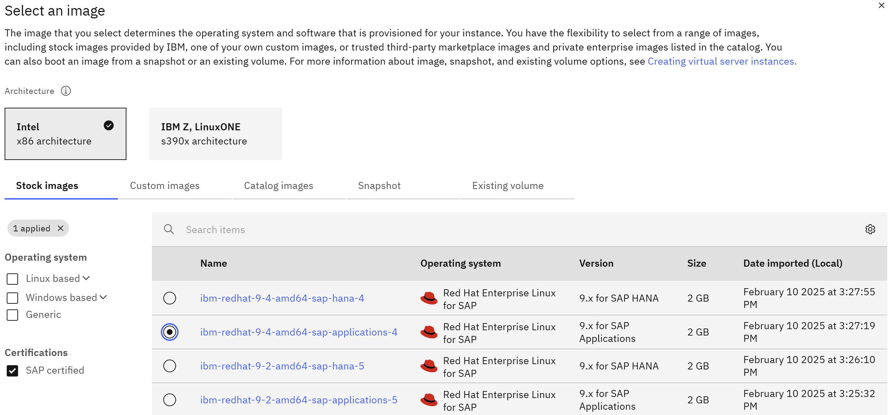

---
copyright:
  years: 2025
lastupdated: "2025-06-26"
keywords:
subcollection: sap
---

{{site.data.keyword.attribute-definition-list}}

# Introduction to SAP workloads on {{site.data.keyword.cloud}} VPC
{: #intro-sap-cloud-vpc}

The objective of this document is to provide solution designs for the deployment of SAP solution types on IBM Cloud® Virtual Private Cloud (VPC). This solution:

* Accelerate and simplify solution design by providing a standard {{site.data.keyword.cloud}} VPC deployment architecture. For more information, see [Architecture framework](/docs/architecture-framework?topic=architecture-framework-intro).
* Provide end to end enterprise-class solution design that includes diagrams, component architecture decisions, and rationale for cloud component selection for a secure, resilient SAP on {{site.data.keyword.cloud_notm}} VPC.
* Verify if requirements can be met by performance, system availability, and security perspectives.

SAP configuration and SAP component deployment scenarios are not covered in this solution design. It is limited to {{site.data.keyword.cloud_notm}} infrastructure options to support SAP workloads.
{: important}

Enterprise-class, mission-critical workloads need to be secure, resilient, and provide High Availability (HA) and Disaster Recovery (DR). This pattern can be used as a guide to meet typical user requirements and provide a base reference solution for a secure and resilient SAP NetWeaver and HANA or SAP NetWeaver and AnyDB deployment to {{site.data.keyword.cloud_notm}} VPC.
This supports the deployment of SAP Business Applications running on SAP NetWeaver, SAP HANA or SAP AnyDB, and other SAP products by using other technologies. Other technologies include SAP Content Server or newer applications such as SAP Data Intelligence.

{{site.data.keyword.cloud_notm}} SAP-Certified infrastructure provides the flexibility to run SAP workloads in the {{site.data.keyword.cloud_notm}} and also addresses issues such as:
* Moving SAP workloads to the cloud
* Rapidly expanding or contracting capacity
* Supplementing an existing private cloud architecture

## {{site.data.keyword.cloud}} VPC introduction
{: #vpc-intro-sap}

IBM Cloud Virtual Servers for VPC offers fast provisioning compute capacity, also known as virtual machines with the highest network speeds and most secure, software-defined networking resources available on the {{site.data.keyword.cloud_notm}}. This is built on {{site.data.keyword.cloud_notm}} Virtual Private Cloud (VPC) featuring powerful, 4th Gen Intel® Xeon® processors with new Intel® Software Guard Extensions (Intel® SGX®) to help protect data in use through a unique application isolation technology.

A VPC is a public cloud offering that an enterprise uses to establish its own private cloud-like computing environment on shared [public cloud](https://www.ibm.com/cloud){: external} infrastructure. VPC gives an enterprise the ability to define and control a virtual network that is logically isolated from all other public cloud tenants, creating a private, secure place on the public cloud.

A VPC’s logical isolation is implemented by using virtual network functions and security features that give an enterprise user granular control over which IP addresses or applications can access particular resources.

## SAP workloads on the {{site.data.keyword.cloud}} VPC
{: #sap-workloads-vpc}

As part of an ongoing partnership with SAP, IBM is constantly providing new platform configurations for certification by SAP as part of its Infrastructure-as-a-Service (IaaS) offering, designed to best fit any SAP workload scenario from small business to intensive workloads running SAP HANA.

SAP note [2927211](https://me.sap.com/notes/2927211/E){: external} offers a complete description of SAP products, database solutions, and OS releases that are available in {{site.data.keyword.cloud_notm}} VPC. These are supported by SAP which is part of IBM’s Infrastructure-as-a-Service (IaaS) virtual machines and bare metal servers.

The Infrastructure-as-a-Service (IaaS) server types within the {{site.data.keyword.cloud_notm}} VPC Infrastructure environment are the Intel Bare Metal Servers and the Intel Virtual Servers, based on {{site.data.keyword.cloud_notm}}'s managed KVM hypervisor.

|      | Linux operating systems |  Windows Server operating systems    |
| --------: | -----------: | -----------: |
| Applications running on the ABAP Platform (inter alia the technology foundation for S/4 HANA 1809 and higher) | \n* SAP Kernel 7.53 (min. PL #622 for all JAVA components)  \n* SAP Kernel 7.73 (min. PL #258) \n* SAP Kernel 7.77 (min. PL #212) \n* higher SAP Kernel versions | \n* SAP Kernel 7.53 (min. PL #718 for all JAVA components) \n* SAP Kernel 7.73 (min. PL #322) \n* SAP Kernel 7.77 (min. PL #313) \n* SAP Kernel 7.81 (min. PL #25) \n* higher SAP Kernel versions |
| Applications running on the Application Servers ABAP and/ or Java as part of SAP NetWeaver 7.4 or higher | \n* SAP Kernel 7.49 (min. PL #913) \n* SAP Kernel 7.53 (min. PL #622) \n* higher SAP Kernel versions | \n* SAP Kernel 7.49 (min. PL #932) \n* SAP Kernel 7.53 (min. PL #718) \n* higher SAP Kernel versions |
| Applications running on the Application Server ABAP and/ or Java as part of SAP NetWeaver 7.1 or higher | \n* SAP Kernel 7.21 EXT (min. PL #1322) \n* SAP Kernel 7.22 EXT / EX2 (min. PL #1011) \n* higher SAP Kernel versions | \n* SAP Kernel 7.21 EXT (min. PL #1400) \n* SAP Kernel 7.22 EXT (min. PL #1018) \n* higher SAP Kernel versions |
|Applications running on the Application Server ABAP as part of SAP NetWeaver 7.0x | \n* SAP Kernel 7.21 EXT (min. PL #1322) \n* SAP Kernel 7.22 EXT / EX2 (min. PL #1011) \n* higher SAP Kernel versions | \n* SAP Kernel 7.21 EXT (min. PL #1400) \n* SAP Kernel 7.22 EXT (min. PL #1018) \n* higher SAP Kernel versions |
{: caption="SAP Kernel and supported operating system" caption-side="top"}

|      | Versions |
| --------: | -----------: |
|SAP Search and Classification (TREX) | \n* SAP TREX 7.10 on RHEL 7.4 and higher \n* SAP TREX 7.10 on SLES 12 SP4 and higher \n* SAP TREX 7.10 on Windows Server 2016 and higher |
|SAP liveCache | The minimal version for SAP LC/LCAPPS 10.0 SP 46 including liveCache 7.9.10.04 and LCA-Build 46, released for EhP 4 for SAP SCM 7.0 or higher. For details, see SAP Note [2074842](https://me.sap.com/notes/2074842){: external}. |
|SAP Content Server | SAP Content Server 7.53 and higher version on Linux and Windows Server. For more information, see SAP Note [719971](https://me.sap.com/notes/719971)(SAP Content Server release strategy){: external}. |
|SAP IQ | The SAP IQ 16.x version is used. For more information, see SAP Note [2133194](https://me.sap.com/notes/2133194){: external}. |
|SAP Business Objects | For the support of SAP BusinessObjects Business Intelligence suite on {{site.data.keyword.cloud_notm}} see SAP Note [2279688](https://me.sap.com/notes/2279688){: external}.|
|SAP Business One | \n* SAP Business One (B1), version for SQL Server according to the [Hardware Requirements Guide](https://help.sap.com/doc/bfa9770d12284cce8509956dcd4c5fcb/9.3/en-US/B1_Hardware_Requirements_Guide.pdf){: external}. \n* SAP Business One (B1), version for HANA according to SAP Note [2058870](https://me.sap.com/notes/2058870){: external} (SAP Business One, version for SAP HANA on public IaaS platforms).|
{: caption="SAP products and supported versions" caption-side="top"}

|      | Versions |
| --------: | -----------: |
|RDBMS | \n* IBM Db2 for LUW version 10.5 or higher. \n* SAP ASE 16.0 SP03 or higher, most recent patch level highly recommended - see also SAP Note [2922454](https://me.sap.com/notes/2922454/E){: external} (SAP Adaptive Server Enterprise (SAP ASE) on Cloud Platforms). \n* SAP MaxDB 7.9, most recent patch level highly recommended - see also SAP Note [2949393](https://me.sap.com/notes/2949393/E){: external} (SAP MaxDB/liveCache in Cloud environments). \n* Microsoft SQL Server 2012 and higher. \n* SAP HANA - See the detailed server specifications in the [Certified IaaS Platform section of the Certified and Supported SAP HANA Hardware Directory](https://www.sap.com/dmc/exp/2014-09-02-hana-hardware/enEN/#/solutions?filters=iaas;ve:28&sort=Latest%20Certification&sortDesc=true){: external}.|
{: caption="RDBMS supported versions" caption-side="top"}

## Supported Operating Systems
{: #supported-os}

* Red Hat Enterprise Linux (RHEL) version 7 or higher.
* SUSE Linux Enterprise Server (SLES) version 12 SP4 or higher.
* Microsoft Windows Server 2016, 2019, and 2022.

For more information on valid DB/OS combinations please consult the SAP [Product Availability Matrix (PAM)](https://userapps.support.sap.com/sap/support/pam){: external}.

### Prerequisites
{: #prerequisites-sap-vpc}

* Create an API key for your VPC. The API key is used to authenticate with the {{site.data.keyword.cloud_notm}} platform and to determine your permissions for {{site.data.keyword.cloud_notm}} services. For more information, see [Create or retrieve an {{site.data.keyword.cloud_notm}} API key](/docs/account?topic=account-userapikey&interface=ui#create_user_key).

* Create a SSH key on the IBM Cloud VPC. For more information, see [Create or retrieve your SSH key ID](/docs/ssh-keys?topic=ssh-keys-getting-started-tutorial).

Before deploying any SAP workload in the {{site.data.keyword.cloud_notm}} VPC, there are certain {{site.data.keyword.cloud_notm}} services which need to be provisioned. The order in which these are provisioned is mentioned here:

* VPC for SAP provisioning
    * New Subnet for the VPC
    * Security Group for the VPC
        * New Intel Virtual Server Instance (VSI)
            * Block storage for Intel Virtual Server Instances (VSIs) – additional storage can be added post VSI creation
            * NFS-based file storage for VPC – additional request for certain deployment scenarios

## VPC for SAP provisioning
{: #vpc-provision-sap}

Before deploying any SAP workload into VSI, a {{site.data.keyword.cloud_notm}} VPC must be created.
{: important}

Following are the steps to setup the VPC:

1. Click **Menu** icon > **VPC Infrastructure** > **Network** > **VPCs**.
2. Choose the **Region** and click **Create**.
3. Confirm the **Location** (Geography and Region).
4. Enter a unique name for the VPC.
5. Select a **Resource group**. Use resource groups to organize your account resources for access control and billing purposes.

    For more information, see [Best practices for organizing resources in a resource group](/docs/account?topic=account-account_setup) and [What makes a good resource group strategy?](/docs/account?topic=account-account_setup#resource-group-strategy).

6. **Optional**: Enter the tags to help you organize and find your resources. You can add more tags later. For more information, see [Working with tags](/docs/account?topic=account-tag&interface=ui).
7. Select whether the default security group allows inbound SSH and ping traffic to virtual server instances in this VPC. You can configure more rules for the default security group later.
8. **Optional**: Default address prefixes. Disable this option if you do not want to assign default subnet address prefixes to each zone in your VPC. After you create the VPC, go to the details page and set your own subnet address prefixes. If you disable this option, the new subnet for VPC section will be hidden and requires manual definition after the VPC is created. The value is set to default.

You can only enable a VPC for classic access when it is created. You cannot update a VPC to add or remove classic access. In addition, you can have only one classic access VPC in your account at any time. For more information, see [Create an {{site.data.keyword.cloud_notm}} VPC](/docs/vpc?topic=vpc-creating-a-vpc-using-the-ibm-cloud-console).
{: important}

### New subnet for VPC
{: #new-subnet-sap-vpc}

Following are the steps to create a new subnet for the VPC:

1. To add a new subnet during the creation of new VPC, click **Add subnet**.
2. Enter a **unique name** for the VPC subnet.
3. Select a **Resource group** for the subnet.
4. Select a **Location** for the subnet. The location consists of a region and a zone.

    The region is automatically inherited from the VPC (currently in creation).
    {: tip}

5. **Optional**: Make use of tags to better organize and find your resources.
6. Enter an **address prefix**, **number of addresses**, and an **IP range** for the subnet. The IP range is entered in CIDR notation, for example: 10.240.0.0/24. Usually, you can use the default IP range. If you want to specify a custom IP range, you can use the IP range calculator to select a different address prefix or change the number of addresses.

    A subnet cannot be resized after it has been created.
    {: important}

7. Attach a public gateway to the subnet to allow all the attached resources to communicate with the public internet (not mandatory for certain scenarios).
8. Click **Create** virtual private cloud.

If you have disabled the default address prefixes, which hides the new subnet for VPC section on the VPC ordering page, then you need to manually define your subnets before provisioning your virtual servers for VPC.
Following are the steps to set up your subnets:

1. Click **Menu** icon > **Infrastructure** > **Network** > **Subnets**.
2. Choose the desired **Region** and click **Create**.
3. Confirm the **Location** (Geography, Region and Zone).
4. Enter a unique name and select the VPC to be associated.
5. Select a **Resource group**.
6. **Optional**: Use tags to better organize and find your resources.
7. Choose the VPC fro the subnet to be associated.
8. Enter an **Address prefix**, **Total IP addresses** and an **IP range** for the subnet. The IP range is entered in CIDR notation, for example: 10.240.0.0/24. Usually, you can use the default IP range. If you want to specify a custom IP range, you can use the IP range calculator to select a different address prefix or change the number of addresses.
9. Leave the values as default for the **Routing table** and **Subnet access control list**.
10. Choose a **Public gateway** to the subnet to allow all the attached resources to communicate with the public internet (not mandatory for certain scenarios).
11. Review the costs of your subnet resource and click **Create subnet**.

### Security Group for VPC
{: #security-group-sap-vpc}

After creating the VPC and subnet, a default Security Group will be automatically provisioned.

1. Navigate to **Menu** icon > **Infrastructure** > **Network** > **VPCs**.
2. Selecting the VPC, displays the **Overview** tab, showing various information on the VPC and the default security group.
3. Click on the default security group, to display the Overview tab.
4. Navigate to the **Rules** tab to bring forward the Inbound rules and Outbound rules settings.

By default, this Security Group is unrestricted, and the user should close the Inbound/Outbound access according to its security requirements and regulations.

#### New Intel Virtual Server Instance (VSI)
{: #new-intel-vsi-sap-vpc}

Before provisioning an Intel VSI (compute component of any SAP Workload), you should understand the available profile families in the {{site.data.keyword.cloud_notm}} VPC.

### Virtual server profile names
{: #virtual-profile-intel-vsi-sap-vpc}

In {{site.data.keyword.cloud_notm}} VPC, the profile families that are certified for SAP are:

* Compute Optimized
* Balanced
* Memory Optimized
* Very High Memory Optimized
* Ultra High Memory Optimized

All the memory family profiles provide memory intensive workloads, such as demanding database applications, in-memory analytics workloads, and are designed for SAP HANA workloads. For more information, see [x86-64 instance profiles](/docs/vpc?topic=vpc-profiles&interface=ui).
For more information about SAP profiles, see [Intel Virtual Server certified profiles on VPC infrastructure for SAP HANA](/docs/sap?topic=sap-hana-iaas-offerings-profiles-intel-vs-vpc) and [Intel Virtual Server certified profiles on VPC infrastructure for SAP NetWeaver](/docs/sap?topic=sap-nw-iaas-offerings-profiles-intel-vs-vpc).

The following profile families are available to provision the VSI:

| Profile Families |  Description |
| ---------------: | ---------: |
|  [Balanced](/docs/vpc?topic=vpc-profiles&interface=ui#balanced) |  Balanced profiles offer a core to RAM ratio that is best for midsize databases and common cloud applications with moderate traffic. |
|  [Compute](/docs/vpc?topic=vpc-profiles&interface=ui#compute) |  Compute profiles offer a core to RAM ratio that is best for moderate to high web traffic workloads. Compute profiles are best for workloads with intensive CPU demands, such as high web traffic workloads, production batch processing, and front-end web servers. |
|  [Memory](/docs/vpc?topic=vpc-profiles&interface=ui#memory) |  Memory profiles offer a core to RAM ratio that is best for memory caching and real-time analytics workloads. Memory profiles are best for memory intensive workloads, such as large caching workloads, intensive database applications, or in-memory analytics workloads. |
|  [Very High Memory](/docs/vpc?topic=vpc-profiles&interface=ui#vhmemory) |  Very High Memory profiles offer a core to RAM ratio of 1 vCPU to 14 GiB of RAM. This family is optimized for running small to medium in-memory databases and OLAP workloads, such as SAP BW/4 HANA. |
|  [Ultra High Memory](/docs/vpc?topic=vpc-profiles&interface=ui#uhmemory) |  Ultra High Memory profiles offer the most memory per core with 1 vCPU to 28 GiB of RAM. These profiles are optimized to run large in-memory databases and OLTP workloads, such as SAP S/4 HANA. |
|  [GPU](/docs/vpc?topic=vpc-profiles&interface=ui#gpu) |  GPU enabled profiles provide on-demand access to NVIDIA V100 and A100 GPUs to accelerate AI, high-performance computing, data science, and graphics workloads. |
|  [Storage Optimized](/docs/vpc?topic=vpc-profiles&interface=ui#storageopt) |  Storage Optimized profiles offer temporary SSD instance storage disks at a ratio of 1 vCPU to 300 GB instance storage with a smaller price point per GB. These profiles are designed for storage-dense workloads and offer virtio interface type for attached disks. |
|  [Confidential Compute](/docs/vpc?topic=vpc-profiles&interface=ui#confidential-computing-profiles) |  Confidential Compute-supported profiles use processor reserved memory called EPC (Enclave Page Cache) to encrypt application data. Processor reserved memory EPC maintains confidentiality and integrity. |
{: caption="Profile Families" caption-side="top"}

The first letter of the profile name indicates the profile family:

| First letter |  Characteristics of the related profile family |
| ---------------: | ---------: |
|  c |  Compute Optimized family, vCPU to memory ratio 1:2 or 1:2.5 |
|  b |  Balanced family, vCPU to memory ratio 1:4 or 1:5 |
|  m |  Memory Optimized family, higher vCPU to memory ratio 1:8 or 1:10 |
|  v |  Very High Memory Optimized family, very high vCPU to memory ratio 1:14 |
|  u |  Ultra High Memory Optimized family, ultra high vCPU to memory ratio 1:28 |
{: caption="First letter of profile family" caption-side="top"}

### Instance storage
{: #instance-storage-sap-vpc}

Instance storage is a set of one or more solid-state drives (full or isolated partial storage spaces) attached to your virtual server instance when the instance is provisioned. Instance storage is close to the compute resources of the virtual server and on a high-speed communication channel that is independent from the network. An instance storage disk provides fast, affordable, temporary storage to improve the performance of cloud native workloads with scratch space, caching buffers, or a place for replicated data. The data that is stored on instance storage is temporary, which means that the data is attached directly to the instance lifecycle. The instance storage disk is automatically created and destroyed with the instance. Instance storage data is not lost when an instance is rebooted.

Instance storage is a complementary storage technology to boot and block storage volumes that are offered with VPC. For more information, see [About instance storage on {{site.data.keyword.cloud_notm}} VPC](/docs/vpc?topic=vpc-instance-storage). Below are the examples for instance storage disks:

* **Distributed File Systems:** Technologies like Hadoop Distributed File System (HDFS) replicate data across multiple servers to improve read bandwidth and ensure reliability. It is recommended to maintain at least three copies of the data, ideally across availability zones, when using Instance Storage for these workloads.

* **Transactional jobs:** Transaction processing usually creates a significant number of temporary files. Instance storage is a great place to temporarily store that data while the transactions are processed, with the results stored persistently on a data volume.

### Block storage for virtual servers on VPC infrastructure
{: #block-storage-vpc-sap}

When you create secondary data volumes, you select a volume profile to meet your requirements. Volume profiles are available in three predefined [tiers](/docs/vpc?topic=vpc-block-storage-profiles&interface=ui#tiers) or as a [custom profile](/docs/vpc?topic=vpc-block-storage-profiles&interface=ui#custom). These volume profiles relate to virtual server instance profiles:

* A 3 IOPS general-purpose tier profile provides IOPS/GB performance suitable for a virtual server instance Balanced profile.
* A 5-IOPS tier profile provides IOPS/GB performance suitable for a virtual server instance Compute profile.
* A 10-IOPS tier profile provides IOPS/GB performance suitable for a virtual server instance Memory profile.

For network storage, IOPS per GB is limited and performance varies based on the workload. For Relational Database Management Systems (RDBMS), it is beneficial to store both the database log and data on the same volume, depending on the applications behavior.
In general, for typical RDBMS-based applications, a 5 IOPS/GB profile is reasonable.
If your application relies on specific KPIs for storage performance, test the storage throughput before deploying software.

More information on Block Storage for Virtual Servers Instances on VPC can be found under [About Block Storage for VPC](/docs/vpc?topic=vpc-block-storage-about).

### NFS-based file storage for VSI on VPC infrastructure
{: #nfs-vsi-vpc-sap}

IBM Cloud® File Storage for VPC is a zonal file storage offering that provides NFS-based file storage services. You can create file shares in an availability zone within a region. You can share them with multiple virtual server instances within the same zone or other zones in your region, across multiple VPCs. You can also limit access to a file share to a specific virtual server instance within a VPC and encrypt the data in transit.

File Storage for VPC provides file shares within the VPC Infrastructure. You create a file share in a zone and create the mount targets for the share per VPC.
Replication between the source file share and a replica file share can be enabled. So if an outage at the primary site was to occur, you can fail over to the replica file share.
Data on a file share is encrypted at rest with IBM-managed encryption by default. For added security, you can use your own root keys to protect your file shares with customer-managed keys.

For more information on NFS-based file storage for Virtual Server Instances on VPC Infrastructure, see [About File Storage for VPC](/docs/vpc?topic=vpc-file-storage-vpc-about&interface=ui).

### Catalog images on VPC
{: #catalog-images-sap-nw-db2-rhel}

When provisioning IBM Cloud virtual servers for VPC on x86 architecture, choose from the supported stock images, a virtual server operating system bundle, or a custom image from {{site.data.keyword.cloud_notm}} Object Storage. The selected image determines the operating system that is provisioned for your instance. If the image selected is a virtual server operating system bundle stock image, then the software that is part of that bundle is also included in your instance.

In the [{{site.data.keyword.cloud_notm}} console](https://cloud.ibm.com){: external}, go to the navigation **Menu** icon > **Infrastructure** > **Compute** > **Images**.

There are 3 different types of images for VPC:

1. [Custom images](/docs/vpc?topic=vpc-planning-custom-images) (includes [Image from volume](/docs/vpc?topic=vpc-image-from-volume-vpc))
2. [Stock images](/docs/vpc?topic=vpc-getting-started-images-on-vpc-stock&interface=api)
3. Catalog images

To share or publish a custom image within your enterprise, you must create a private catalog, which allows you to manage access to products for multiple accounts within the same enterprise. You can share any existing x86 virtual server custom image with a private catalog, except for an encrypted image. For more information about these limitations, see [VPC considerations when using custom images in a private catalog](/docs/vpc?topic=vpc-custom-image-cloud-private-catalog&interface=api).

When you select a catalog image, ensure that you are informed about any associated billing plans.
{: note}

Catalog images are billed in one of the following ways:
* Free trial
* Usage-based
* Bring Your Own License (BYOL)

### Bring your own OS product license
{: #byol-sap-vpc}

When you have your own operating system license, you can install on your virtual server based on the instructions. For more information about custom images, see [Importing and managing custom images](/docs/vpc?topic=vpc-managing-custom-images&interface=ui). The OS chosen must be certified for SAP and have access to the necessary OS packages for SAP. For more information, see [Bring your own license](/docs/vpc?topic=vpc-byol-vpc-about).

## Provisioning the Intel Virtual Server Instance (VSI)
{: #provision-vsi-sap-vpc}

Once you understand the server profile, storage, and image options, then the Intel Virtual Server Instance (VSI) can be provisioned.

1. Click **Menu** icon > **Infrastructure** > **virtual server instances**.
2. From the virtual server instance main screen, click **Create** after ensuring the right **Region** is selected.
3. Choose the desired **Location**. This is done by choosing the Geography, Region and Zone.
4. Enter a unique name for the virtual server, that becomes the hostname. SAP hostnames must consist of a maximum of 13 alpha-numeric characters. For more information about SAP hostnames, see [SAP Notes 611361](https://me.sap.com/notes/611361/E){: external} and [129997](https://me.sap.com/notes/129997/E){: external}.
5. Choose a **Resource group**.
6. **Optional**: Enter tags to help you organize and find your resources. You can add more tags later. For more information, see [Working with tags](/docs/account?topic=account-tag&interface=ui).
7. Select your preferred operating system from either Windows Server, Red Hat Linux or SUSE Linux to run SAP NetWeaver, or from Red Hat or SUSE to run SAP HANA. Ensure **SAP certified** is selected.

{: caption="Catalog Images" caption-side="bottom"}

8. Select **Profile**. For more information, see based on the guidance that is detailed in [Intel Virtual Server certified profiles for SAP HANA](/docs/sap?topic=sap-hana-iaas-offerings-profiles-intel-vs-vpc) or [Intel Virtual Server certified profiles for SAP NetWeaver](/docs/sap?topic=sap-nw-iaas-offerings-profiles-intel-vs-vpc), which lists the profiles that are certified for SAP HANA and SAP NetWeaver.
9. Select the SSH key that you want to add to the virtual server. For this step, you can create a new SSH key.
10. In the **Data Volumes** section, click **Create**. This will allow adding data disks to the provisioned VSI. Afterwards, these disks can be used for partitioning and storage management (File system distribution).
    * For SAP HANA, these volumes must meet special KPI needs that are defined by SAP and are mandatory. For more information, see [Storage specifications - Intel Virtual Server certified profiles for SAP HANA](/docs/sap?topic=sap-hana-iaas-offerings-profiles-intel-vs-vpc#hana-iaas-intel-vs-vpc-storage-specs) or [Storage design considerations](/docs/sap?topic=sap-storage-design-considerations) to learn these special needs and how you should configure the data volumes.
    * For SAP NetWeaver, these volumes are based on the requirements of the installed SAP NetWeaver instance. The standard tiered options are 3K, 5K, and 10K IOPS, and custom IOPS. These options can be used to accommodate the specific requirements.
11. During **Data Volume** creation, the option Auto-delete can be enabled, if required. This will mark the data volume to be automatically deleted when the VSI itself will be deleted. Consider this option carefully.

    Data volume sizes must be specified in GB and Profile and IOPS values need to be specified. More information on IOPS can be found under Block Storage for VPC profiles.
    Choose your preferred encryption method and click **Create**.

12. Under **Networking**, select the Virtual Private Cloud (VPC) to attach the virtual server.
13. By default, the virtual network interface option will be selected. This is the suggested option.
14. Under Network attachments, click **Edit** to change the Security Group, thus the Inbound/Outbound rules. This can also be done later, after the VSI is provisioned.
15. Review the costs for your VSI resource and click **Create virtual server**.

### Related information
{: #related-info-references}

* [Release notes for {{site.data.keyword.cloud_notm}} VPC](/docs/vpc?topic=vpc-release-notes&interface=ui)
* [SAP Note 84555 - Windows Server, Linux&reg;, and UNIX: Certified hardware](https://me.sap.com/notes/84855){: external}
* [SAP Note 2927211 - SAP Applications on {{site.data.keyword.cloud_notm}} Virtual Private Cloud (VPC) Infrastructure environment](https://me.sap.com/notes/2927211){: external}
* [SAP Note 2923773 - Linux&reg; on {{site.data.keyword.cloud_notm}} (IaaS): Adaption of your SAP License](https://me.sap.com/notes/2923773){: external}
* [SAP Note 171380 - Released IBM hardware (Intel processors) and {{site.data.keyword.cloud_notm}} services offers](https://me.sap.com/notes/171380){: external}
* [SAP Note 1380654 - SAP support in IaaS environments](https://me.sap.com/notes/1380654){: external}
* [SAP Note 2369910 - SAP Software on Linux®: General information](https://me.sap.com/notes/2369910)
* [SAP Note 3108316 - Red Hat Enterprise Linux 9.x: Installation and Configuration](https://me.sap.com/notes/3108316){: external}
* [SAP Note 1597355 - Swap-space recommendation for Linux](https://me.sap.com/notes/1597355){: external}
* [SAP Product Availability Matrix](https://support.sap.com/en/release-upgrade-maintenance.html?anchorId=section_1969201630){: external}
