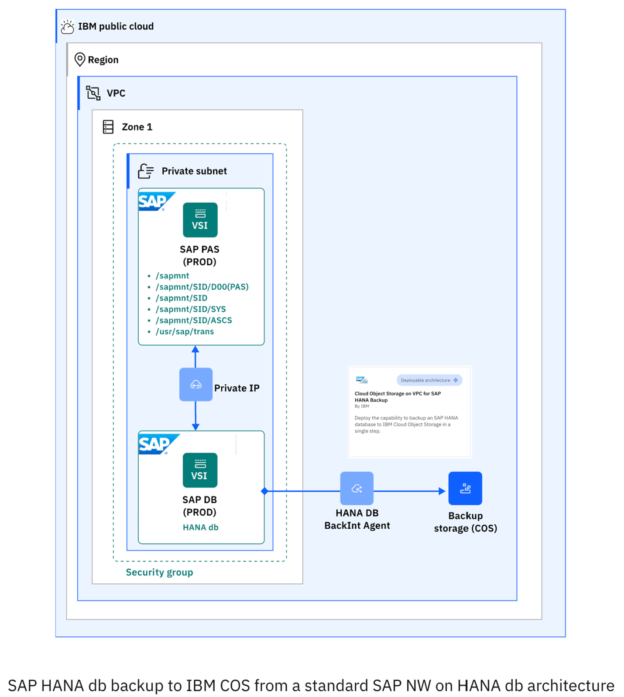

---
copyright:
  years: 2023
lastupdated: "2023-12-06"
keywords:
subcollection: sap
---

{{site.data.keyword.attribute-definition-list}}

# Introduction to IBM Cloud VPC and HANA db backup on Cloud Object Storage automation
{: #sap-automate-intro-hana-db-backup-cos}

You can use Terraform to automate {{site.data.keyword.cloud}} VPC provisioning. The provisioning includes virtual server instances with high network performance. For the VPC infrastructure there are a number of Infrastructure-as-a-Service (IaaS) offerings, including Virtual Servers. After the VPC infrastructure components are provisioned, the scripts use the Ansible playbooks to install the SAP system.
{{site.data.keyword.cloud_notm}} VPC infrastructure consists of SAP certified hardware that uses Intel&reg; Xeon CPUs and additional Intel&reg; technologies.

## {{site.data.keyword.cloud_notm}} VPC introduction
{: #automate-backup-vpc-intro}

A VPC is a public cloud offering that an enterprise uses to establish its own private cloud-like computing environment on shared [public cloud](https://www.ibm.com/cloud) infrastructure. VPCs give an enterprise the ability to define and control a virtual network that is logically isolated from all other public cloud tenants, creating a private, secure place on the public cloud.

Imagine that a cloud provider’s infrastructure is a residential apartment building and multiple families live inside. Being a public cloud tenant is akin to sharing an apartment with a few roommates. In contrast, having a VPC is like having your own private condominium; no one else has the key, and no one can enter the space without your permission.
A VPC’s logical isolation is implemented by using virtual network functions and security features that give an enterprise customer granular control over which IP addresses or applications can access particular resources. It is analogous to the “friends-only” or “public/private” controls on social media accounts used to restrict who can or can’t see your otherwise public posts.

With {{site.data.keyword.cloud_notm}} VPC, you can use the UI, CLI, and API to manually provision virtual server instances for VPC with high network performance. VPC infrastructure contains several Infrastructure-as-a-Service (IaaS) offerings, including Virtual Servers for VPC. Use the following information to understand a simple use case for planning, creating, and configuring resources for your VPC, and learn about more VPC overviews and VPC tutorials. For more information about VPC, see [Getting started with Virtual Private Cloud (VPC)](/docs/vpc?topic=vpc-getting-started).

## SAP on {{site.data.keyword.cloud_notm}}
{: #sap-hana-db-backup-on-cloud}

SAP NetWeaver is the core foundation of the SAP technology stacks and is the platform that is used for ABAP and Java applications. The SAP system can be installed and configured in {{site.data.keyword.cloud_notm}} for various system and database types.

For more information about SAP system architectures on {{site.data.keyword.cloud_notm}} VPC, see the infrastructure reference architectures for SAP for each supported database type. For example, [SAP NetWeaver 7.x on UNIX with HANA on {{site.data.keyword.cloud_notm}} VPC](https://cloud.ibm.com/docs/sap?topic=sap-sap-refarch-nw-hana&interface=terraform) is the dedicated reference architecture for this SAP solution.

## SAP Project Value Guide – IBM Cloud VPC and HANA db backup automation on Cloud Object Storage
{: #sap-hana-db-backup-on-cos-value-guide}

SAP projects vary widely in scope and budget, but none are considered trivial. Whether you are delivering a new SAP system or implementing changes to an existing one, the requirement for no errors in execution and reducing the project time to realize the benefits are always present.

In many SAP project scenarios, the deployment of an SAP system is often a key and repeated task. This project value guide covers the automated deployment of {{site.data.keyword.cloud_notm}} VPC and HANA db backup automation on Cloud Object Storage (Cloud Object Storage). More information on [SAP NetWeaver of HANA database](/docs/sap?topic=sap-intro-automate-deploy-vpc-terraform-ansible&interface=ui) and [Additional Application Server (AAS) to SAP instance and HANA instance](/docs/sap?topic=sap-intro-automate-aas-hana-anydb-terraform-ansible&interface=ui) is discussed in their respective sections.

With this system being a key part of your SAP project, you want to backup the HANA database. For more information, go to [Cloud Object Storage on VPC for SAP HANA Backup](https://cloud.ibm.com/catalog/architecture/deploy-arch-ibm-sap-vpc-automation-hana-backup-cos-a2a5c6fa-64e8-4907-a88d-f8d38214d218-global){: external} to automatically provision {{site.data.keyword.cloud_notm}} Object Storage resources as a backup target within HANA Studio, by using the backint agent for {{site.data.keyword.cloud_notm}} available from SAP.

 {: caption="SAP HANA database backup to {{site.data.keyword.cloud_notm}} Object Storage" caption-side="bottom"}

## HANA db backup to {{site.data.keyword.cloud_notm}} Object Storage (Cloud Object Storage)
{: #sap-hana-db-backkup-cos}

{{site.data.keyword.cloud_notm}} Object Storage stores encrypted and dispersed data across multiple geographic locations. This getting started tutorial walks through the steps that are needed to use {{site.data.keyword.cloud_notm}} Object Storage to create buckets, upload objects, and set up access policies to allow other users to work with your data.

Manually deploying a VPC and configuring a backup/restore on Cloud Object Storage with a backint HANA agent on a cloud platform can be time-consuming. The Terraform automation assures not only a quicker implementation, but also a standardized and less prone to error deployment. Terraform and Ansible are used for automating the deployment processes.

## Ansible for SAP installation
{: #sap-hana-db-backup-ansible-install}

Ansible is a command line IT automation software application that can be used to configure systems, deploy software, orchestrate workflows to support application deployment, system updates. It is used to automate the configuration of a Hana db backup for Cloud Object Storage. For more information about Ansible, see the [Ansible Documentation](https://docs.ansible.com/ansible/latest/index.html){: external}.

The Ansible playbooks are called directly by the Terraform scripts. The scripts start with Terraform specific steps for creating the VPC infrastructure elements, and continue automatically with the Ansible specific steps, which configure Hana db backup for Cloud Object Storage.

## Where to run the scripts
{: #sap-hana-db-backup-where-scripts}

The scripts run from your Deployment Server because the Deployment Server has Terraform and Ansible already installed. The SAP Kits must be downloaded to the temporary storage assigned to you on the Deployment Server. Ansible playbooks install the kits for you based on the location of the kits that are specified in the configuration files.

## Prerequisites
{: #sap-hana-db-backup-prereq-bastion}

* Before you deploy any of the SAP automated solutions on {{site.data.keyword.cloud_notm}} VPC, a deployment server (bastion server) should be created in your chosen region. The deployment server (bastion server) is used for downloading and storing specific SAP solution media that are needed for later automation deployment. The deployment server (bastion server) is used for both CLI deployment scenarios, as well for Schematics UI deployments. For more information about how to create the deployment server (bastion server) and its corresponding VPC, see [Automate SAP bastion server - SAP media storage repository](/docs/sap?topic=sap-sap-bastion-server). "HANA Backup to Cloud Object Storage" automation module requires a deployment server in the same region as HANA VSIs to be backed up.
*	A pair of SSH keys to be used to run the automation for the backup configuration must be available. The public SSH key should be manually added on SAP HANA VSI, in `/root/.ssh/authorized_keys` and uploaded in {{site.data.keyword.cloud_notm}}.
*	The {{site.data.keyword.cloud_notm}} user running the automation for SAP HANA backup should have the role of Manager on {{site.data.keyword.cloud_notm}} Object Storage. To view/use the credential, the user must have the IAM level access action resource-controller.credential.retrieve_all. This action is given with the Administrator role, and overrides any credential level access enabling the user to view the credential. For more information on granting the necessary authorizations to your {{site.data.keyword.cloud_notm}} user, see https://cloud.ibm.com/iam/users and select the USER_ID, which runs the automation and then check/grant the required roles. More information on Readme file.
*	The kit of the backup agent for {{site.data.keyword.cloud_notm}} Object Storage aws-s3-backint-.*-linuxx86_64.tar.gz should be manually uploaded on the bastion server. This kit is part of the SAP HANA kit file and can be found in */DATA_UNITS/HDB_SERVER_LINUX_X86_64/server path. Either the entire SAP HANA kit or only the kit of the backup agent for {{site.data.keyword.cloud_notm}} Object Storage can be provided, but the minimum backint agent kit version to be used is `aws-s3-backint-1.2.17-linuxx86_64`.
*	The Python script create_hdbbackint.py provided by SAP (SAP note 2935898 - Install and Configure SAP HANA Backint Agent for Amazon S3) to modify the "hdbbackint" script so that it points to the Python 3 libraries should be manually uploaded on the bastion server.
* You need to have already deployed an SAP HANA system (built on one of the following OS: SUSE Linux Enterprise Server 15 SP 4 for SAP, SUSE Linux Enterprise Server 15 SP 3 for SAP, Red Hat Enterprise Linux 8.6 for SAP or Red Hat Enterprise Linux 8.4 for SAP) in an {{site.data.keyword.cloud_notm}} Gen2 VPC, on a single host (with or without HA).
* The HANA DB SYSTEM user must have the same password for SYSTEMDB and all tenant databases.

This HANA backup solution was implemented and tested on the following OS images available in {{site.data.keyword.cloud_notm}}: ibm-sles-15-4-amd64-sap-hana-3, ibm-sles-15-3-amd64-sap-hana-3, ibm-redhat-8-6-amd64-sap-hana-2, ibm-redhat-8-4-amd64-sap-hana-2.
{: note}

The kits are installed by Ansible playbooks based on the location of the kits that are specified in the configuration files.

To save costs, the deployment server (bastion server), with its SAP media dedicated storage, can be decommissioned after the SAP solutions are successfully implemented on {{site.data.keyword.cloud_notm}} VPC cloud. Or, you can keep the deployment server (bastion server) and use it as a jump host for that specific region.

This automation is offered at no cost; however, the provisioned infrastructure comes at cost.
{: note}
