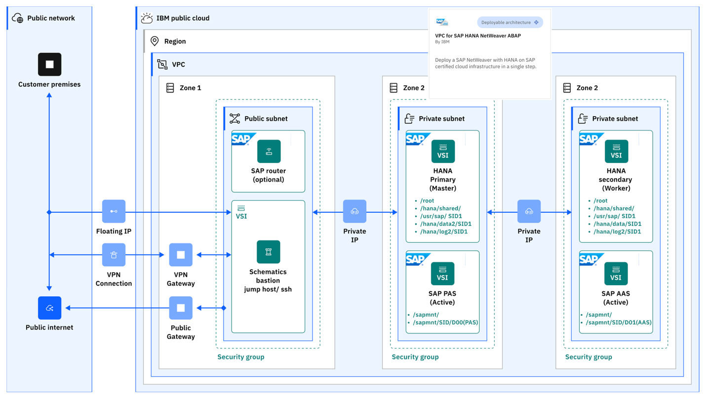

---
copyright:
  years: 2023
lastupdated: "2023-12-06"
keywords:
subcollection: sap
---

{{site.data.keyword.attribute-definition-list}}

# Automating SAP workload deployment on {{site.data.keyword.cloud}} VPC with Terraform and Ansible
{: #intro-automate-deploy-vpc-terraform-ansible}

Terraform on {{site.data.keyword.cloud}} enables predictable and consistent provisioning of {{site.data.keyword.cloud_notm}} Virtual Private Cloud (VPC) infrastructure resources so that you can rapidly build complex, cloud environments. {{site.data.keyword.cloud_notm}} VPC infrastructure consists of SAP certified hardware that uses Intel&reg; Xeon CPUs and other Intel&reg; technologies.

You can use Terraform scripts to create a single-tier VPC and create the SAP and SAP HANA in a distributed architecture on the bastion server that you create. Creating the bastion server is a prerequisite for all {{site.data.keyword.cloud_notm}} SAP VPC automated solutions. The Terraform scripts use the VPC information that you provide and then call the Ansible playbook to create the SAP architecture on the specified VPC.

## {{site.data.keyword.cloud_notm}} VPC introduction
{: #intro-automate-deploy-vpc-terraform-ansible-vpc}

A VPC is a public cloud offering that an enterprise uses to establish its own private cloud-like computing environment on shared [public cloud](https://www.ibm.com/cloud){: external} infrastructure. VPCs give an enterprise the ability to define and control a virtual network that is logically isolated from all other public cloud tenants, creating a private, secure place on the public cloud.

Imagine that a cloud provider’s infrastructure is a residential apartment building and multiple families live inside. Being a public cloud tenant is akin to sharing an apartment with a few roommates. In contrast, having a VPC is like having your own private condominium; no one else has the key, and no one can enter the space without your permission.

A VPC’s logical isolation is implemented by using virtual network functions and security features that give an enterprise customer granular control over which IP addresses or applications can access particular resources. It is analogous to the “friends-only” or “public/private” controls on social media accounts used to restrict who can or can’t see your otherwise public posts.

With {{site.data.keyword.cloud_notm}} VPC, you can use the UI, CLI, and API to manually provision virtual server instances for VPC with high network performance. VPC infrastructure contains a number of Infrastructure-as-a-Service (IaaS) offerings, including Virtual Servers for VPC. Use the following information to understand a simple use case for planning, creating, and configuring resources for your VPC, and learn about more VPC overviews and VPC tutorials. For more information about VPC, see [Getting started with Virtual Private Cloud (VPC)](/docs/vpc?topic=vpc-getting-started).

## SAP solution implemented
{: #intro-automate-deploy-vpc-terraform-ansible-solution}

SAP NetWeaver is the core foundation of the SAP technology stacks and is the platform that is used for ABAP and Java applications. The SAP system can be installed and configured in {{site.data.keyword.cloud_notm}} for various system and database types.

Manually deploying a VPC and installing an SAP system can be time-consuming. The Terraform automation assures not only a quicker implementation, but also a standardized and less prone to error deployment. Terraform and Ansible are used for automating the deployment processes.

The Terraform scripts solution provides the automated deployment of a single host with SAP NetWeaver with either ASE SYB or SAP HANA db on the Red Hat Enterprise Linux® 8.4 and SUSE 15.x for SAP Applications.

The SAP installation media that are used for this deployment are the default media for SAP AAS of NetWeaver 7.x (ABAP stack) on SUSE/RHEL with ASE SYB 16 or HANA 2.0 db as distributed instance available at the SAP Support Portal under INSTALLATION AND UPGRADE area. You provide the installation media as an input parameter for Terraform for your SAP AAS solution chosen on dedicated kits storage from bastion server.

## SAP Project Value Guide – SAP NetWeaver with HANA landscape deployment
{: #intro-automate-deploy-vpc-terraform-ansible-value-guide}

SAP projects vary widely in scope and budget, but none are considered trivial. Whether you are delivering a new SAP system or implementing changes to an existing one, the requirements for error-free execution and reducing the project time to realize benefits are always present.

In many SAP project scenarios, the deployment of an SAP system is often a key and repeated task. This project value guide covers the automated deployment of SAP NetWeaver (ABAP) with HANA database on {{site.data.keyword.cloud_notm}} VPC. We will also discuss [Additional Application Server (AAS) to SAP instance and HANA instance](/docs/sap?topic=sap-intro-automate-aas-hana-anydb-terraform-ansible&interface=ui) and [Backing up the HANA database IBM Cloud Object Storage](/docs/sap?topic=sap-sap-automate-intro-hana-db-backup-cos&interface=ui) in their respective sections.

### Whom does the automation help?
{: #intro-automate-deploy-vpc-terraform-ansible-value-guide-help}

The SAP NetWeaver with HANA landscape deployment automation helps, if:

* You are an early adopter of the HANA database and deployed SAP Suite on HANA.
* You would like to run the SAP NetWeaver with HANA on the cloud.
* Migration of SAP databases to HANA is part of your SAP NetWeaver implementation plan.

This deployment automation helps the business who plans to migrate SAP databases to HANA while keeping SAP NetWeaver as the application layer. From deployment launch to SAP logon, you are only hours away from having test and target SAP systems.

### What does the automation deploy?
{: #intro-automate-deploy-vpc-terraform-ansible-value-guide-deploy}

This deployment automation delivers two VSIs along with storage and a secure network. You can choose the VSI profile size for HANA database and SAP NetWeaver application server.

Prerequisites to deploy the automation:

* Follow the [instructional documentation](/docs/sap?topic=sap-create-terraform-3tier-nw-hana-vpc-ansible&interface=ui).
* Obtain the SAP NetWeaver (ABAP) with SAP HANA installation software from SAP.
* Deploy the bastion (SAP install kit) server.

The automation deploys SAP certified infrastructure and the application/database software in one step. The installation process follows the SAP Master Installation Guides. For more information, go to [VPC for SAP HANA NetWeaver ABAP](https://cloud.ibm.com/catalog/architecture/deploy-arch-ibm-sap-vpc-automation-hana-nw-abap-c0fc9daf-791b-42d2-9fe3-406f267b89ac-global){: external}.

 {: caption="SAP NetWeaver with HANA landscape deployment" caption-side="bottom"}

## Ansible for SAP installation
{: #intro-automate-deploy-vpc-terraform-ansible-sap-install}

Ansible is an automation tool for the deployment of several IT tasks. Ansible is used for automating the installation of an SAP NetWeaver with HANA or AnyDB. For more information about Ansible, see the [Ansible Documentation](https://docs.ansible.com/ansible/latest/index.html){: external}.

The deployment is done by using the Ansible core, which provides CLI tools for automation. More information about Ansible core can be found on the [Ansible core page](https://docs.ansible.com/ansible-core/devel/index.html){: external}.

The Ansible playbook is called directly by the Terraform script. The script starts with Terraform specific steps for creating the VPC, and continues automatically with the Ansible specific steps to install the SAP system.

## Where to run the scripts?
{: #intro-automate-deploy-vpc-terraform-ansible-scripts}

The recommended way to run the scripts is from your deployment (bastion) server because the deployment (bastion) server has Terraform and Ansible already installed. If you want to run the scripts from your local workstation, you need to install Terraform and Ansible locally.

For both the deployment (bastion) server and local workstation, you must download the SAP kits to the temporary storage assigned to you on the deployment (bastion) server. Ansible installs the kits for you. You specify the location of the kits in the configuration files.

## Prerequisites
{: #intro-automate-deploy-vpc-terraform-ansible-prereq}

Before you deploy any of the SAP automated solutions on {{site.data.keyword.cloud_notm}} VPC, you create a Bastion server VPC in your chosen region. The Bastion server is used for downloading and storing specific SAP solution media that are needed for later automation deployment. The Bastion server is used for both CLI deployment scenarios, as well for Schematics UI deployments. For more information about how to create the Bastion server and its corresponding VPC, see [Automate SAP Bastion server – SAP media storage repository](/docs/sap?topic=sap-sap-bastion-server).

After bastion VPC deployment is complete, you must download the SAP kits to the temporary storage assigned to you on the bastion server. Ansible installs the kits for you. You specify the location of the kits in the configuration files.

To save costs, the bastion server, with its SAP media dedicated storage, can be decommissioned after the SAP solutions are successfully implemented on {{site.data.keyword.cloud_notm}} VPC. Or, you can keep the bastion server and use it as a jump host for that specific region.

However, this automation is offered free of charge , the provisioned infrastructure comes at a cost.
{: note}
