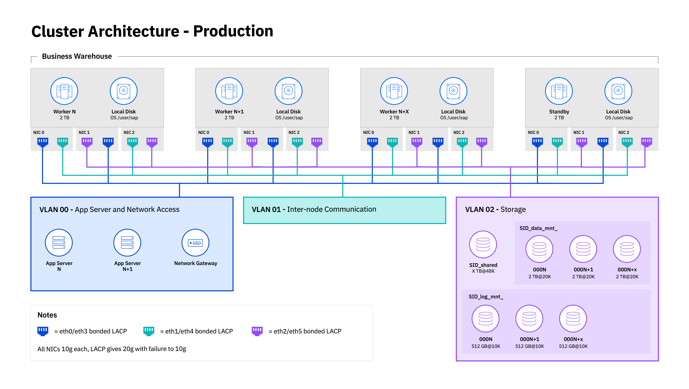

---
copyright:
  years: 2020, 2025
lastupdated: "2025-02-13"
keywords: SAP, {{site.data.keyword.cloud_notm}} SAP-Certified Infrastructure, {{site.data.keyword.ibm_cloud_sap}}, SAP Workloads
subcollection: sap
---

{{site.data.keyword.attribute-definition-list}}

# SAP HANA scale-out Reference Architecture
{: #refarch-hana-scaleout}

The {{site.data.keyword.cloud}} architecture provides superior technical capabilities, such as a software definable environment critical to a cloud infrastructure, programmable interfaces, and hundreds of hardware and network configurations. It is designed to deliver a higher level of flexibility by mixing virtual and dedicated servers to fit various workloads, automation of interfaces, and hybrid deployment options. The {{site.data.keyword.cloud_notm}} SAP-Certified Infrastructure offering for SAP HANA and SAP NetWeaver provides you with a best-fit selection. This selection includes bare metal and virtualization-based servers on which the SAP software stack is run.

## Intel Bare Metal servers on Classic Infrastructure
{: #refarch-hana-scaleout-bm}

### Reviewing the network topology and storage layout
{: #reviewing-topology}

Figure 1 shows the network topology that is required for the {{site.data.keyword.cloud_notm}} Classic Infrastructure as a Service SAP HANA TDI scale-out setup.

{: caption="{{site.data.keyword.cloud_notm}} Classic IaaS SAP HANA TDI scale-out network topology" caption-side="bottom"}

### Available SAP HANA certified {{site.data.keyword.cloud_notm}} configurations
{: #reference-intel-bm}

For Intel Bare Metal, the following solutions are certified to serve as OLAP or OLTP scale-out configuration SAP HANA nodes:

OLTP:
- BI.S4.H8.12000

OLAP:
- BI.S4.H8.12000
- BI.S4.H8.6000
- BI.S4.H4.3000
- BI.S4.H4.6000
- BI.S4.H2.3000
- BI.S2.H8401
- BI.S2.H4101
- BI.S2.H4201

Check [SAP' Certified and Supported SAP HANA Hardware Directory](https://www.sap.com/dmc/exp/2014-09-02-hana-hardware/enEN/#/solutions?filters=v:deCertified;iaas;ve:28;v:b046dad8-7aa0-457a-ade5-286ebaf88a2f&id=s:2014){: external} for details of the supported configurations.

### Network layout for Scale-out configurations
{: #reference-intel-bm-scaleout-network}

For Intel Bare Metal scale-out configurations, contact {{site.data.keyword.cloud_notm}} support for assisting you to set-up the required networking. Depending on the hardware used, the choice of networks might be restricted, or special configurations might have to be adapted. See the following diagram, for the layout to use. The diagram describes the use of three fully redundant (LACP config), physically separate networks, for:
* Storage traffic,
* Internal SAP HANA inter-node communication
* Communication with the client(s), for example SAP ABAP application servers or SAP HANA Studio for administration purposes.

Use the network that holds the default route of your environment to pass the NFS traffic through it, the storage servers are reachable through that gateway, only.

### Storage for Scale-out configurations
{: #reference-intel-bm-scaleout-storage}

For scale-out configuration, the ability of storage volumes to be accessed from different server nodes is required for failover purposes. Thus, local storage is out of scope, and NFS volumes need to be deployed. The deployed volumes can vary in size and number (see details here: [Persistent Data Storage in the SAP HANA Database](https://help.sap.com/docs/SAP_HANA_PLATFORM/6b94445c94ae495c83a19646e7c3fd56/be3e5310bb571014b3fbd51035bc2383.html){: external}). In any case, they have to comply with the TDI performance KPIs (see [SAP Note 2613646](https://me.sap.com/notes/2613646){: external}) verified by [SAP HANA Hardware and Cloud Measurement Tools](https://help.sap.com/docs/HANA_HW_CLOUD_TOOLS/02bb1e64c2ae4de7a11369f4e70a6394/7e878f6e16394f2990f126e639386333.html){: external}.

{{site.data.keyword.cloud_notm}} recommends Endurance File Storage at 10 IOPS per GB or Performance File Storage with IOPS equal or greater than 10K. For the network configuration, use the primary network as storage network to guide the traffic to the NFS servers through it.

## Intel Virtual Servers in VPC Infrastructure (Gen2)
{: #reference-intel-vsi}

### Available SAP HANA certified {{site.data.keyword.cloud_notm}} configurations
{: #reference-intel-vsi-scaleout-olap}

For Intel-based VSIs in VPC, the following configuration is available for OLAP scale-out configuration with SAP HANA:

OLAP:
- vx2-176x2464

Check [SAP' Certified and Supported SAP HANA Hardware Directory](https://www.sap.com/dmc/exp/2014-09-02-hana-hardware/enEN/#/solutions?filters=v:deCertified;iaas;ve:28;v:b046dad8-7aa0-457a-ade5-286ebaf88a2f&id=s:2014){: external} for details of the supported configurations.

These configurations can either be run on-top of dedicated hosts (DHs) or on shared hosts.

### Network layout for Scale-out configurations
{: #reference-intel-vsi-scaleout-olap-network}

For Intel Bare Metal scale-out configurations, contact {{site.data.keyword.cloud_notm}} support for assisting you to set-up the required networking. On the VPC (Gen2) infrastructure, underlying host systems are laid out for full redundance, no matter if they are dedicated or shared hosts. As a result, VSIs in VPC do not require for redundant network adapter. Throughput for all VSI level adapters in one VSI is limited to 60 Gbps, by default. A single adapter is limited to 25 Gbps maximum throughput. Therefore, the HANA network layout for scale-out configurations requires three separate networks, 3 adapters to be configured with a throughput of 20 Gbps, each. See the following diagram for the network layout for VSIs. Read the following chapter on storage before you decide on the details of your storage layout and the according networks to use.

Figure 2 shows the network topology that is required for the {{site.data.keyword.cloud_notm}} VPC Infrastructure as a Service SAP HANA TDI scale-out setup.

{: caption="{{site.data.keyword.cloud_notm}} VPC IaaS SAP HANA TDI scale-out network topology for VSIs" caption-side="bottom"}

### Storage for Scale-out configurations
{: #reference-intel-vsi-scaleout-olap-storage}

For scale-out configuration, the ability of storage volumes to be accessed from different server nodes is required for failover purposes. Thus, local storage is out of scope, and NFS volumes need to be deployed. These shares are referred to as `file shares and their mount targets` in {{site.data.keyword.cloud_notm}} VPC. The shares can vary in size and number (see details here: [Persistent Data Storage in the SAP HANA Database](https://help.sap.com/docs/SAP_HANA_PLATFORM/6b94445c94ae495c83a19646e7c3fd56/be3e5310bb571014b3fbd51035bc2383.html){: external}). In any case, they must comply with the TDI performance KPIs (see [SAP Note 2613646](https://me.sap.com/notes/2613646){: external}) verified by [SAP HANA Hardware and Cloud Measurement Tools](https://help.sap.com/docs/HANA_HW_CLOUD_TOOLS/02bb1e64c2ae4de7a11369f4e70a6394/7e878f6e16394f2990f126e639386333.html){: external}.

{{site.data.keyword.cloud_notm}} recommends 10 IOPS per GB or custom profile File Shares for meeting the SAP's KPIs.

Choose one subnet to connect the file shares to. Carefully design and configure your network and SAP HANA configuration in a way that this network is not used for client nor internal communication. For more information on creating file shares and mount targets, see [Planning your file shares](/docs/vpc?topic=vpc-file-storage-planning&interface=ui).
