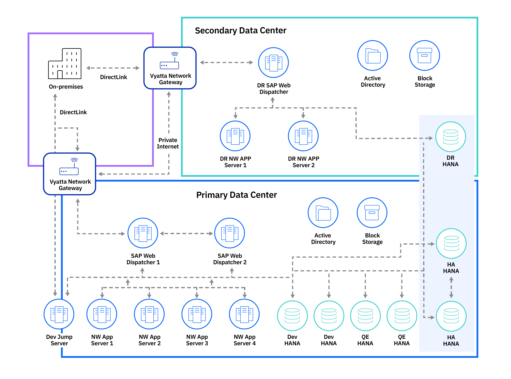

---

copyright:
  years: 2020
lastupdated: "2020-09-21"

keywords: SAP, {{site.data.keyword.cloud_notm}} SAP-Certified Infrastructure, {{site.data.keyword.ibm_cloud_sap}}, SAP Workloads

subcollection: sap

---

{:shortdesc: .shortdesc}
{:codeblock: .codeblock}
{:screen: .screen}
{:external: target="_blank" .external}
{:pre: .pre}
{:table: .aria-labeledby="caption"}
{:note: .note}
{:tip: .tip}
{:deprecated: .deprecated}

This document is out of date, it is being updated and replaced in November-2020 with new content.
{: deprecated}

# SAP HANA scale-up Reference Architecture
{: #refarch-hana-scaleup}

## Intel Bare Metal
{: #refarch-hana-scaleup-bm}

Reference architecture (RA) for a landscape comprised of

    * Vyatta network components
    * SAP Web Dispatcher
    * SAP NetWeaver Application Servers
    * SAP HANA databases
    * Other relational database management systems (RDBMS)

The example RA is configured with high availability and disaster recovery. Note that in Figure 1, the database servers can be any database system supported by SAP NetWeaver, for example, SAP HANA.

{: caption="Sample reference architecture" caption-side="bottom"}

### Understanding the architecture behind the SAP reference architecture
{: #architecture}

The architecture example in Figure 1 might differ from your architecture; it shows the general concepts of an SAP {{site.data.keyword.cloud}}-based deployment. Your on-premises systems are connected through the internet to your {{site.data.keyword.cloud_notm}} infrastructure.

After your environment is ordered and deployed, you connect through an administrative VPN to your {{site.data.keyword.cloud_notm}} infrastructure. The VPN might not be sufficient for connecting your on-premises systems with cloud-based systems, which is why you can deploy a Vyatta Network appliance in the {{site.data.keyword.cloud_notm}} environment. For higher bandwidth and lower latency requirements, an Ethernet circuit handover into the cloud environment is also supported.

There are two different data centers that are shown in Figure 1 that consist of several SAP-certified {{site.data.keyword.baremetal_short}} for both SAP NetWeaver and SAP HANA. The {{site.data.keyword.baremetal_short}} in the diagram can be different, depending on your environment and the database technology you're using. In addition, the SAP HANA data in the architectural overview is transferred from the primary data center to the secondary data center for disaster recovery (DR). Other databases also allow for setups like Figure 1, with the setup being different.

In Figure 1, on the DR data center site, replicated systems are configured to maintain DR capabilities, which need to be implemented on different layers. For more information, see [Disaster recovery considerations](#dr).

#### SAP systems
{: #systems}

The SAP systems (Advanced Business Application Programming (ABAP), Java, and SAP HANA) have a granular set of authorization objects for user management. Because of this, only remote access from desktops or other front-end devices to the {{site.data.keyword.cloud_notm}}-based environment need to be set up. No user access needs to be granted and managed in the cloud environment. There might be several users with different responsibilities who need access to a database through a specific interface, command line, or have latency restrictions that require Remote Desktop Protocol (RDP)-based access. To manage RDP access, a "jump host" can be deployed in the environment to serve as a central point of access for these scenarios. Apart from these specific requirements, users have access to the cloud-based systems within your corporate network and do not need to be administered in any specific way.

#### Network
{: #network-scaleup}

Any device in an {{site.data.keyword.cloud_notm}} environment can be ordered with a choice of internal and optional external LAN access. The external address is a routable public IP address and should be handled with care. The internal address is determined by the ordered VLAN and chosen from a subrange of 10.0.0.0/8. By ordering multiple VLANs, different environments, or traffic types, can be segregated according to your network design and security requirements.

While a public interface with a configured firewall can cover some scenarios - for example, short term, rapid prototyping proof of concept with non-critical data - a firewall device should be considered for most cases. The example reference architecture maps a production scenario, so public network interfaces are out-of-scope.

#### Vyatta Network Gateway
{: #vyatta}

Vyatta provides software-based virtual router, virtual firewall/NAT, and VPN capabilities for both IPV4 and IPV6. If users are to connect remotely into your {{site.data.keyword.cloud_notm}}-based systems, these devices can serve as end-points for both side-to-side VPN or the so-called "road warrior VPN" (access point). Different kinds of VPN technologies - IPSec, or SSL VPN tunnels, such as OpenVPN - can be used. Depending on the SAP technology you're using, these VPN connections can be used to interconnect SAP systems (even with non-SAP systems) for traditional GUI technology, and browser-based SAP UI5 technology. Connecting an SAP Web Dispatcher behind a Vyatta Gateway allows for further features to be used, such as load balancing or single sign-on scenarios. For more information on the SAP Web Dispatcher, see [High availability](#availability).

The Vyatta device can be deployed in a high-availability cluster configuration with a bandwidth up to 10 Gbps. For more information, see [Vyatta 5400 High Availability Configuration](/docs/virtual-router-appliance?topic=virtual-router-appliance-vyatta-5400-high-availability-configuration#vyatta-5400-high-availability-configuration).

#### Jump box server
{: #jump_box}

SAP systems contain user management and do not require centralized user administration. You can, of course, set up centralized user management. For more information, see [Central User Administration)](https://help.sap.com/viewer/c6e6d078ab99452db94ed7b3b7bbcccf/7.3.19/en-US/bfb0b13bb3acd607e10000000a11402f.html){: external}.

You can use a jump box server to give specific users low-level access to your {{site.data.keyword.cloud_notm}} environment through command-line access-based tools or other special purpose tools, such as SAP HANA Studio. Database administration tools, and the users who are granted access to the tools, are managed centrally on the jump box server. Users can log in to your {{site.data.keyword.cloud_notm}} environment from their desktops through Remote Desktop Protocol, which is routed through the VPN gateway.

#### SAP servers - SAP HANA and SAP NetWeaver
{: #servers}

{{site.data.keyword.IBM_notm}} offers various of SAP-certified servers for SAP HANA and SAP NetWeaver from the {{site.data.keyword.ibm_cloud_sap}} portfolio. The servers are {{site.data.keyword.baremetal_short}} with your choice of operating system (OS) (Red Hat Linux, SUSE Linux, Microsoft Windows Server, or deployed with the VMware ESX hypervisor). For more information on the SAP NetWeaver-certified servers, see [SAP Note 2414097)](https://launchpad.support.sap.com/#/notes/2414097){: external}.

On the hypervisor, you deploy one of the operating systems that are listed in SAP Note 2414097 as a guest OS.
{: note}

SAP HANA servers come with a preselected storage layout that fulfills SAP's storage Key Performance Indicators (KPIs) for SAP HANA. You cannot change these layouts and you're urged not to use external storage for SAP HANA. External storage of different quality and accessible through different protocols - NFS, CIFS, iSCSI - can be used for backup and other purposes. Also, for the SAP NetWeaver servers, you have a choice to run other supported database systems on external storage.

All SAP Software solutions based on either SAP HANA or on SAP NetWeaver include the entire SAP Business Suite, and SAP S/4HANA can be deployed in the {{site.data.keyword.cloud_notm}} environment. For other software components outside of these components, you need to contact SAP Support. Follow the SAP sizing process to determine the right server size for your project, and choose from the servers that are listed for either the SAP HANA or SAP NetWeaver offering.

For more information on the SAP HANA-certified servers, see the [SAP Certified and Supported SAP HANA Hardware Directory - Certified IaaS Platforms - {{site.data.keyword.cloud_notm}}](https://www.sap.com/dmc/exp/2014-09-02-hana-hardware/enEN/#/solutions?filters=iaas;ve:28){: external}.

For more information on SAP HANA and SAP NetWeaver sizing, see [Sizing process for SAP Systems)](/docs/sap?topic=sap-sizing).

### Guidance for your {{site.data.keyword.cloud_notm}} SAP-Certified Infrastructure
{: #recommendations}

Your requirements might differ from the offered guidance; however, it serves as a starting point for building your SAP-certified server in the {{site.data.keyword.cloud}} environment.

#### VLANs
{: #vlans}

The SAP guidelines for landscape design recommend a segregation of server traffic on different network interface controllers (NICs). For example, business data should be separated from administrative and backup traffic. Assigning multiple NICs to different subnets enables this data segregation. For more information, see the Network section in [Building High Availability for SAP NetWeaver and SAP HANA](https://support.sap.com/content/dam/SAAP/SAP_Activate/AGS_70.pdf){: external} (PDF).

To follow the NIC recommendation, you can configure multiple VLANs on the servers. The VLAN interfaces can be made high availability (HA) through multiple NICs to be configured under bond interfaces (Linux) or teaming interfaces (Microsoft Windows). Consult SAP installation documentation for support on how to assign addresses during the installation with the SAP Software Provisioning Manager (SWPM). For virtual machines (VMs), the address of the main interface of the VM is usually sufficient.

A best practice is to reserve additional IP addresses and assign the addresses to the different SAP services as the services are implemented for both HA and disaster recovery (DR) capabilities on the {{site.data.keyword.baremetal_long}}.
{: tip}

By default, {{site.data.keyword.cloud_notm}} {{site.data.keyword.baremetal_short}} have a public and a private interface. In general, it's not recommended to keep the public LAN configured for all servers in your {{site.data.keyword.cloud_notm}} infrastructure. Specific instances of the Vyatta Network Gateway should be deployed to allow public access to your environment, if needed. For more information, see [Vyatta Network Gateway](#vyatta).

#### {{site.data.keyword.cloud_notm}} storage
{: #storage-scaleup}

{{site.data.keyword.cloud_notm}} servers certified for SAP NetWeaver can be configured with a different number of internal disks and with different layouts for those disks for RAID configuration. Be aware that the layouts might not be sufficient for project requirements, for example, insufficient size, or shared access to storage.

Storage requirements differ to the point that the guidance is to clearly define the project Key Performance Indicators (KPIs) in terms of backup and restore time slots, HA and failover requirements, and then decide on the storage type to use. Covering all options is beyond the scope of this content; however, some guidance can be provided.

    * Use shared iSCSI devices for HA setups with a database that fails over between nodes. You will need to look at the required maximum IOPS/sec.

    * Use internal storage for HA setups with a database that is replicated; for example, SAP HANA system replication. SAP NetWeaver application servers can either reside on internal storage or on shared network-attached storage (NAS).

    * Use shared storage to facilitate failover capabilities with VMware-based installations. For more information on selecting the right storage type, see [Storage to use with VMware Systems](/docs/vmware?topic=vmware-vmware-storage).

All the options can be selected from within the {{site.data.keyword.cloud_notm}} infrastructure.

#### High availability
{: #availability}

In a distributed installation of SAP applications on a centralized database, the base installation is replicated to achieve HA. For each layer of the architecture, the HA design varies.

    * **SAP Web Dispatcher**. HA is achieved with multiple redundant SAP Web Dispatcher instances with SAP application traffic. The SAP Web Dispatcher serves as a potential entry point for a set of SAP systems and other `https`-based services. It typically lies between the internet and the backend systems and deals with web protocol-based requests from the "outside world." The SAP Web Dispatcher works like a reverse proxy with a variety of supported features, such as load balancing and single sign on. For more information, see [SAP Web Dispatcher](https://help.sap.com/viewer/product/SAP_NETWEAVER_731/7.31.25/en-US){: external}.

    * **ABAP SAP Central Services (ASCS)**. For HA of ASCS in an {{site.data.keyword.cloud_notm}} environment, the cluster software of the target operating system needs to be installed, for example, Linux Pacemaker or Microsoft Cluster. The single point of failure of the ASCS (SAP's enqueue service) needs to be configured to replicate its data to an Enqueue Replication Service (ERS). An ERS instance needs to be installed as part of the SAP installation process and is supported by SAP's SWPM. For details on installing and configuring the cluster components for both ASCS and ERS, consult the documentation of the operating system vendor's offering.

    * **SAP NetWeaver application servers**. HA is achieved by load balancing traffic within a pool of application servers. If only a limited amount of resources are required, a single application server can be configured as HA. The application server needs to be installed with storage that is accessible by all potential cluster nodes, which can be used for failover. Also, the SAP NetWeaver stack needs to use a virtual hostname. Consult the operating system documentation of the operating system vendor for details on the required configuration and SAP documentation for HA. If your configuration requires multiple application servers, the configuration of the SAP application servers needs to cover load balancing, too, for example, in SAP logon groups and RFC server groups. For more information, see the administration guide for your SAP NetWeaver version.

    * **Database tier**. The example reference architecture deploys a single SAP HANA, or other database, instance. For high availability, deploy more than one instance and use HANA System Replication (HSR) to implement manual failover. To enable automatic failover, a high availability extension for the specific Linux distribution is required. For other databases, either  a failover of the database instance on shared storage can be configured, or a replication technique similar to the SAP HANA case can be used. Consult the documentation of the supported database system for the set of options that are required to set up either high availability or replication.

    For additional information, see [{{site.data.keyword.cloud_notm}} high-availability support](/docs/sap?topic=sap-hana-design-considerations).

#### Disaster recovery
{: #dr}

Each tier uses a different strategy to provide disaster recovery protection.

 * **SAP NetWeaver application servers**. SAP application servers contain no business data; however, the installation and configuration of the server needs to be preserved for continued operation after a disaster. One disaster recovery strategy is to have SAP application servers in another region. Any changes to configuration or kernel updates on the primary application server must be copied to the virtual machines or servers in the disaster recovery region.

 * **SAP Central Services (SCS)**. The SCS component of the SAP application stack doesn't persist business data. You can build a server or a VM in the disaster recovery region to run the SCS role. The only content from the primary SCS note to synchronize is the `/sapmnt` share content. Also, if configuration changes or kernel updates take place on the primary SCS servers, the changes must be replicated on the disaster recovery SCS. To synchronize the two servers, use a regularly scheduled copy job to copy `/sapmnt` to the disaster recovery servers. For more information on SCS, see [Central Services Instance](https://help.sap.com/viewer/product/SAP_NETWEAVER_731/7.31.25/en-US){: external}.

 * **Database tier**. For SAP HANA-based systems, use HANA-supported replication solutions such as HANA System Replication or {{site.data.keyword.cloud_notm}} storage replication features. For other supported databases, refer to the database documentation for its supported features. In general, choosing from the available options requires a clear understanding of the business requirements of the underlying SAP application. The impact of a potential loss of single transactions or even all data within a time window needs to be determined.

 * **Infrastructure**. Depending on where the SAP clients are in your {{site.data.keyword.cloud_notm}} infrastructure, other components within it need to be prepared for disaster recovery scenarios. In the example reference architecture, clients access the SAP systems from the on-premises side, or from within the customer's corporate network.

#### Security
{: #security}

##### User management
{: #security-user-management}

SAP has its own Users Management Engine (UME) to control role-based access and authorization with the SAP application. For more information, see [SAP HANA Security Guide for SAP HANA Platform](https://help.sap.com/docs/SAP_HANA_PLATFORM/b3ee5778bc2e4a089d3299b82ec762a7/c3d9889e3c9843bdb834e9eb56f1b041.html){: external}. From a user management perspective, it's not relevant if your SAP systems run on-premises {{site.data.keyword.cloud_notm}}. Exceptions to that rule are mentioned under [Jump box server](#jump_box).

##### Network security
{: #security-network-security}

Since there are different ways for you to access an {{site.data.keyword.cloud_notm}}-based environment, security measures need to be differentiated.

The use of a public interface for external access should only be considered in proof-of-concept type deployments. For production scenarios, the deployment of Vyatta appliances is available since the appliances feature all required functionality (VPN firewall, and so on). Should latency and or through-put requirements not be met by Vyatta appliances, contact {{site.data.keyword.cloud_notm}} Support to discuss all the possible steps and configurations that are available beyond the Vyatta appliances.
