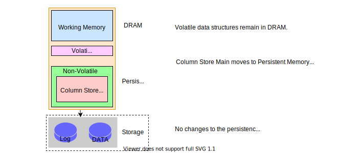

---

copyright:
  years: 2021
lastupdated: "2021-03-05"

keywords: SAP, {{site.data.keyword.cloud_notm}} SAP-Certified Infrastructure, {{site.data.keyword.ibm_cloud_sap}}, SAP Workloads, persistent memory, PMEM

subcollection: sap

---

{:shortdesc: .shortdesc}
{:codeblock: .codeblock}
{:screen: .screen}
{:external: target="_blank" .external}
{:pre: .pre}
{:table: .aria-labeledby="caption"}
{:note: .note}
{:tip: .tip}
{:important: .important}
{:deprecated: .deprecated}

# SAP HANA with Intel Optane Persistent Memory (PMEM)
{: #sap-partner-intel-optane-pmem}

SAP HANA now has a non-volatile in-memory option on Bare Metal servers. Intel Optane&trade; persistent memory (PMEM) retains its contents like traditional storage options but with speeds similar to main memory. 

{: caption="Figure 1. SAP HANA Intel Optane PMem[^Figure] overview" caption-side="bottom"}

[^Figure]: This diagram originally appeared in the [SAP Community blog by Andreas Schuster](https://blogs.sap.com/2018/11/29/sap-hana-persistent-memory-2/)

Many systems with large data storage and retrieval needs use DRAM for fast data retrieval. DRAM is costly and data does not persist when the server is rebooted or shutdown. On startup, data must be reloaded from storage.   

With Intel Optane PMEM, data is retained in memory during system restarts and power outages, providing faster start times. PMEM provides near-DRAM performance and is also byte-addressable. 

Intel Optane PMEM modules are installed with DRAM in the same dual in-line memory module (DIMM) slot. PMEM modules do not function without any DRAM DIMMS installed. The current configurations support a DRAM to PMEM ration of 1:1, providing an equal amount of DRAM and PMEM.

SAP HANA uses App Direct mode, in which the application stores data on the persistent memory. HANA2 SP04 release or higher was co-engineered by SAP and Intel to use the unique dual memory and storage capability of the PMem modules.   

In App Direct mode, the applications directly access the memory and control the direct load and store of the PMem and DRAM DIMMs memory resources. In this mode, the PMem acts as byte-addressed persistent memory that is mapped to the system physical address space. App Dir mode uses regions, which are groups of one or more PMem modules that appear to be a single logical virtual address space. Regions are partitioned into one or more namespaces, similar to hard disk partitions.  

## Persistent memory is a Bare Metal profile option
{: #sap-partner-intel-optane-bm-option}

You order persistent memory as part of ordering your Bare Metal server. 

Bare Metal server profiles include three options for persistent memory:

|Profile|Cores|Speed|RAM|Storage|Features|  
|-------|-------------|---------------|----|----|-----| 
|[BI.S4.H2.1.5 TB RAM + 1.5 TB Persistent Memory](https://cloud.ibm.com/gen1/infrastructure/provision/bm?imageItemId=13475&packageId=1045&presetId=825){: external}|56|2.70 GHx|1536 GB|12 Drives|SAP|
|[BI.S4.H4.3 TB RAM + 3 TB Persistent Memory](https://cloud.ibm.com/gen1/infrastructure/provision/bm?imageItemId=8451&packageId=1041&itemId=10831){: external}|112|2.70 GHz|3072 GB|12 Drives|SAP|
|[BI.S4.H8.6 TB RAM + 6 TB Persistent Memory](https://cloud.ibm.com/gen1/infrastructure/provision/bm?imageItemId=8451&packageId=1041&itemId=10831){: external}|224 |2.70 GHz|6144 GB|12 Drives|SAP|

## Sizing 
{: #sap-partner-intel-optane-sizing}

Standard HANA sizing rules apply to a 1:1 ratio configured server. The PMem size is the maximum HANA database size capacity. For example, the BI.S4.H4 profile can host a database of up to approximately 3 TB (compressed). If the server is hosting multiple systems or tenants, you have a total maximum data capacity of 3 TB (for example 3 x 1 TB databases or 2 x 1.5 TB systems). HANA uses both the DRAM and PMem and manages memory use for both data and application logic.

## Post-provisioning
{: #sap-partner-intel-optane-post-provisioning}

When you order your Bare Metal server with persistent memory, regions are created by the provisioning engine. As part of post-provisioning, you create the namespaces that you need. For more information, see [Deploying your infrastructure](https://test.cloud.ibm.com/docs/sap?topic=sap-bm-optane-set-up-infrastructure).

### Backup, recovery, and system replication

Backup, recovery, and system replication are part of standard Bare Metal configuration. You perform the same steps for post provisioning on the Bare Metal servers as you do for SAP HANA.

