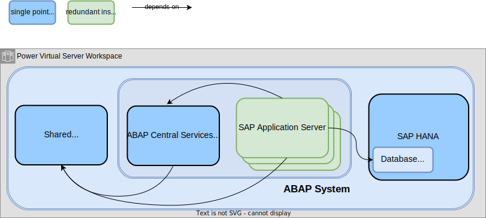
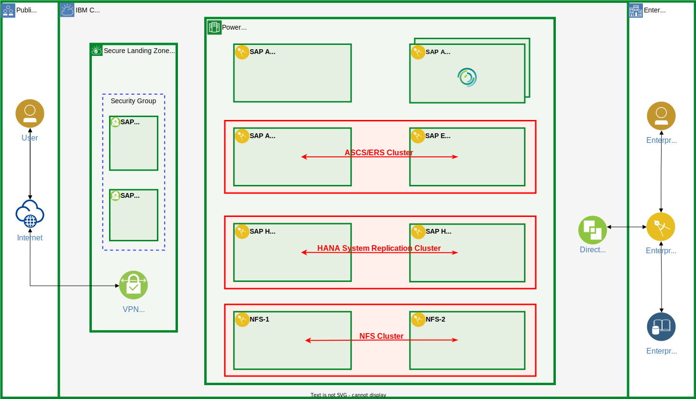

---
copyright:
  years: 2023, 2024
lastupdated: "2024-01-09"

keywords: SAP, {{site.data.keyword.cloud_notm}}, SAP-Certified Infrastructure, {{site.data.keyword.ibm_cloud_sap}}, SAP Workloads, SAP HANA, SAP HANA System Replication, High Availability, HA, Linux, Pacemaker, RHEL HA AddOn

subcollection: sap
---

{{site.data.keyword.attribute-definition-list}}

# Implementing High Availability for SAP Applications on {{site.data.keyword.powerSysFull}}
{: #ha-overview}

Running SAP on IBM {{site.data.keyword.powerSys_notm}} offers a consistent platform for SAP HANA-based and traditional applications, best-in-class performance, resilience for critical workloads, and a flexible infrastructure.
{: shortdesc}

Use the following information to understand how to implement high availability solutions for SAP systems by using {{site.data.keyword.powerSys_notm}} virtual server instances.

## SAP system architecture
{: #ha-overview-architecture}

The main components of an SAP system are as follows.

SAP HANA system
:   The SAP HANA system provides the tenant database for SAP application servers.

SAP application server
:   SAP application servers provide the functional part of an SAP S/4HANA or other application solution.
    All customization and application data of an SAP system is stored in a tenant database of an SAP HANA system.

    An SAP application system is installed and configured as a single unit and consists of the following application instances.

    - One ABAP System Central Services instance (ASCS instance)
      Each SAP application system has exactly one ASCS instance, which consists of a message server and an enqueue server.

    - One or more application server instances (AS instances)
      - The primary application server (PAS) is the first AS instance that is installed for an ABAP system.
      - Other AS instances that are installed for an ABAP system are called additional application servers (AAS).

    Both the application server instances and the ASCS instance depend on a shared file system and require read/write access to it.

Shared file system
:   Typically, the shared file system is exported on an NFS server and mounted on all instances.

Figure 1 illustrates the technical components of an SAP system.

{: caption="Figure 1. Technical components for SAP systems" caption-side="bottom"}

## Considerations for implementing an SAP high availability solution
{: #ha-overview-ha-considerations}

For high availability protection, it is recommended to install application servers redundantly.
Install at least two application servers (PAS and AAS) and use login groups to implement load balancing.
If an application server fails, all user sessions that are connected to that instance are stopped.
The user logs in again, and load balancing redirects the user to another application server that is still running.

The other technical components, such as the ASCS instance, the SAP HANA database, and the shared file system, are single points of failure and must be protected.

- ASCS instance

   The best way to safeguard the ASCS instance is to deploy an Enqueue Replication Server (ERS) instance on an extra virtual server and use HA clustering software for automating failover.

   Install ASCS and ERS either on a shared disk that is attached to both virtual server instances or on an NFS file system.

   The enqueue server of the ASCS instance manages the lock table, and the ERS creates a replicated copy of the lock table in its main memory.
   If the enqueue server must be restarted, the lock table is rebuilt by using the copy on the ERS, and all of the locks are retained.

   A simple restart of the message server is sufficient because no data needs to be retained.

   To set up an HA cluster for the ABAP System Central Services instance, follow the steps that are in [Configuring high availability for SAP S/4HANA (ASCS and ERS) in a RHEL HA Add-On cluster](/docs/sap?topic=sap-ha-rhel-nfs){: external}.

- Shared file system

   The recommended method of protecting the NFS server is to implement an extra virtual server instance. Then, create the NFS exported file systems on shared disks that are attached to both virtual server instances and automate the failover by using HA cluster software.

   To set up an HA cluster for the shared file system, follow the steps that are in [Configuring an active-passive NFS server in a Red Hat High Availability cluster](/docs/sap?topic=sap-ha-rhel-nfs){: external}.

- SAP HANA system

   SAP HANA provides two approaches to scale a system: *scale-up* and *scale-out*.
   With the comprehensive and highly scalable set of [IBM Power Virtual Server certified profiles for SAP HANA](/docs/sap?topic=sap-hana-iaas-offerings-profiles-power-vs){: external} that are available in IBM {{site.data.keyword.powerSys_notm}}, the focus is on SAP HANA *scale-up* solutions.
   {: note}

   The best way to protect an SAP HANA system is to set up a secondary SAP HANA system on a separate virtual server instance. Then, configure SAP HANA system replication, and automate failover with HA cluster software.

The following figure shows an architectural overview of a highly available SAP system that is implemented on {{site.data.keyword.powerSys_notm}}.

{: caption="Figure 2. SAP on {{site.data.keyword.powerSys_notm}} HA architecture overview" caption-side="bottom"}

## SAP HANA high availability solution scenarios
{: #ha-overview-hana-ha-scenarios}

The solution varies depending on the recovery time objective (RTO).

| Scenario                      | Typical RTO           | Comment        |
| ----------------------------- | --------------------- | -------------- |
| Performance Optimized         | A few minutes         | Unless you have specific requirements, this scenario is the default. |
| Active/Active (read enabled)  | A few minutes         | In an Active/Active (read enabled) configuration, SAP HANA system replication allows read access to the database content on the secondary system. |
| Cost Optimized                | A few tens of minutes | In a cost-optimized configuration, a nonproduction SAP HANA system runs on the secondary node during normal operation. The hardware resources on the secondary node are shared between the nonproduction system and the SAP HANA System Replication secondary. The memory consumption of the production SAP HANA System Replication secondary is reduced by turning off the preloading of data in the column tables. When a failover occurs, the nonproduction instance is automatically stopped before the node takes over the production workload. The take-over time is longer compared to a performance-optimized configuration. |
{: caption="Table 1. Variations for high availability solutions for SAP HANA" caption-side="bottom"}

Depending on your requirements, select the documentation for one of the scenarios.

- SAP HANA System Replication performance-optimized scenario

   [Configuring SAP HANA Scale-Up System Replication in a RHEL HA Add-On cluster](/docs/sap?topic=sap-ha-rhel-hana-sr){: external}.

- SAP HANA System Replication cost-optimized scenario

   [Configuring SAP HANA Cost-Optimized Scale-Up System Replication in a RHEL HA Add-On cluster](/docs/sap?topic=sap-ha-rhel-hana-sr-cost-optimized){: external}.

- SAP HANA System Replication Active-Active (Read Enabled) scenario

   [Configuring SAP HANA Active/Active (Read Enabled) System Replication in a RHEL HA Add-On cluster](/docs/sap?topic=sap-ha-rhel-hana-sr-aa){: external}.

## SAP HANA disaster recovery solution scenarios
{: #ha-overview-hana-dr-scenarios}

For extra protection of the database system, replicate the SAP HANA system to a third system that is located in a different region by using SAP HANA system replication.
Depending on your requirements, select one of the two available topologies.

- SAP HANA multitier system replication scenario

   With SAP HANA multitier system replication, you can chain multiple systems together to achieve a higher level of availability.

   [Configuring SAP HANA multitier system replication in a RHEL HA Add-On cluster](/docs/sap?topic=sap-ha-rhel-hana-sr-multitier){: external}.

- SAP HANA multitarget system replication scenario

   Multitarget system replication allows primary and secondary systems to replicate changes to more than one system.

   [Configuring SAP HANA multitarget system replication in a RHEL HA Add-On cluster](/docs/sap?topic=sap-ha-rhel-hana-sr-multitarget){: external}.
