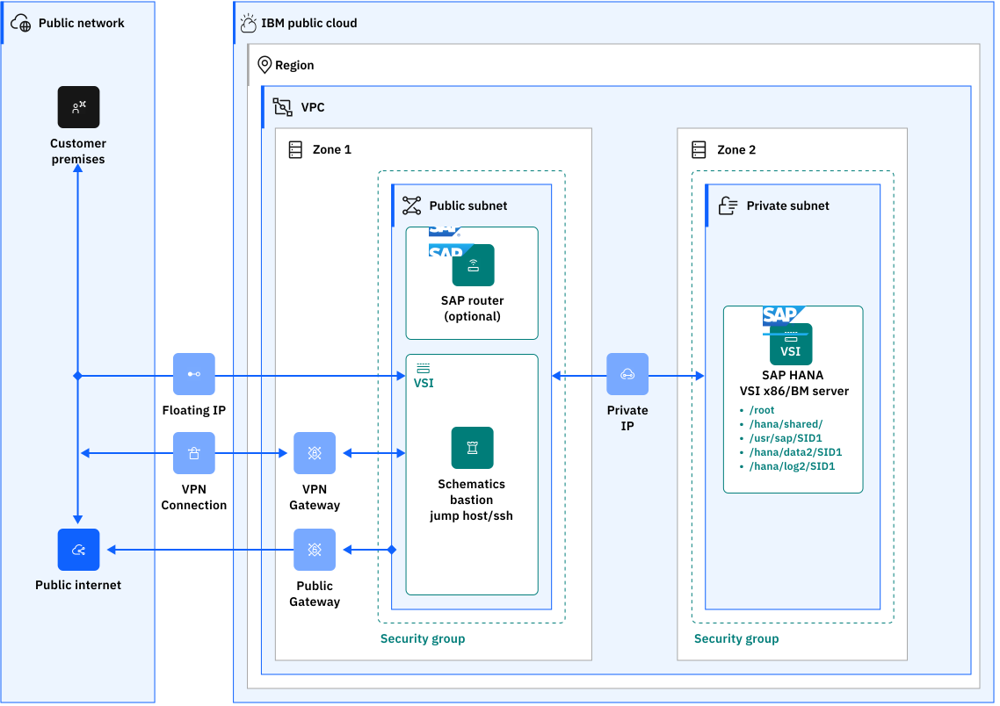

---

copyright:
  years: 2023, 2024
lastupdated: "2024-10-29"

subcollection: sap

---

{:external: target="_blank" .external}
{:shortdesc: .shortdesc}
{:screen: .screen}
{:pre: .pre}
{:note: .note}
{:important: .important}
{:table: .aria-labeledby="caption"}
{:codeblock: .codeblock}
{:tip: .tip} 
{:ui: .ph data-hd-interface="ui"}
{:terraform: .ph data-hd-interface="terraform"}

# Automating SAP NetWeaver 7.x on HANA db 3-tier architecture on {{site.data.keyword.cloud}} VPC (Terraform and Ansible)
{: #create-terraform-3tier-nw-hana-vpc-ansible}

You can use Terraform scripts to create a single-tier VPC and also create SAP and SAP HANA infrastructure on the VPC. The Terraform scripts use the VPC information that you provide and then call the Ansible playbooks to create the SAP architecture on the specified VPC. Terraform on {{site.data.keyword.cloud}} enables predictable and consistent provisioning of {{site.data.keyword.cloud_notm}} Virtual Private Cloud (VPC) infrastructure resources so that you can rapidly build complex cloud environments. {{site.data.keyword.cloud_notm}} VPC infrastructure consists of SAP certified hardware that uses Intel&reg; Xeon CPUs and additional Intel&reg; technologies.
{: shortdesc}

You have two deployment methods to choose from:
*   Terraform scripts run from the CLI on your deployment server (bastion server).
*   {{site.data.keyword.bpshort}} user interface accessed from your cloud dashboard menu.

You can create either:

*   SAP NetWeaver 7.x on SAP HANA-based ABAP stack
*   SAP NetWeaver 7.x on SAP HANA-based Java stack

## SAP Solution implemented
{: #terraform-3tier-nw-hana-solution}

Many SAP enterprise solutions are built on SAP’s extensive platform, SAP NetWeaver, including:
*  SAP HANA as Primary Persistence for SAP NetWeaver-Based Applications
*  SAP Business Suite applications (ERP, CRM, and SCM, and other applications)
*  SAP Business Warehouse (BW), and 
*  Other SAP enterprise solutions

SAP NetWeaver (SAP NW) uses mainly ABAP and Java programming languages. Many applications that are built on SAP NetWeaver’s ABAP or Java (or both) application servers can run “on” SAP HANA. In this instance, SAP HANA serves as the sole database in the architecture. 

Technical interfaces are available for applications that are built on SAP NetWeaver AS ABAP and AS Java to run on SAP HANA. However, specific development enablement is normally required for each application to ensure that it runs optimally on SAP HANA. SAP Business Suite applications (ERP, CRM, SCM, and other applications), SAP Business Warehouse (BW), and other SAP NetWeaver-based applications were modified to run on SAP HANA and use its many advantages. Also, various components and complimentary applications that are built on SAP NetWeaver can also run on SAP HANA by using the provided SAP NetWeaver DB interfaces. 

The SAP HANA as primary persistence database for SAP NetWeaver-based applications scenario has one restriction: SAP NetWeaver ABAP and Java application servers must run on separate hardware servers from the SAP HANA hardware. 

## Prerequisites
{: #terraform-3tier-nw-hana-prerequisites}

A deployment server (bastion server) deployed using the automation solution [Automate SAP bastion server – SAP media storage repository](/docs/sap?topic=sap-sap-bastion-server), should exist in the same VPC, same region, and have the same subnet and security group configured as for the SAP system VSIs.

## What is created
{: #terraform-3tier-nw-hana-components}

The scripts automate the deployment of the virtual infrastructure resources, provisioning processes for the SAP architecture, in an existing VPC, with a distributed environment. SAP NW 7.x (ABAP or Java) App server, on a distinct virtual server instance VPC system, and SAP HANA DB, on a dedicated server type virtual server instance VPC box, are provisioned. The scripts work in two phases.

During the first phase, two virtual server instances, with SAP certified storage and network configuration (the same subnet and security group as for the deployment server (bastion server)) are configured.

During the second phase, the Ansible playbooks are called and the SAP architecture is installed for both dedicated VSIs: SAP App VSI system and dedicated SAP HANA VSI box.
The SAP architecture that is deployed is the SAP NW 7.x release on a stand-alone dedicated SAP HANA 2.0 box.

{: caption="SAP NetWeaver 7.x with SAP HANA standard 3-tier installation to {{site.data.keyword.cloud_notm}} VPC" caption-side="bottom"}

The scripts are designed to install SAP (SAP NW 7.x release) solution together with its dedicated DB SAP HANA box in one task flow.

## Terraform deployment script files
{: #terraform-3tier-nw-hana-ansible-files}
{: terraform}

The configuration and script files are available in the GitHub repository:

*   For Java stack : https://github.com/IBM-Cloud/sap-netweaver-java-hana
*   For ABAP stack : https://github.com/IBM-Cloud/sap-netweaver-abap-hana 

The `input.auto.tfvars` file allows the customization of the resources and variable values should be provided.

Other configuration files are provided and no modification is required. 

## Virtual server instance configuration
{: #terraform-3tier-nw-hana-vsi-config}

The supported operating systems for SAP NetWeaver primary application server are the following and for HANA database are: 

* Red Hat Enterprise Linux 8.6 for SAP
* Red Hat Enterprise Linux 8.4 for SAP
* SUSE Linux Enterprise Server 15 SP 4 for SAP
* SUSE Linux Enterprise Server 15 SP 3 for SAP

For both server instances, the provided SSH key is used to access the VSIs via SSH as a `root` user.

## {{site.data.keyword.bpshort}} script files
{: #automate-3tier-nw-hana-schematics}
{: ui}

The configuration and script files are available in the GitHub repository:

*   ABAP: https://github.com/IBM-Cloud/sap-netweaver-abap-hana/tree/main
*   Java: https://github.com/IBM-Cloud/sap-netweaver-java-hana/tree/main

When the {{site.data.keyword.bpshort}} interface is used, the following information should be provided:
*   the workspace information.
*   the GitHub path for the chosen solution either on ABAP or Java stack.
*   the values for the parameters in the {{site.data.keyword.bpshort}} interface. They are the same parameters as the `input.auto.tfvars` file that you use with the cli.

## SAP Kits
{: #terraform-3tier-nw-hana-sap-kits}
{: terraform}

For each IBM Cloud region, a dedicated deployment server (bastion server) is used for the Terraform environment. It is your responsibility to download the necessary SAP and DB kits to your Deployment (Bastion) Server. All file archives are decompressed by Ansible during the automatic deploying process. For more information, see the Readme file in the dedicated GitHub repository.

## Support - Terraform and {{site.data.keyword.bpshort}}
{: #terraform-nw-hana-support}
 
There are no warranties of any kind, and there is no service or technical support available for these materials from {{site.data.keyword.IBM}}. As a recommended practice, review carefully any materials that you download from this site before using them on a live system.

Though the materials provided herein are not supported by the IBM Service organization, your comments are welcomed by the developers, who reserve the right to revise, readapt or remove the materials at any time. To report a problem, or provide suggestions or comments, open a GitHub issue.

## Before you begin
{: #terraform-3tier-nw-db2-ansible-before}
{: terraform}

Before you use the scripts:
 
*  If you have not created already, create a deployment server (bastion server) to store the SAP kits. For more information, see [Automate SAP bastion server - SAP media storage repository](/docs/sap?topic=sap-sap-bastion-server).
*  Log in to your previously created deployment server and verify that Terraform and Ansible are installed.
*  Download the SAP kits from the SAP Portal to your Deployment Server. Make note of the download locations. 
    Ansible decompresses all of the files. For more information, see the [Java README file](https://github.com/IBM-Cloud/sap-netweaver-java-hana) or the [ABAP README file](https://github.com/IBM-Cloud/sap-netweaver-abap-hana).
*  [Create or retrieve an {{site.data.keyword.cloud_notm}} API key](/docs/account?topic=account-userapikey#create_user_key). The API key is used to authenticate with the {{site.data.keyword.cloud_notm}} platform and to determine your permissions for {{site.data.keyword.cloud_notm}} services.
*  [Create or retrieve your SSH key ID](/docs/ssh-keys?topic=ssh-keys-getting-started-tutorial). You need the 40-digit UUID for the SSH key, not the SSH key name.

## Before you begin
{: #ui-3tier-nw-abap-hana-db}
{: ui}

Before you deploy SAP NetWeaver ABAP or Java stack on HANA db:

*  Set up your account to access the VPC. Make sure that your account is upgraded to a [paid account](/docs/account?topic=account-upgrading-account).
*  If you have not already, create a deployment server (bastion server) to store the SAP kits. For more information, see [Automate SAP bastion server - SAP media storage repository](/docs/sap?topic=sap-sap-bastion-server). You need the Floating IP from your deployment server (bastion server) for deployment.
*  Download the SAP kits from the SAP Portal to your deployment server (bastion server). Make note of the download locations. Ansible decompresses all of the archive kits and needs the paths. For more information, see the Readme file for:
    * ABAP: [Schematics](https://github.com/IBM-Cloud/sap-netweaver-abap-hana/blob/main/README.md#21-executing-the-deployment-of-sap-netweaver-on-hana-db-stack-in-gui-schematics), [Terraform](https://github.com/IBM-Cloud/sap-netweaver-abap-hana/blob/main/README.md#22-executing-the-deployment-of-sap-netweaver-on-hana-db-stack-in-cli), or the [Catalog Tile](https://cloud.ibm.com/catalog/661d79e6-7859-4578-847f-7b377215cf67/architecture/deploy-arch-ibm-sap-vpc-automation-hana-nw-abap-c0fc9daf-791b-42d2-9fe3-406f267b89ac)
    * JAVA: [Schematics](https://github.com/IBM-Cloud/sap-netweaver-java-hana/blob/main/README.md#11-executing-the-deployment-of-three-tier-sap-java-hana-stack-in-gui-schematics) and [Terraform](https://github.com/IBM-Cloud/sap-netweaver-java-hana/blob/main/README.md#12-executing-the-deployment-of-three-tier-sap-java-hana-stack-in-cli)
*  [Create or retrieve an IBM Cloud API key](/docs/account?topic=account-userapikey#create_user_key). The API key is used to authenticate with the IBM Cloud platform and to determine your permissions for IBM Cloud services.
*  [Create or retrieve your SSH key ID](/docs/ssh-keys?topic=ssh-keys-getting-started-tutorial). You need the 40-digit UUID for the SSH key, not the SSH key name.
*  Optional - (Catalog Tile) create secrets for your credentials and passwords by using the [Secrets Manager](/docs/secrets-manager?topic=secrets-manager-arbitrary-secrets&interface=ui).

## Deploying SAP NetWeaver 7.x and SAP HANA by using the {{site.data.keyword.bpshort}} user interface
{: #automate-nw-hana-deploy-schematics-procedure}
{: ui}

Use these steps to configure the NetWeaver ABAP or Java stack on your existing VPC by using the {{site.data.keyword.bpshort}} interface. The scripts can take 2 - 3 hours to complete.

1.	From the {{site.data.keyword.cloud_notm}} menu, select **{{site.data.keyword.bpshort}}**.
2.	Click **Create workspace**.
3.	On the **Specify template** page:
    *   Enter the URL for the {{site.data.keyword.bpshort}} interface.
    *   Select the **Terraform version** that is listed in the Readme file.
    *   Click **Next**.
4.	On the **Workspace details** page:
    *   Enter a name for the workspace.
    *   Select a **Resource group**.
    *   Select a **Location** for your workspace. The workspace location does not have to match the resource location.
    *   Select **Next**.
5.	Select **Create** to create your workspace.
6.	On the workspace settings page, in the Input variables section, review the default input variables and provide values that match your solution.

    For a more detailed description of each of the parameters, check the GitHub repo [Java Readme](https://github.com/IBM-Cloud/sap-netweaver-java-hana/blob/main/schematics/README.md) or [ABAP Readme](https://github.com/IBM-Cloud/sap-netweaver-abap-hana/blob/main/README.md) file, chapter “Input parameter file”. Also, make sure to mark the parameters that contain sensitive information like passwords, API, and ssh private keys as "sensitive". These parameters are marked as “sensitive” in the Readme file, under “Input parameter file”.

7.	On the workspace settings page, click **Generate plan**. Wait for the plan to complete.
8.	Click **View log** to review the log files of your Terraform execution plan.
9.	Apply your Terraform template by clicking **Apply plan**.
10.	Review the log file to ensure that no errors occur during the provisioning, modification, or deletion process.

## Deploying SAP NetWeaver (ABAP) Linux/HANA on VPC via Deployable Architecture tile
{: #automate-nw-abap-hana-deploy-arch-tile-procedure}
{: ui}

Use these steps to configure the SAP NetWeaver (ABAP) Linux/HANA on your existing VPC by using the catalog tile interface. The scripts can take 2 - 3 hours to complete.

1. From the {{site.data.keyword.cloud_notm}} Catalog menu, select the **VPC for SAP HANA NetWeaver ABAP** on Deployable Architecture tile. For more information about this deployment, see the [Readme](https://github.com/IBM-Cloud/sap-netweaver-abap-hana/blob/main/README.md) file.
2. Select the latest version.
3. Select **Standard** variation.
4. Click **Review deployment options**:
   * **Add to project** to add this deployment to an {{site.data.keyword.cloud_notm}} project and combine it with other deployments. The {{site.data.keyword.cloud_notm}} projects include several other pipeline steps, including deployment validation, cost calculation, compliance verification, and approval process.
   * **Create from the CLI** to get the CLI command. With this command you can trigger the deployment from the CLI.
   * **Work with code** to embed the code into other terraform deployment.
   * **Deploy with IBM Cloud {{site.data.keyword.bpshort}}** to trigger deployment process directly.
5. Select **Deploy with IBM Cloud {{site.data.keyword.bpshort}}** option. Now, add the input parameters for this installation. There are 3 categories of parameters:
    * **Workspace** - These parameters define the workspace that is automatically created in the {{site.data.keyword.bpshort}}:
      * Enter a name for the workspace or use default name.
      * The Resource Group used to create resources. Use default or create a Resource Group.
      * Select a location to create your {{site.data.keyword.bpshort}} workspace. The workspace location need not match the resource location.
    * **Required input variables** - Review the default input variables and provide values that match your solution. These parameters are specific to your deployment. For more detailed information, see the [Readme file](https://github.com/IBM-Cloud/sap-netweaver-abap-hana/blob/main/README.md).

      |Parameter	|Description|
      |-----|-----|
      |APP-HOSTNAME	|The Hostname for the SAP Application VSI. The hostname should be up to 13 characters as required by SAP. For more information on the rules regarding hostnames for SAP systems, check SAP Note 611361: "Hostnames of SAP ABAP Platform servers".|
      |DB-HOSTNAME	|The Hostname for the HANA VSI. The hostname should be up to 13 characters as required by SAP. For more information on the rules regarding hostnames for SAP systems, check SAP Note 611361: "Hostnames of SAP ABAP Platform servers".|
      |BASTION_FLOATING_IP	|Input the FLOATING IP from the Bastion Server.|
      |REGION	|The cloud region where to deploy the solution. The regions and zones for VPC are listed [here](https://cloud.ibm.com/docs/containers?topic=containers-regions-and-zones#zones-vpc). Review supported locations in IBM Cloud Schematics [here](https://cloud.ibm.com/docs/schematics?topic=schematics-locations). |
      |RESOURCE_GROUP	|The name of an EXISTING Resource Group for VSIs and Volumes resources. The list of Resource Groups is available [here](https://cloud.ibm.com/account/resource-groups).|
      |SECURITY_GROUP	|The name of an EXISTING Security group. The list of Security Groups is available [here](https://cloud.ibm.com/infrastructure/network/securityGroups).|
      |SSH_KEYS	|List of SSH Keys UUIDs that are allowed to SSH as root to the VSI. Can contain one or more IDs. The list of SSH Keys is available [here](https://cloud.ibm.com/infrastructure/compute/sshKeys).|
      |SUBNET	|The name of an EXISTING Subnet. The list of Subnets is available [here](https://cloud.ibm.com/infrastructure/network/subnets). |
      |VPC	|The name of an EXISTING VPC. The list of VPCs is available [here](https://cloud.ibm.com/infrastructure/network/vpcs).|
      |ZONE	|The cloud zone where to deploy the solution.
      |HANA_MAIN_PASSWORD	|Common password for all users that are created during the installation. A list of images is available here. |
      |IBMCLOUD_API_KEY	|IBM Cloud API key (Sensitive* value).|
      |PRIVATE_SSH_KEY	|Input your id_rsa private key pair content in OpenSSH format (Sensitive* value). This private key should be used only during the terraform provisioning and it is recommended to be changed after the SAP deployment.|
      |SAP_MAIN_PASSWORD	|Common password for all users that are created during the installation. See Obs* section. |
    
   * **Optional input variables** - Review and update the optional parameters. For more detailed information, see the [Readme file](https://github.com/IBM-Cloud/sap-netweaver-abap-hana/blob/main/README.md).

      |Parameter	|Description|
      |-----|-----|
      |APP_IMAGE	|The OS image used for SAP Application VSI. See Obs* section. A list of images is available here.|
      |APP_PROFILE	|The instance profile used for SAP Application VSI. A list of profiles is available here. For more information about supported DB/OS and IBM Gen 2 Virtual Server Instances (VSI), check SAP Note 2927211: "SAP Applications on IBM Virtual Private Cloud".|
      |DB_IMAGE	|The OS image used for HANA VSI. See Obs* section. A list of images is available here.|
      |DB_PROFILE	|The instance profile used for the HANA VSI. The list of profiles is available here. For more information about supported DB/OS and IBM Gen 2 Virtual Server Instances (VSI), check SAP Note 2927211: "SAP Applications on IBM Virtual Private Cloud".|
      |ID_RSA_FILE_PATH	|The file path for private_ssh_key is automatically generated by default. If it is changed, it must contain the relative path from git repo folders.|
      |HANA_COMPONENTS	|SAP HANA Components. Default: "server". Valid values: "all", "client", "es", "ets", "lcapps", "server", "smartda", "streaming", "rdsync", "xs", "studio", "afl", "sca", "sop", "eml", "rme", "rtl", "trp".|
      |HANA_SID	|The SAP system ID identifies the SAP HANA system.|
      |HANA_SYSNO |Specifies the instance number of the SAP HANA system.|
      |HANA_SYSTEM_USAGE	|System Usage. Default: "custom". Valid values: "production", "test", "development", "custom".|
      |HDB_CONCURENT_JOBS	Number of concurrent jobs used to load and/or extract archives to HANA Host.|
      |KIT_HDB_CLIENT_FILE	|Path to the HANA DB client archive (SAR), as downloaded from SAP Support Portal.|
      |KIT_IGSEXE_FILE	|Path to the IGS archive (SAR), as downloaded from SAP Support Portal.|
      |KIT_IGSHELPER_FILE	|Path to the IGS Helper archive (SAR), as downloaded from SAP Support Portal.|
      |KIT_NWHANA_EXPORT_FILE	|Path to the NetWeaver Installation Export ZIP File. The archives downloaded from SAP Support Portal should be present in this path.|
      |KIT_SAPCAR_FILE	|Path to the sapcar binary, as downloaded from SAP Support Portal.|
      |KIT_SAPEXE_FILE	|Path to the SAP Kernel OS archive (SAR), as downloaded from SAP Support Portal.|
      |KIT_SAPEXEDB_FILE	|Path to the SAP Kernel DB archive (SAR), as downloaded from SAP Support Portal.|
      |KIT_SAPHANA_FILE	|Path to the SAP HANA ZIP file. See [Obs* section](https://github.com/IBM-Cloud/sap-netweaver-abap-hana/blob/main/README.md). As downloaded from SAP Support Portal.|
      |KIT_SAPHOSTAGENT_FILE	|Path to the SAP Host Agent archive (SAR), as downloaded from SAP Support Portal.|
      |KIT_SWPM_FILE	|Path to SWPM archive (SAR), as downloaded from SAP Support Portal.|
      |SAP_ASCS_INSTANCE_NUMBER	|Technical identifier for the internal processes of ASCS.|
      |SAP_CI_INSTANCE_NUMBER	|Technical identifier for the internal processes of CI.|
      |SAP_SID	|The SAP system ID identifies the entire SAP system.|
      |HANA_TENANT |SAP HANA tenant name.|

6. Accept the license agreement.
7. Select **Deploy**. The deployment starts and you are directed to the {{site.data.keyword.bpshort}} page that displays the script log files for you to monitor the deployment progress.

## Deploying SAP NetWeaver 7.x and SAP HANA by using Terraform
{: #automate-nw-hana-terraform-procedure}
{: terraform}

Use these steps to create the VPC resources and install the SAP architecture. The scripts can take 2 hours to complete. 

1.  Log in to the deployment server (bastion server) using `ssh`.

2.  Clone the GitHub repository.

     For Java:
     Clone the repository https://github.com/IBM-Cloud/sap-netweaver-java-hana and change the path to the `sap-netweaver-java-hana/cli` folder.

    ``` git
    $ git clone https://github.com/IBM-Cloud/sap-netweaver-java-hana.git
    $ cd sap-netweaver-java-hana/cli
    ```

    For ABAP:
    Clone the repository https://github.com/IBM-Cloud/sap-netweaver-abap-hana and change to the `sap-netweaver-abap-hana` folder.

    ``` git
    $ git clone https://github.com/IBM-Cloud/sap-netweaver-abap-hana.git
    $ cd sap-netweaver-abap-hana
    ```

3.	Define your existing VPC variables. Modify the `input.auto.tfvars` file to specify your zone, VPC component names, profile, and image. The file is preset with the minimal recommended disk sizes. You need your 40-digit SSH key ID for this file. The second SSH key is optional. For more options for profile, see [Instance Profiles](/docs/vpc?topic=vpc-profiles). For more options for image, see [Images](/docs/vpc?topic=vpc-about-images). For descriptions of the variables, see the [Java README file](https://github.com/IBM-Cloud/sap-netweaver-java-hana) or the [ABAP README file](https://github.com/IBM-Cloud/sap-netweaver-abap-hana).

    For Java, the following variable values should be modified:
    *  REGION - Region for the VSI. See the Readme file.
    *  ZONE - Zone for the VSI. See the Readme file.
    *  VPC - The name of an existing VPC in the specified region.
    *  SECURITY_GROUP - The name of an existing Security group in the same VPC
    *  RESOURCE_GROUP - The name of an existing Resource group, previously created by the user.
    *  SUBNET - The name of an existing Subnet in the same region and zone as the VSI
    *  SSH_KEYS - A list of SSH keys UUIDs allowed to connect via SSH to the VSIs
    *  DB_HOSTNAME - The hostname of the database VSI, up to 13 characters. For more information, see the Readme file.
    *  APP_HOSTNAME - The hostname of the application server VSI, up to 13 characters. For more information, see the Readme file.

    ``` terraform
    # General VPC variables for Java stack
    REGION        = "ed-de"
    ZONE          = "eu-de-2"
    VPC           = "ic4sap"
    SECURITYGROUP = "ic4sap-securitygroup"
    SUBNET        = "ic4sap-subnet"
    SSH_KEYS      = [ "ssh key1" , "ssh key2" ]

    # SAP Database VSI variables:
    DB_HOSTNAME   = "sapjavadb"
    DB_PROFILE    = "mx2-16x128" 
    DB_IMAGE      = "ibm-redhat-8-6-amd64-sap-hana-2" # For any manual change in the Terraform code, you have to make sure that you use a certified image based on the SAP Note: 2927211.

    # SAP APPs VSI variables:
    APP-HOSTNAME    = "sapjavci"
    APP-PROFILE     = "bx2-4x16"
    APP_IMAGE = "ibm-redhat-8-6-amd64-sap-applications-2" # For any manual change in the terraform code, you have to make sure that you use a certified image based on the SAP Note: 2927211.

    ```

    For ABAP, the following variable values should be modified:
    *  REGION - Region for the VSI. See the Readme file.
    *  ZONE - Zone for the VSI. See the Readme file.
    *  VPC - The name of an existing VPC in the specified region.
    *  SECURITY_GROUP - The name of an existing Security group in the same VPC
    *  RESOURCE_GROUP - The name of an existing Resource group, previously created by the user
    *  SUBNET - The name of an existing Subnet in the same region and zone as the VSI
    *  SSH_KEYS - A list of SSH keys UUIDs allowed to connect via SSH to the VSIs
    *  DB-HOSTNAME - The hostname of the database VSI, up to 13 characters. For more information, see the Readme file.
    *  APP-HOSTNAME - The hostname of the application server VSI, up to 13 characters. For more information, see the Readme file.

    ``` terraform
    # General VPC variables for ABAP stack
    REGION          = "eu-de"
    ZONE            = "eu-de-2"
    VPC             = "ic4sap"                    # EXISTING Security group name
    SECURITY_GROUP  = "ic4sap-securitygroup"      # EXISTING Security group name
    RESOURCE_GROUP  = "wes-automation"
    SUBNET          = "ic4sap-subnet"             # EXISTING Subnet name
    SSH_KEYS        = [ "r010-57bfc315-f9e5-46bf-bf61-d87a24a9ce7a" , "r010-3fcd9fe7-d4a7-41ce-8bb3-d96e936b2c7e" ]

    # SAP Database VSI variables:
    DB_HOSTNAME     = "sapnwhdb"
    DB_PROFILE      = "mx2-16x128"
    DB_IMAGE        = "ibm-redhat-8-6-amd64-sap-hana-6"

    # SAP APPs VSI variables:
    APP_HOSTNAME	= "sapnwci"
    APP_PROFILE	= "bx2-4x16"
    APP_IMAGE 	= "ibm-redhat-8-6-amd64-sap-applications-6"
    ```
    
    The hostname must have up to 13 characters as required by SAP. For more information about the rules that apply to hostnames for SAP systems, see SAP Note 611361 - Hostnames of SAP ABAP Platform servers

4. Customize your SAP system configuration. Modify the ``input.auto.tfvars`` file to specify SAP system configuration and enter the location of the downloaded SAP Kits. For descriptions of the variables, see the [Java README file](https://github.com/IBM-Cloud/sap-netweaver-java-hana) or the [ABAP README file](https://github.com/IBM-Cloud/sap-netweaver-abap-hana). 
  
    For Java:

    ``` terraform
    # SAP HANA DB configuration for Java stack
    HANA_SID                = "HDB"
    HANA_SYSNO              = "00"
    HANA_SYSTEM_USAGE       = "custom"
    HANA_COMPONENTS         = "server"

    # SAP HANA Installation kit path
    KIT_SAPHANA_FILE        = "/storage/HANADB/51055299.ZIP"

    # SAP system configuration
    SAP_SID                 = "JV1"
    SAP_SCS_INSTANCE_NUMBER = "01"
    SAP_CI_INSTANCE_NUMBER  = "00"

    # SAP JAVA APP Installation kit path
    KIT_SAPCAR_FILE = "/storage/NW75HDB/SAPCAR_1010-70006178.EXE"
    KIT_SWPM_FILE = "/storage/NW75HDB/SWPM10SP31_7-20009701.SAR"
    KIT_SAPEXE_FILE = "/storage/NW75HDB/SAPEXE_801-80002573.SAR"
    KIT_SAPEXEDB_FILE = "/storage/NW75HDB/SAPEXEDB_801-80002572.SAR"
    KIT_IGSEXE_FILE = "/storage/NW75HDB/igsexe_13-80003187.sar"
    KIT_IGSHELPER_FILE = "/storage/NW75HDB/igshelper_17-10010245.sar"
    KIT_SAPHOSTAGENT_FILE = "/storage/NW75HDB/SAPHOSTAGENT51_51-20009394.SAR"
    KIT_HDBCLIENT_FILE = "/storage/NW75HDB/IMDB_CLIENT20_009_28-80002082.SAR"
    KIT_SAPJVM_FILE = "/storage/NW75HDB/SAPJVM8_73-80000202.SAR"
    KIT_JAVA_EXPORT = "/storage/NW75HDB/export"
    ```

    For ABAP:
    ``` terraform
    # HANA DB configuration for ABAP stack
    HANA_SID                = "HDB"
    HANA_SYSNO              = "00"
    HANA_TENANT		= "NWD"
    HANA_SYSTEM_USAGE       = "custom"
    HANA_COMPONENTS 	= "server"

    # SAP HANA Installation kit path
    KIT_SAPHANA_FILE 	= "/storage/HANADB/SP07/Rev73/51057281.ZIP"

    # SAP system configuration
    SAP_SID = "NWD"
    SAP_ASCS_INSTANCE_NUMBER = "01"
    SAP_CI_INSTANCE_NUMBER 	 = "00"

    # Number of concurrent jobs used to load and/or extract archives to HANA Host
    HDB_CONCURRENT_JOBS 	 = "12"

    # SAP NW APP Installation kit path
    KIT_SAPCAR_FILE 	 = "/storage/NW75HDB/SAPCAR_1300-70007716.EXE"
    KIT_SWPM_FILE 		 = "/storage/NW75HDB/SWPM10SP42_0-20009701.SAR"
    KIT_SAPEXE_FILE 	 = "/storage/NW75HDB/KERNEL/754/SAPEXE_400-80007612.SAR"
    KIT_SAPEXEDB_FILE 	 = "/storage/NW75HDB/KERNEL/754/SAPEXEDB_400-80007611.SAR"
    KIT_IGSEXE_FILE 	 = "/storage/NW75HDB/KERNEL/754/igsexe_4-80007786.sar"
    KIT_IGSHELPER_FILE 	 = "/storage/NW75HDB/igshelper_17-10010245.sar"
    KIT_SAPHOSTAGENT_FILE 	 = "/storage/NW75HDB/SAPHOSTAGENT65_65-80004822.SAR"
    KIT_HDBCLIENT_FILE 	 = "/storage/NW75HDB/IMDB_CLIENT20_022_27-80002082.SAR"
    KIT_NWHANA_EXPORT_FILE   = "/storage/NW75HDB/ABAPEXP/51050829_3.ZIP"
    ```

5. Initialize the Terraform CLI. 

   ``` terraform
   terraform init
   ```

6. Create a Terraform execution plan. The Terraform execution plan summarizes all the actions that are done to create the virtual private cloud instance in your account. During the Terraform plan, you are prompted to enter your API key, and initial SAP and DB passwords.  

   ``` terraform
   terraform plan --out plan1
   ```
    You will be asked for SAP main password, HANA main password, and the API key.
    
    The SAP main password must be 10 - 14 characters long and contain at least one digit (0-9). It can contain only the following characters: a-z, A-Z, 0-9, @, #, $, _. This password cannot contain !. It must not start with a digit or an underscore ( _ ).

7. Verify that the plan shows all the resources that you want to create and that the names and values are correct. If the plan needs to be adjusted, edit the ``input.auto.tfvars`` file to correct resources and run ``terraform plan --out plan1` again.

8. Create the virtual private cloud for SAP instance and IAM access policy in {{site.data.keyword.cloud_notm}}.

    ``` terraform
     terraform apply "plan1"
     ```
     The virtual private cloud and components are created and you see output similar to the `terraform plan` output.

## Next steps
{: #next-steps-3tier-nw-hana}

Do not use the {{site.data.keyword.cloud_notm}} Dashboard and user interface to modify your VPC after it is created. The Terraform scripts create a complete solution and selectively modifying resources with the user interface might cause unexpected results. 

If you need to remove your VPC, go to your project folder and run ``terraform destroy``.

## Related information

For more information about Terraform on {{site.data.keyword.cloud_notm}}, see [Terraform on {{site.data.keyword.cloud_notm}} getting started tutorial](/docs/ibm-cloud-provider-for-terraform?topic=ibm-cloud-provider-for-terraform-getting-started).

For more information about using Terraform for creating only a VPC for SAP, without the SAP architecture, see [Creating single-tier virtual private cloud for SAP by using Terraform](/docs/sap?topic=sap-create-terraform-single-tier-vpc-sap).

SAP One Support Notes that apply to this document:
*	[SAP Note 84555 - Windows Server, Linux&reg;, and UNIX: Certified hardware](https://launchpad.support.sap.com/#/notes/84855)
*	[SAP Note 2927211 - SAP Applications on IBM Cloud Virtual Private Cloud (VPC) Infrastructure environment](https://launchpad.support.sap.com/#/notes/2927211)
*	[SAP Note 2923773 - Linux&reg; on IBM Cloud (IaaS): Adaption of your SAP license](https://launchpad.support.sap.com/#/notes/2923773)
*	[SAP Note 2414097 - SAP Applications on IBM Cloud Classic Infrastructure environment](https://launchpad.support.sap.com/#/notes/2414097)
*	[SAP Note 2369910 - SAP Software on Linux&reg;: General information](https://launchpad.support.sap.com/#/notes/2369910)
*	[SAP Note 171380 - Released IBM hardware (Intel processors) and IBM cloud services offers](https://launchpad.support.sap.com/#/notes/171380)
*	[SAP Note 1380654 - SAP support in IaaS environments](https://launchpad.support.sap.com/#/notes/1380654)

This document is referenced by:
*	[SAP Note 2927211 - SAP Applications on IBM Cloud Virtual Private Cloud (VPC) Infrastructure environment](https://launchpad.support.sap.com/#/notes/2927211)
*	[SAP Note 2588225 - SAP on IBM Cloud: Protect against speculative execution vulnerabilities](https://launchpad.support.sap.com/#/notes/2588225)
*	[SAP Note 1380654 - SAP support in IaaS environments](https://launchpad.support.sap.com/#/notes/1380654)
*	[SAP Note 2414097 - SAP Applications on IBM Cloud Classic Infrastructure environment](https://launchpad.support.sap.com/#/notes/2414097)

This automation is offered at no cost; however, the provisioned infrastructure comes at cost.
{: note}
