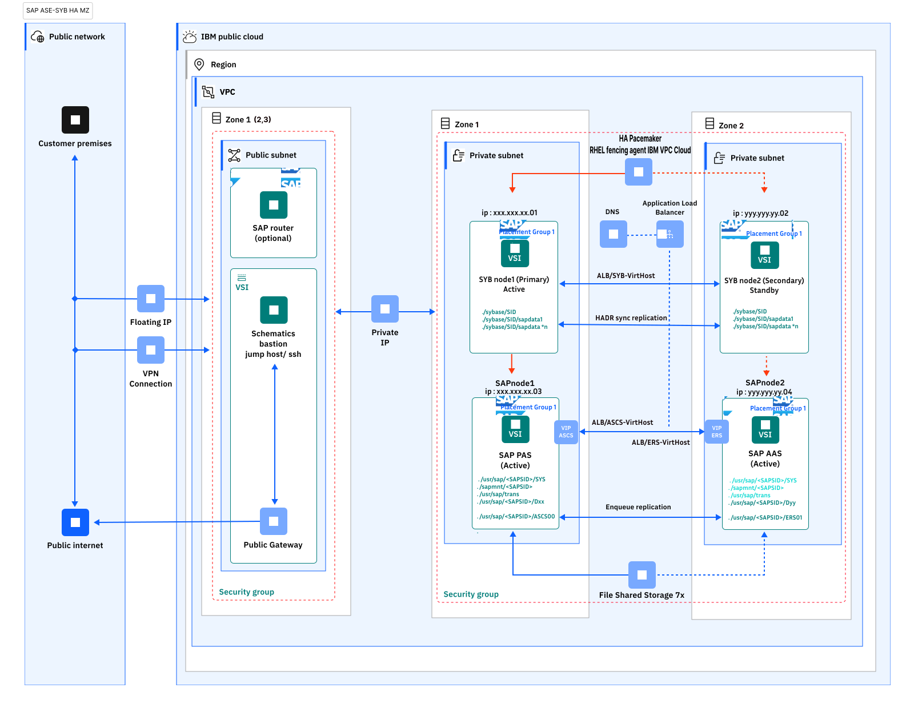

---

copyright:
  years: 2023, 2024
lastupdated: "2024-12-13"

subcollection: sap

---

{:external: target="_blank" .external}
{:shortdesc: .shortdesc}
{:screen: .screen}
{:pre: .pre}
{:note: .note}
{:table: .aria-labeledby="caption"}
{:codeblock: .codeblock}
{:tip: .tip}
{:ui: .ph data-hd-interface="ui"}
{:terraform: .ph data-hd-interface="terraform"}

# Automating SAP workload SAP NetWeaver(ABAP) 7.5 on ASE Sybase HA deployment on IBM Cloud VPC with Terraform and Ansible
{: #automate-sap-ase-sybase-ha-sz-delpoyment-intro}

Terraform on {{site.data.keyword.cloud}} enables predictable and consistent provisioning of {{site.data.keyword.cloud}} Virtual Private Cloud (VPC) infrastructure resources so that you can rapidly build complex cloud environments. {{site.data.keyword.cloud}} VPC infrastructure consists of SAP certified hardware that uses Intel&reg; Xeon CPUs and other Intel&reg; technologies.

You can use Terraform scripts to create a VPC and create 2 clustered layers, one for SAP NetWeaver (ABAP) and the second for SAP ASE Sybase in-memory database in a HA Single Zone or Multi Zone architecture on the bastion server. Creating the bastion server is a prerequisite for all IBM SAP VPC automated solutions. The automation scripts use the VPC information that you provide and then call the Ansible playbook to create the SAP architecture on the specified VPC.

You have two deployment methods to choose from:

* Terraform scripts that run from the CLI on your bastion server.
* {{site.data.keyword.bpshort}} user interface accessed from your cloud dashboard menu.

## Terraform scripts include
{: #automate-sap-ase-sybase-ha-sz-delpoyment-scripts}
{: terraform}

The terraform scripts that are included for deploying are:

* One Placement group to include all the four VMs involved in this solution.
* Four VSIs in an existing VPC with subnet and security group configurations.
    * Two for the ASE Sybase database cluster instance
    * Two for the SAP application cluster
* Configuring three Application Load Balancers like ASE Sybase DB and SAP ASCS/ERS.
* Configuring one VPC DNS service used to map the ALB FQDN to the SAP ASCS/ERS and ASE Sybase virtual hostnames.
* Configuring seven file shares for VPC.

The ansible scripts that are included are:

* OS requirements for installation and configuration of SAP applications.
* Cluster components installation.
* Ansible scripts for SAP application cluster configuration and SAP ASE Sybase cluster configuration.
* ASE Sybase installation
* ASE Sybase db backup
* ASE Sybase system replica configuration
* ASCS and ERS instances installation
* DB load
* Primary and extra application servers installation

Ansible is started by Terraform and must be available on the same host.
{: note}

## SAP Solution implemented
{: #automate-sap-ase-sybase-ha-sz-delpoyment-solution}
{: terraform}

SAP NetWeaver is the core foundation of the SAP technology stacks and is the platform that is used for ABAP and Java applications. The SAP system can be installed and configured in {{site.data.keyword.cloud}} for various system and database types.

For more information about SAP system architectures on {{site.data.keyword.cloud}} VPC, see the infrastructure reference architectures for SAP for each supported database type. For example, [SAP NetWeaver 7.x on UNIX with ASE SYB on {{site.data.keyword.cloud}} VPC](https://cloud.ibm.com/docs/sap?topic=sap-sap-refarch-nw-sybase){: external} is the dedicated reference architecture for this SAP solution.

Manually deploying a VPC and installing an SAP system can be time-consuming. The terraform automation assures not only a quicker implementation, but also a standardized and less error-prone deployment. Terraform and Ansible are used for automating the deployment processes.

The terraform scripts solution provides the automated deployment of a single host with SAP NetWeaver with ASE SYB on the Red Hat Enterprise Linux 8 and SUSE 15 for SAP Applications.

The SAP installation media that is used for this deployment are the default media for SAP NetWeaver 7.5 with ASE SYB 16.0. The media are available at the SAP Support Portal under the Installation and Upgrade area. You provide the installation media as an input parameter for Terraform.

An ERP system is used for demand-oriented business resource planning. It is used to control processes and to link departments and functional areas in a meaningful way. Individual modules include applications for accounting, sales, production, and marketing. More complex tasks in customer or supply chain management can also be done by ERP software. As the successor to the core product SAP ECC, SAP NetWeaver was presented as the intelligent ERP system of the new generation. Thanks to modern technologies, the Software-as-a-Service (SaaS) version is designed to help companies standardize processes and make the leap to digitalization.

## What is created
{: #automate-sap-ase-sybase-ha-sz-delpoyment-components}
{: terraform}

The scripts work in two phases. The first phase automates creating the resources for the VPC provisioning process in an existing VPC created when you deployed the bastion VSI. The second phase creates the SAP architecture in a distributed environment. This phase creates the:

* SAP HA SAP NetWeaver App cluster server on a distinct VSI as a single zone or multi zone VPC.
* SAP ASE Sybase cluster DB on a dedicated server type VSI as a single zone or multi zone VPC.

For more information about this architecture, see [SAP NetWeaver 7.x with SAP ASE Sybase {{site.data.keyword.cloud}} VPC](https://cloud.ibm.com/docs/sap?topic=sap-sap-refarch-nw-hana&interface=ui){: external}.

During the first phase, the VPC is provisioned with these components:

*	1 VPC where the virtual server instances are provisioned
*	1 security group. The rules for this security group allow:
    - Inbound DNS (port 53) and
    - Inbound SSH (TCP port 22) connections to your virtual server instance
    - All outbound traffic from the virtual server instance
*	1 subnet to enable networking in your VPC
*	2 X virtual server instances with SAP certified storage and network configurations
*	2 floating IP’s address that you use to access your VPC virtual server instance over the public network

During the second phase, the Ansible Playbook is called and the SAP High availability architecture is installed for both dedicated VSIs SAP App VSI system and dedicated SAP ASE Sybase VSI box. The SAP architecture that is deployed is the SAP NetWeaver release on pacemaker cluster HA dedicated SAP ASE Sybase 16 SP0+VSI’s release as a distributed deployment model. For more information about this architecture, see [Automating SAP ASE Sybase stand-alone virtual server instance on {{site.data.keyword.cloud}} VPC by using Terraform and Ansible](https://cloud.ibm.com/docs/sap?topic=sap-automate-terraform-sap-hana-vsi){: external}.

## Highly available system for SAP ASE Sybase database
{: #automate-sap-ase-sybase-ha-sz-delpoyment-database}
{: terraform}

{: caption="SAP NetWeaver ASE Sybase HA on VPC distributed in two zones" caption-side="bottom"}

At the most basic level, a standard HA ASE Sybase cluster in an active-passive configuration has two nodes: one is the primary node and the other is the standby node. The primary node is actively serving the active SAP instances (PAS and AAS), while the standby node is waiting to jump in if necessary.

The cluster is set with a virtual hostname IP. Hostname is mapped to the FQDN of the ASE Sybase ALB through DNS, which is the same as SAP ASCS and ERS instances. App instances (PAS and AAS), are the details to be used on the SAP profiles to call that particular component. The cluster assigns that virtual IP to the active node and uses a heartbeat monitor to confirm the availability of the components. If the primary node stops responding, it triggers the automatic failover mechanism that calls the standby node to become the primary node. The ALB detects the change, redirects the traffic to the new active node, and assigns the virtual IP to it, restoring the component availability. After the failed node is fixed, it comes online as a standby node.

## Terraform deployment overview
{: #automate-sap-ase-sybase-ha-sz-delpoyment-terraform-overview}
{: terraform}

You use Terraform on the bastion server CLI to download and run the scripts that are located [here](https://github.com/IBM-Cloud/sap-nwase-ha/tree/main){: external}.

To run the Terraform scripts, you modify:

* The `input.auto.tfvars` file to specify the information for your solution:
    * Enter the floating IP and subnet information from the bastion server.
    * Enter existing VPC information:
        * VPC name
        * Security group
        * Subnet
        * Hostname
        * Profile
        * Image
        * Up to two SSH keys
    * You can change the default SAP system configuration settings to match your solution.
    * You also specify the location where you downloaded the SAP kits.

The {{site.data.keyword.cloud}} Provider plug-in for Terraform on {{site.data.keyword.cloud}} uses these configuration files to install SAP NetWeaver High Availability on Single Zone or Multi Zone on the specified VPC in your {{site.data.keyword.cloud}} account.

## SAP Kits
{: #automate-sap-ase-sybase-ha-sz-delpoyment-sap-kits}
{: terraform}

For each {{site.data.keyword.cloud}} region, IBM allocates temporary storage on a dedicated Jump host. It is your responsibility to download the necessary SAP and DB kits to your Deployment Server. All files archives are decompressed by Ansible during the automation deployment process. For more information, see the [Readme](https://github.com/IBM-Cloud/sap-nwase-ha/blob/main/README.md){: external} file.

## Before you begin
{: #automate-sap-ase-sybase-ha-sz-delpoyment-before}
{: terraform}

Before you deploy SAP NetWeaver High Availability on Single Zone or Multi Zone:

* The automation for this deployment requires {{site.data.keyword.cloud}} File Storage for VPC to complete successfully. {{site.data.keyword.cloud}} File Storage for VPC is available for customers with special approval to preview this service in the Frankfurt, London, Dallas, Toronto, Washington, Sao Paulo, Sydney, Osaka, and Tokyo regions. Contact your IBM Sales representative to get access. For more information, see [{{site.data.keyword.cloud}} File Storage for VPC](https://cloud.ibm.com/docs/vpc?topic=vpc-file-storage-vpc-about){: external}.
* Set up your account to access the VPC. Make sure that your account is [upgraded to a paid account](https://cloud.ibm.com/docs/account?topic=account-accountfaqs#changeacct){: external}.
* If you have not already, create a bastion server to store the SAP kits. For more information, see [Automate SAP bastion server - SAP media storage repository](https://cloud.ibm.com/docs/sap?topic=sap-sap-bastion-server. You need the floating IP from your bastion server for deployment.
* Download the SAP kits from the SAP Portal to your Deployment Server. Make note of the download locations. Ansible decompresses the files. For more information, see the [Readme](https://github.com/IBM-Cloud/sap-nwase-ha/blob/main/README.md) file, in the respective GitHub repository for [Schematics](https://github.com/IBM-Cloud/sap-s4hana-sz-ha/tree/main) and [Terraform](https://github.com/IBM-Cloud/sap-s4hana-sz-ha){: external} and on the About page.
* [Create or retrieve an {{site.data.keyword.cloud}} API key](https://cloud.ibm.com/docs/account?topic=account-userapikey&interface=ui#create_user_key){: external}. The API key is used to authenticate with the {{site.data.keyword.cloud}} platform and to determine your permissions for {{site.data.keyword.cloud}} services.
* [Create or retrieve your SSH key ID](https://cloud.ibm.com/docs/ssh-keys?topic=ssh-keys-getting-started-tutorial){: external}. You need the 40-digit UUID for the SSH key, not the SSH key name.

## Deploying SAP HA SAP NetWeaver by using Terraform with the bastion server CLI
{: #automate-sap-ase-sybase-ha-sz-delpoyment-bastion-server}
{: terraform}

Use these steps to configure the {{site.data.keyword.cloud}} Provider plug-in and use Terraform to install SAP HA SAP NetWeaver on your existing VPC. The scripts can take 1 - 2 hours to complete.

1. Access the bastion server cli.
2. Clone the solution repository as:

    ```sh
    git clone https://github.com/IBM-Cloud/sap-nwase-ha.git

    cd sap-nwase-ha
    ```

3. Specify your VPC. Modify the `input.auto.tfvars` file to specify the information for the existing VPC, your zone, VPC and component names, profile, and image.
  You need your 40-digit SSH key ID for this file. The second SSH key is optional.

  For more options for profile, see [Instance Profiles](https://cloud.ibm.com/docs/vpc?topic=vpc-profiles){: external}.
  For more options for images, see [Images](https://cloud.ibm.com/docs/vpc?topic=vpc-about-images){: external}.
  For descriptions of the variables, see the [Readme](https://github.com/IBM-Cloud/sap-nwase-ha/blob/main/README.md){: external} file.

### General VPC variables
{: terraform}

4. REGION = "eu-de"
   Region for the VSI. Supported regions: https://cloud.ibm.com/docs/containers?topic=containers-regions-and-zones#zones-vpc
   Example: REGION = "eu-de"

5. ZONE_1 = "eu-de-1"
   Availability zone for VSI. Supported zones: https://cloud.ibm.com/docs/containers?topic=containers-regions-and-zones#zones-vpc
   Example: ZONE = "eu-de-1"

6. ZONE_2 = "eu-de-2"
   Availability zone for VSI. Supported zones: https://cloud.ibm.com/docs/containers?topic=containers-regions-and-zones#zones-vpc
   Example: ZONE = "eu-de-2"

7. DOMAIN_NAME = "example.com"
   The DOMAIN_NAME variable should contain at least one "." as a separator. It is a private domain and it is not reachable to and from the outside world.
   The DOMAIN_NAME variable might be like a subdomain name. Example: staging.example.com
   Domain names can only use letters, numbers, and hyphens.
   Hyphens cannot be used at the beginning or end of the domain name.
   You can't use a domain name that is already in use.
   Domain names are not case-sensitive.

8. ASCS_VIRT_HOSTNAME = "sapascs"
   ASCS Virtual hostname
   Default =  "sap($your_sap_sid)ascs"

9. ERS_VIRT_HOSTNAME =  "sapers"
   ERS Virtual hostname
   Default =  "sap($your_sap_sid)ascs"

10. ASE_SYBASE_VIRT_HOSTNAME = "dbASE Sybase"
   ASE Sybase Virtual hostname
   Default = "db($your_ASE SYBASE_sid)ASE Sybase"

11. VPC = "ic4sap"
   EXISTING VPC, previously created by the user in the same region as the VSI. The list of available VPCs: https://cloud.ibm.com/infrastructure/network/vpcs
   Example: VPC = "ic4sap"

12. SECURITY_GROUP = "ic4sap-securitygroup"
   EXISTING Security group, previously created by the user in the same VPC. The list of available Security Groups: https://cloud.ibm.com/infrastructure/network/securityGroups
   Example: SECURITY_GROUP = "ic4sap-securitygroup"

13. RESOURCE_GROUP = "wes-automation"
   EXISTING Resource group, previously created by the user. The list of available Resource Groups: https://cloud.ibm.com/account/resource-groups
   Example: RESOURCE_GROUP = "wes-automation"

14. SUBNET = "ic4sap-subnet"
   EXISTING Subnet in the same region and zone as the VSI, previously created by the user. The list of available Subnets: https://cloud.ibm.com/infrastructure/network/subnets
   Example: SUBNET = "ic4sap-subnet"

15. SSH_KEYS = [ "r010-57bfc315-f9e5-46bf-bf61-d87a24a9ce7a", "r010-3fcd9fe7-d4a7-41ce-8bb3-d96e936b2c7e" ]
   List of SSH Keys UUIDs that are allowed to SSH as root to the VSI. The SSH Keys should be created for the same region as the VSI. The list of available SSH Keys UUIDs: https://cloud.ibm.com/infrastructure/compute/sshKeys
   Example: SSH_KEYS = ["r010-8f72b994-c17f-4500-af8f-d05680374t3c", "r011-8f72v884-c17f-4500-af8f-d05900374t3c"]

### File share variables
{: terraform}

    share_profile = "tier-5iops"
    Enter the IOPs (IOPS per GB) tier for File Share storage. Valid values are 3, 5, and 10.

  File shares sizes:
  USRSAP_AS1      = "20"
  USRSAP_AS2      = "20"
  USRSAP_SAPASCS  = "20"
  USRSAP_SAPERS   = "20"
  USRSAP_SAPMNT   = "20"
  USRSAP_SAPSYS   = "20"
  USRSAP_TRANS    = "80"
  Enter Custom File Shares sizes for SAP mounts.

### DB VSI variables
{: terraform}

1. DB_HOSTNAME-1 = "sybdb-1"
   ASE Sybase Cluster VSI1 hostname.
   The hostname for the primary Sybase DB VSI server. The hostname should be up to 13 characters, as required by SAP
   Default: DB-HOSTNAME-1 = "ASE SYBASEdb-$your_ASE SYBASE_sid-1"

2. DB_HOSTNAME-2 = "sybdb-2"
   ASE Sybase Cluster VSI2 hostname.
   The hostname for the standby (companion) Sybase DB VSI server. The hostname should be up to 13 characters, as required by SAP
   Default: DB-HOSTNAME-2 = "ASE SYBASEdb-$your_ASE SYBASE_sid-2"

3. DB_PROFILE = "bx2-4x16"
   The DB VSI profile. Supported profiles for DB VSI: bx2-4x16. The list of available profiles: https://cloud.ibm.com/docs/vpc?topic=vpc-profiles&interface=ui

4. DB_IMAGE = "ibm-redhat-8-6-amd64-sap-hana-4"
   OS image for DB VSI. Supported OS images for DB VSIs: ibm-redhat-8-4-amd64-sap-hana-4
   The list of available VPC Operating Systems supported by SAP: SAP note '2927211 - SAP Applications on IBM Virtual Private Cloud (VPC) Infrastructure environment' https://launchpad.support.sap.com/#/notes/2927211; The list of all available OS images: https://cloud.ibm.com/docs/vpc?topic=vpc-about-images
   Example: DB-IMAGE = "ibm-redhat-8-4-amd64-sap-hana-4"

### SAP APP VSI variables
{: terraform}

1. APP_HOSTNAME-1 = "sapapp-1"
   SAP Cluster VSI1 hostname.
   The hostname for the SAP APP VSI. The hostname should be up to 13 characters, as required by SAP
   Default: APP-HOSTNAME-1 = "sapapp-$your_sap_sid-1"

2. APP_HOSTNAME-2 = "sapapp-2"
   SAP Cluster VSI2 hostname.
   The hostname for the SAP APP VSI. The hostname should be up to 13 characters, as required by SAP
   Default: APP-HOSTNAME-2 = "sapapp-$your_sap_sid-2"

3. APP_PROFILE = "bx2-4x16"
   The APP VSI profile. Supported profiles: bx2-4x16. The list of available profiles: https://cloud.ibm.com/docs/vpc?topic=vpc-profiles&interface=ui

4. APP_IMAGE = "ibm-redhat-8-4-amd64-sap-hana-4"
   OS image for SAP APP VSI. Supported OS images for APP VSIs: ibm-redhat-8-4-amd64-sap-hana-4.
   The list of available VPC Operating Systems supported by SAP: SAP note '2927211 - SAP Applications on IBM Virtual Private Cloud (VPC) Infrastructure environment' https://launchpad.support.sap.com/#/notes/2927211; The list of all available OS images: https://cloud.ibm.com/docs/vpc?topic=vpc-about-images
   Example: APP-IMAGE = "ibm-redhat-8-4-amd64-sap-hana-4"

Customize your SAP system configuration. In `input.auto.tfvars` file, edit the SAP system configuration variables that are passed to the Ansible automated deployment. For descriptions of the variables, see the [Readme](https://github.com/IBM-Cloud/sap-nwase-ha/blob/main/README.md){: external} file.

## SAP system configuration
{: terraform}

1. SAP_SID = "NWD"
   SAP System ID
   Obs. This is used as identification number across different HA name resources. Duplicates are not allowed.

2. SAP_ASCS_INSTANCE_NUMBER = "00"
   The central ABAP service instance number. Should follow the SAP rules, for instance, number naming.
   Example: sap_ascs_instance_number = "00"

3. SAP_ERS_INSTANCE_NUMBER = "01"
   The enqueue replication server instance number. Should follow the SAP rules, for instance, number naming.
   Example: sap_ers_instance_number = "01"

4. SAP_CI_INSTANCE_NUMBER = "10"
   The primary application server instance number. Should follow the SAP rules, for instance, number naming.
   Example: sap_ci_instance_number = "10"

5. SAP_AAS_INSTANCE_NUMBER = "20"
   The additional application server instance number. Should follow the SAP rules, for instance, number naming.
   Example: sap_aas_instance_number = "20"

6. HDB_CONCURRENT_JOBS = "23"
   Number of concurrent jobs used to load and/or extract archives to ASE Sybase Host

### SAP NetWeaver application kit paths
{: terraform}

1. KIT_SAPCAR_FILE = "/storage/NW75SYB/SAPCAR_1010-70006178.EXE"
2. KIT_SWPM_FILE =  "/storage/NW75SYB/SWPM10SP38_0-20009701.SAR"
3. KIT_SAPHOSTAGENT_FILE = "/storage/NW75SYB/SAPHOSTAGENT61_61-80004822.SAR"
4. KIT_SAPEXE_FILE = "/storage/NW75SYB/KERNEL/754UC/SAPEXE_200-80007612.SAR"
5. KIT_SAPEXEDB_FILE = "/storage/NW75SYB/KERNEL/754UC/SAPEXEDB_200-80007655.SAR"
6. KIT_IGSEXE_FILE = "/storage/NW75SYB/KERNEL/754UC/igsexe_2-80007786.sar"
7. KIT_IGSHELPER_FILE = "/storage/NW75SYB/igshelper_17-10010245.sar"
8. KIT_ASE_FILE = "/storage/NW75SYB/51056521_1_16_0_04_04.ZIP"
9. KIT_NWABAP_EXPORT_FILE = "/storage/NW75SYB/ABAPEXP/51050829_3.ZIP"

4. Ansible decompresses the rest of the SAP kit files. For more information, see the [Readme](https://github.com/IBM-Cloud/sap-nwase-ha/blob/main/README.md){: external} file.
5. Initialize the Terraform CLI.
6. `terraform init`
7. Create a terraform execution plan. The Terraform execution plan summarizes all the actions that are done to create the virtual private cloud instance in your account.
8. `terraform plan --out plan1`

Enter an SAP main password and your API key.

For SAP main password:
* It must be 15 to 30 characters long.
* It must contain at least one digit (0-9)
* It must contain at least one lowercase letter (a-z)
* It must contain at least one uppercase letter (A-Z)
* It may contain one of the following special characters: !, #, $, &, , +, ,, -, ., /, :, =>, @, ^, _,

9. Verify that the plan shows all the resources that you want to create and that the names and values are correct. If the plan needs to be adjusted, edit the `input.auto.tfvars` file to correct resources and run terraform plan again.
10. Create the VPC for SAP instance and IAM access policy in {{site.data.keyword.cloud_notm}}.
11. `terraform apply "plan1"`
The VPC and components are created and you see output similar to the terraform plan output.
12. Add the SAP credentials and the virtual server instance IP to the SAP GUI. For more information about the SAP GUI, see [SAP GUI](https://help.sap.com/docs/ABAP_PLATFORM_NEW/b1c834a22d05483b8a75710743b5ff26/9ad405e746ef43288755cb80a14be542.html){: external}.

## Deploying SAP NetWeaver(ABAP) 7.5 on ASE SYBASE High Availability on Single Zone or Multi Zone with the Schematics interface
{: #automate-sap-ase-sybase-ha-sz-delpoyment-schematics-interface}
{: ui}

Use these steps to configure the SAP NetWeaver(ABAP) 7.5 on ASE SYBASE High Availability on Single Zone or Multi Zone on your existing VPC by using the Schematics interface. The scripts can take 2 - 3 hours to complete. See the [readme](https://github.com/IBM-Cloud/sap-nwhana-ha/blob/main/README.md) file for recommended kits versions.

1.	From the {{site.data.keyword.cloud_notm}} menu, select **{{site.data.keyword.bpshort}}**.
2.	Click **Create workspace**.
3.	On the **Specify template** page:
    *   Enter the [GitHub repository URL](https://github.com/IBM-Cloud/sap-nwhana-ha){: external} that contains the {{site.data.keyword.bpshort}} code for this offering.
    *   Select the **Terraform version**.
    *   Click **Next**.
4.	On the **Workspace details** page:
    *   Enter a name for the workspace.
    *   Select a **Resource group**.
    *   Select a **Location** for your workspace. The workspace location does not have to match the resource location.
    *   Select **Next**.
5.	Select **Create** to create your workspace.
6.	On the workspace Settings page, in the Input variables section, review the default input variables and provide values that match your solution.

    For more detailed description of each of these parameters, check the GitHub repo readme file, chapter “Input parameter file”. Also, make sure to mark the parameters that contain sensitive information like passwords, API, and ssh private keys as "sensitive". These parameters are marked as “sensitive” in the readme file, under “Input parameter file”.

    Save each parameter that you modify.

    |Parameter	|Description|
    |-----|-----|
    |APP_HOSTNAME_1	|APP VSI hostname-1|
    |APP_HOSTNAME_2	|APP VSI hostname-2|
    |BASTION_FLOATING_IP	|Input the floating IP of the Bastion Server that you created before you started this deployment. For more information, see [Automate SAP bastion server - SAP media storage](/docs/sap?topic=sap-sap-bastion-server).|
    |DB_HOSTNAME_1	|DB VSI hostname-1|
    |DB_HOSTNAME_2	|DB VSI hostname-2|
    |DOMAIN_NAME	|Private Domain Name|
    |REGION	|Cloud Region where resources are deployed |
    |RESOURCE_GROUP	|EXISTING Resource Group for VSIs and Volumes |
    |SECURITY_GROUP	|EXISTING Security group name |
    |SSH_KEYS	|SSH Keys ID list to access the VSI|
    |SUBNET	|EXISTING Subnet name |
    |VPC	|EXISTING VPC name |
    |ZONE	|Cloud Zone where resources are deployed
    |HA_PASSWORD	|HA cluster password |
    |IBMCLOUD_API_KEY	|{{site.data.keyword.cloud_notm}} API key or use a secret stored in Secrets Manager|
    |PRIVATE_SSH_KEY	|Input id_rsa private key content or use a secret stored in Secrets Manager|
    |SAP_MAIN_PASSWORD	|SAP main password or use a secret stored in Secrets Manager |
    |SAP_SID	|SAP sid |

    * Review and update the optional input variables. The Ansible scripts expect the SAP kits to be in the default locations listed. For more information, see the [Readme file - Input Parameters](https://github.com/IBM-Cloud/sap-nwase-ha/blob/main/README.md){: external}.

    |Parameter	|Description|
    |-----|-----|
    |APP_IMAGE	|APP VSI OS image|
    |APP_PROFILE	|APP VSI profile|
    |ASCS_VIRT_HOSTNAME	|ASCS Virtual hostname|
    |DB_IMAGE	|DB VSI OS image|
    |DB_PROFILE	|DB VSI profile|
    |ERS_VIRT_HOSTNAME	|ERS Virtual hostname|
    |KIT_HDBCLIENT_FILE	|kit_hdbclient_file|
    |KIT_IGSEXE_FILE	|kit_igsexe_file|
    |KIT_IGSHELPER_FILE	|kit_igshelper_file|
    |KIT_S4ASE_SYBASE_EXPORT	|kit_s4ASE SYBASE_export|
    |KIT_SAPCAR_FILE	|kit_sapcar_file|
    |KIT_SAPEXE_FILE	|kit_sapexe_file|
    |KIT_SAPEXEDB_FILE	|kit_sapexedb_file|
    |KIT_SAPASE_FILE	|kit_sapASE SYBASE_file|
    |KIT_SAPHOTAGENT_FILE	|kit_saphotagent_file|
    |KIT_SWPM_FILE	|kit_swpm_file|
    |SAP_AAS_INSTANCE_NUMBER	|sap_aas_instance_number|
    |SAP_ASCS_INSTANCE_NUMBER	|sap_ascs_instance_number|
    |SAP_CI_INSTANCE_NUMBER	|sap_ci_instance_number|
    |SAP_ERS_INSTANCE_NUMBER	|sap_ers_instance_number|
    |SHARE_PROFILE	|Enter the IOPs (IOPS per GB) tier for File Share storage. Valid values are 3, 5, and 10.|
    |USRSAP_AS1	|FS Size in GB for usrsap-as1|
    |USRSAP_AS2	|FS Size in GB for usrsap-as2|
    |USRSAP_SAPASCS	|FS Size in GB for usrsap-sapascs|
    |USRSAP_SAPERS	|FS Size in GB for usrsap-sapers|
    |USRSAP_SAPSYS	|FS Size in GB for usrsap-sapsys|
    |USRSAP_TRANS	|FS Size in GB for usrsap-trans|

7.	On the workspace settings page, click **Generate plan**. Wait for the plan to complete.
8.	Click **View log** to review the log files of your Terraform execution plan.
9.	Apply your Terraform template by clicking **Apply plan**.
10.	Review the log file to ensure that no errors occurred during the provisioning, modification, or deletion process.

## Support
{: #automate-sap-ase-sybase-ha-sz-delpoyment-support}

There are no warranties of any kind, and there is no service or technical support available for these materials from {{site.data.keyword.IBM}}. As a recommended practice, review carefully any materials that you download from this site before using them on a live system.

Though the materials provided herein are not supported by the {{site.data.keyword.IBM}} Service organization, your comments are welcomed by the developers, who reserve the right to revise, readapt or remove the materials at any time. To report a problem, or provide suggestions or comments, open a GitHub issue.

## Related information
{: #automate-sap-ase-sybase-ha-sz-delpoyment-related}

For more information about Terraform on {{site.data.keyword.cloud_notm}}, see [Getting started with Terraform on {{site.data.keyword.cloud_notm}}](/docs/ibm-cloud-provider-for-terraform?topic=ibm-cloud-provider-for-terraform-getting-started).

For more information about using Terraform for creating only a VPC for SAP, without the SAP architecture, see [Creating single-tier virtual private cloud for SAP by using Terraform](/docs/sap?topic=sap-create-terraform-single-tier-vpc-sap).

SAP One Support Notes that apply to this document:

* [SAP Note 84555 - Windows Server, Linux&reg;, and UNIX: Certified hardware](https://launchpad.support.sap.com/#/notes/84855){: external}
* [SAP Note 2927211 - SAP Applications on {{site.data.keyword.cloud_notm}} Virtual Private Cloud (VPC) Infrastructure environment](https://launchpad.support.sap.com/#/notes/2927211){: external}
* [SAP Note 2923773 - Linux&reg; on {{site.data.keyword.cloud_notm}} (IaaS): Adaption of your SAP License](https://launchpad.support.sap.com/#/notes/2923773){: external}
* [SAP Note 2414097 - SAP Applications on {{site.data.keyword.cloud_notm}} Classic Infrastructure environment](https://launchpad.support.sap.com/#/notes/2414097){: external}
* [SAP Note 2369910 - SAP Software on Linux&reg;: General information](https://launchpad.support.sap.com/#/notes/2369910){: external}
* [SAP Note 171380 - Released IBM hardware (Intel processors) and IBM cloud services offers](https://launchpad.support.sap.com/#/notes/171380){: external}
* [SAP Note 1380654 - SAP support in IaaS environments](https://launchpad.support.sap.com/#/notes/1380654){: external}

This document is referenced by:

* [SAP Note 2927211 - SAP Applications on {{site.data.keyword.cloud_notm}} Virtual Private Cloud (VPC) Infrastructure environment](https://launchpad.support.sap.com/#/notes/2927211){: external}
* [SAP Note 2588225 - SAP on {{site.data.keyword.cloud_notm}}: Protect against speculative execution vulnerabilities](https://launchpad.support.sap.com/#/notes/2588225){: external}
* [SAP Note 1380654 - SAP support in IaaS environments](https://launchpad.support.sap.com/#/notes/1380654){: external}
* [SAP Note 2414097 - SAP Applications on {{site.data.keyword.cloud_notm}} Classic Infrastructure environment](https://launchpad.support.sap.com/#/notes/2414097){: external}
