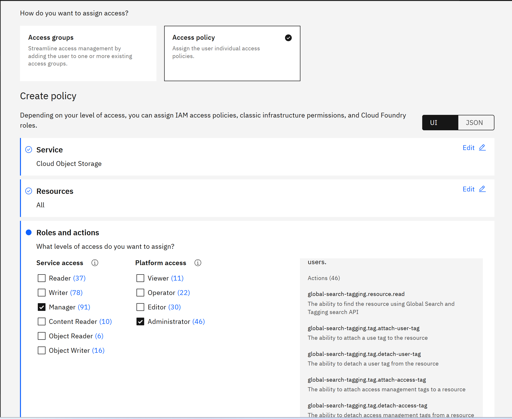

---

copyright:
  years: 2023, 2025
lastupdated: "2025-02-05"

subcollection: sap

---

{:external: target="_blank" .external}
{:shortdesc: .shortdesc}
{:screen: .screen}
{:pre: .pre}
{:note: .note}
{:important: .important}
{:table: .aria-labeledby="caption"}
{:codeblock: .codeblock}
{:tip: .tip}
{:ui: .ph data-hd-interface="ui"}
{:terraform: .ph data-hd-interface="terraform"}

# Deploying SAP HANA db backup to Cloud Object Storage on existing {{site.data.keyword.cloud_notm}} VPC with automation
{: #sap-automate-hana-db-backup-cos-deploy}

You can use Terraform scripts to create the required setup for storing HANA db backup in IBM Cloud Object Storage (COS), in case of a HANA database instance that is already deployed in the VPC. The Terraform scripts use the VPC information that you provide and then call the Ansible playbooks to create the SAP architecture on the specified VPC. Terraform on {{site.data.keyword.cloud_notm}} enables predictable and consistent provisioning of {{site.data.keyword.cloud_notm}} Virtual Private Cloud (VPC) infrastructure resources so that you can rapidly build complex cloud environments. {{site.data.keyword.cloud_notm}} VPC infrastructure consists of SAP certified hardware that uses Intel&reg; Xeon CPUs and additional Intel&reg; technologies.
{: shortdesc}

You have two deployment methods to choose from:

* Terraform scripts run from the CLI on your deployment server (bastion server).
* {{site.data.keyword.bpshort}} user interface accessed from your cloud dashboard menu.

You can store the SAP HANA db backup into the Cloud Object Storage.

## SAP solution implemented
{: #sap-hana-db-backup-cos-proc}

{: caption="Backup SAP HANA db into Cloud Object Storage from a standard SAP NW on HANA db architecture" caption-side="bottom"}

## What is created
{: #sap-hana-db-backup-cos-created}

This automation solution is designed for the implementation of SAP HANA Backup solution that uses Backint and [{{site.data.keyword.cloud_notm}} Object Storage](https://cloud.ibm.com/docs/cloud-object-storage?topic=cloud-object-storage-getting-started-cloud-object-storage){: external}. It is based on SAP note "2935898 - Install and Configure SAP HANA Backint Agent for Amazon S3".

The minimum version of SAP HANA Backint Agent for Amazon S3 to be used for {{site.data.keyword.cloud_notm}} Object Storage is 1.2.17. SAP HANA Backint Agent for Amazon S3 requires Python 3.7 including SSL support. The Python package delivered as part of the SAP HANA 2 installation does not include SSL support. Python 3.7 with SSL support is installed in /usr/local/bin directory, if it is not previously installed. SAP HANA Backint Agent for Amazon S3 is installed in the `/hana/shared/< SID >/backint_agent` directory.

The setup runs initial full data backup to Cloud Object Storage for system and tenant databases. The regular backup policy for the databases must be configured by the customer.

All data backup, log backup, and catalog backup files are saved in the same dedicated bucket (with no enforced storage quota) created in a Cloud Object Storage instance by using an existing bastion host with secure remote SSH access in the same {{site.data.keyword.cloud_notm}} Gen2 VPC as the SAP HANA system. The setup uses the Regional Storage Class with the Smart Tier pricing option and the standard pricing plan. The SAP HANA system is deployed on one of the following operating systems:

* SUSE Linux Enterprise Server 15 SP 4 for SAP
* SUSE Linux Enterprise Server 15 SP 3 for SAP
* Red Hat Enterprise Linux 8.6 for SAP
* Red Hat Enterprise Linux 8.4 for SAP

## Script files
{: #sap-hana-db-backup-cos-script-files}
{: terraform}

The configuration and script files are available in GitHub.
[GitHub repository for Terraform - HANA backup Cloud Object Storage](https://github.com/IBM-Cloud/sap-hana-backup-cos){: external}

## Schematics deployment
{: #sap-hana-db-backup-cos-schematics}
{: ui}

The configuration and script files are provided in [GitHub](https://github.com/IBM-Cloud/sap-hana-backup-cos){: external}.
When the {{site.data.keyword.bpshort}} interface is used, the following information should be provided:

* the workspace information.
* the GitHub path for the solution.
* the values for the parameters in the {{site.data.keyword.bpshort}} interface; they are the same as the parameters from `input.auto.tfvars` file, which are used in CLI.

## Terraform interface
{: #sap-hana-db-backup-terraform-interface}
{: terraform}

To run the Terraform script, you should modify:

* The `input.auto.tfvars` file, to specify the existing VPC resources for your solution. You should provide the values for the following variables:
    * VPC name
    * Region
    * Security group
    * Subnet
    * Resource Group
    * HostName(s)
    * Setup for HA
    * Number of backup retention days

You can change the default SAP system configuration settings to match your solution. You also specify the location where you downloaded the SAP kits.

The {{site.data.keyword.cloud_notm}} Provider plug-in for Terraform on {{site.data.keyword.cloud_notm}} uses these configuration files and the Ansible playbooks to store the HANA db backup into Cloud Object Storage for an already installed HANA database instance, in the specified VPC, in your {{site.data.keyword.cloud_notm}} account.

## Support
{: #sap-hana-db-backup-support-terraform}

There are no warranties of any kind, and there is no service or technical support available for these materials from {{site.data.keyword.IBM}}. As a recommended practice, review carefully any materials that you download from this site before you use them on a live system.

Though the materials provided herein are not supported by the IBM® Service organization, your comments are welcomed by the developers, who reserve the right to revise, readapt or remove the materials at any time. To report a problem, or provide suggestions or comments, open a GitHub issue.

## Virtual server instance configuration
{: #sap-hana-db-backup-cos-vsi-config}
{: ui}

This solution is applied on existing VSIs with SAP HANA deployed in an existing VPC. See below for more information:

* https://github.com/IBM-Cloud/sap-netweaver-abap-hana
* https://github.com/IBM-Cloud/sap-netweaver-java-hana
* https://github.com/IBM-Cloud/sap-s4hana
* https://github.com/IBM-Cloud/sap-bw4hana
* https://github.com/IBM-Cloud/sap-netweaver-abap-hana
* https://github.com/IBM-Cloud/sap-s4hana-ha

## Before you begin
{: #sap-hana-db-backup-cos-before}
{: ui}

Before you use the scripts:

* An SAP HANA system that is built on one of the above OS should be deployed in an IBM Cloud Gen2 VPC, on a single host with or without HA.

* A bastion server with secure remote SSH access must be deployed in the same region and zone of {{site.data.keyword.cloud_notm}} Gen2 VPC as the SAP HANA system.

* A pair of SSH keys used to run the automation for the backup configuration should be available. The public SSH key should be manually added on SAP HANA VSI in `/root/.ssh/authorized_keys` and uploaded in {{site.data.keyword.cloud_notm}}.

* The {{site.data.keyword.cloud_notm}} user running the automation for SAP HANA backup should have the role of Manager on {{site.data.keyword.cloud_notm}} Object Storage. To view or use the credentials, the user should have the IAM level access action "resource-controller.credential.retrieve_all". This permission is given to the administrator role and overrides any credential level access enabling the user to view the credentials.

To provide the access for the required roles to run the "SAP HANA db backup to Cloud Object Storage", go to https://cloud.ibm.com/iam/users and select the USER_ID to run the automation.

   {: caption="SAP HANA db backup to Cloud Object Storage" caption-center="bottom"}

* The kit of the backup agent for the IBM COS `aws-s3-backint-.*-linuxx86_64.tar.gz` should be manually uploaded on the deployment server (bastion server). This kit is part of the SAP HANA kit file and can be found in `*/DATA_UNITS/HDB_SERVER_LINUX_X86_64/server` path. Either the entire SAP HANA kit or only the kit of the backup agent for IBM COS can be provided, but the minimum backint agent kit version to be used is `aws-s3-backint-1.2.17-linuxx86_64`

* The Python script `create_hdbbackint.py` provided by SAP (SAP note 2935898 - Install and Configure SAP HANA Backint Agent for Amazon S3) to modify the `hdbbackint` script so that it points to the Python 3 libraries must be manually uploaded on the bastion server.

* The HANA DB system user should have the same password for SYSTEMDB and all tenant databases.

## Deploying SAP HANA Backup to IBM Cloud Object Storage on VPC by using the Schematics user interface
{: #sap-hana-db-backup-cos-deploy}
{: ui}

Use these steps to configure the SAP HANA Backup for COS by using the {{site.data.keyword.bpshort}} interface. The script takes one hour to complete if they run after a SAP HANA fresh install.

1.	From the {{site.data.keyword.cloud_notm}} menu, select **{{site.data.keyword.bpshort}}**.
2.	Click **Create workspace**.
3.	On the **Specify template** page:
    *   Enter the [URL](https://github.com/IBM-Cloud/sap-hana-backup-cos){: external} for the github repository that contains the {{site.data.keyword.bpshort}} code for this offering.
    *   Select the **Terraform version** that is listed in the [Readme](https://github.com/IBM-Cloud/sap-hana-backup-cos/blob/main/README.md){: external} file.
    *   Click **Next**.
4.	On the **Workspace details** page:
    *   Enter a name for the workspace.
    *   Select a **Resource group**.
    *   Select a **Location** for your workspace. The workspace location does not have to match the resource location.
    *   Select **Next**.
5.	Select **Create** to create your workspace.
6.	On the workspace settings page, in the input variables section, review the default input variables and provide values that match your solution.

    For a more detailed description of each of the parameters, check the GitHub repo [Readme](https://github.com/IBM-Cloud/sap-hana-backup-cos/blob/main/README.md){: external} file, chapter “Input parameter file”. Also, ensure to mark the parameters that contain sensitive information like passwords, API, and ssh private keys as "sensitive". These parameters are marked as “sensitive” in the readme file, under Input parameter file.
    Save each parameter that you modify.

7.	On the workspace settings page, click **Generate plan**. Wait for the plan to complete.
8.	Click **View log** to review the log files of your Terraform execution plan.
9.	Apply your Terraform template by clicking **Apply plan**.
10.  Review the log file to ensure that no errors occurred during the provisioning, modification, or deletion process.

## Deploying SAP HANA Backup to IBM Cloud Object Storage on VPC via the Deployable Architecture tile
{: #sap-hana-db-backup-arch-tile-procedure}
{: ui}

Use these steps to configure the SAP NetWeaver (ABAP) Linux/HANA on your existing VPC by using the catalog tile interface. The script takes 2 - 3 hours to complete.

1. From the {{site.data.keyword.cloud_notm}} Catalog menu, select **Cloud Object Storage on VPC for SAP HANA Backup** on Deployable Architecture tile. For more information about this deployment, see the [Readme](https://github.com/IBM-Cloud/sap-hana-backup-cos/blob/main/README.md){: external} file.
2. Select the latest version.
3. Select the **Standard** variation.
4. Click **Review deployment options**:
    * **Add to project** to add this deployment to an {{site.data.keyword.cloud_notm}} project and combine it with other deployments. The {{site.data.keyword.cloud_notm}} projects include several other pipeline steps, including deployment validation, cost calculation, compliance verification, and approval process.
    * **Create from the CLI** to get the CLI command. With this command you can trigger the deployment from the CLI.
    * **Work with code** to embed the code into other terraform deployment.
    * **Deploy with {{site.data.keyword.cloud_notm}} {{site.data.keyword.bpshort}}** to trigger deployment process directly.
5. Select the **Deploy with {{site.data.keyword.cloud_notm}} {{site.data.keyword.bpshort}}** option. Now, add the input parameters for this installation. There are 3 categories of parameters:
    * **Workspace** - These parameters define the workspace is automatically created in the {{site.data.keyword.bpshort}}:
      * Enter a name for the workspace or use default name.
      * The Resource Group used to create resources. Use default or create a Resource Group.
      * Select a location to create your {{site.data.keyword.bpshort}} workspace. The workspace location need not match the resource location.
    * **Required input variables** - Review the default input variables and provide values that match your solution. These parameters are specific to your deployment. For more detailed information, see the [Readme file](https://github.com/IBM-Cloud/sap-netweaver-abap-hana/blob/main/README.md){: external}.

    |Parameter	|Description|
    |-----|-----|
    |BACKINT_COS_KIT	|The full path to the backup agent for IBM COS kit. Mandatory only if HANA_KIT_FOR_BACKINT_COS is not provided. Make sure the version of the backint agent kit is at least aws-s3-backint-1.2.17-linuxx86_64.|
    |BASTION_FLOATING_IP	|Input the floating IP from the bastion server.|
    |CREATE_HDBBACKINT_SCRIPT	|The full path to the Python script provided by SAP (SAP note 2935898 - Install and Configure SAP HANA Backint Agent for Amazon S3) to modify the "hdbbackint" script so that it points to the Python 3 libraries.|
    |HANA_MAIN_PASSWORD	|HANA system master password. The HANA DB system user must have the same password for SYSTEMDB and all tenant databases. |
    |DB_HOSTNAME_1	|The hostname of an existing HANA VSI. Required. If High Availability is configured for HANA Database must be the hostname of HANA DB VSI 1.|
    |HANA_SID	|Existing SAP HANA system ID. The SAP system ID identifies the SAP HANA system.|
    |HANA_SYSNO	|Existing SAP HANA instance number. Specifies the instance number of the SAP HANA system.|
    |HANA_TENANTS	|A list of existent SAP HANA tenant databases. |
    |HA_CLUSTER	|Choose if High Availability is configured for HANA Database. Accepted values: yes/no. For the value "no" it is required that only the "DB_HOSTNAME_1" variable to be filled in. For the value "yes" it is required that both next variables to be filled in: DB_HOSTNAME_1, DB_HOSTNAME_2.|
    |IBM_CLOUD_API_KEY	|{{site.data.keyword.cloud_notm}} API key (Sensitive* value).
    |LIFECYCLE_POLICY	|The number of retention days for HANA database backup and transaction log backup. |
    |REGION	|The cloud region where HANA VSI was deployed. The COS is created in the same region as HANA VSI. The regions and zones for VPC are listed [here](https://cloud.ibm.com/docs/containers?topic=containers-regions-and-zones#zones-vpc). Review supported locations in {{site.data.keyword.cloud_notm}} Schematics [here](https://cloud.ibm.com/docs/schematics?topic=schematics-locations){: external}.|
    |RESOURCE_GROUP	|The name of an existing Resource Group for VSIs and Volumes resources. The list of Resource Groups is available [here](https://cloud.ibm.com/account/resource-groups){: external}.|
    |SECURITY_GROUP	|The name of an existing Security group. The list of Security Groups is available [here](https://cloud.ibm.com/infrastructure/network/securityGroups){: external}.|
    |SUBNET	|The name of an existing subnet. The list of subnets is available [here](https://cloud.ibm.com/infrastructure/network/subnets){: external}. |
    |VPC	|The name of an existin VPC. The list of VPCs is available [here](https://cloud.ibm.com/infrastructure/network/vpcs){: external}.|
    |private_ssh_key	|Input your id_rsa private key pair content in OpenSSH format (Sensitive* value). This private key must be used only during the terraform provisioning and it is recommended to be changed after the SAP deployment.|

    * **Optional input variables** - Review and update the optional parameters. For more detailed information, see the [Readme file](https://github.com/IBM-Cloud/sap-netweaver-abap-hana/blob/main/README.md){: external}.

    |Parameter	|Description|
    |-----|-----|
    |DB_HOSTNAME_2	|The Hostname of an existing HANA VSI 2. Required only if High Availability is configured for HANA Database.|
    |HANA_KIT_FOR_BACKINT_COS |The full path to SAP HANA kit file to be used by the automation to extract backint agent kit for IBM COS aws-s3-backint-....-linuxx86_64.tar.gz. Mandatory only if BACKINT_COS_KIT is not provided. Make sure the version of the contained backint agent kit is at least aws-s3-backint-1.2.17-linuxx86_64.|
    |ID_RSA_FILE_PATH	|The file path for private_ssh_key is automatically generated by default. If it is changed, it must contain the relative path from git repo folders.|

6. Accept the license agreement.
7. Select **Deploy**. The deployment starts and you are directed to the {{site.data.keyword.bpshort}} page that displays the script log files for you to monitor the deployment progress.

## Before you begin
{: #sap-hana-db-backup-before}
{: terraform}

You need the following to get started with {{site.data.keyword.cloud_notm}} Object Storage:

*	Go to [{{site.data.keyword.cloud_notm}} Platform account](https://cloud.ibm.com/){: external}.
*	Set up your account to access the VPC. Make sure that your account is [upgraded to a paid account](https://cloud.ibm.com/docs/account?topic=account-accountfaqs#changeacct){: external}.
*	Create a deployment server (bastion server) to store the SAP kits. For more information, see the [Automate SAP bastion server - SAP media storage repository](https://cloud.ibm.com/docs/sap?topic=sap-sap-bastion-server){: external}
*	Download the SAP kits from the SAP Portal to your Deployment Server. Make note of the downloaded locations. Ansible decompresses the files. For more information, see the [Readme](https://github.com/IBM-Cloud/sap-hana-backup-cos/blob/main/README.md){: external} file.
*	[Create or retrieve an {{site.data.keyword.cloud_notm}} API key](/docs/account?topic=account-userapikey&interface=ui#create_user_key){: external}. The API key is used to authenticate with the create or retrieve your SSH key ID.
*	Log in to the {{site.data.keyword.cloud_notm}} platform and to determine your permissions for {{site.data.keyword.cloud_notm}} services.
*	Terraform should be already installed on the deployment server (bastion server) that you deployed. For more information, see the [Bastion server for SAP deployment](https://cloud.ibm.com/docs/sap?topic=sap-sap-bastion-server){: external}.
*	Before using "HANA db backup to Cloud Object Storage" automation module the HANA database instance(s) should be installed on the specified VPC in your {{site.data.keyword.cloud_notm}} account.
*	Ensure you have the same password for all your HANA db system users before you run this automation module for HANA backup in Cloud Object Storage.

## Creating the infrastructure by using the Terraform CLI and the deployment server (bastion server)
{: #create-hana-db-backup-cli}
{: terraform}

Use these steps and "HANA db backup to Cloud Object Storage" automation module to configure the backup of SAP HANA db into Cloud Object Storage for an already deployed SAP HANA db 2.0, in your existing VPC.

The scripts take 1-2 hours to complete. A full backup of System DB and Tenant DB is executed at the end.

1.	Access the deployment server (bastion server) CLI.
2.	Clone the solution repository from https://github.com/IBM-Cloud/sap-hana-backup-cos

    ```sh
    git clone https://github.com/IBM-Cloud/sap-hana-backup-cos.git

    cd sap-hana-backup-cos
    ```

3.	Specify your VPC. Modify the `input.auto.tfvars` file to specify the information for the existing VPC and component names. For descriptions of the variables, see the [Readme](https://github.com/IBM-Cloud/sap-hana-backup-cos/blob/main/README.md){: external} file.
    The VSI OS images that are validated for the automation solution "HANA db backup to Cloud Object Storage" are:
    *	SUSE Linux Enterprise Server 15 SP 4 for SAP
    *	SUSE Linux Enterprise Server 15 SP 3 for SAP,
    *	Red Hat Enterprise Linux 8.6 for SAP or
    *	Red Hat Enterprise Linux 8.4 for SAP

    Note: Any of the above OS distributions and versions can be used for the prior deployment of the host(s) for the HANA db (with or without HA) in an IBM Cloud Gen2 VPC. This HANA backup solution was implemented and tested on the following OS images available in {{site.data.keyword.cloud_notm}}: ibm-sles-15-4-amd64-sap-hana-3, ibm-sles-15-3-amd64-sap-hana-3, ibm-redhat-8-6-amd64-sap-hana-2, ibm-redhat-8-4-amd64-sap-hana-2.

    ```terraform
    # Infra VPC variables
    REGION           = "eu-de"
    VPC              = "ic4sap"
    SECURITY_GROUP   = "ic4sap-securitygroup"
    RESOURCE_GROUP   = "wes-automation"
    SUBNET           = "ic4sap-subnet"
    ID_RSA_FILE_PATH = "/root/.ssh/id_rsa_backup"

    # Cloud Object Storage variables:

    LIFECYCLE_POLICY = "60"

    # HANA VSI variables:

    HA_CLUSTER       = "yes/no"
    DB_HOSTNAME_1    = "hanadb-vsi1"
    DB_HOSTNAME_2    = ""
    ```

4.	Customize your SAP system configuration. In the same `input.auto.tfvars` file, edit the SAP system configuration variables that are passed to the Ansible automated deployment. For descriptions of the variables, see the [Readme](https://github.com/IBM-Cloud/sap-hana-backup-cos/blob/main/README.md){: external} file.

    ```terraform
    # SAP HANA backup configuration

    HANA_SID                 = "HDB"
    HANA_SYSNO               = "00"
    HANA_TENANTS             = ["Ten_HDB1", "Ten_HDB2"]

    # Kits paths - for HANA db backup to Cloud Object Storage

    BACKINT_COS_KIT          = "/storage/hdb_backup_kit_files/aws-s3-backint/aws-s3-backint-1.2.18-linuxx86_64.tar.gz"
    HANA_KIT_FOR_BACKINT_COS = ""
    CREATE_HDBBACKINT_SCRIPT ="/storage/hana_backup_kit_files/create_hdbbackint.py"
    ```

5.	Initialize the Terraform CLI.

    ```sh
    terraform init
    ```

6.	Create a Terraform execution plan. The Terraform execution plan summarizes all the actions that are performed by the automation scripts based on the input variables.

    ```sh
    terraform plan --out plan1
    ```

    You should enter an SAP HANA main password (which should be the same for all your HANA SYSTEM db users) and your API key. The SAP main password should be 10 - 14 characters long and contain at least one digit (0-9). It can contain only the following characters: a-z, A-Z, 0-9, @, #, $, . This password cannot contain exclamation points '!'. The password should not start with a digit or an underscore ().
7.	Verify that the plan shows all of the resources that you want to create and that the names and values are correct. If the plan needs to be adjusted, edit the input.auto.tfvars file to correct resources and run terraform plan again.

8.	Apply the saved terraform plan.

    ```sh
    terraform apply "plan1"
    ```

    Resources are created and you see output similar to the terraform plan output.

10.	 {{site.data.keyword.cloud_notm}} Object Storage instance and bucket are created and the Hana DB system is configured to use backint backup.

11.	Add the SAP credentials and the virtual server instance IP to the SAP GUI or HANA STUDIO. For more information about the SAP GUI, see SAP GUI.

## Next steps
{: #sap-hana-db-backup-next}
{: terraform}

Do not use the {{site.data.keyword.cloud_notm}} Dashboard and user interface to modify your VPC after it is created. The Terraform scripts create a complete solution and selectively modifying resources with the user interface might cause unexpected results.

If you need to remove the backup service:

Remove the "Hana backup to Cloud Object Storage" configuration and delete the Cloud Object Storage.

First change/adapt Hana backup configuration to not use backint/backup to {{site.data.keyword.cloud_notm}} Object Storage:
1. Check and change/delete any Hana database backup job (for SYSTEM and tenant DBs) already scheduled, by using the same tool that you used to schedule the job (OS crontab, SAP DB13, SAP HANA Cockpit, Hana Studio) to not use the backint/backup to {{site.data.keyword.cloud_notm}} Object Storage.
2. Make sure that the Hana "LOG Backup Settings" is changed from backint/backup to Cloud Object Storage to any other "Destination type" (file/disk, other backup tool). You can use SAP HANA Cockpit, Hana Studio, or other tool.
    Double check in the "Hana backup log" file and the new backup location to see whether Hana logs are automatically backed up as needed.
3. Make sure that Hana "Backup Catalog" destination is changed from backint/backup to Cloud Object Storage to any other "Destination type" (file/disk, other backup tool). You might use SAP Hana Cockpit, Hana Studio.
4. Make sure that you don't need the previous backups of Hana data and logs saved to Cloud Object Storage. Cloud Object Storage and all Hana data backups and logs backups are deleted. Make sure you saved them before in another location if you still need them.
5. Run a full DATA backup test for SYSTEM and Tenant DBs using the new backup location (file/disk, other backup tool), different from {{site.data.keyword.cloud_notm}} Object Storage. Make sure that all backups complete succesfuly in the new location.
6. Check and reschedule full data backups for SYSTEM and tenant DBs using the new "Destination type" (file/disk, other backup tool).

Second, release the IBM Bucket and delete all the backups:
1. Run `terraform destroy` to delete the used IBM bucket (the Cloud Object Storage instance, as well) and all its contents/backups.
- The used files/directories for "Python 3.7 with ssl support" and "S3 backint" are still present at the OS level on Hana VSI but Hana will no longer use them.

## Next steps
{: #sap-hana-db-backup-next-steps-ui}
{: ui}

Do not use the {{site.data.keyword.cloud_notm}} dashboard and user interface to modify your VPC after it is created. The Terraform scripts create a complete solution and selectively modifying resources with the user interface might cause unexpected results.

## Related information
{: #sap-hana-db-backup-cos-related}

For more information about the Terraform on {{site.data.keyword.cloud_notm}}, see [Getting started with Terraform on {{site.data.keyword.cloud_notm}}](/docs/ibm-cloud-provider-for-terraform?topic=ibm-cloud-provider-for-terraform-getting-started).

For more information about using the Terraform for creating only a VPC for SAP, without the SAP architecture, see [Creating single-tier virtual private cloud for SAP by using Terraform](/docs/sap?topic=sap-create-terraform-single-tier-vpc-sap).

SAP One Support Notes that apply to this document:

*	[SAP Note 84555 - Windows Server, Linux&reg;, and UNIX: Certified hardware](https://me.sap.com/notes/84855){: external}
*	[SAP Note 2927211 - SAP Applications on {{site.data.keyword.cloud_notm}} Virtual Private Cloud (VPC) Infrastructure environment](https://me.sap.com/notes/2927211){: external}
*	[SAP Note 2923773 - Linux&reg; on {{site.data.keyword.cloud_notm}} (IaaS): Adaption of your SAP License](https://me.sap.com/notes/2923773){: external}
*	[SAP Note 2414097 - SAP Applications on {{site.data.keyword.cloud_notm}} Classic Infrastructure environment](https://me.sap.com/notes/2414097){: external}
*	[SAP Note 2369910 - SAP Software on Linux&reg;: General information](https://me.sap.com/notes/2369910){: external}
*	[SAP Note 171380 - Released IBM hardware (Intel processors) and IBM cloud services offers](https://me.sap.com/notes/171380){: external}
*	[SAP Note 1380654 - SAP support in IaaS environments](https://me.sap.com/notes/1380654){: external}

This document is referenced by:

*	[SAP Note 2927211 - SAP Applications on {{site.data.keyword.cloud_notm}} Virtual Private Cloud (VPC) Infrastructure environment](https://me.sap.com/notes/2927211){: external}
*	[SAP Note 2588225 - SAP on {{site.data.keyword.cloud_notm}}: Protect against speculative execution vulnerabilities](https://me.sap.com/notes/2588225){: external}
*	[SAP Note 1380654 - SAP support in IaaS environments](https://me.sap.com/notes/1380654){: external}
*	[SAP Note 2414097 - SAP Applications on {{site.data.keyword.cloud_notm}} Classic Infrastructure environment](https://me.sap.com/notes/2414097){: external}

This automation is offered at no cost; however, the provisioned infrastructure comes at cost.
{: note}
