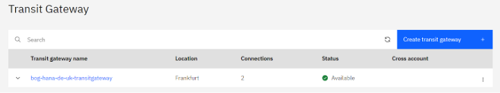
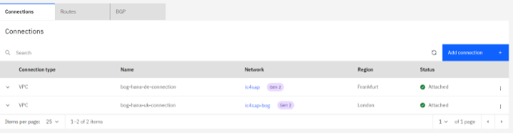

---

copyright:
  years: 2024
lastupdated: "2024-08-13"

subcollection: sap

---

{:external: target="_blank" .external}
{:shortdesc: .shortdesc}
{:screen: .screen}
{:pre: .pre}
{:note: .note}
{:table: .aria-labeledby="caption"}
{:codeblock: .codeblock}
{:tip: .tip} 
{:ui: .ph data-hd-interface="ui"}
{:terraform: .ph data-hd-interface="terraform"}

# Introduction to {{site.data.keyword.cloud_notm}} VPC and HANA db cross-region DR automation
{: #sap-automate-intro-hana-db-cross-region-dr}

You can use Terraform to automate {{site.data.keyword.cloud}} VPC provisioning. The provisioning includes virtual server instances with high network performance. For the VPC infrastructure there are a number of Infrastructure-as-a-Service (IaaS) offerings, including Virtual Servers. After the VPC infrastructure components are provisioned, the scripts use the Ansible playbooks to install the SAP system. {{site.data.keyword.cloud_notm}} VPC infrastructure consists of SAP certified hardware that uses Intel® Xeon CPUs and additional Intel® technologies.

## {{site.data.keyword.cloud_notm}} VPC introduction
{: #vpc-intro}

A VPC is a public cloud offering that an enterprise uses to establish its own private cloud-like computing environment on shared [public cloud]( https://www.ibm.com/cloud/public) infrastructure. VPCs give an enterprise the ability to define and control a virtual network that is logically isolated from all other public cloud tenants, creating a private, secure place on the public cloud.

Imagine that a cloud provider’s infrastructure is a residential apartment building and multiple families live inside. Being a public cloud tenant is akin to sharing an apartment with a few roommates. In contrast, having a VPC is like having your own private condominium; no one else has the key, and no one can enter the space without your permission.
A VPC’s logical isolation is implemented by using virtual network functions and security features that give an enterprise customer granular control over which IP addresses or applications can access particular resources. It is analogous to the “friends-only” or “public/private” controls on social media accounts used to restrict who can or can’t see your otherwise public posts.

With {{site.data.keyword.cloud_notm}} VPC, you can use the UI, CLI, and API to manually provision virtual server instances for VPC with high network performance. VPC infrastructure contains several Infrastructure-as-a-Service (IaaS) offerings, including Virtual Servers for VPC. Use the following information to understand a simple use case for planning, creating, and configuring resources for your VPC, and learn about more VPC overviews and VPC tutorials. For more information about VPC, see [Getting started with Virtual Private Cloud (VPC)]( https://cloud.ibm.com/docs/vpc?topic=vpc-getting-started).

## SAP on {{site.data.keyword.cloud_notm}}
{: #sap-hana-db-backup-on-dr}

SAP NetWeaver is the core foundation of the SAP technology stacks and is the platform that is used for ABAP and Java applications. The SAP system can be installed and configured in {{site.data.keyword.cloud_notm}} for various system and database types.

For more information about SAP system architectures on {{site.data.keyword.cloud_notm}} VPC, see the infrastructure reference architectures for SAP for each supported database type. For example, [SAP NetWeaver 7.x on UNIX with HANA on {{site.data.keyword.cloud_notm}} VPC](https://cloud.ibm.com/docs/sap?topic=sap-sap-refarch-nw-hana&interface=terraform) is the dedicated reference architecture for this SAP solution.

## SAP Project Value Guide – {{site.data.keyword.cloud_notm}} VPC and HANA db backup automation on Cloud Object Storage
{: #sap-hana-db-backup-on-dr-value-guide}

SAP projects vary widely in scope and budget, but none are considered trivial. Whether you are delivering a new SAP system or implementing changes to an existing one, the requirement for no errors in execution and reducing the project time to realize the benefits are always present.

In many SAP project scenarios, the deployment of an SAP system is often a key and repeated task. This project value guide covers the automated deployment of {{site.data.keyword.cloud_notm}} VPC and HANA db cross-regions DR. More information on [SAP NetWeaver of HANA database and Additional Application Server (AAS) to SAP instance and HANA instance](/docs/sap?topic=sap-intro-automate-aas-hana-anydb-terraform-ansible&interface=ui) is discussed in their respective sections.

With this system being a key part of your SAP project, you want to enable a cross-regions Disaster Recovery architecure for your existing SAP HANA productive database.

## SAP HANA db cross-regions disaster recovery automation module
{: #sap-hana-db-backup-dr}

SAP HANA db cross-regions Disaster Recovery (DR) automation module will be developed as standalone automation module that will be integrated to any deployed SAP solution running on HANA database.

SAP HANA Cloud offers options to replicate your SAP HANA Cloud database synchronously within the same availability zone or asynchronously to other availability zones in another region since October 2021.

With these options, you can set up a Highly Available (HA) architecture and/or a Disaster Recovery (DR) architecture in by running HANA DR cross-region automation module on top of an existing SAP product running on HANA db.

In the diagrams below, SAP HANA database is represented as a HANA secondary passive. The synchronous and asynchronous replication architectures are illustrated for both HA and DR scenarious.

"){: caption="Figure 1. HANA HA (with HSR Async replication)" caption-side="bottom"}

"){: caption="Figure 2. HANA DR (with HSR Async replication cross-regions)" caption-side="bottom"}

Different RPO/RTO values can be associated with different kinds of faults. Business critical systems are expected to operate with an RPO of zero data loss in case of local faults, and often even in case of a disaster. But the challenges of disaster recovery are different from locally recoverable faults. To achieve zero RPO and low RTO, data must be replicated synchronously over longer distances, which impacts regular system performance and may require more expensive standby and failover solutions. All of this leads to tradeoff decisions around the attributes of fault recovery functionality, cost, and complexity.

Here is how the system replication works. When the secondary system is brought up to start running in live replication mode, each service component establishes a connection with its primary system counterpart, and requests a snapshot of the data. From there, all the logged changes in the primary systems are replicated.

Whenever logs are persisted in the primary system (that is, written to the log volumes of each service), they are also sent to the secondary system. A transaction in the primary system is not committed until the redo logs are replicated, as determined by a log replication option:

* Synchronous (used for HA): The primary system waits to commit the transaction, until it receives a reply that the log is persisted in the secondary system. This mode guarantees immediate consistency between both the systems, at a cost of delaying the transaction by the time for data transmission and persisting in the secondary system.

What happens if the replication fails?

If the replication fails due to a network fault then it can be set to commit the transaction, or to fail the commit on the primary system, until replication is restored.

SAP HANA supports multi-tenant database containers. System replication can only be set for the system as a whole, not per individual tenant.

* Synchronous in-memory: The primary system commits the transaction after it receives a reply that the log was received by the secondary system, but before it was persisted. The transaction delay in the primary system is shorter, because it only includes the data transmission time.

* Asynchronous (used for DR): The primary system commits the transaction after sending the log without waiting for a response. This eliminates the synchronization latency, at the risk of minor theoretical data-loss during failure. This mode is most useful when the secondary site is hundreds of kilometers away from the primary site, or when reducing latency is critical.

HSR synchronizes data between a primary and a secondary HANA system, ensuring that your critical data remains accessible even during unexpected events.

System Replication Continuous (synchronous and asynchronous) update of secondary system by primary system, including in-memory table loading and continuous log replay on the secondary system (if configured).

SAP HANA system replication provides the possibility to copy and continuously synchronize an SAP HANA database to a secondary location in the same or another data center. Usually, system replication is used to support high availability and disaster recovery.

Distance between the data centers:

* System replication offers synchronous and asynchronous replication modes to accommodate network latency.
* If the distance between your sites is less than 100 km, then you can use synchronous replication mode `SYNC` or `SYNCMEM`.
* If the distance between your sites is more than 100 km apart, then you can use asynchronous replication mode `ASYNC`.

### Transit Gateway
{: #sap-hana-db-backup-dr-transit_gateway}

With [{{site.data.keyword.cloud_notm}} Transit Gateway](/docs/transit-gateway?topic=transit-gateway-about), you can create single or multiple transit gateways to connect VPCs together. You can also connect your {{site.data.keyword.cloud_notm}} classic infrastructure to a transit gateway to provide seamless communication with classic infrastructure resources. Any new network that you connect to a transit gateway is then automatically made available to every other network connected to it so that you can scale your network as it grows.

Transit gateways provide flexibility by allowing you to add networks to local gateways. Networks can be attached to multiple local gateways and a single global gateway, enabling you to keep local traffic on a local gateway.

{{site.data.keyword.cloud_notm}} Transit Gateway supports local and global routing between VPCs and the {{site.data.keyword.cloud_notm}} classic infrastructure. All routing options remain within the private {{site.data.keyword.cloud_notm}} infrastructure without operating on the public internet, and are optimized for performance. {{site.data.keyword.cloud_notm}} Transit Gateway allows customers greater flexibility, redundancy, and speed in scaling their workloads, and in connecting isolated networks that run on {{site.data.keyword.cloud_notm}}.

* Create transit gateway.

{: caption="Figure 3. Create the Transit Gateway" caption-side="bottom"}

* The Transit Gateway is now created and available.

{: caption="Figure 4. Transit Gateway" caption-side="bottom"}

* The transit gateway shows two connections having the VSIs HANA db instance in 2 separate regions.

{: caption="Figure 5. Transit Gateway Connections" caption-side="bottom"}

### Network latency dashboards
{: #sap-hana-db-backup-dr-network_latency_dashboards}

The inter-region latency dashboard provides the average network round-trip latency (round-trip time or RTT) for all pairs of regions in {{site.data.keyword.cloud}}. The dashboard shows a snapshot of inter-region RTT expressed in milliseconds. This snapshot is an average of multiple measurements over the previous 30 days. For each measurement, a pair of Linux virtual machines (of cx2-8x16 profile) is provisioned in the two corresponding regions in {{site.data.keyword.cloud_notm}}. VM-to-VM network connectivity is provided by the Transit Gateway. Netperf TCP RR test is used for measuring the VM-to-VM latency between regions.

The results reported are measured. There are no performance guarantees implied by these dashboards. These statistics provide visibility into latency between all regions and zones to help you plan the optimal selection for your cloud deployment and plan for scenarios, such as data residency and performance. These dashboards are not intended for use in troubleshooting. For more information, see [Network latency dashboards](docs/vpc?topic=vpc-network-latency-dashboard).

Manually deploying a VPC and configuring a HANA db as standby database with Async HSR replication cross-regions for enabiling a DR on a cloud platform can be time-consuming. The Terraform automation assures not only a quicker implementation, but also a standardized and less prone to error deployment. Terraform and Ansible are used for automating the deployment processes.

## Ansible for SAP installation
{: #sap-hana-db-dr-ansible-install}

Ansible is a command line IT automation software application that can be used to configure systems, deploy software, orchestrate workflows to support application deployment, system updates. It is used to automate the configuration of a Hana db backup for Cloud Object Storage. For more information about Ansible, see the [Ansible Documentation](https://docs.ansible.com/ansible/latest/index.html).

The Ansible playbooks are called directly by the Terraform scripts. The scripts start with Terraform specific steps for creating the VPC infrastructure elements, and continue automatically with the Ansible specific steps, which configure Hana db backup for Cloud Object Storage.

## Where to run the scripts
{: #sap-hana-db-dr-where-scripts}

The scripts run from your Deployment Server because the Deployment Server has Terraform and Ansible already installed. The SAP Kits must be downloaded to the temporary storage assigned to you on the Deployment Server. Ansible playbooks install the kits for you based on the location of the kits that are specified in the configuration files.

## Prerequisites
{: #sap-hana-db-dr-prereq-bastion}

* Before you deploy any of the SAP automated solutions on {{site.data.keyword.cloud_notm}} VPC, a deployment server (bastion server) should be created in your chosen region. The deployment server (bastion server) is used for downloading and storing specific SAP solution media that are needed for later automation deployment. The deployment server (bastion server) is used for both CLI deployment scenarios, as well for Schematics UI deployments. For more information about how to create the deployment server (bastion server) and its corresponding VPC, see Automate SAP bastion server - SAP media storage repository. "SAP HANA db cross-regions DR automation module" automation module requires a deployment server in a different region from the  productive HANA VSIs is located.

* A pair of SSH keys to be used to run the automation for the backup configuration must be available. The public SSH key should be manually added on SAP HANA DR VSI, in `/root/.ssh/authorized_keys` and uploaded in {{site.data.keyword.cloud_notm}}.

* The {{site.data.keyword.cloud_notm}} user running the automation for SAP HANA db cross-regions DR should have the role of Manager on {{site.data.keyword.cloud_notm}} Object Storage. To view/use the credential, the user must have the IAM level access action `resource-controller.credential.retrieve_all`. This action is given with the Administrator role, and overrides any credential level access enabling the user to view the credential. For more information on granting the necessary authorizations to your {{site.data.keyword.cloud_notm}} user, see https://cloud.ibm.com/iam/users and select the USER_ID, which runs the automation and then check/grant the required roles. More information on Readme file.

* You need to have already deployed an SAP HANA productive system in order to connect in a different region a SAP HANA db cross-regions DR VSI (built on one of the following OS: SUSE Linux Enterprise Server 15 SP 4 for SAP, SUSE Linux Enterprise Server 15 SP 3 for SAP, Red Hat Enterprise Linux 8.6 for SAP or Red Hat Enterprise Linux 8.4 for SAP) in an {{site.data.keyword.cloud_notm}} Gen2 VPC, on a single host (with or without HA).

* The HANA DB SYSTEM for newly created HANA DR instance user must have the same password for SYSTEMDB and all tenant databases.

This HANA db DR cross-regions VSI solution was implemented and tested on the following OS images available in {{site.data.keyword.cloud_notm}}: ibm-sles-15-4-amd64-sap-hana-3, ibm-sles-15-3-amd64-sap-hana-3, ibm-redhat-8-6-amd64-sap-hana-2, and ibm-redhat-8-4-amd64-sap-hana-2.

The kits are installed by Ansible playbooks based on the location of the kits that are specified in the configuration files.

To save costs, the deployment server (bastion server), with its SAP media dedicated storage, can be decommissioned after the SAP solutions are successfully implemented on {{site.data.keyword.cloud_notm}} VPC cloud. Or, you can keep the deployment server (bastion server) and use it as a jump host for that specific region.

This automation is offered at no cost; however, the provisioned infrastructure comes at cost.

