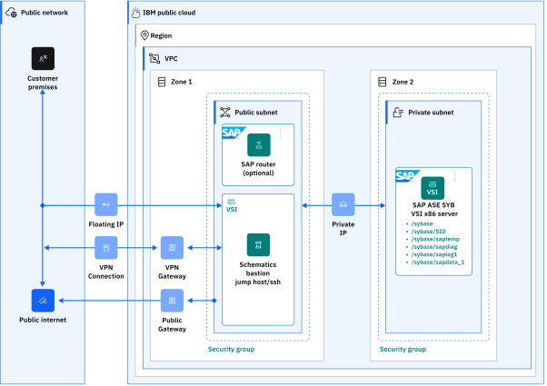

---

copyright:
  years: 2024
lastupdated: "2024-06-20"

subcollection: sap

---

{:external: target="_blank" .external}
{:shortdesc: .shortdesc}
{:screen: .screen}
{:pre: .pre}
{:note: .note}
{:table: .aria-labeledby="caption"}
{:codeblock: .codeblock}
{:tip: .tip}

# Background for automating ASE Sybase stand-alone virtual server instance deployment in {{site.data.keyword.cloud}} VPC
{: #sap-ase-sybase-vpc-background}

## {{site.data.keyword.cloud}} Virtual Private Cloud (VPC) introduction
{: #sap-ase-sybase-vpc-intro}

SAP Adaptive Server Enterprise (SAP ASE) is a high-performance relational database management system for mission-critical, data-intensive environments optimized for SAP Business Suite applications.
{{site.data.keyword.cloud}} VPC offers the possibility to quickly provision virtual server instances for VPC with high network performance. VPC infrastructure contains several Infrastructure-as-a-Service (IaaS) offerings, including Virtual Servers for VPC. A VPC is a public cloud offering that an enterprise uses to establish its own private cloud-like computing environment on shared [public cloud](https://www.ibm.com/cloud/public) infrastructure. A VPC gives an enterprise the ability to define and control a virtual network that is logically isolated from all other public cloud tenants. This helps creating a private and secure place on the public cloud.
{: shortdesc}

Imagine that a cloud providers infrastructure is a residential apartment building with multiple families living inside. Being a public cloud tenant is akin to sharing an apartment with a few roommates. In contrast, having a VPC is like having your own private condominium. No one else has the key, and no one can enter the space without your permission.

A VPC’s logical isolation is implemented by using virtual network functions and security features that give an enterprise user a granular control, over which the IP addresses or applications can access the particular resources. It is similar to the “friends-only” or “public/private” controls on social media accounts used to restrict who can or cannot see your public posts.

With {{site.data.keyword.cloud_notm}} VPC, you can use the UI, CLI, and API to quickly provision virtual server instances for VPC with high network performance. VPC infrastructure contains several Infrastructure-as-a-Service (IaaS) offerings, including Virtual Servers for VPC. Use the following information to understand a simple use case for planning, creating, and configuring resources for your VPC, and learn about more VPC overviews and VPC tutorials. For more information, see [Getting started with Virtual Private Cloud (VPC)](https://cloud.ibm.com/docs/vpc?topic=vpc-getting-started).

## SAP ASE Sybase in {{site.data.keyword.cloud_notm}}
{: #sap-ase-sybase-in-cloud}

The IBM public cloud is an open, security-rich, and enterprise-ready public cloud for business. This design makes it easier for global enterprises to modernize and build new business applications in the cloud to meet the requirements of the business and its customers. {{site.data.keyword.cloud_notm}} offerings include a broader portfolio of SAP-certified infrastructure, ranging from bare metal, VMware, VPC, and IBM Power® Systems Virtual Server products.

## SAP ASE Sybase defined 
{: #sap-ase-sybase-defined}

SAP ASE is based on a client/server model, communicating with its clients over the network through the Tabular Data Stream™ (TDS) protocol. Each client process runs on one system and communicate with a database server on the same or a different system. SAP ASE runs as an application for the operating system. The hardware that the operating system runs on is open to SAP ASE, which identifies only the operating systems user interfaces. To enhance the performance on multiprocessor systems, configure multiple processes (engines).

SAP ASE is divided into a DBMS (database) component and a kernel component. The kernel component uses the operating system services for process creation and manipulation, device and file processing, and interprocess communication. The DBMS component manages SQL statement processing, accesses data in a database, and manages different types of server resources.

### SAP ASE Editions
{: #sap-ase-sybase-editions}

Analyze your system and scalability requirements to determine which edition of SAP ASE is appropriate for your enterprise. Some of the SAP ASE editions are:

* Enterprise edition - has no limit on scalability and supports all the options that can be purchased or licensed separately.
* Small business edition - has limited scalability and supports a limited set of options that are purchased or licensed separately.
* Developer edition - has limited scalability and includes many of the options that are included in the enterprise edition.

The SAP ASE installer automatically installs a SySAM license server. You can choose the full installation option or enter the license key when prompted for the SySAM license. You can also install the license server by using the installers custom installation option.

### SAP ASE Options
{: #sap-ase-sybase-options}

SAP offers various optional features for SAP ASE, such as data compression, partitions, and encrypted columns.

* Data compression - Enables compression for regular and large object data, which uses less storage space for the same amount of data, reduces cache memory consumption, and improves performance due to lack of input/output demands.
* Security and directory services - Provides lightweight directory services, network-based authentication, and encryption by using SSL and Kerberos.
* Partitions - Enables semantic partitioning for table row data.
* Encrypted columns - Increases security parameters and allows for addition of data types.
* Tivoli storage manager - Enables the database to back up and restore operations to IBM Tivoli Storage Manager.
* In-memory database - Provides zero-disk footprint in-memory database support that is fully integrated with SAP ASE for high-performance transactional applications. Provides performance enhancements to disk-resident databases with relaxed durability properties.

SAP ASE includes server components that are installed into specific directories. The SAP ASE is installed into the ASE-16_0 directory.

* SAP ASE – the database server.
* Backup server – an application based on SAP® Open Server™ that manages all database backup (dump) and restore (load) operations.
* XP server – an Open Server application that manages and runs extended stored procedures (ESPs) from within SAP ASE.
* Job Scheduler – provides a job scheduler for SAP ASE. Job Scheduler components are located in `ASE-16_0/jobscheduler/` path.

## Single-host SAP ASE Sybase Instance Database
{: #sap-ase-sybase-single-host}

A single-host system is the simplest installation type that runs an SAP ASE Sybase system entirely on one host. You can scale the system up as needed. The single-host system has these components as shown in the architecture:

 {: caption="Figure 1. SAP ASE Sybase single-host installation" caption-side="bottom"}

The SAP ASE Sybase stand-alone deployment does not support any additional SAP application instance, as this is not deployed based on SAP Software Provisioning Manager (SWPM) phases for SAP applications running on ASE Sybase. This stand-alone database is suitable for applications like SAP Business Objects, Business Intelligence Platform, and SAP Data Services etc.
{: note}

For more information about SAP systems architectures in {{site.data.keyword.cloud_notm}} VPC, see [reference architectures](/docs/sap?topic=sap-sap-refarch-nw-hana) for each supported database type.

Manually deploying a VPC and installing an SAP system can be time-consuming. The automation assures not only a quicker implementation, but also a standardized and less error-prone deployment. Terraform and Ansible are used for automating the deployment processes.

The solution that is documented in this topic is the automated deployment of a single host with SAP ASE Sybase stand-alone VSI on Red Hat Enterprise Linux or SUSE Linux Enterprise Server (SLES) for SAP Applications.

Database instance (DB) - To assist your project planning phase, more design considerations are provided at SAP AnyDB – SAP ASE Sybase database with {{site.data.keyword.cloud_notm}} for SAP. For more information, see [AnyDB - SAP ASE Sybase](/docs/sap?topic=sap-sap-refarch-nw-sybase&interface=ui) and [Infrastructure certified for SAP](/docs/sap?topic=sap-iaas-offerings). A dedicated reference architecture about this AnyDB SAP ASE Sybase on {{site.data.keyword.cloud_notm}} VPC cloud can be found on [AnyDB - SAP ASE Sybase Database](/docs/sap?topic=sap-anydb-hana-db).

SAP ASE Sybase installation media that are used for this deployment is the default one for SAP ASE Sybase, platform edition 16.0 SPSXX. The media is available at the SAP Support Portal in the Installation and Upgrade area and it must be provided manually in the input parameter file.

## Terraform for infrastructure deployment
{: #sap-ase-sybase-terraform-for-infra-deploy}

Terraform on {{site.data.keyword.cloud_notm}} enables predictable and consistent provisioning of {{site.data.keyword.cloud_notm}} solutions. For more information about Terraform on {{site.data.keyword.cloud_notm}}, see [Getting started with Terraform on {{site.data.keyword.cloud_notm}}](/docs/ibm-cloud-provider-for-terraform?topic=ibm-cloud-provider-for-terraform-getting-started).

Terraform is used to provision the infrastructure components in {{site.data.keyword.cloud_notm}}. For automating this process, the current solution uses a Terraform script for deploying a VPC and a VSI with SAP certified storage and network configuration. The VPC is created along with the bastion (deployment) server, with one to three subnets and the following security rules:

* Allow all traffic in the Security group for private networks.
* Allow outbound traffic (ALL for port 53, TCP for ports 80, 443, 8443).
* Allow inbound SSH traffic (TCP for port 22) from IBM Schematics Servers.
* Option to Allow inbound SSH traffic with a custom source IP/CIDR list.

After the successful deployment of the infrastructure, the Terraform script calls the Ansible Playbooks, which perform the file system setup and the OS configuration before automatically installing the SAP application.

## Ansible for SAP installation
{: #sap-ase-sybase-ansible-for-install}

Ansible is an IT automation engine that automates provisioning, configuration management, application deployment, and other IT tasks. This solution performs the automated deployment of a stand-alone SAP ASE Sybase 2.0 DB on a Red Hat Enterprise Linux 8.6|8.4 for SAP or on a SUSE Linux Enterprise Server 15 SP 4|3 for SAP Applications VSI box. For more information about Ansible, check out the documentation available on the Ansible page.

Ansible core provides CLI tools for automation. More information about Ansible core can be found on [the Ansible core page](https://docs.ansible.com/ansible-core/devel/index.html){: external}.

The Ansible playbooks are called directly by the Terraform script. The Terraform script is run in one run. During the run, the first steps are Terraform specific for creating the VPC resources, and it continues automatically with Ansible steps for the installation of the SAP system.

This automation is offered free of charge however, the provisioned infrastructure comes at a cost.
{: note}
