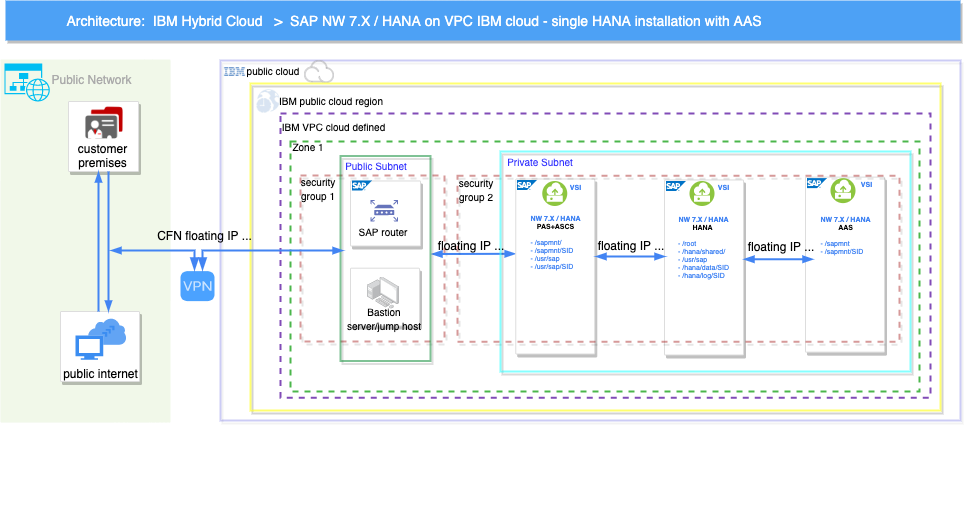

---

copyright:
  years: 2022, 2023
lastupdated: "2023-07-06"

subcollection: sap

---

{:external: target="_blank" .external}
{:shortdesc: .shortdesc}
{:screen: .screen}
{:pre: .pre}
{:note: .note}
{:table: .aria-labeledby="caption"}
{:codeblock: .codeblock}
{:tip: .tip}

# Automate SAP bastion server – SAP media storage repository 
{: #sap-bastion-server} 

This task describes how to do an automated deployment of SAP bastion and storage setup on top of Red Hat Enterprise Linux 8.4. It shows how to deploy an {{site.data.keyword.cloud_notm}} Virtual Private Cloud (VPC) with a bastion host with secure remote SSH access. In SAP Terraform and Ansible deployments, the bastion host is used to give external administrative access to the other servers and applications. The bastion server is accessed through the Floating IP. The bastion server includes a customizable security group and subnet to enable access to the same region zones on its dedicated SAP/DBs and the VSI's IPs and ports. The Floating IP also allows the bastion host access to the internet so the sap and DB kits can be downloaded. 

Before you decide which SAP automated solution you want to deploy in {{site.data.keyword.cloud_notm}} VPC, run the bastion server automated deployment. You need to specify the amount of dedicated storage that is needed to download and store the SAP kits. The SAP kits are used to deploy wanted SAP solution from the {{site.data.keyword.cloud_notm}} VPC automated SAP solutions pool. The bastion server in {{site.data.keyword.cloud_notm}} is primarily used for SAP solution deployment. It can be used as a Jump Host, for example, to maintain and administer all SAP solutions within its respective {{site.data.keyword.cloud_notm}} VPC region.

Each customer is given an SAP S-user that reflects their contractual details with SAP, including: 
* SAP support
* SAP Notes 
* System maintenance 
* Generate and maintain SAP and DB licenses  
* Migrations keys 

It is the customer's responsibility to download and prepare the necessary SAP kits from [SAP launchpad support](https://launchpad.support.sap.com/) and store them on the dedicated and customizable storage. The SAP kits are used during automated deployment when Ansible is called.

{: caption="Figure 1. Standard Bastion server SAP NetWeaver 7.x SAP HANA single-host installation with AAS" caption-side="bottom"}

## Solution implemented
{: #bastion-solution-implemented}

The Bastion server is used for remote software installation by using Terraform remote-exec and Ansible playbooks that are run by Schematics.

The Terraform modules implement a 'reasonable' set of best practices for bastion host configuration only. Your own Organization might have more requirements that you must apply before the deployment.

It contains:
*	Terraform scripts for deploying a VPC, Subnet, Security Group with rules, a volume, and a VSI.
*	Bash scripts to install the prerequisites for SAP BASTION&STORAGE VSI and other SAP solutions.

### VPC Configuration
{: #sap-bastion-vpc-config}

The Security Rules are:
*	Allow all traffic in the Security group
*	Allow all outbound traffic
*	Allow inbound DNS traffic (UDP port 53)
*	Allow inbound SSH traffic (TCP port 22)
*	Option to Allow inbound TCP traffic with a custom port or a range of ports.

### VSI Configuration
{: #sap-bastion-vso-config}

The VSI is configured with Red Hat Enterprise Linux 8.4 (amd64), has a minimal of two SSH keys that are configured to be accessed by the root user and one storage volume. 

### Software configuration
{: #sap-bastion-software-config}

*	Terraform - an open source infrastructure as code software tool created by HashiCorp
*	Ansible - an open source software provisioning and configuration management tool.
*	The {{site.data.keyword.cloud_notm}} Command Line Interface provides commands for managing resources in {{site.data.keyword.cloud_notm}}.

## Bastion input variables
{: #sap-bastion-input-vars}

|Parameter  |	Description   |
|-----------|------------------|
|ibmcloud_api_key	|{{site.data.keyword.cloud_notm}} API key (Sensitive* value).|
|private_ssh_key	|The id_rsa private key content from your local machine (Sensitive* value).|
|REGION	|The cloud region where to deploy the resources. For more information about regions and zones for VPC, see [Locations](/docs/containers?topic=containers-regions-and-zones#zones-vpc). Review the supported locations in {{site.data.keyword.cloud_notm}} Schematics that are listed in [Locations and endpoints](/docs/schematics?topic=schematics-locations). Sample value: eu-de.|
|ZONE	| The cloud zone where to deploy the solution. Sample value: eu-de-2.|
|VPC_EXISTS	    | Specify whether the chosen VPC exists (enter 'yes' or 'no'). If you choose 'no', the VPC is created.|
|SUBNET_EXISTS	    | Specify whether the chosen SUBNET/SECURITYGROUP exist (use 'yes' or 'no'). If you choose 'no', a SUBNET/SECURITYGROUP with OPEN PORTS is created in the specified VPC. |
|ADD_OPEN_PORTS_IN_NEW_SUBNET	|Create new port/s only if a NEW SUBNET is created, use 'yes' or 'no'.|
|OPEN_PORT_MINIMUM	(Required, Integer) |The TCP port range that includes the minimum value. Valid values are 1 - 65535. |
|OPEN_PORT_MAXIMUM	(Required, Integer) | The TCP port range that includes the maximum value. Valid values are 1 - 65535.|
|VPC	| The name of the VPC. View the list of available VPCs on the {{site.data.keyword.cloud_notm}} Console [Virtual private clouds](https://cloud.ibm.com/vpc-ext/network/vpcs) page.|
|SUBNET	|The name of the Subnet. View the list of available Subnets on the {{site.data.keyword.cloud_notm}} Console [Subnets] (https://cloud.ibm.com/vpc-ext/network/subnets) page.|
|SECURITYGROUP	| The name of the Security Group. View the list of available Security Groups on the {{site.data.keyword.cloud_notm}} Console [Security groups for VPC page](https://cloud.ibm.com/vpc-ext/network/securityGroups).|
|HOSTNAME	|The hostname for the VSI. The hostname must have up to 13 characters.|
|PROFILE	|The profile used for the VSI. For more information about profiles, see [Instance profiles](docs/vpc?topic=vpc-profiles&interface=ui). Default value: "bx2-2x8".|
|IMAGE	|The OS image used for the VSI. For more information about available images, see [Virtual server images](docs/vpc?topic=vpc-about-images). Default value: ibm-redhat-8-4-minimal-amd64-1.|
|SSH_KEYS	|List of SSH Keys IDs that are allowed to SSH as root to the VSI. Can contain one or more IDs. View the list of available SSH Keys on the {{site.data.keyword.cloud_notm}} Console [SSH keys for VPC](https://cloud.ibm.com/vpc-ext/compute/sshKeys) page. Sample input (use your own SSH IDs from I{{site.data.keyword.cloud_notm}}): [ "r010-57bfc315-f9e5-46bf-bf61-d87a24a9ce7a", "r010-3fcd9fe7-d4a7-41ce-8bb3-d96e936b2c7e" ]|
|VOL1 [ number ]|	The size for the disk in GB to be attached to the BASTION VSI as storage for the SAP deployment kits. The mount point for the new volume is: "/storage". Default value: 100 GB.|

Sensitive* - The variable value is not displayed in your workspace details after it is stored. Make sure to select **Sensitive** on the Settings page for all fields marked "Sensitive".

VOL1 [ number ] variable represents the defined customer size of the storage that is needed to store downloaded SAP kits before you run the automated SAP deployment. The storage size can be customized when you deploy the bastion SAP VPC and VSI. Default storage that is allocated is 100 Gb.
{: note}

## Before you begin
{: #sap-bastion-before-begin}

1. To complete this procedure, you need a general understanding of {{site.data.keyword.cloud_notm}} VPC and VSIs. To run the example in {{site.data.keyword.cloud_notm}} Schematics, you need an {{site.data.keyword.cloud_notm}} account. The deployed resources are chargeable.

2. [Create or retrieve an {{site.data.keyword.cloud_notm}} API key](/docs/account?topic=account-userapikey#create_user_key). The API key is used to authenticate with the {{site.data.keyword.cloud_notm}} platform and to determine your permissions for {{site.data.keyword.cloud_notm}} services.

3. Be sure that you have the [required {{site.data.keyword.cloud_notm}} IAM permissions](/docs/vpc?topic=vpc-managing-user-permissions-for-vpc-resources) to create and work with VPC infrastructure and you are [assigned the correct permissions](/docs/schematics?topic=schematics-access) to create the workspace and deploy resources.

4. [Generate an SSH key](/docs/vpc?topic=vpc-ssh-keys). The SSH key is required to access the provisioned VPC virtual server instances through the bastion host. After you create your SSH key, make sure to [upload this SSH key to your {{site.data.keyword.cloud_notm}} account](/docs/vpc-on-classic-vsi?topic=vpc-on-classic-vsi-managing-ssh-keys#managing-ssh-keys-with-ibm-cloud-console) in the VPC region and resource group where you want to deploy the bastion server.

5. Verify that you can access the URL used for this solution [Automation script for SAP solutions using a BASTION & STORAGE setup deployment through Terraform and IBM Schematics](https://github.com/IBM-Cloud/sap-bastion-setup). 

## Procedure

1. From the {{site.data.keyword.cloud_notm}} menu, select [Schematics](https://cloud.ibm.com/schematics/overview).
2. Click **Create workspace**.
3. On the **Specify template** page:
    * Enter the URL of bastion setup folder. 
    * Select the **Terraform version**.
    * Click **Next**.  
4. On the Workspace details page:
    * Enter a name for the workspace.
    * Select a **Resource group**.
    * Select a **Location** for your workspace. The workspace location does not have to match the resource location.
    * Select **Next**.
5. Select **Create** to create your workspace.
6. On the workspace **Settings** page, in the Input variables section, review the default input variables and provide values that match your solution:
     * Your API key
     * Your private SSH key from your local machine
     * The ID for the SSH key that you created and uploaded to {{site.data.keyword.cloud_notm}}
     * The Region for your resources
     * The Zone for your resources
     * Whether to use an existing VPC or create one
     * Whether to use an existing subnet
     * Whether to create new port only when a new subnet is created
     * TCP port range, nimimun and maximum
     * VPC name
     * Subnet name
     * Security group name
     * Hostname
     * Profile
     * Image
     * Minimal recommended disk sizes. 
     * Click **Save changes**.
7. On the workspace Settings page, click **Generate plan**. Wait for the plan to complete.
8. Click **View log** to review the log files of your Terraform execution plan.
9. Apply your Terraform template by clicking **Apply plan**.
10. Review the log file to ensure that no errors occurred during the provisioning, modification, or deletion process.
11. At the end of the log is information that you need to deploy different SAP products and databases. Copy and save this information for your deployments. For example: 

   ```
   2022/08/17 10:30:11 Terraform apply | FLOATING-IP = "xxx.xxx.xxx.xx"
   2022/08/17 10:30:11 Terraform apply | HOSTNAME = "myhost"
   2022/08/17 10:30:11 Terraform apply | PRIVATE-IP = "xx.xxx.xx.x"
   2022/08/17 10:30:11 Terraform apply | REGION = "eu-gb"
   2022/08/17 10:30:11 Terraform apply | SECURITY_GROUP = "secgrp-myhost"
   2022/08/17 10:30:11 Terraform apply | SUBNET = "myvpc-subnet"
   2022/08/17 10:30:11 Terraform apply | VPC = "myvpc"
   2022/08/17 10:30:11 Terraform apply | ZONE = "eu-gb-1"
   ```
   
This automation is offered free of charge however, the provisioned infrastructure comes at cost.{: note}