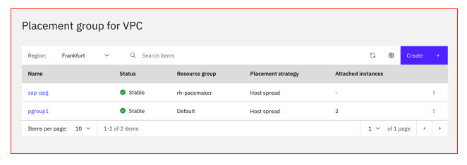
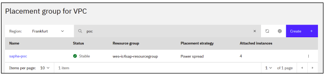
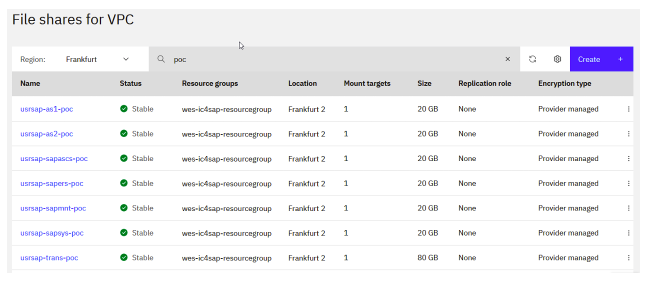
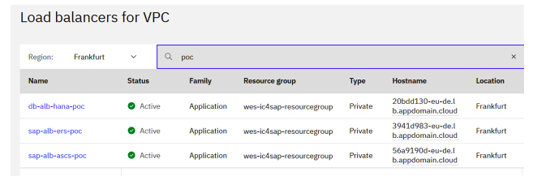
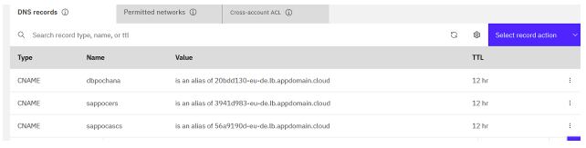

---

copyright:
  years: 2022, 2025
lastupdated: "2025-02-02"

subcollection: sap

---

{:external: target="_blank" .external}
{:shortdesc: .shortdesc}
{:screen: .screen}
{:pre: .pre}
{:note: .note}
{:table: .aria-labeledby="caption"}
{:codeblock: .codeblock}
{:tip: .tip}
{:ui: .ph data-hd-interface="ui"}
{:terraform: .ph data-hd-interface="terraform"}

# Overview for automating SAP workload HA deployment on {{site.data.keyword.cloud}} Virtual Private Cloud (VPC) (Terraform and Ansible)
{: #automate-sap-ha-deployment-overview}

You can use Terraform to automate {{site.data.keyword.vpc_short}} provisioning. The VPC provisioned includes virtual server instances with high network performance. The VPC infrastructure contains a number of Infrastructure-as-a-Service (IaaS) offerings, including virtual servers. After the VPC is provisioned, the scripts use the Ansible Playbook to install the SAP system.
{: shortdesc}

## {{site.data.keyword.cloud}} VPC introduction
{: #automate-sap-ha-vpc-introduction}

A VPC is a public cloud offering that an enterprise uses to establish its own private cloud-like computing environment on shared [public cloud](https://www.ibm.com/cloud){: external} infrastructure. VPCs give an enterprise the ability to define and control a virtual network that is logically isolated from all other public cloud tenants, creating a private, secure place on the public cloud.

Imagine that a cloud provider’s infrastructure is a residential apartment building and multiple families live inside. Being a public cloud tenant is akin to sharing an apartment with a few roommates. In contrast, having a VPC is like having your own private condominium; no one else has the key, and no one can enter the space without your permission.

A VPC’s logical isolation is implemented by using virtual network functions and security features that give an enterprise customer granular control over which IP addresses or applications can access particular resources. It is analogous to the “friends-only” or “public/private” controls on social media accounts used to restrict who can or can’t see your otherwise public posts.

With {{site.data.keyword.vpc_short}}, you can use the UI, CLI, and API to manually provision virtual server instances for VPC with high network performance. VPC infrastructure contains a number of Infrastructure-as-a-Service (IaaS) offerings, including {{site.data.keyword.vsi_is_short}}. Use the following information to understand a simple use case for planning, creating, and configuring resources for your VPC, and learn about more VPC overviews and VPC tutorials. For more information about VPC, see [Getting started with Virtual Private Cloud (VPC)](/docs/vpc?topic=vpc-getting-started).

## SAP products architecture on IBM Cloud VPC
{: #automate-sap-ha-products-architecture-vpc}

A [Virtual Private Cloud (VPC)](https://www.ibm.com/think/topics/vpc){: external} contains one of the most secure and reliable cloud environments for SAP applications within your own VPC with its included virtual server instances. This represents an Infrastructure as a Service (IaaS){: external} within {{site.data.keyword.cloud_notm}} that offers all of the benefits of isolated, secure, and flexible virtual cloud infrastructure from IBM. In comparison, the {{site.data.keyword.cloud_notm}} classic infrastructure virtual servers offering uses virtual instances with native and VLAN networking to communicate to each other within a data center; however, the instances are restricted in one well-working pod by using subnet and VLAN networking as a gap scale up of virtual resources should rely between the pods. What’s new with {{site.data.keyword.vpc_short}} is a network orchestrator layer concept that eliminates the pod boundaries and restrictions, so this new concept handles all the networking for every virtual instance running within VPC across regions and zones.

## Highly available system for SAP NetWeaver on {{site.data.keyword.cloud_notm}} VPC
{: #automate-sap-ha-system-nw}

In a highly available (HA) system, every instance can run on a separate {{site.data.keyword.cloud_notm}} virtual server instance. The cluster HA configuration for the SAP application server consists of two virtual server instances, each of them located in the same zone for single zone or in different zones for multi zone within the same region by using placement groups. Placement groups assure that both cluster resources and cloud resources are also located in different compute nodes as specified in the following placement groups section.

 and AAS (Active) with HANA DB instance HA cluster)"){: caption="SAP HA SZ for SAP applications cluster nodes PAS (Active) and AAS (Active) with HANA DB instance HA cluster" caption-side="bottom"}

 and AAS (Active) with HANA DB instance in HA cluster)"){: caption="SAP HA MZ for SAP applications cluster nodes PAS (Active) and AAS (Active) with HANA DB instance in HA cluster" caption-side="bottom"}

### Placement groups on {{site.data.keyword.cloud_notm}} VPC for SAP HA architecture
{: #automate-sap-ha-placement-groups}

Placement groups (PG) for VPC have two different anti-affinity strategies for high availability. By using placement strategies, you minimize the chance of service disruption with virtual server instances that are placed on different hosts or into an infrastructure with separate power and network supplies.

The design of placement groups for {{site.data.keyword.cloud_notm}} virtual servers solves this issue. Placement groups give you a measure of control over the host on which a new public virtual server is placed. With this release, a “spread” rule is implemented, which means that virtual servers within a placement group are all spread onto different hosts. You can build a highly available application within a data center and know that your virtual servers are isolated from each other.

Placement groups with the “spread” rule are available to create in select {{site.data.keyword.cloud_notm}} data centers. After a "spread" rule is created, you can provision a virtual server into that group and ensure that it won't be on the same host as any of your other virtual servers. The best part? There’s absolutely no charge for using this feature.

You can create your placement group, then assign up to four new virtual server instances. With the "spread" rule, each of your virtual servers are provisioned on different physical hosts. In the following example configurations, the “Power Spread” option is used.

{: caption="Placement groups host spread" caption-side="bottom"}

{: caption="Placement groups power spread" caption-side="bottom"}

These are the following SAP instances that are needed for an HA scenario:

* ABAP central services instance (ASCS instance)- contains the ABAP message server and the ABAP enqueue server
* Enqueue replication server instance (ERS instance) for the ASCS instance
* Database instance
* Primary application instance (PAS) on node 1
* Additional application instance (AAS) on node 2

It is recommended that you run both the ASCS instance and ERS instance in a switchover cluster infrastructure.

### {{site.data.keyword.filestorage_vpc_full_notm}} for SAP HA architecture
{: #automate-sap-ha-file-storage}

[{{site.data.keyword.filestorage_vpc_full_notm}}](/docs/vpc?topic=vpc-file-storage-vpc-about) technology is used to make the SAP directories available to the SAP system. The technologies of choice are NFS, shared disks, and cluster file system. If you have decided to use a highly available (HA) solution for your SAP system, make sure that you properly address the HA requirements of the SAP file systems in your SAP environment.

{: caption="File shares for VPC" caption-side="bottom"}

* File shares that are mounted as NFS permanent file systems on both cluster nodes for SAP apps HA:
    * `/usr/sap/<SAPSID>/SYS`
    * `/sapmnt<SAPSID>`
    * `/usr/sap/trans`
* Cluster-managed file systems for SAP Apps HA: ASCS si ERS
    * `/usr/sap/<SAPSID>/ASCS00`
    * `/usr/sap/<SAPSID>/ERS01`
* Permanent NFS mount on SAP Apps HA node 1 PAS instance:
    * `/usr/sap/<SAPSID>/Dxx`
* Permanent NFS mount on SAP Apps HA node 2 dialog instance:
    * `/usr/sap/<SAPSID>/Dyy`

#### Prerequisites
{: #automate-sap-ha-file-storage-prerequisites}

You need to install the hardware (hosts, disks, and network) and decide how to distribute the database, SAP instances, and, if required, the Network File System (NFS) server over the cluster nodes.

#### Context
{: #automate-sap-ha-file-storage-context}

From the perspective of an SAP application, these are the types of SAP directories:
* Physically shared directories: `/<sapmnt>/<SAPSID>` and `/usr/sap/trans`
* Logically shared directories that are bound to a node, such as `/usr/sap`, with the following local directories:
    * `/usr/sap/<SAPSID>`
    * `/usr/sap/<SAPSID>/SYS`
    * `/usr/sap/hostctrl`
* Local directories that contain the SAP instances, such as `/usr/sap/<SAPSID>/ASCS<Instance_Number>`
* The global transport directory might reside on a separate SAP transport host as a standard three systems transport layer configuration.

You need at least two nodes and a shared file system for distributed ASCS and ERS instances, and the assumption is that the rest of the components are distributed on other nodes.

#### ASCS and ERS installation
{: #automate-sap-ha-file-system-ascs-ers-installation}

In order for the ASCS and ERS instances to be able to move from one node to the other, they need to be installed on a shared file system and use virtual hostnames based on the virtual IP.

In this VPC-based SAP HA solution, the shared file system that is required by the cluster is replaced by the NFS-mounted file storage, and the virtual IP is replaced by the {{site.data.keyword.alb_full}} (ALB).

In this scenario, three ALBs are used, one for each Single Point of Failure component (SPOF) in order to replace the virtual IP requirement: ALB for ASCS, ALB for ERS, and ALB for HANA. Each ALB is configured as a backend for the corresponding cluster servers and redirects all of the communication that is received on the front-end ports to the active server in the backend pool.

{: caption="Application load balancer management of HA IPs mechanism" caption-side="bottom"}

### Private application load balancer
{: #automate-sap-ha-private-application-load-balancer}

A [private application load balancer](/docs/vpc?topic=vpc-load-balancers&interface=ui) is accessible through your private subnets that you configured to create the load balancer.

Similar to a public application load balancer, your private application load balancer service instance is assigned an FQDN; however, this domain name is registered with one or more private IP addresses.

{{site.data.keyword.cloud_notm}} operations might change the number and value of your assigned private IP addresses over time, based on maintenance and scaling activities. The back-end virtual server instances that host your application must run in the same region and under the same VPC.

Use the assigned ALB FQDN to send traffic to the private application load balancer to avoid connectivity problems to your applications during system maintenance or scaling down activities.

Each ALB sends traffic to the cluster node where the application (ASCS, ERS, HANA DB) is running. During the cluster failover, the ALB redirects all the traffic to the new node where the resources are up and running.

DNSaaS (DNS as a Service) is the management {{site.data.keyword.vpc_short}} DNS service of HA and FQDN (IPs) mechanism.
{: note}

The ALB has a default of 50 seconds for client and server timeout, so after 50 seconds of inactivity, the connections close. To support SAP connections through ALB and not lose connection after 50 seconds, you need to request a change this value to a minimum of 300 seconds (client-side idle connection = minimum 300s and server-side idle connection = minimum 300s). To request this change, open a support ticket. This is an account-wide change that affects all of the ALBs in your account. For more information, see [Connection timeouts](/docs/vpc?topic=vpc-advanced-traffic-management#connection-timeouts).
{: note}

### {{site.data.keyword.dns_short}} with VPC
{: #automate-sap-ha-dns-services}

[{{site.data.keyword.dns_full_notm}}](/docs/vpc?topic=vpc-about-dns-srvcs) provides private DNS to VPC users. Private DNS zones are resolvable only on {{site.data.keyword.cloud_notm}}, and only from explicitly [permitted networks](/docs/dns-svcs?topic=dns-svcs-dns-concepts#permitted-networks) in an account. To get started, create a {{site.data.keyword.dns_short}} instance using the {{site.data.keyword.cloud_notm}} console.

{{site.data.keyword.dns_short}} allow you to:
* Create private DNS zones that are collections for holding domain names.
* Create DNS resource records under these DNS zones.
* Specify access controls used for the DNS resolution of resource records on a zone-wide level.

{{site.data.keyword.dns_short}} also maintains its own worldwide set of DNS resolvers. Instances that are provisioned under {{site.data.keyword.cloud_notm}} on an {{site.data.keyword.cloud_notm}} network can use resource records that are configured through {{site.data.keyword.dns_full_notm}} by querying {{site.data.keyword.dns_short}} resolvers.

Resource records and zones that are configured through {{site.data.keyword.dns_short}} are:
* Separated from the wider, public DNS and their publicly accessible records.
* Hidden from machines outside of and not part of the {{site.data.keyword.cloud_notm}} private network.
* Accessible only from machines that you authorize on the {{site.data.keyword.cloud_notm}} private network.
* Resolvable only via the resolvers provided by the service.

The DNS service maps the FQDN of each ALB to the virtual hostnames of the ASCS, ERS, and HANA that are used by SAP applications.

{: caption="DNS records" caption-side="bottom"}

### Network latency between VPC Zones and Regions
{: #automate-sap-ha-network-latency}

For network latency between VPC zones and regions, see the [VPC Network latency dashboards](https://cloud.ibm.com/docs/vpc?topic=vpc-network-latency-dashboard){: external} topic and run your own measurement according with SAP note "500235 - Network Diagnosis with NIPING" to perform a latency check using SAP tool niping.

The results reported are as measured. There are no performance guarantees implied by these measurement. These statistics provide visibility into latency between all regions and zones to help you plan the optimal selection for your cloud deployment and plan for scenarios, such as data residency and performance.

## Highly available system for SAP HANA database
{: #automate-sap-ha-hana-database}

 and Secondary (Passive) in a Single Zone architecture"){: caption="SAP HA for HANA DB instances cluster nodes Primary (Active) and Secondary (Passive) in a Single Zone architecture" caption-side="bottom"}

At the most basic level, a standard HA HANA cluster in an active-passive configuration has two nodes: one is the primary node and the other is the standby node. This simply means that the primary node is actively serving the active SAP instances (PAS and AAS), while the standby node is waiting to jump in if there is a failure.

## Highly available system for SAP application instance
{: #automate-sap-ha-hana-app-instance}

 and AAS (Active) in a Single Zone architecture"){: caption="SAP HA for SAP applications cluster nodes PAS (Active) and AAS (Active) in a Single Zone architecture" caption-side="bottom"}

The cluster is set with a virtual hostname IP (hostname is mapped to the FQDN of the HANA ALB through DNS, which is the same as explained previously for SAP ASCS and ERS instances). App instances (PAS and AAS), these are the details to be used on the SAP profiles to call that particular component. The cluster assigns that virtual IP to the active node and uses a heartbeat monitor to confirm the availability of the components. If the primary node stops responding, it triggers the automatic failover mechanism that calls the standby node to step up to become the primary node. The ALB detects the change, redirects the traffic to the new active node, and assigns the virtual IP to it, restoring the component availability. After the failed node is fixed, it comes online as a standby node.

### Synchronous on disk (sync) HANA database replication mechanism supported by SAP
{: #automate-sap-ha-hana-sync}

The primary system waits to commit the transaction until it gets a reply that the log is persisted in the secondary system. This option guarantees immediate consistency between both systems, at a cost of delaying the transaction by the time for data transmission and persisting in the secondary system.

When the connection to the secondary system is lost, the primary system continues the transaction processing and writes the changes only to the local disk. No data loss occurs in this scenario if the secondary system is connected. Data loss can occur when a takeover is run while the secondary system is disconnected.

Additionally, this replication mode can run with a full sync option. This means that log write is successful when the log buffer has been written to the log file of the primary and the secondary system. When the secondary system is disconnected (for example, because of network failure), the primary system suspends the transaction processing until the connection to the secondary system is reestablished. No data loss occurs in this scenario. You can set the full sync option for system replication with the parameter `[system_replication]/enable_full_sync`.

If SAP HANA system replication runs in the sync replication mode with the full sync option enabled, and if the connection to the secondary site is interrupted, no write operations on the primary site are possible. The operation of creating a tenant database, for example, waits until the connection to the secondary is reestablished or the SQL statement times out.
{: note}

This automation is offered at no cost; however, the provisioned infrastructure comes at cost.
{: note}
