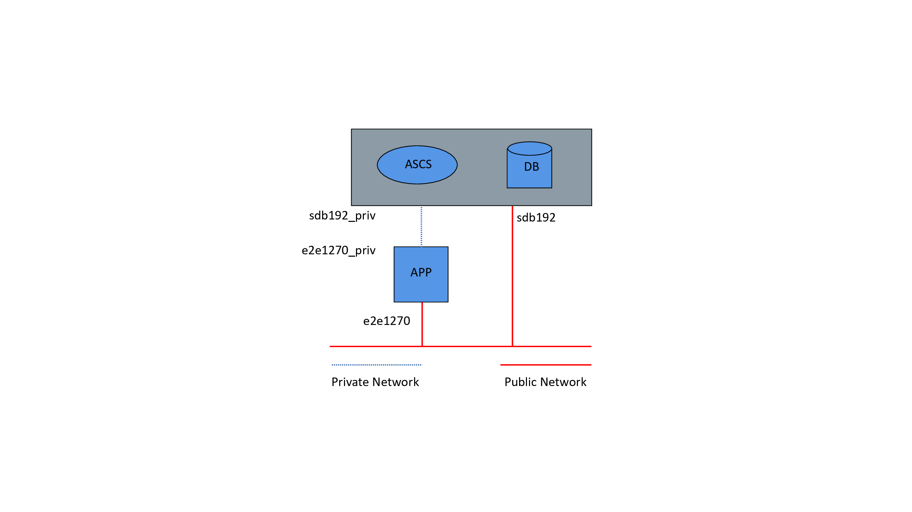

---
copyright:
  years: 2020
lastupdated: "2020-06-07"
keywords: SAP, {{site.data.keyword.cloud_notm}} SAP-Certified Infrastructure, {{site.data.keyword.ibm_cloud_sap}}, SAP Workloads, Quick Study Tutorial
subcollection: sap
content-type: tutorial
completion-time: 90m
---

{{site.data.keyword.attribute-definition-list}}

# SAP NetWeaver deployment to Bare Metal on Classic Infrastructure, when you are using Windows Server
{: #quickstudy-bm-netweaver-wins}
{: toc-content-type="tutorial"}
{: toc-completion-time="90m"}

*A Quick Study, someone who is able to learn new things quickly.*
{: note}

These Quick Study Tutorials provide a single sample configuration, with less detailed instructions, as an introduction for customers who prefer hands-on tasks to increase their pace of learning.
{: shortdesc}

The following information provides an introduction for customers who are new to the Classic Infrastructure environment. Two sample configurations are provided to help you through the ordering process to the start of the SAP installation.

The first configuration sample is a simple, single node 32 GB RAM server with Windows Server. The second is an advanced two-node configuration that adds a second virtual server of 192 GB RAM with Windows Server to the landscape.

The third sample is an example of how to set up external storage, which can be applied to either sample configuration.

The sample layouts might match your preferred layout. The purpose of the tutorial is to show two possibilities. Your installation should follow your business requirements and SAP installation documentation.

## Provisioning a 32 GB server for a single-host environment
{: #provisioning-a-32-gb-single-node-server}
{: step}

1. Log in to the [{{site.data.keyword.cloud_notm}} console](https://cloud.ibm.com){: external} with your unique credentials.
2. Click **Create resource** > **Compute** > **Infrastructure** > **Bare Metal Server**.
3. Click **Continue**. If you can't click **Continue**, you don't have the correct permissions to create a server. Check with your system administrator about your permissions.
4. Leave *1* in the **Quantity** field.
5. Enter *e2e1270* in the **Hostname** field. Hostname is a permanent or temporary name for your servers. Click **Information** for formatting specifics.
6. Enter *mycloud.com* in the **Domain** field. Domain is the identification string that defines administrative control within the internet. Click **Information** for formatting specifics.
7. **Billing** defaults to *Monthly*. Currently, 1-year contract and 3-year contract are not available for SAP-certified servers.
8. The data centers displayed under **Location** depend on product availability within a particular data center. Leave the default **Location** of *NA South DAL10-Dallas*.
9. Click **All servers** > **SAP certified**.

### Configuring your server
{: #configure_server-32GB}
{: step}

Select your SAP-certified server and OS.

1. Select **CPU Model BI.S3.NW32 (OS Options)**. For more information about deciphering the server names, see [Provisioning your {{site.data.keyword.baremetal_short}} using the {{site.data.keyword.cloud_notm}} console](/docs/sap?topic=sap-nw-iaas-offerings-profiles-intel-bm).
2. **RAM** defaults to a predefined value based on your server selection and cannot be changed.
3. Enter an optional public key for your **SSH key**, which you can use to log in to your server after provisioning is done. The default is *None*.
4. Choose *Microsoft* as your **Image** (OS) and select *2016 Standard (64 bit)-HVM*.

    If you're bringing your own license (BYOL) for your OS, select **No OS**. For more information, see [Bring your own license](#byol-32GB).
    {: note}

### Adding storage disks
{: #adding-storage-disks-32GB}
{: step}

1. Under **Type**, select *RAID 10*.
2. **Disks**, **Hot Spare**, and **Disk Media** have default values that are based on your selection. Select a **Disk Size** that covers the total amount of storage you need.
3. Click the Menu icon  > **Advanced configuration** and leave **Controller** cleared. Click **OK**.

### Network interface
{: #network-options-32GB}
{: step}

1. Select *1 Gbps Redundant Public and Private Network Uplinks* for **Uplink Port Speed**.
2. Select the values in Table 1 for the following fields:

|              Field               |      Value              |
| -------------------------------- | ------------------------|
| Private VLAN                     | dal10.bcr01a.981      |
| Public VLAN                      | dal10.fcr01a.926      |
| Private Subnet                   | 10.177.119.192/26     |
| Public Subnet                    | 169.46.15.96/27       |
{: caption="32 GB network interface values" caption-side="top"}

3. Leave the default values for all other fields.
4. Review your Order Summary.
5. Select **I read and agree to the following Third-Party Service Agreements**.

    You can create your server, save the order as a quote to provision later, or add the order an estimate, which might include multiple services.
    {: note}

6. Click **Create** to be redirected to the Checkout page after your order is verified.

You are redirected to a page with your order number. Print the page because it is your receipt. You also receive a confirmation email with the subject *Your {{site.data.keyword.cloud_notm}} Order ## has been approved*. The ## is your order number.

Depending on your order, the server is available for use within one to four hours after the order is submitted. You can check Device Details from the {{site.data.keyword.cloud_notm}} console (Menu icon  > Resource List > Devices) for the status of the provisioning steps. Click the **Device Name** that matches your device's hostname and domain to see its status.

### Bring your own license
{: #byol-32GB}
{: step}

If you have your own operating system license, you install it on your {{site.data.keyword.baremetal_short}} based on the vendor's instructions. For more information, see [The no OS option](/docs/bare-metal?topic=bare-metal-bm-no-os#bm-no-os).

### Access your server
{: #access-server}
{: step}

Use a public IP for remote access so that you can connect to your server through a Remote Desktop (RDP) client (for example, Microsoft Windows’ MSTSC). The public IP address is displayed in the Device List for your device. The administrator password for your server is also displayed. Click **Show Password** to see the password.

### Partitioning and file systems
{: #partition_32GB}
{: step}

For the single-node example, a server with one logical disk (on RAID 1) was ordered. The operating system (OS) has one mirrored disk, with one large file system equal to the total size of the ordered disk.

The server does not require any further installation steps for storage.

## Provisioning 192 GB and 32 GB servers for a three-tier environment
{: #provisioning_three_tier}
{: step}

A three-tier environment is a more complex scenario that uses a 192 GB server as the database server and a 32 GB server as the SAP NetWeaver application server.

### Ordering your SAP NetWeaver Application Server
{: #order-app-server}
{: step}

Follow the steps in the [Provisioning a 32 GB server for a single-host environment](#provisioning_single_host) to order the SAP NetWeaver Application Server.

### Ordering your Database Server
{: #order-db-server}
{: step}

Use the following steps to order an SAP-certified server as your database server.

1. Log in to the [{{site.data.keyword.cloud_notm}} console](https://cloud.ibm.com){: external} with your unique credentials.
2. Click **Create resource** > **Compute** > **Infrastructure** > **Bare Metal Server**.
3. Click **Continue**. If you can't click **Continue**, you don't have the correct permissions to create a server. Check with your system administrator about your permissions.
4. Leave *1* in the **Quantity** field.
5. Enter *sdb192* in the **Hostname** field. Hostname is a permanent or temporary name for your servers. Click **Information** for formatting specifics.
6. Enter *mycloud.com* in the **Domain** field. Domain is the identification string that defines administrative control within the internet. Click **Information** for formatting specifics.
7. **Billing** defaults to *Monthly*. Currently, 1-year contract and 3-year contract are not available for SAP-certified servers.
8. The data centers displayed under **Location** depend on product availability within a particular data center. Leave the default **Location** of *NA South DAL10-Dallas*.
9. Click **All servers** > **SAP certified**.

### Configuring your Database Server
{: #configure_server-192GB}
{: step}

Use the following steps to configure your database server and its OS.

1. Select *CPU Model BI.S3.NW192 (OS Options)*. For more information about deciphering the server names, see [Provisioning your {{site.data.keyword.baremetal_short}} using the {{site.data.keyword.cloud_notm}} console](/docs/sap?topic=sap-nw-iaas-offerings-profiles-intel-bm).
2. **RAM** defaults to a predefined value based on your server selection and cannot be changed.
3. Enter an optional public key for your **SSH key**, which you can use to log in to your server after provisioning is done. The default is *None*.
4. Choose *Microsoft* as your **Image** (OS), and select *2016 Standard (64 bit)-HVM*.

    If you're bringing your own license (BYOL) for your OS, select **No OS**. For more information, see [Bring your own license](#byol-192GB).
    {: note}

### Adding storage disks
{: #adding-storage-disks-192GB}
{: step}

Use the following steps to add a 2 TB SATA drive for your database server.

1. For **Disk 1**, click the Menu icon  > **Advanced configuration** and verify that **Primary disk partition** is set to the default of *Windows Basic*. Click **OK**.
2. Click **Add new**.
3. **Disks**, **Hot Spare**, and **Disk Media** have default values. Select a **Disk Size** that covers the total amount of storage you need.

### Setting up the network interface
{: #network-options-192GB}
{: step}

Use the following steps to set up the network interface for your database server.

1. Select *1 Gbps Redundant Public and Private Network Uplinks* for **Uplink Port Speed**.
2. Select the values in Table 1 for the following fields:

    Make sure the network interface values for your database server match the values for your application server.
    {: note}

|              Field               |      Value              |
| -------------------------------- | ------------------------|
| Private VLAN                     | dal10.bcr01a.981      |
| Public VLAN                      | dal10.fcr01a.926      |
| Private Subnet                   | 10.177.119.192/26     |
| Public Subnet                    | 169.46.15.96/27       |
{: caption="192 GB network interface values" caption-side="top"}

3. Leave the default values for all other fields.
4. Review your Order Summary.
5. Select **I read and agree to the following Third-Party Service Agreements**.

    You can create your server, save the order as a quote to provision later, or add the order to an estimate, which might include multiple services.
    {: note}

6. Click **Create** to be redirected to the Checkout page after your order is verified.

You are redirected to a page with your order number. Print the page because it is your receipt. You also receive a confirmation email with the subject *Your {{site.data.keyword.cloud_notm}} Order ## has been approved*. The ## is your order number.

Depending on your order, the server is available for use within one to four hours after the order is submitted. You can check Device Details from the {{site.data.keyword.cloud_notm}} console (Menu icon  > Resource List > Devices) for the status of the provisioning steps. Click the **Device Name** that matches your given hostname and Domain to see its status.

### Bring your own license
{: #byol-192GB}
{: step}

If you have your own operating system license, you install it on your {{site.data.keyword.baremetal_short}} based on the vendor's instructions. For more information, see [The no OS option](/docs/bare-metal?topic=bare-metal-bm-no-os#bm-no-os).

### Access your server
{: #access-db-server}
{: step}

Use a public IP for remote access so that you can connect to your servers through a Remote Desktop (RDP) client (for example, Windows’ MSTSC). The public IP addresses are displayed in the Device List (under the Device menu) for your device. The root passwords for your servers are also displayed. Click **Show Password** to see the passwords.

### Partitioning and file systems
{: #partitioning-and-file-systems}
{: step}

For the three-tier example, a 192 GB database server with one logical disk (on RAID10) and a 32 GB application server with one logical disk (on RAID 1) were ordered. Both servers come with one large file system equal to the total size of disks.

The server does not require any further installation steps for storage.

### Preparing your network for a three-tier setup
{: #network}
{: step}

If you are installing a three-tier setup, you need to prepare the network setup. For the sample setup, a 192 GB database server (named "sdb192") and a 32 GB application server (named "e2e1270") are deployed. The database server also hosts the ABAP SAP Central Services (ASCS) instance. Adding the IPs on the private network to your hosts file helps with the upcoming steps and ensures that SAP internal network traffic goes through the right network.

{: caption="Sample of three-tier setup" caption-side="bottom"}

The network setup of the deployed servers that are outlined in Figure 1 is found under Network Connections in Microsoft Windows. In the sample setup, `10.17.139.35` is the private IP of the database server that is found under Network Connections - Private Network-Teamed, and is one of the IP ranges from RFC 1597. You can determine the IP of the application server, too, and add both IPs to both servers' `host files` under `C:\Windows\System32\drivers\etc`.

In the {{site.data.keyword.cloud}} console, you can find the private IP of the database server under Menu icon  > Resource List > Devices. Select the applicable device and the IP address is displayed in the respective column.

## Adding external storage to your server
{: #storage}
{: step}

External storage can be added to your provisioned server, or servers. You can use the external storage as a backup device, or as a snapshot to quickly restore your database in a test environment. In the example, block storage is used for both archiving log files of the database and online and offline backups for the database. The fastest block storage (10 IOPS per GB) was selected to help assure a minimum backup time. Slower block storage might be sufficient for your needs. For more information about {{site.data.keyword.blockstoragefull}}, see [Getting started with Block Storage](/docs/BlockStorage?topic=BlockStorage-getting-started#getting-started).
{: shortdesc}

{{site.data.keyword.cloud_notm}} storage LUNS can be provisioned with two options - Endurance and Performance. Endurance tiers feature pre-defined performance levels and other features, such as [snapshot](/docs/BlockStorage?topic=BlockStorage-snapshots) and replication. A custom Performance environment is built with allocated input/output operations per second (IOPS) in the range 100 - 1,000.

### Setting up external storage
{: #setting-up-external-storage}
{: step}

1. Log in to the [{{site.data.keyword.cloud_notm}} console](https://cloud.ibm.com/){: external} with your unique credentials.
2. Expand the Menu icon  and select **Classic Infrastructure**.
3. Select **Storage** > **Block Storage** > **Order Block Storage**.
4. Select the specifics for your storage needs. Table 1 contains recommended values, including 10 IOPS/GB for a demanding database workload.

|              Field               |      Value                                        |
| -------------------------------- | ------------------------------------------------- |
|Location                          | US South, DAL10                                   |
|Billing Method                    | Monthly (default)                                 |
|Size                              | 1000 GB                                           |
|Endurance (IOPS tiers)            | 10 IOPS/GB                                        |
|Snapshot space                    | 0 GB                                              |
|OS Type                           | Windows 2008+                                     |
{: caption="Recommended values for block storage" caption-side="top"}

5. Review the Order Summary.
6. Select **I have read and agree to the terms and conditions listed below**.

### Authorizing host
{: #authorizing-hosts-console}
{: step}

1. Select **Storage** > **Block Storage**.
2. Highlight your LUN and expand the Action menu  and select **Authorize Host**.
3. Select a **Device Type** of *Bare Metal Server*.
4. Click **Hardware** to load available devices and select the hostname of your database server.
5. Click **Save**.

    More provisioning information can be found under [Ordering Block Storage through the Console](/docs/BlockStorage?topic=BlockStorage-orderingBlockStorage).
    {: tip}

Follow the steps in [Connecting to MPIO iSCSCI LUNS on Microsoft Windows](/docs/BlockStorage?topic=BlockStorage-mountingWindows#mountingWindows) to connect your block storage to your database server by using the data from the example. Follow the steps carefully; they lead to a new “offline” disk available for your Windows server.

You can now bring the disk online and initialize it.

## Installing your SAP landscape
{: #install_landscape}
{: step}

### Downloading your SAP software
{: #download_software}
{: step}

You need an SAP S-user ID and Download Authorization to download the DVDs. For more information about the SAP S-user ID, see [How to set up an S-user ID](https://www.youtube.com/watch?v=4wICiRTP8u0){: external}.

1. Log in to the [SAP Support Portal](https://support.sap.com/en/index.html){: external}, click **Download Software**, and download the required DVDs to a local share drive.
2. Transfer the files to your provisioned server.

Another option is to download the [SAP Software Download Manager](https://support.sap.com/en/my-support/software-downloads.html#section_995042677){: external}, install it on your target server, and directly download the DVD images to the server.

### Installing SAP software
{: #install_software-wins}
{: step}

This example is for downloading the applicable SAP NetWeaver software. You may or might not be using SAP Netweaver 7.5.
{: note}

After you download the installation media, follow the standard SAP installation procedure that is documented in the SAP installation guide for your SAP version and components, and the corresponding SAP Notes. For more information, see [SAP Installation Guide](https://help.sap.com/docs/SAP_NETWEAVER/9e41ead9f54e44c1ae1a1094b0f80712/576f5c1808de4d1abecbd6e503c9ba42.html?language=en-US){: external} (search for the guides based on the Windows OS) and [SAP Notes](https://support.sap.com/en/index.html){: external}. SAP Notes requires an SAP S-user ID.

1. Open the root folder of your SWPM-DVD or of your installation DVD as Administrator, and run `sapinst`. The Welcome to SAP Installation page is displayed.
2. Select **SAP NetWeaver 7.5** > **IBM DB2 for Linux, Unix, and Windows** > **SAP Systems** > **Application Server ABAP**.
3. Open **Distributed System** and run **ASCS Instance** and **Database Instance** on the database server.
4. Verify that `sapinst` successfully shared folders `\\usr\sap\trans` and `\\sapmnt` after the ASCS Instance is installed for the next step to work.
5. Run **Primary Application Server Instance** on the application server. Be sure to use the private addresses for the ASCS and the database hostnames during installation of the application server. Using private addresses ensures that network traffic between the application server and ASCS, or database, path through the private network and not through the public network.

You can now run your SAP installation according to the SAP installation instructions.
